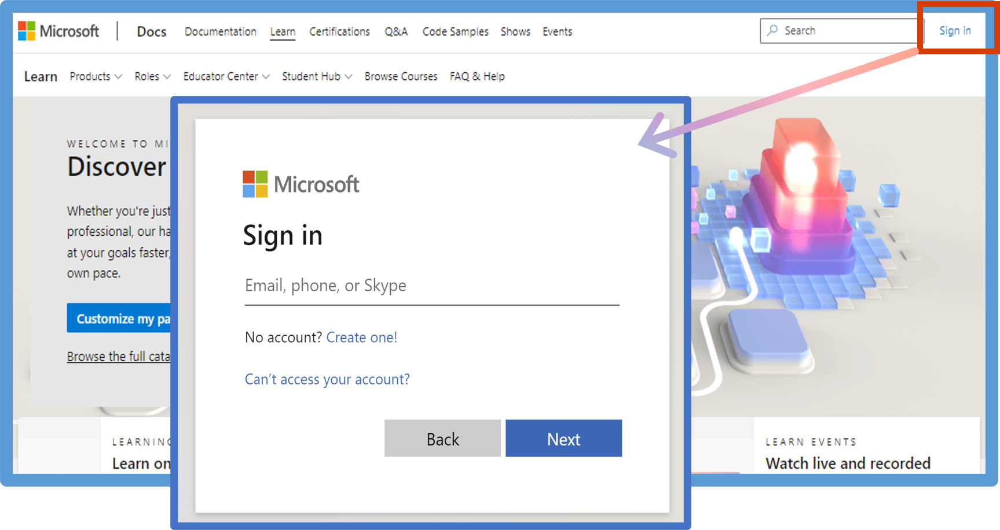
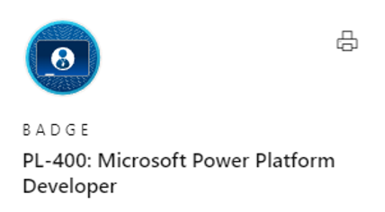

---
demo:
    title: 'Demo 0: Microsoft Learn'
    module: '0: Course Introduction'
---

# Demo 0 - Microsoft Learn

**Objective:** In this demo, you will explain how to use Microsoft Learn.

Students need to create an account on Learn. As an MCT you need your students to have a Learn account and to redeem the achievement code at the end of the course to track that you have delivered this course. This is important to you for renewing your MCT and to the training services provider to meet their obligations to Microsoft.

All courseware is on Microsoft Learn. Students need to create a profile if they do not have one.

## Task 0.1 - Learn profile

1. Walk students through signing into Learn <https://learn.microsoft.com>

   

1. Tell students to create a profile if they do not already have one. They can use their work account, but it is highly recommended to use a Microsoft account i.e. a hotmail or outlook account.

1. Provide this resource <https://learn.microsoft.com/training/support/faq?pivots=profile#where-is-my-profile> to your students.

1. Demonstrate your own Learn profile <https://learn.microsoft.com/users/me/profile> and show the Activity, Training, Certifications, Achievements, and Transcript tabs.

## Task 0.2 - Certification profile

1. If students have taken a Microsoft exam before, they will need to link their certification profile to their Learn account.

1. Show this page, Connect your Learn profile <https://learn.microsoft.com/certifications/connect-cert-profile-to-learn> to your students.

## Task 0.3 - Learn modules

1. The courseware for PL-400 is on Microsoft Learn. Every deck contains the relevant links to Learn modules but a full list of the Learn modules can be found at <https://learn.microsoft.com/users/sarikulthm-2667/collections/12omu31mm02ond>. Share this link with your students.

1. Use the Introduction to Microsoft Power Platform module <https://learn.microsoft.com/training/modules/introduction-power-platform> to explain how to navigate a Learn module and also show the Check your knowledge and summary units.

## Task 0.4 - Achievement code

1. An the end of the course explain that you will provide a link for students to redeem an achievement code that will add a badge to their Learn profile

   

1. Mention that there will be a Metrics that Matter survey to complete at the end of the course.

## Task 0.5 - Share

1. Once students have passed the PL-400 exam and gained the Power Platform Developer certification they should celebrate and share their success.

   1. Share badges on LinkedIn <https://aka.ms/CelebrateYourMicrosoftSkills>

   1. Share badges <https://aka.ms/certbadges>
