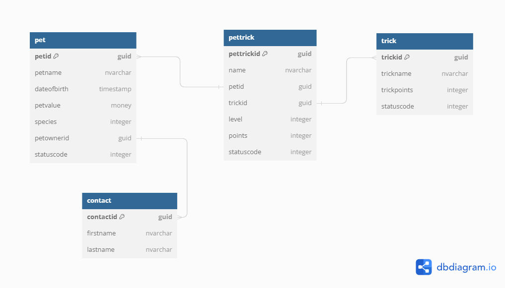

---
demo:
    title: 'Demo 5: Relationships'
    module: '1: Work with Microsoft Dataverse'
---

# Demo 5 - Relationships

**Objective:** In this demo, you will show how to create relationships for the tables created in the previous demo.

## Task 5.1 - Create one-to-many relationship from Pet to Pet Trick

1. Navigate to the Power Apps maker portal <https://make.powerapps.com>.

1. Select the **Demo** environment.
1. Select **Solutions** from the left navigation pane.
1. Select the **PL400 Demos** solution.
1. Expand **Tables**.
1. Select and expand the **Pet** table.
1. Select **Relationships**.

1. Select **+ New relationship** and select **One-to-many**.
1. Select **Pet Trick** for the **Related (Many) Table**.
1. Enter `petid` for Lookup column name.
1. Expand **General**.
1. Enter `pet_pettrick` for Relationship name.
1. Expand **Advanced options**.
1. Show the options for Type of behavior and select **Parental**.
1. Select **Done**.

## Task 5.2 - Create many-to-one relationship between Contact and Pet

1. Select **+ New relationship** and select **Many-to-one**.

1. Select **Contact** for the **Related (One) Table**.
1. Enter `Pet Owner` for Lookup column display name .
1. Enter `petownercontactid` for Lookup column name.
1. Expand **General**.
1. Enter `contact_pet` for Relationship name.
1. Expand **Advanced options**.
1. Show the options for Delete and select **Remove Link**.
1. Select **Done**.

## Task 5.3 - Create many-to-one relationship between Pet Trick and Trick

1. Select the **Pet Trick** table.

1. Under **Schema**, select **Relationships**.
1. Show the relationship to the Pet table.
1. Select **+ New relationship** and select **Many-to-one**.
1. Select **Trick** for the **Related (One) Table**.
1. Enter `trickid` for Lookup column name.
1. Expand **General**.
1. Enter `trick_pettrick` for Relationship name.
1. Expand **Advanced options**.
1. Select **Restrict** for Delete.
1. Select **Done**.

1. Select **All** in the Objects tree.
1. Select **Publish all customizations**.
