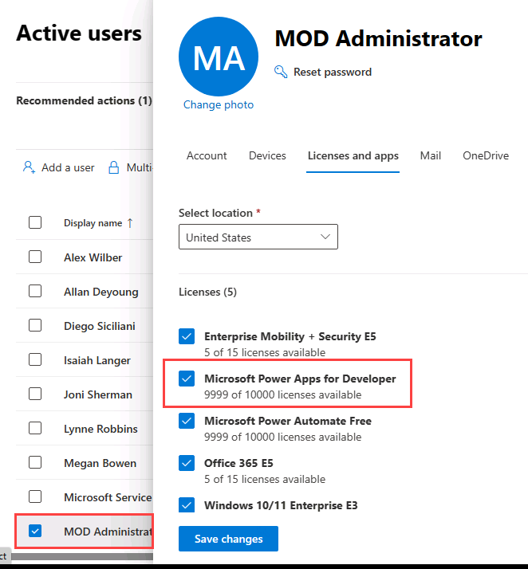

---
lab:
    title: 'Lab 0: Validate lab environment'
    module: 'Module 0: Course Introduction'
---

# Practice Lab 0 - Validate lab environment

## WWL Tenants - Terms of Use

If you are being provided with a tenant as a part of an instructor-led training delivery, please note that the tenant is made available for the purpose of supporting the hands-on labs in the instructor-led training.

Tenants should not be shared or used for purposes outside of hands-on labs. The tenant used in this course cannot be used or accessed after the class is over and are not eligible for extension.

Tenants must not be converted to a paid subscription. Tenants obtained as a part of this course remain the property of Microsoft Corporation and we reserve the right to obtain access and repossess at any time.

> [!IMPORTANT]
> This lab provides you with a Microsoft 365 tenant and licenses for the Power Platform applications you will be using in this course. You will only be provided with one tenant for the practice labs in this course. The settings and actions you take within this tenant do not roll-back or reset, whereas the virtual machine you are provided with does reset each time you close the lab session. Please be aware that Microsoft 365 and Power Platform are evolving all the time. The instructions in this document may be different from what you experience in your actual tenant. It is also possible to experience a delay of several minutes before the virtual machine has network connectivity to begin the labs.

## Exercise 1 - Download lab files

1. From the lab virtual machine, select the Windows **Start** icon and search for **PowerShell** then open **PowerShell as Administrator**.

   

1. Select **Yes** if prompted.

1. Run the following commands to download the latest version of the lab files to the virtual machine.
        
    >Please note, if any of the commands fail run them again until they are successful.

1. Create folder for lab files.

    ```powershell
    New-Item -Path "C:\" -Name "LabFiles" -ItemType "directory"   
    ```

1. Download ZIP file from GitHub.

    ```powershell
    ([System.Net.WebClient]::new()).DownloadFile('https://github.com/MicrosoftLearning/PL-400_Microsoft-Power-Platform-Developer/archive/master.zip', 'C:\LabFiles\master.zip')
    ```

1. Expand ZIP file.

    ```powershell
    Expand-Archive -Path 'C:\LabFiles\master.zip' -DestinationPath 'C:\LabFiles'
    ```

1. Move files to C:\Labfiles

    ```powershell
    Move-item -Path "C:\LabFiles\PL-400_Microsoft-Power-Platform-Developer-master\Allfiles\Labs\*" -Destination "C:\LabFiles" -confirm: $false
    ```

    

1. Delete files not required for labs.

    ```powershell
    Remove-item 'C:\LabFiles\PL-400_Microsoft-Power-Platform-Developer-master' -recurse -force
    ```

1. Delete zip file.

    ```powershell
    Remove-item 'C:\LabFiles\master.zip'
    ```

    > Please note, the files are copied to C:\Labfiles and whenever asked to navigate to a lab files, you should use this location.

    

1. Close the PowerShell window.


## Exercise 2 – Power Platform license

In this exercise, you will add Power Apps for Developer to the tenant and assign licenses to users.

### Task 2.1 – Sign into the Microsoft 365 admin portal

1. Verify that you have your **Microsoft 365 credentials** from the Authorized Lab Host available. You can find them under the **Resources** tab on the top right corner of your screen.

1. Navigate to the Microsoft 365 admin center `https://admin.microsoft.com`

1. Enter the email address from your Microsoft 365 credentials in the text box that says **Email, phone, or Skype**.

1. Select **Next**.

1. Enter the password from your Microsoft 365 credentials.
    >If prompt to update your password, please do so and remember to use it instead of the one provided by the Authorised Lab Host.

1. Select **Sign in**.

1. Select **Yes** to stay signed in.


### Task 2.2 – Sign up for Power Apps for Developer

1. In a new browser tab, navigate to `https://powerapps.microsoft.com` 

1. Select **Try for free**, then **Let's get started**.

1. Enter the `email address` provided by the Authorized Lab Host.

1. Select **Next**.

1. Select **Sign In**.

1. Enter the `password` provided by the Authorized Lab Host, if prompted.

1. Leave the **Country or Region** as the default value.

1. If prompted, enter `0123456789` for **Business phone number**.

1. Select **Start Free**.

1. Select **Start Free** again.

1. The Power Apps Maker portal will open in a new tab.


### Task 2.3 – Verify Power Apps license is assigned to your user

1. Navigate to the Microsoft 365 admin center `https://admin.microsoft.com`

1. In the left navigation, expand **Users** and select **Active users**.

1. Select your user, **MOD Administrator**, to open the user details panel and select the **Licenses and apps** tab. 

    

1. Verify that **Microsoft Power Apps for Developer** is checked. Check it, if not.

1. Select **Save changes**. 

1. Select the **X** in the top right of the user details panel to close the panel.
