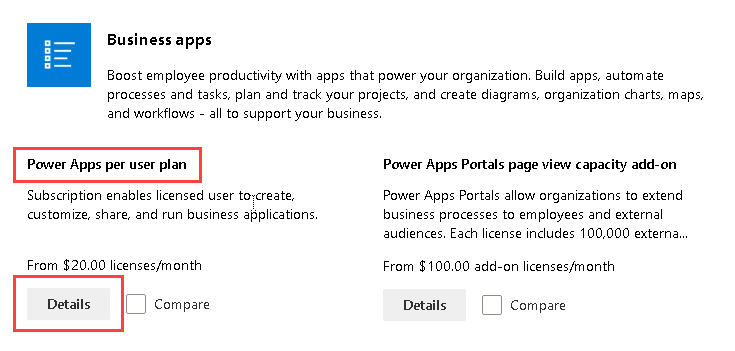
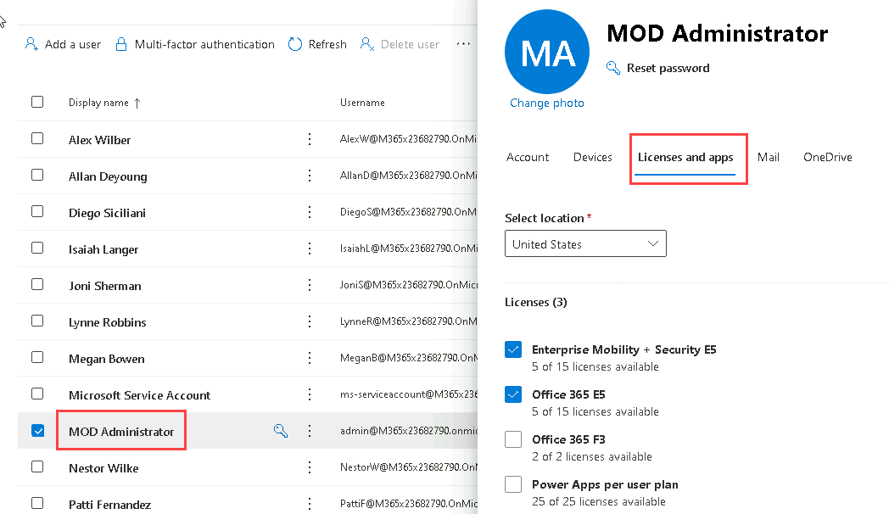
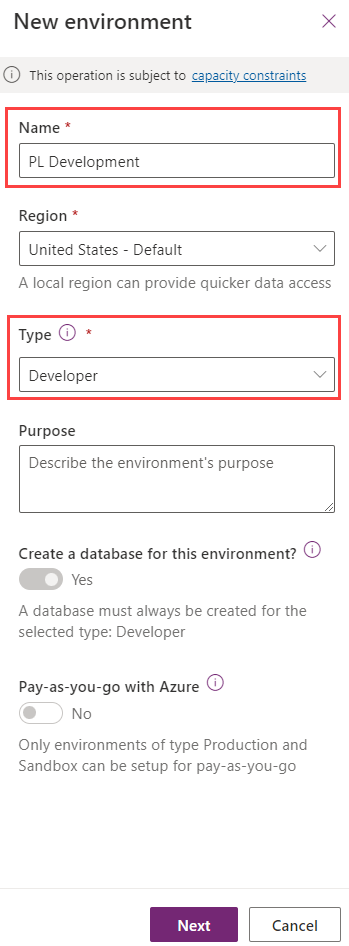
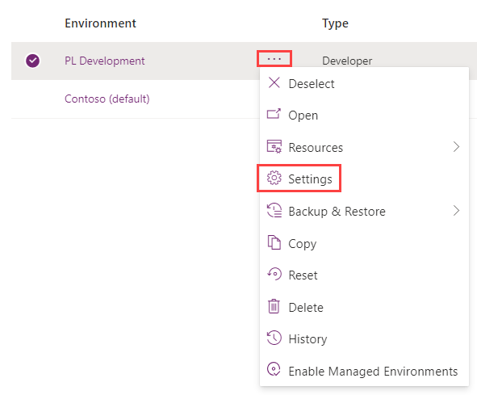
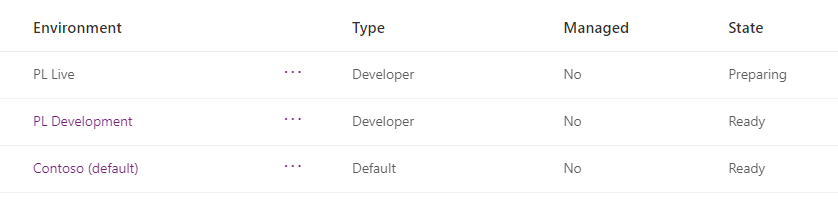

---
lab:
    title: 'Lab 0: Validate lab environment'
    module: 'Module 0: Course Introduction'
---

# Practice Lab 0 - Validate lab environment

> [!IMPORTANT]
> This lab provides you with a Microsoft 365 tenant and licenses for the Power Platform applications you will be using in this course. You will only be provided with one tenant for the practice labs in this course. The settings and actions you take within this tenant do not roll-back or reset, whereas the virtual machine you are provided with does reset each time you close the lab session. Please be aware that Microsoft 365 and Power Platform are evolving all the time. The instructions in this document may be different from what you experience in your actual tenant. It is also possible to experience a delay of several minutes before the virtual machine has network connectivity to begin the labs.

## Exercise 1 – Power Platform trial

In this exercise, you will add a Power Apps trial to the tenant and assign licenses to users.

### Task 1.1 – Sign up for a Power Apps per user trial

1. Navigate to <https://admin.microsoft.com>.

1. Enter the email address from your Microsoft 365 credentials in the text box that says **Email, phone, or Skype** .

1. Click **Next**.

1. Enter the password from your Microsoft 365 credentials.

1. Click **Sign in**.

1. Select **Yes** to stay signed in.

1. In the left-hand navigation, expand **Billing** and select **Purchase services**.

    

1. In the search all product categories text box, enter **PowerApps** and press **Enter**.

1. Scroll down and locate the **Power Apps per user plan** and click on **Details**.

    

1. Click **Start free trial**.

1. Click **Try now**.

1. Click **Continue**.

### Task 1.2 – Assign Power Apps licenses to your user

1. In the left-hand navigation, expand **Users** and select **Active users**.

1. Select your user **MOD Administrator** to open the user details panel and select the **Licenses and apps** tab. 

1. Check the box for **Power Apps per user plan**.

1. Click **Save changes**.

1. Click on **X** in the top right of the pane to close the panel.

### Task 1.3 – Assign Power Apps licenses to other users

1. In the left-hand navigation, expand **Users** and select **Active users**.

1. Check the boxes next to the other users, click on the **ellipses (...**) in the action bar, and select **Manage product licenses**.

    

1. Select **Assign more** and check the box for **Power Apps per user plan**.

    

1. Click **Save changes**.

1. Click **Done**.

## Exercise 2 - Create environments

In this exercise, you will create a *Development* environment that you will do the majority of your lab work in and a *Live* environment to use to deploy solutions.

> [!NOTE]
> Depending on the browser that you are using, it is suggested that you disable any pop-up blockers that maybe enabled. This will prevent popup screens from not appearing as they should.

### Task 2.1 – Create development environment

1. Navigate to the Power Platform admin center <https://admin.powerplatform.microsoft.com> and sign in with your Microsoft 365 credentials if prompted again.

1. Click **Get Started** if a Welcome to the Power Platform admin center popup is shown.

1. Select **Environments** from the left navigation pane. There should be a single environment, *Contoso (default)*.

1. Click **+ New**.

    

1. In the **Name** text box, enter **[my initials] Development**. (Example: PL Development).

1. In the **Type** drop down, select **Developer**.

1. Leave all other selections as default and select **Next**.

    

1. On the **Add database** tab, click **Save**.

1. Your **Development** environment should now show in the list of environments.

    

1. Your Development environment may take a few minutes to provision. Refresh the page if needed. When your environment shows as Ready, select your **Development** environment by clicking on the ellipses (...) next to its name to expand the drop down menu and select **Settings**.

    

1. Explore the different areas in **Settings** that you may be interested in but do not make any changes yet.

### Task 2.2 – Create live environment

1. Navigate to environments in the Power Platform admin center <https://admin.powerplatform.microsoft.com/environments>.

1. Click **+ New**.

1. In the **Name** text box, enter **[my initials] Live**. (Example: PL Live).

1. In the **Type** drop down, select **Developer**.

1. Leave all other selections as default and select **Next**.

1. On the **Add database** tab, click **Save**.

1. You should now see three environments; Contoso (default), Development, and Live.

    

1. You will use the *Development* environment for all customizations in the labs. The *Live* environment will act as your test/production environment.

## Exercise 3 - Azure subscription

In this exercise, you will create an Azure subscription that you will be using in later labs.

### Task 3.1 – Redeem Azure Pass

1. Obtain a new Azure Pass (valid for 30-days) from the instructor, lab provider, or other source.

1. Navigate to the Azure Pass redemption page <https://www.microsoftazurepass.com> and sign in with your Microsoft 365 credentials if prompted.

1. Follow these instructions to redeem your Azure Pass.

    [Redeem a Microsoft Azure Pass](https://www.microsoftazurepass.com/Home/HowTo?Length=5)

1. On the sign up page, enter address line 1, city, and postal code.

> [!NOTE]
> 1. If you are prompted for a *Phone number* enter **0123456789** and click on **Submit**.
