---
lab:
    title: 'Lab 01: Data Modeling'
---

> [!NOTE]
> Effective November 2020:
> - Common Data Service has been renamed to Microsoft Dataverse. [Learn more](https://aka.ms/PAuAppBlog)
> - Some terminology in Microsoft Dataverse has been updated. For example, *entity* is now *table* and *field* is now *column*. [Learn more](https://go.microsoft.com/fwlink/?linkid=2147247)
>
> This content will be updated soon to reflect the latest terminology.

##  Lab 01 – Data Modeling

# Scenario

A regional building department issues and tracks permits for new buildings and updates for remodeling of existing buildings. Throughout this course you will build applications and perform automation to enable the regional building department to manage the permitting process. This will be an end-to-end solution which will help you understand the overall process flow.

In this lab, you will set up a second environement to memic a production environment for learning purposes, create solutions to track your changes. You will also create a data model to support the following requirements:

- R1 – Track the status of permits issued for new buildings and existing building modifications

- R2 – Permits are associated with a Build Site, which represents the building or land being modified

- R3 – Permit type indicates the type of permit and inspections, other data that might be required on a permit

- R4 – Inspections completed on the permit work are to be tracked for the entire process i.e., from request of inspection to the pass or fail of the inspection

- R5 – Permits, for our lab purposes, are requested by a person and we need to track who requested each permit

# High-level lab steps

To prepare your learning environments you will create a solution and publisher and add both new and existing components that are necessary to meet the application requirements. Refer to the data model document for the metadata description (Tables, Column types and relationships). Your solution will contain several Tables upon completion of all the customizations.

## Things to consider before you begin

- What are considered as best practices for managing changes in between environments (“Dev” to “Test” to “Prod”)? Are there additional considerations for team solution development?

- What Tables a user might need in the scenario that we are building? 

- What relationship behaviors would we consider enabling users to complete their tasks?

- Remember to work in your **DEVELOPMENT** environment with the customizations. Once the customizations are completed, published and tested in “Dev”, and if everything works fine, the same will be deployed to “Prod”. 

  
‎ 

# Exercise #1: Create Environments and Solution

**Objective:** In this exercise, you will create a community plan environment to memic Production environment that we will refer to as "Prod".

## Task #1: Create Environments

1. Create the community plan environment

	- Navigate to [Power Apps Community Plan page](https://powerapps.microsoft.com/en-us/communityplan/)
	- Click on *Create an indiviual environment*
	- Enter your credentials when prompt to sign in
	- Select your country from the dropdown menu and click *Accept*
	- Navigate to [Power Platform Admin Center](https://admin.powerplatform.microsoft.com/environments) to see a new environment had been created by the system. We will refer to it as "Prod" environment for the rest of this course.

 You should now have the dev environment and the "Prod" environment listed under environments.

## Task #2: Create Solution and Publisher

1. Create Solution

	- Sign in to [Power Apps maker portal](https://make.powerapps.com/)

	- Select your Dev environment.

    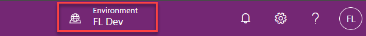

	- Select **Solutions** from the left menu and click **+** **New solution**.

	- Enter **Permit Management** for **Display Name**.

2. Create Publisher

	- Click on the **Publisher** dropdown and select **+ Publisher**.

    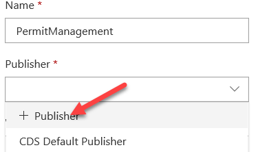

	- Enter **Contoso** for **Display Name** and **contoso** for **Prefix.** 

	- Click **Save and Close**.

    

	- Click **Done**.

3. Complete the solution creation

	- Now, click on the **Publisher** dropdown and select the **Contoso** publisher you just created.

	- Enter **1.0.0.0** for **Version** and click **Create**.

 

## Task #3: Add Existing Table

1. Add Contact Table to the solution

	- Click to open the **Permit Management** solution you just created.

	- Click **Add Existing** and select **Table**.

    

	- Search for **Contact** and select it.

	- Click **Next**.

	- Click **Select** **Components**.

    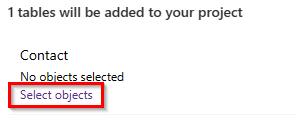

	- Select the **Views** tab and select the **Active Contacts** view. Click **Add**.

	- Click **Select Components**.

	- Select the **Forms** tab and select the **Contact** form.

	- Click **Add**.

	- You should have **1 View** and **1 Form** selected. Click **Add** again. This will add the Contact Table to the newly created solution.

    

2. Add User Table to the solution

	- Click Add Existing and select **Table**.

	- Search for **User** and select it.

	- Click **Next**.

	- **DO NOT** select any components. Click **Add**.

	- Your solution should now have two Tables.

 

# Exercise #2: Create Tables and Columns

**Objective:** In this exercise, you will create Tables, add Columns to these Tables and edit the **Status Reason** options for the **Permit** and **Inspection** Tables.

## Task #1: Create Permit Table and Columns

1. Continuing in your development environment, open the Permit Management solution

	- Sign in to [Power Apps maker portal](https://make.powerapps.com/)

	- Select **Solutions** and click to open the **Permit Management** solution you just created.

2. Create Permit Table

	- Click **+** **New** and select **Table**.

    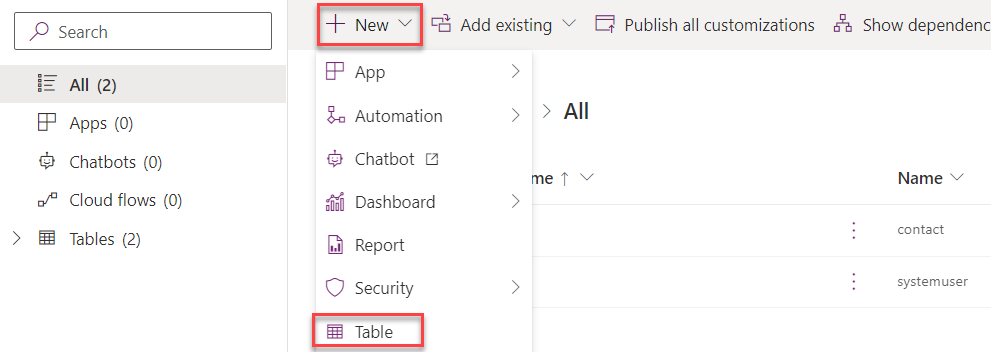

	- Enter **Permit** for **Display Name** and click **Create**. This will start provisioning the Table in background while you can start adding Columns.

3. Create Start Date Column

	- Make sure you have the **Columns** tab selected and click **+** **Add Column**.

    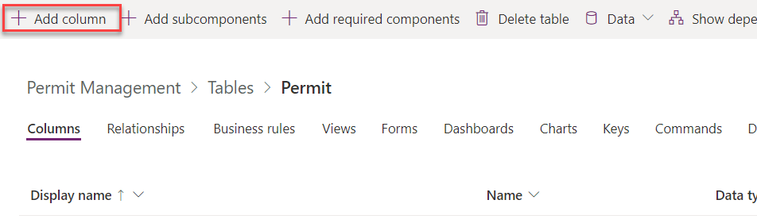

	- Enter **Start Date** for **Display Name**.

	- Select **Date Only** for **Data Type**.

	- Select **Required**.

	- Leave the searchable checkbox checked. When a Column is searchable it appears in Advanced Find in model-driven apps and is available when customizing views. De-selecting this will reduce the number of options shown to people using advanced find.

	- Click **Done**.

4. Create Expiration Date Column.

	- Click **+ Add Column**.

	- Enter **Expiration Date** for **Display Name**.

	- Select **Date Only** for **Data Type**.

	- Click **Done**.

5. Create New Size Column.

	- Click **+ Add Column**.

	- Enter **New Size** for **Display Name**.

	- Select **Whole Number** for **Data Type.** 

	- Click **Done**.

	- Select **Custom** for filter.

    

	- Click **Save Table**.

    

 

## Task #2: Create Permit Type Table and Columns

1. Create Permit Type Table

	- Click on the solution name. This action will take you back to the Solution.

    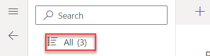

	- Click **+ New** and select **Table**.

	- Enter **Permit Type** for **Display Name**.

	- Click **Done**.

2. Create Require Inspections Column

	- Make sure you have the **Columns** tab selected and click **+ Add Column**.

	- Enter **Require Inspections** for **Display Name**.

	- Select **Yes/No** for **Data Type**.

	- Click **Done**.

3. Create Require Size Column

	- Click **+ Add Column**.

	- Enter **Require Size** for **Display Name**.

	- Select **Yes/No** for **Data Type**.

	- Click **Done**.

4. Click Save Table

 

 

## Task #3: Create Build Site Table and Columns

1. Create Build Site Table

	- Click on the solution name. This action will take you back to the Solution.

	- Click **+ New** and select **Table**.

	- Enter **Build Site** for **Display Name.**

	- Change the **Display Name** of the **Primary Column** to **Street Address.**

	- Change the **Name** of the **Primary Column** to **street1.**

	- Click **Done**.

    

2. Add City Column

	- Make sure you have the **Columns** tab selected and click **+ Add Column**.

	- Enter **City** for **Display Name** and change the **Name** to **city**.

	- Make sure **Text** is selected for **Data Type**. 

	- Select **Required**. 

	- Click **Done**.

    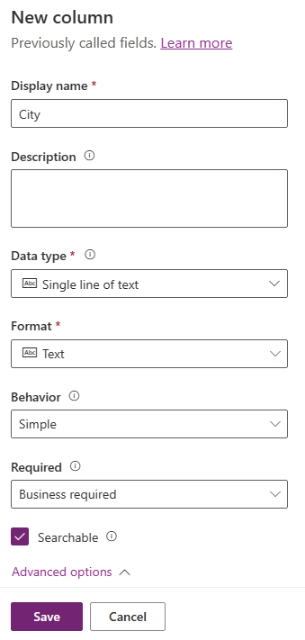

3. Add Zip/Postal Code Column

	- Make sure you have the **Columns** tab selected and click **+ Add Column**.

	- Enter **ZIP/Postal Code** for **Display Name** and change the **Name** to **postalcode**.

	- Make sure **Text** is selected for **Data Type**. 

	- Select **Required**. 

	- Click **Done**.

4. Add State/Province Column

	- Make sure you have the **Columns** tab selected and click **+ Add Column**.

	- Enter **State/Province** for **Display Name** and change the **Name** to **stateprovince**.

	- Make sure **Text** is selected for **Data Type**.

	- Select **Required**.

	- Click **Done**.

5. Add Country Region Column

	- Make sure you have the **Columns** tab selected and click **+ Add Column**.

	- Enter **Country/Region** for **Display Name** and change the **Name** to **country**.

	- Make sure **Text** is selected for **Data Type.** 

	- Click **Done**.

6. Click **Save Table**.

 

## Task #4: Create Inspection Table and Columns

1. Create Inspection Table

	- Click on the solution name. This action will take you back to the Solution.

	- Click **New** and select **Table**.

	- Enter **Inspection** for **Display Name.**

	- Click **Done**.

2. Add Inspection Type Column

	- Make sure you have the **Columns** tab selected and click **+ Add Column**.

	- Enter **Inspection Type** for **Display Name**.

	- Select **Choice** for **Data Type**.

	- Click on the **Choice** dropdown and select +**New Choice.**

    

	- Enter **Initial Inspection** and click **Add New Item**.

    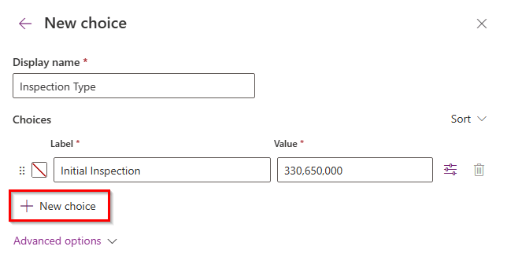

	- Enter **Final Inspection** and click **Save**.

    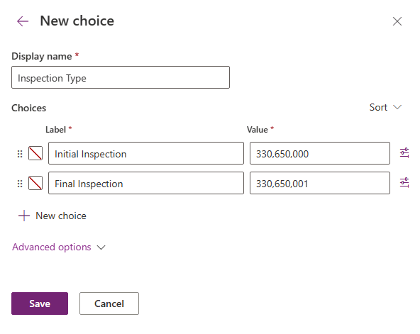

	-  Click **Done**.

3. Add Scheduled Date Column

	- Make sure you have the **Columns** tab selected and click **+ Add Column**.

	- Enter **Scheduled Date** for **Display Name**.

	- Select **Date Only** for **Data Type**.

	- Select **Required**. 

	- Click **Done**.

4. Add Comments Column

	- Make sure you have the **Columns** tab selected and click **+ Add Column**.

	- Enter **Comments** for **Display Name**.

	- Make sure **Text** is selected for **Data Type.** 

	- Expand **Advanced options.**

	- Set **Max length to 1000** in the Advanced options**.**

	- Click **Done**.

5. Add Sequence Column

	- Make sure you have the **Columns** tab selected and click **+ Add Column**.

	- Enter **Sequence** for **Display Name**.

	- Make sure **Text** is selected for **Data Type**.

	- Click **Done**.

6. Click **Save Table**.

7. Select **Solutions** on the top and this action will take you back to the Solutions page.

8.  Click **Publish All Customizations.**

    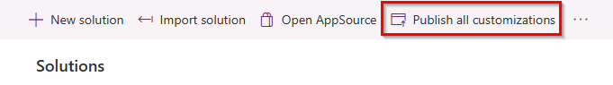

 

## Task #5: Edit Status Reason Options

1. Open the Permit Management solution

	- Navigate to [Power Apps maker portal](https://make.powerapps.com/)

	- Select **Solutions** from the left menu and click to open the **Permit Management** solution.

2. Switch to Classic

	- Click on the **…** icon and select **Switch to Classic**.

    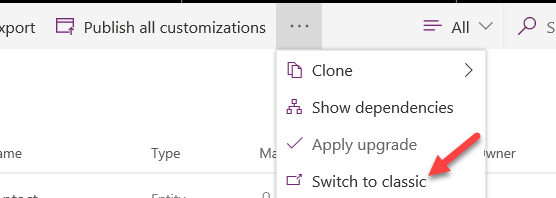

3. Edit Inspection Table Status Reason options

	- Expand **Tables**.

	- Expand the **Inspection** Table and select **Columns**.

    

	- Locate and double click to open the **statuscode** Column.

    

4. Change the Active option label

	- Make sure you have **Active** selected for **Status**.

	- Select the **Active** option and click **Edit**.

    

	- Change the **Label** to **New Request** and click **OK**.

    

5. Add the Pending Option

	- Click **Add**.

    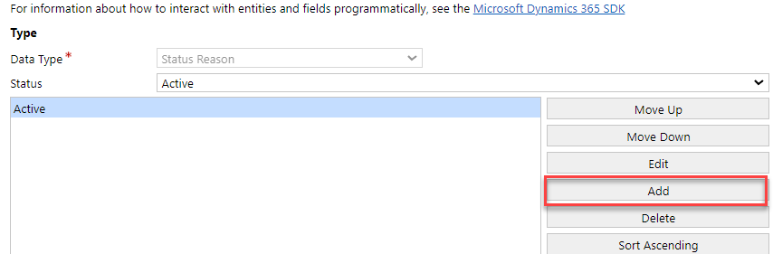

	- Enter **Pending** for **Label** and click **OK**.

6. Add the Passed Option

	- Click **Add**.

	- Enter **Passed** for **Label** and click **OK.**

7. Add the Failed Option

	- Click **Add**.

	- Enter **Failed** for **Label** and click **OK.**

8. Add the Canceled Option

	- Click **Add**.

	- Enter **Canceled** for **Label** and click **OK.**

9. Your option-set should now have 5 options for the **Active** state.

    

10. Select Pending as the Default Value and click **Save and Close** from the top menu.

    

11. Edit Permit Table Status Reason options

	- Expand the **Permit** Table and select **Columns**.

    

	- Locate and double click to open the **statuscode** Column.

12. Add the Locked option

	- Make sure you have the **Active** selected for **Status**.

	- Click **Add**.

	- Enter **Locked** for Label and click **OK**.

13. Add the Completed option

	- Click **Add**.

	- Enter **Completed** for Label and click **OK**.

14. Add the Canceled option

	- Click **Add**.

	- Enter **Canceled** for Label and click **OK**.

15. Add the Expired option

	- Click **Add**.

	- Enter **Expired** for Label and click **OK**.

16. Your option-set should now have 5 options for the **Active** state

    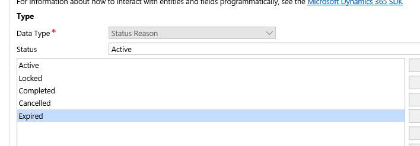

17. Select the **Active** for the **Default Value** and click **Save and Close** from the top menu

18. Select **Information** from the left side menu and click **Save and Close** to close classic solution explorer

    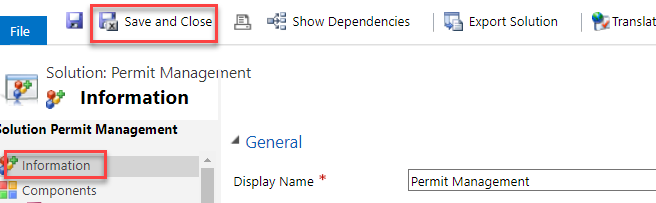

19. Select **Solutions** from the top menu and click **Publish All Customizations**.

 

 

  
‎ 

# Exercise #3: Create Relationships 

**Objective:** In this exercise, you will create relationships.

 

## Task #1: Create Relationships

1. Open the Permit Management solution

	- Sign in to [Power Apps maker portal](https://make.powerapps.com/)

	- Select **Solutions** and click to open the **Permit Management** solution.

2. Create Permit to Contact relationship

	- Click to open the **Permit** Table.

	- Select the **Relationships** tab.

	- Click **+ Add Relationship** and select **Many-to-one**.

    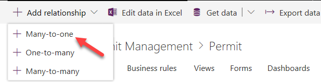

	- Select Contact for **Related (One)** and click **Done**.

    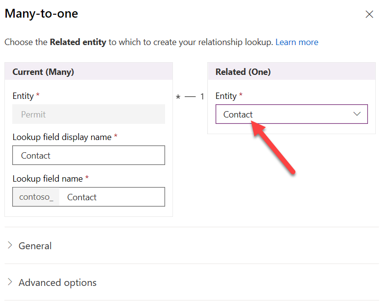

3. Create Permit to Inspection relationship

	- Click **Add Relationship** and select **One-to-Many**.

	- Select **Inspection** for **Table** in the **Related (Many)** and click **Advanced Options**.

    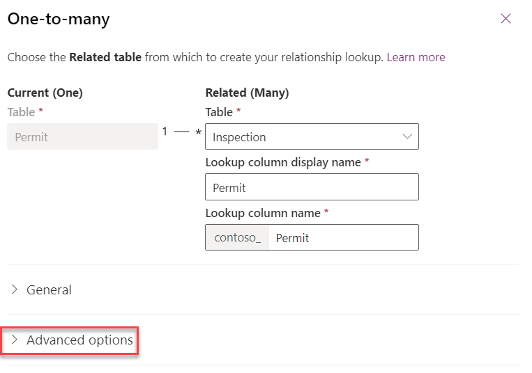

	- Change the **Type of Behavior** to **Parental** and click **Done**.

    

4. Create Permit to Build Site relationship

	- Click **Add Relationship** and select **Many-to-One**.

	- Select **Build Site** for **Related (One) Table** and click **Advanced Options**.

	- Change the **Delete** to **Restrict** and click **Done**.

    

5. Create Permit to Permit Type relationship

	- Click **Add Relationship** and select **Many-to-One**.

	- Select **Permit Type** for **Related (One) Table** and click **Done**.

6. Change the filter to **Custom**.

    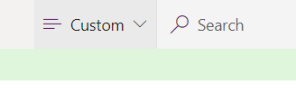

7. Click **Save Table**.

    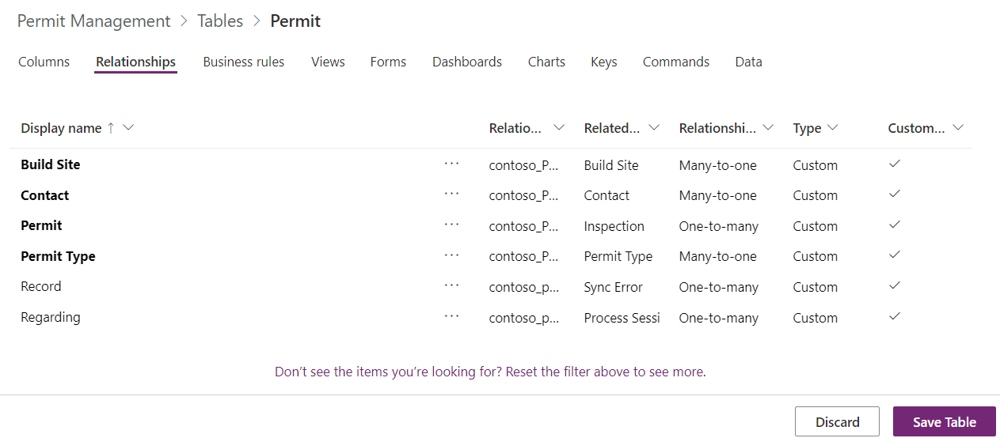

8. Select **Solutions** from the top menu and click **Publish All Customizations.**

#  

 
