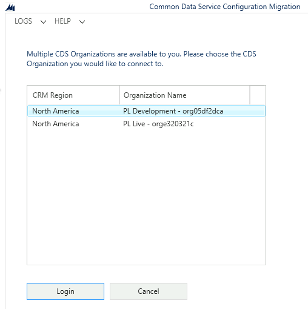

---
lab:
    title: 'Lab 1: Import solution'
    module: 'Module 0: Course Introduction'
---

# Practice Lab 1 - Import solution

## Scenario

A regional building department, Contoso, issues and tracks permits for new buildings and updates for remodeling of existing buildings. Throughout these labs you will create business logic, write code, and perform automation to enable the regional building department to manage the permit process.

The data model and Power Apps apps have been built by a functional consultant. You are a Power Platform developer and have been assigned to the Contoso project for the next stage of the project.

You need to prepare your development environment by importing solutions and data.

The solution contains:

- Microsoft Dataverse data model
- Power Apps Model-driven app, named Permit Management
- Power Apps Canvas app, named Inspector

The data model supports the following requirements:

- R1 – Track the status of **Permits** issued for new buildings and existing building modifications
- R2 – Permits are associated with a **Build Site**, which represents the building or land being modified
- R3 – The **Permit type** indicates the type of permit and inspections, other data that might be required on a permit
- R4 – **Inspections** are completed on the permit work are to be tracked for the entire process i.e., from request of inspection to the pass or fail of the inspection
- R5 – **Permits**, for our lab purposes, are requested by a person and we need to track who requested each permit

Refer to the data model pdf document for the metadata description (tables, column types and relationships) [Data model and metadata](../../Allfiles/Labs/L01/DataModel.pdf).

## Exercise 1 - Import Permit Management solution

In this exercise, you will import the solution into your **Development** environment.

### Task 1.1 – Import solution

1. Navigate to `https://make.powerapps.com`

1. Make sure you are in your **Development** environment.

1. Select **Solutions**.

1. Select **Import solution**.

1. Select **Browse** and locate the **PermitManagement_1.0.0.0.zip** file and select **Open**.

    > **Note:** This file is located in the Labfiles/L01 folder on your machine.

    

1. Select **Next**.

1. Select **Import**.

    The solution will import in the background. This may take a few minutes.

    

    > **Alert:** Wait until the solution has finished importing before continuing to the next step.

1. When the solution has imported successfully, open the **Permit Management** solution.

    

1. In the solution, select the **Overview** page.

    

1. Select **Publish all customizations**.

## Exercise 2 - Import data

In this exercise, you will import data the into your **Development** environment using the Configuration Migration Tool.

### Task 2.1 - Import data with the Configuration Migration Tool

1. Open a **Command Prompt**.

1. Launch the **Configuration Migration Tool** using the following command:

    `pac tool cmt`

    

1. Select **Import data**.

1. Select **Continue**.

1. Select **Office 365** for *Deployment Type*.

1. Check **Display list of available organizations**.

1. Check **Show Advanced**.

1. Select **Don't know** for *Online Region*.

1. Enter your Microsoft 365 tenant credentials.

    

1. Select **Login**.

    

1. Select your **Development** environment.

1. Select **Login**.

    

1. Select the ellipsis (...) menu and locate and select **PermitManagementdata.zip** file.

    > **Note:** This file is located in the Labfiles/L01 folder on your machine.

1. Select **Open**. The data file will be validated.

1. Select **Import Data**. The import process will take approximately a minute.

1. Select **Exit**.

1. Select the **X** to close the Configuration Migration Tool.

### Task 2.2 – Examine the data

1. Navigate to the Power Apps Maker portal `https://make.powerapps.com`

1. Make sure you are in your **Development** environment.

1. In the Maker portal, select **Apps** from the left navigation.

1. For the **Permit Management** model-driven app, select the ellipsis **...** and select **Play**, signing in with your Microsoft 365 credentials if prompted.

1. In the left navigation of the app, select **Inspections**.

1. You should have four inspections for the Test Permit.

    
