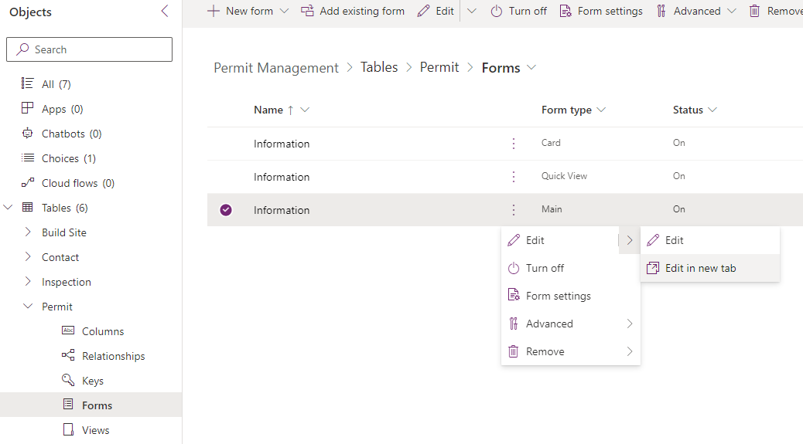
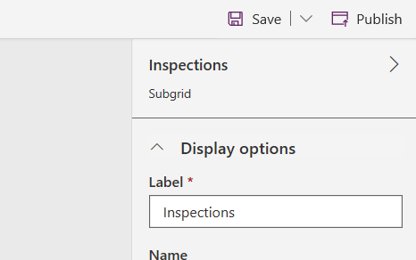
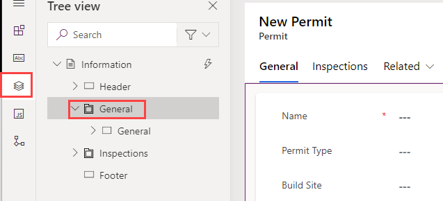
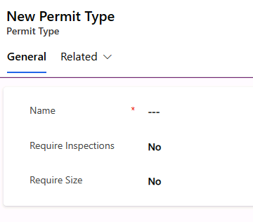
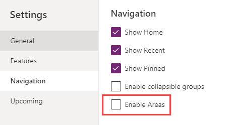
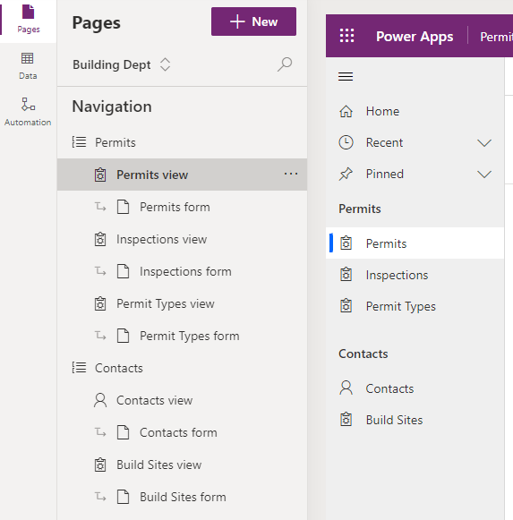
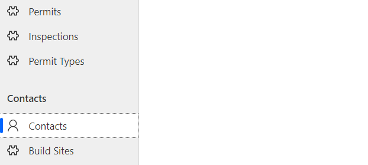

---
lab:
    title: 'Lab 2: Model-driven app'
    module: 'Module 2: Create model-driven apps'
---

# Practice Lab 2 – Model driven app

## Scenario

In this lab we will continue to build on top of the Microsoft Dataverse components created in the previous lab. We will now build a Power Apps model-driven app to allow the office staff manage records for the inspectors and the inspectors to manage their own records as needed.

## High-level lab steps

As part of creating the model-driven app, you will complete the following:

- Create a new model-driven app named Permit Management
- Edit the app navigation to reference the required tables
- Customize the forms and views of the required tables for the app

**Views**: As the name suggests, this helps viewing the existing data in the form of table. This is the configuration of the columns that will be displayed on the screen.

**Forms**: This is where the user creates/updates new records in the tables.

Both will be integrated to the model-driven app for a better user-experience.

The following is what the model-driven app designer looks like when all the customizations are completed:

## Things to consider before you begin

- What changes should we make to improve the user experience?
- What should we include in a model-driven app based on the data model we’ve built?
- What customizations can be made on the sitemap of a model-driven app?
- Remember to continue working in your DEVELOPMENT environment. We’ll move everything to production once everything is built and tested.

## Starter solution

A starter solution file for this lab can be found in the  C:\Labfiles\L02\Starter folder.

## Completed solution

A completed solution file for this lab can be found in the  C:\Labfiles\L02\Completed folder.

## Exercise 1: Customize forms and views

**Objective:** In this exercise, you will customize views and forms of the tables that will be used in the model-driven app.

### Task 1.1: Permit Form

1. Navigate to the [Power Apps maker portal](https://make.powerapps.com/)
1. Make sure you are in the Development environment.
1. Select **Solutions**.
1. Open the **Permit Management** solution.
1. Expand **Tables**.
1. Select the **Permit** table.
1. Edit the Permit table main form.

   - Under **Data experiences**, select **Forms**.
   - Select the **Main** form.

     

   - Select the ellipses **...** for the **Main** form, select **Edit** and select **Edit in new tab**.

   - By default, the form has two columns, Name (Primary column) and Owner.

     

   - Drag the **Permit Type** column to the form and place it below the **Name** column.

     

   - Add **Build Site** lookup, **Contact** lookup, **Start Date** and **New Size** to the form.
  
     

   - Select the header of the form.
  
   - Add the **Status Reason** column to the form header.

      

1. Add new tab for **Inspections** to the form.

   - Select the **Components** tab in the left-hand pane.

     

   - Select **1-column tab**.

     

   - Select the new tab you added.

   - Go to the **Properties** pane, change the **Label** to `Inspections` and the **Name** to `inspectionsTab`.
  
     

   > [!IMPORTANT]
   > Make sure you enter the name of the new tab correctly as this will be referenced by JavaScript in a later lab.

1. Add Inspections sub-grid to the Permit form.

   - Select the **Inspections** tab. Make sure that you have selected the whole tab and not just a section.

   - Select the **Components** tab in the left-hand pane.

   - Select **Subgrid** this will open a pop-up to select table.

     - Check the **Show related records** checkbox.
     - Select **Inspections (Permit)** for **Table**.
     - Select **Active Inspections** for **Default view**.

       

     - Select **Done**.

1. Inspections sub-grid properties.

    - Go to the sub-grid properties pane and change the Label to `Inspections`.

      

1. Hide the section label.

   - Select the section.

     

   - Go to the **Properties** pane and check the **Hide Label** checkbox.

     

1. Add Timeline control to Permit form.

   - In the **Tree view**, select the **General** tab

     

   - In the **Properties** pane, change **Layout** to **2 columns**.

     

   - In the **Tree view**, select the **New Section** section under the General tab.

   - Select the **Components** tab.

   - Click on **Timeline** in the Component pane to add the Timeline control to the form.

     

   - Select the section.

   - Go to the **Properties** pane and check the **Hide Label** checkbox.

1. Select **Save and publish** and wait for the publishing to complete.
1. Close the form editor tab.
1. Select **Done**.

### Task 1.2: Permit View

1. Navigate to the [Power Apps maker portal](https://make.powerapps.com/)
1. Make sure you are in the Development environment.
1. Select **Solutions**.
1. Open the **Permit Management** solution.
1. Expand **Tables**.
1. Select the **Permit** table.
1. Edit the Active Permits view.

   - Under **Data experiences**, select **Views**.
   - Select the **Active Permits** view.

     

   - Select the ellipses **...** for the **Active Permits** view, select **Edit** and select **Edit in new tab**.
   - Drag the **Build Site** column and drop it between the **Name** and **Created On** columns.
   - Click once on the **Permit Type** column. The Permit Type column will be added to the view.
   - Click the **Contact** column. The **Contact** column will be added to the view.
   - Go to the view designer and click on the chevron icon of the **Created On** column.
   - Select **Remove**. The **Created On** column will now be removed from the view.
   - Select **Save and publish** and wait for the publishing to complete.

1. Close the view editor tab.
1. Select **Done**.

### Task 1.3: Build Site form and view

1. Navigate to the [Power Apps maker portal](https://make.powerapps.com/)
1. Make sure you are in the Development environment.
1. Select **Solutions**.
1. Open the **Permit Management** solution.
1. Expand **Tables**.
1. Select the **Build Site** table.
1. Edit the Build Site table form.

   - Under **Data experiences**, select **Forms**.
   - Select the **Main** form.
   - Select the ellipses **...** for the **Main** form, select **Edit** and select **Edit in new tab**.
   - Add **City**, **State/Province**, **Zip/Postal Code**, and **Country Region** columns to the form between **Street Address** and **Owner**.

     

   - Select **Save and publish** and wait for the publishing to complete.
1. Close the form editor tab.
1. Select **Done**.

1. Edit the Active Build Sites view.

   - Select the **Views** node in the tree view for the Build Sites table.
   - Select the **Active Build Sites** view.
   - Select the ellipses **...** for the **Active Build Sites** view, select **Edit** and select **Edit in new tab**.
   - Add **City** and **Zip/Postal Code** to the view.
   - Remove **Created On** from the view by selecting **Remove** from the options in column chevron.

     

   - Select **Save and publish** and wait for the publishing to complete.
1. Close the view editor tab.
1. Select **Done**.

### Task 1.4: Inspection form and views

1. Navigate to the [Power Apps maker portal](https://make.powerapps.com/)
1. Make sure you are in the Development environment.
1. Select **Solutions**.
1. Open the **Permit Management** solution.
1. Expand **Tables**.
1. Select the **Inspection** table.
1. Edit the Inspection table form.

   - Under **Data experiences**, select **Forms**.
   - Select the **Main** form.
   - Select the ellipses **...** for the **Main** form, select **Edit** and select **Edit in new tab**.
   - Add **Inspection type**, **Permit**, **Scheduled Date**, and **Comments** columns to the form. **Inspection Type**, **Permit**, **Scheduled Date** should be added between **Name** and **Owner**, while **Comments** will be added after the **Owner** column.
   - Add the **Status Reason** column to the header.
   - The form should now look like the image below.

     

   - Select **Save and publish** and wait for the publishing to complete.
1. Close the form editor tab.
1. Select **Done**.

1. Edit the Active Inspections view.

   - Select the **Views** node in the tree view for the Inspections table.
   - Select the **Active Inspections** view.
   - Select the ellipses **...** for the **Active Inspections** view, select **Edit** and select **Edit in new tab**.
   - Add **Permit**, **Inspection Type**, **Scheduled Date**, **Owner**, and **Sequence** to the view.
   - Remove **Created On** from the view by selecting the chevron on the column and select **Remove**.

     

   - Select **Save and publish** and wait for the publishing to complete.
1. Close the view editor tab.
1. Select **Done**.

1. Create new Inspector View on the Inspection table.

   - Make sure you still have the **Views** node selected.
   - Select **+ New view**.

     

   - Enter `Inspector View` for **Name**.
   - Select **Create**.
   - Add **Inspection Type**, **Permit**, **Scheduled Date**, and **Sequence** columns to the view.

      

1. Sort the Inspector View by the Sequence column.

   - Go to the view properties pane and select **Sort By**.

     

   - Select **Sequence**.

1. Filter the Inspector View.

   - Go to the view properties pane and select **Edit filters**. This will open a new pane on the right side of the window.

     

   - Select **Add** and select **Add row**.

     

   - Set the filter property by Selecting **Status Reason** in first dropdown and **Pending** in the third dropdown. Now, select **Add** and select **Add row** again.

     

   - To set the filter property select **Owner** column in the first dropdown and **Equals current user** in second dropdown.

     

   - Select **Ok**.
   - Select **Save and publish** and wait for the publishing to complete.
1. Select the **<- Back** button.

### Task 1.5: Edit Permit Type form and view

1. Navigate to the [Power Apps maker portal](https://make.powerapps.com/)
1. Make sure you are in the Development environment.
1. Select **Solutions**.
1. Open the **Permit Management** solution.
1. Expand **Tables**.
1. Select the **Permit Type** table.
1. Edit the Permit Type table form.

   - Under **Data experiences**, select **Forms**.
   - Select the **Main** form.
   - Select the ellipses **...** for the **Main** form, select **Edit** and select **Edit in new tab**.
   - Add **Require Inspections** and **Require Size** columns to the form between **Name** and **Owner**.

     

1. Select **Save and publish** and wait for the publishing to complete.
1. Close the form editor tab.
1. Select **Done**.

1. Edit the Active Permit Types view.
   - Select the **Views** node in the tree view for the Permit Types table.
   - Select the ellipses **...** for the **Active Permit Types** view, select **Edit** and select **Edit in new tab**.
   - Add **Require Inspections** and **Require Size** to the view.
   - Remove **Created On** from the view but selecting the chevron on the column and select **Remove**.

     

   - Select **Save and publish** and wait for the publishing to complete.
1. Close the view editor tab.
1. Select **Done**.

## Exercise 2: Create model-driven app

**Objective:** In this exercise, you will create the model-driven app, customize the sitemap, and test the app.

> [!NOTE]
> You will see several columns not addressed as you build out your application, particularly on the sitemap steps. We have taken some short cuts in the interest of time for doing the labs. In a real project you would give these items logical names.

### Task 2.1: Create Application

1. Navigate to the [Power Apps maker portal](https://make.powerapps.com/)
1. Make sure you are in the Development environment.
1. Select **Solutions**.
1. Open the **Permit Management** solution.

1. Create the model-driven application

   - Select **+ New** and select **App** and then select **Model-driven app**.
  
     
  
   - Enter `Permit Management` for **Name**.
   - Select **Create**.

1. Enable Areas in Navigation

   - Select **Navigation**.
   - Select the ellipses **...** for the **Navigation**  and select **Settings**.

     

   - Select the **Navigation** tab.
   - Check the **Enable Areas** checkbox.

     

   - Close the settings window.

   - In the left-hand pane, select **Area1**, select the **ellipses (...)** and select **Edit properties**.

       

   - In the **Title** text box in the **Properties** pane, enter `Building Dept`.

1. Add group to app navigation

   - Click on **Navigation**, select the **ellipses (...)** and select **New group**.
   - In the **Title** text box in the **Properties** pane, enter `Permits`.

1. Add tables to Permits group

   - Click **+ Add page**.
   - Select **Dataverse table**.
   - Click **Next**.
   - Search for `Permit` and select the **Permit** and **Permit Type** tables.
   - Search for `Inspection` and select the **Inspections** table.
   - Click **Add**.

1. Order the navigation.

   - Select **Permits view** , select the **ellipses (...)** and select **Move up**.

1. Add second group to app navigation

   - Click on **Navigation**, select the **ellipses (...)** and select **New group**.
   - In the **Title** text box in the **Properties** pane, enter `Contacts`.

1. Add tables to Contacts group

   - Click **+ New**.
   - Select **Dataverse table**.
   - Click **Next**.
   - Search for `Contact` and select the **Contact** table.
   - Search for `Build` and select the **Build Site** table.
   - Click **Add**.
   - Select **Contacts view** , select the **ellipses (...)** and select **Move up**.

1. The navigation should now look like the image below.

     

1. Select **Save**.

1. Select **Publish**.

1. Select the **<- Back** button to go back to the solution.

### Task 2.2: Test Application

1. Navigate to the [Power Apps maker portal](https://make.powerapps.com/)
1. Make sure you are in the Development environment.
1. Select **Solutions**.
1. Open the **Permit Management** solution.
1. In the **Objects** pane, select **All**.
1. Select the **Apps** node.
1. Select the **Permit Management** app, select the **ellipses (...)** and select **Play**.

1. Create new Contact record

   - Select **Contacts**.
  
       

   - Select **+ New**.

   - Provide First Name as `John`, Last Name as `Doe`.

   - Select **Save & Close**

     

   - You should now see the created contact on the **Active Contacts** view.

     

1. Create new Build Site record

   - Select **Build Sites**.

   - Select **+ New**.

   - Provide the address as `One Microsoft Way Redmond WA 98052 USA`.

   - Select **Save & Close** and this will show the newly created record on the Active Build Sites View.

     

1. Create new Permit Type record

   - Select **Permit Types**.

   - Select **+ New**.

   - Provide **Name** as `New Construction` and select **Save & Close** and this will show the newly created record on the Active Permit Types View.

     

1. Create new Permit record

   - Select **Permits**.

   - Select **+ New**.

   - Provide **Name** as `Test Permit`, select the **Permit Type**, **Build Site**, and the **Contact** records you created in the previous steps.

   - Select tomorrow's date for the **Start Date** and select **Save**.

     

1. Create new Inspection record

   - Select the **Inspections** tab in the Permit form.

   - Select **+ New Inspection**.

     

   - Provide **Name** as `Framing Inspection`.

   - Select **Initial Inspection** from the dropdown for **Inspection Type**.

   - Select tomorrow's date for **Scheduled Date**.

   - Select **Save & Close**.

     

   - The **Inspection** record should now show in the Inspections sub-grid.

     

1. You may add more test records.
