---
lab:
    title: 'Lab 03: Canvas app'
---

> [!NOTE]
> Effective November 2020:
> - Common Data Service has been renamed to Microsoft Dataverse. [Learn more](https://aka.ms/PAuAppBlog)
> - Some terminology in Microsoft Dataverse has been updated. For example, *entity* is now *table* and *Column* is now *column*. [Learn more](https://go.microsoft.com/fwlink/?linkid=2147247)
>
> This content will be updated soon to reflect the latest terminology.

## Lab 03 – Canvas app

# Scenario

A regional building department issues and tracks permits for new buildings and updates for remodeling of existing buildings. Throughout this course you will build applications and automation to enable the regional building department to manage the permitting process. This will be an end-to-end solution which will help you understand the overall process flow.

As we continue to build our solution, we will now design a Power Apps canvas app that the inspectors will use in the Column on their mobile devices. Canvas apps are low code apps that can be designed for a tablet or mobile phone layouts. You will build a two-screen canvas app that allows inspectors quickly access and process the inspections.

# High-level lab steps

We will follow the below schema to design the canvas app:

- Create the app using the tablet form factor

- Connect to Microsoft Dataverse as a data source

- Configure a gallery control to show the pending inspections

- Use a Microsoft Dataverse view to populate the gallery

- Configure a detail page with inspection info

- Handle saving the inspection results to Microsoft Dataverse

- Export the solution with the data model and apps and import it to the “Production” environment

This is the first screen in the application to show all Pending Inspections for the logged in Inspector.

This second screen lets the inspector update the selected Inspection.

## Things to consider before you begin

- What would an inspector need quick access to while in the field?

- How do we move our solution from the development to the production environment?

- Remember to continue working in your DEVELOPMENT environment. We’ll move everything to production in Exercise 2 of this lab.

 

  
‎ 

# Exercise #1: Create Canvas App

**Objective:** In this exercise, you will create a canvas app.

## Task #1: Create Canvas App

1. Open the Permit Management solution.

	- Sign in to [Power Apps maker portal](https://make.powerapps.com/)

	- Select your **Dev environment.**

	- Select **Solutions**.

	- Click to open the **Permit Management** solution. 

2. Create new canvas application

	- Click **+ New** and select **App | Canvas**.
	
	- Select **Tablet Form Factor** from canvas app window.

    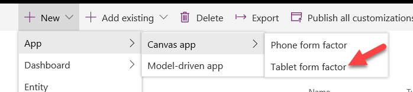

    If you are creating your first app, this will ask you to set the Country/region for the app. Click **Get Started.**

    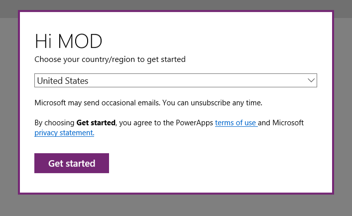
        
	- Enter **Inspector** for App Name, select Table format and click **Create**.
	
	- On the Welcome to Power Apps Studio popup, click **Skip**
	
	- Click **File** and select **Save As**.

	- Select **The Cloud**,This will make sure that the changes are not removed if the app closes unexpectedly.

    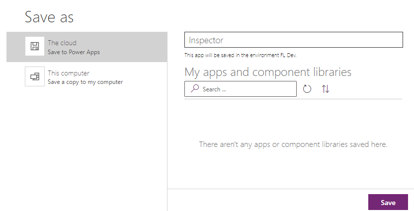

	- Click on the app designer button.

    

3. Rename Screen1.

	- Go to the **Tree View** and double click on **Screen1**.

	- Rename it **Main Screen** and press **Enter.**

    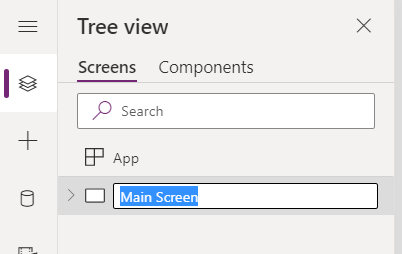

4. Import Component.

**NOTE: Follow the workaround as listed at the beginning of the lab.**

	- Select the **Components** tab.

	- Click on the **… (Component Options)** button and select Import **Components**.

    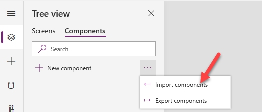

	- Click **Upload File**. 

	- Browser to the lab resources folder (F:\temp\Instructions\L03\Resources), select the **Components** file and click **Open**.

    

5. Add the Header component to the MainScreen.

	- Select the **Screens** tab.

	- Click **+** Insert.

    

	- Click to expand **Library components** and select **Header**.

    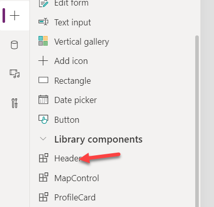

	- Select **Tree View**.

	- Rename **Header_1** to **Main Header** by double click on Header_1.

6. Change the Main Header properties

	- Select **Main Header**.

	- Change the **Text** Column of the **Main Header** to **My Pending Inspections**. This can be done by selecting “Text” property in the dropdown below top menu. Make sure that you have selected the Main Header control while doing this step.

    

	- Change the **Width** vale of the **Main Header** to the formula below.

            Parent.Width

    

## Task #2: Add Data Source

1. Add Permit and Inspection as data source.

	- Select the **Data Sources** tab.

    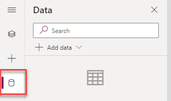

	- Search for **Permit** and select **Permits**.

    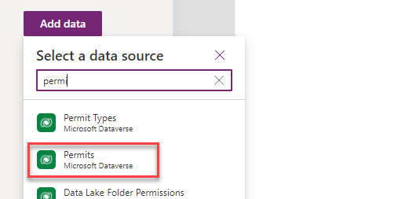

	- Search for **Inspection** and select **Inspections**.

    

	- You should now have both **Permits** and **Inspections** in your app.

    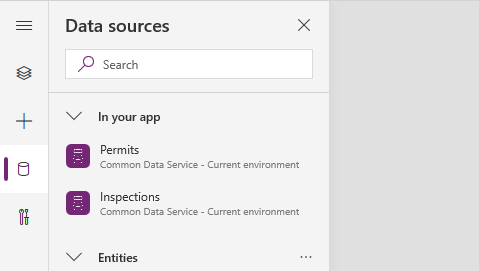

 

## Task #3: Add Inspection Gallery

1. Add Gallery

	- Click **+ Insert** and select **Vertical Gallery**. Vertical Gallery will be added to the MainScreen.

    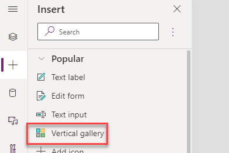

	- Select **Inspections** for **Data Source**. When Inspection is selected, this will automatically pick the Columns and show them in the gallery items.

    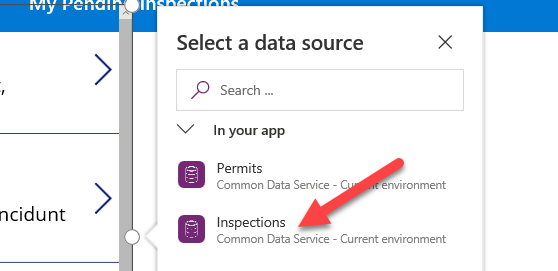

	- Select the **Tree View** tab.

	- Rename **Gallery_1** to **Inspection List** by double click on Gallery_1.

2. Select the inspector view

	- Make sure you have the **Inspection List** control selected.

	- Go to the **Properties** pane and select **Inspector View** for **View**.

    

3. Change the **Inspection List** control layout

	- Go to the **Properties** pane and click on the **Layout** dropdown.

    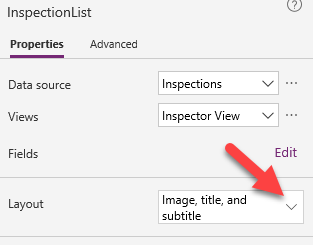

	- Select **Title and Subtitle**.

4. Verify the selected Columns.

	- Go to the **Properties** pane and click on the **Edit Columns**.

    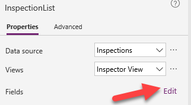

	- Confirm that **Scheduled Date** is selected for **Subtitle** and **Name** is selected for **Title**. Close the **Data** pane. 

    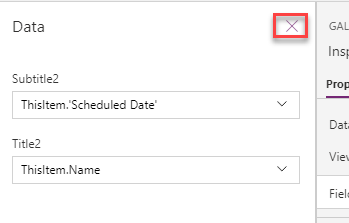

5. Change date time to date only.

	- Expand the **Inspection List** and select **Subtitle**.

    

	- Change the **Text** property of the control to the formula below.

            DateValue(Text(ThisItem.'Scheduled Date'),"en")

6. Resize the Gallery

	- Select the **Inspection List** gallery.

	- Select **Width** property from the formula dropdown and enter the formula below.

            Parent.Width

	- Select **Height** property and set it to the formula below.

            Parent.Height - ('Main Header'.Height*2)

	- Select the Y property from the dropdown and set it to formula below.

            'Main Header'.Height

	- Select the X property from the dropdown and set it to formula below.

            'Main Header'.X

 

## Task #4: Add Inspection Details Screen

1. Add new screen named Details Screen

	- Click **New Screen** and select **Blank**.

    

	- Rename the new screen **Details Screen** by double clicking on the control in Tree View.

2. Add Header to the Details Screen and edit it

	- Go to the **Main Screen** and copy the **Main Header**.

    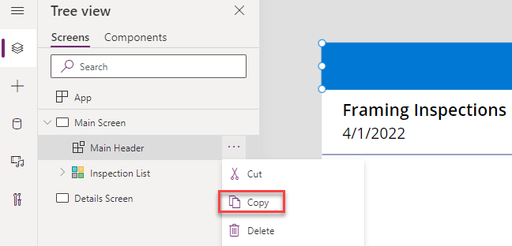

	- Go to the **Details Screen** and paste the **Header**.

    

	- Rename the Header you **Details Header** by double clicking on the control in Tree View.

    

	- Select te **Y** property of the **Details Header** and set to **0**.

	- Select the **Text** property of the **Details Header** and set it to formula below.

            'Inspection List'.Selected.Name

    

3. Add Form to the Details Screen.

	- Select the **Details Screen**.

	- Click **+ Insert** and select **Edit Form**.

    

	- Select the **Tree View** tab.

	- Rename the form **Inspection Form**.

	- Resize the Edit form as:

		- Select the **InspectionForm**.

		- Select **Width** property from the formula dropdown and enter the formula below.

                Parent.Width

	- Select **Height** property and set it to the formula below.

            Parent.Height - ('Details Header'.Height*2)

	- Select the Y property from the dropdown and set it to formula below.

            'Details Header'.Height

- Select the X property from the dropdown and set it to formula below.

        'Details Header'.X

- The form should now look like the image below.

    

4. Set the **Inspection Form** data source

	- Select the **Inspection Form** and select the DataSource as **Inspections** Table.

    

	- Set the Item value to the formula below.

            'Inspection List'.Selected

    

5. Edit Inspection Form Columns. This adds the data cards for Columns by default, but you can add/remove the data cards as:

	- Select the **Inspection Form**.

	- Go to the **Properties** pane and click **Edit Fields**.

    

	- Click **+ Add Field**.

	- Select **Status Reason**, **Scheduled Date**, **Name** and **Comments**.

	- Click **Add**.

	- The Columns should be ordered as shown in the image below. You can drag/drop to rearrange the Columns.

    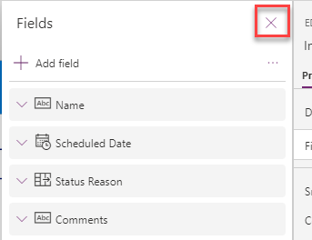

6. Change the Scheduled Date to show date only.

	- Go to the **Tree View** and expand the **Inspection Form**.

	- Select the **Scheduled Date** data card.

	- Go to the **Properties** pane and select the **Advanced** tab.

	- Click **Unlock to change Properties**.

    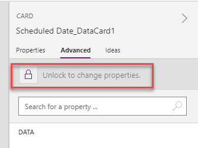

	- Expand the **Scheduled Date** card.

	- Select **StarVisible**, **ErrorMesage**, **MinuteValue**, **Separator**, and **HourValue**.

    

	- Delete the selected controls. When the controls are deleted, you will see an error message.

    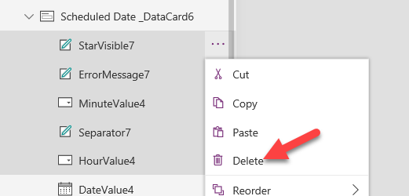

	- Select the **Scheduled Date** DataCard.

	- Go to formula bar and select **Update**.

    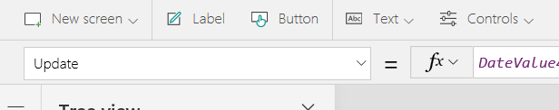

	- Remove everything after the **SelectedDate**. This should remove the error message from the app.

    

7. Make the Name and Scheduled Date Columns read-only

	- Select the **Inspection Form**.

	- Go to the **Properties** pane and click **Edit Fields**.

	- Expand the **Name** Column.

    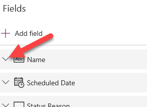

	- Click on the **Control Type** dropdown and select **View Text**.

    

	- Expand the **Scheduled Date** Column. Observe the change.

	- Notice we cannot change this the same way because we’ve customized it. From the Tree View select **DateValue** control inside the **Scheduled Date** Datacard and go to the **Advanced tab** of the **Properties pane**.

    

	- Search for **DisplayMode** property and remove the existing formula and replace it with the following:  

            DisplayMode.View
    

8. Change the Status Reason label.

	- Select the **Status Reason data card**.

	- Go to the **Properties** pane and the Advanced tab, click **Unlock to Change properties.**

	- Change the **DisplayName** to **Inspection** **Result**.

    

9. Resize the Comments data card.

	- Select the **Comments** data card.

	- Click and drag the right edge to the far right of the screen.

    

	- Go to the **Advanced** tab of **Properties** pane and click **Unlock to change properties**.

	- Set the **Height** value to **300**.

	- Select the **DataCardValue** control.

    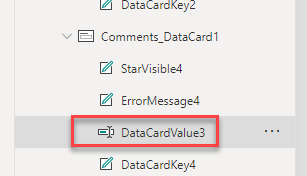

	- Set the **Height** value to **300**.

	- Change the **Mode** to the formula below.

            TextMode.MultiLine

    

10. Make sure your form looks like the image below. Save your work.

    

 

## Task #5: Submit the Inspection Result

1. Add submit button to the details screen.

	- Select the **Details Screen**. Make sure that you have selected the screen and not selected the Edit Form.

	- Go to the **Insert** tab and click **Button**.

    

	- Rename the button **Submit Button**.

	- Change the Text value of the button to **Submit**.

	- Place the button below the form through drag and drop.

    

2. Submit the inspection result.

	- Select the **Submit Button.**

	- Set the **OnSelect** value of the submit button to the formula below. Remove the false expression and update it. This formula will submit the form and then navigate back to the MainScreen.

    SubmitForm('Inspection Form');Back(ScreenTransition.UnCoverRight)

    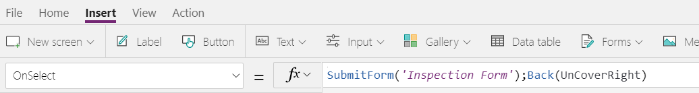

3. Add navigation from the main screen to the details screen.

	- Go to the **Main Screen** and select the **Inspection List**.

	- Set the **OnSelect** property of the **Inspection List** to the formula below. Remove the already existing false expression.

            Navigate('Details Screen', ScreenTransition.Cover)

 

 

## Task #6: Test Application

1. Start the application

	- Select the **Main Screen** and click **Preview the App**.

    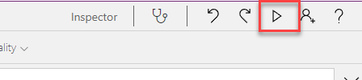

	- The application should load and show at least one inspection. Click on the inspection.

    

	- The application should navigate to the details screen. Change the **Inspection Result** to **Passed**, provide a comment in the textbox as “Framing inspection was completed.”, and click **Submit**.

    

	- The inspection should be submitted, and the application should navigate back to the MainScreen. Click Close.

     

 

2. Save and publish the application

	- Click **File** and then click **Save**.

	- Click **Publish**.

    

	- Click **Publish this Version**.

	- Click **Close**.

    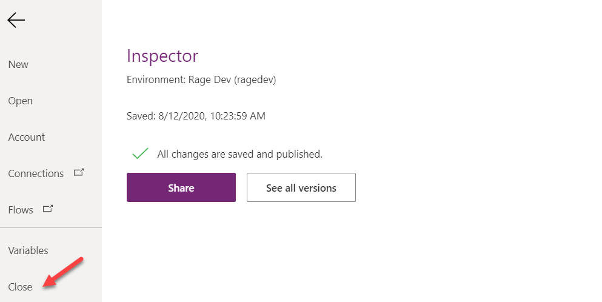

	- Close the **Designer** browser window or tab.

	- Click **Leave** if prompted when trying to close the browser window.

 

3. Confirm the inspection record was updated

	- Navigate to [Power Apps maker portal](https://make.powerapps.com/)

	- Select your **Dev environment.**

	- Select **Apps** and click to open the **Permit Management Application**.

    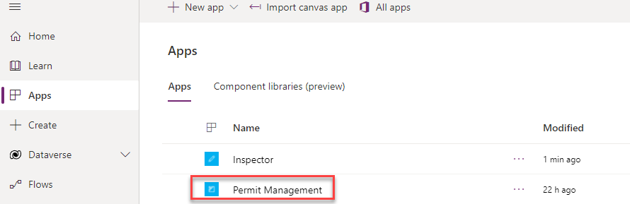

	- Select **Inspections** and click to open the **Framing Inspection**.

    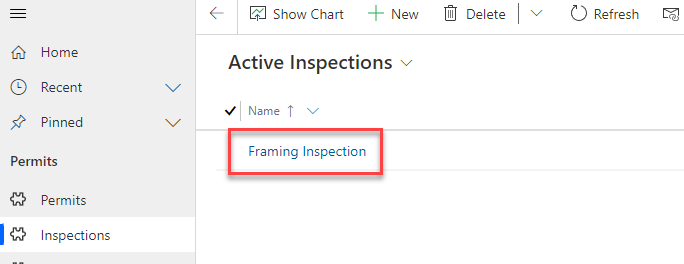

	- The **Status Reason** of the inspection should be **Passed,** and the comment should be updated to the comment you provided.

    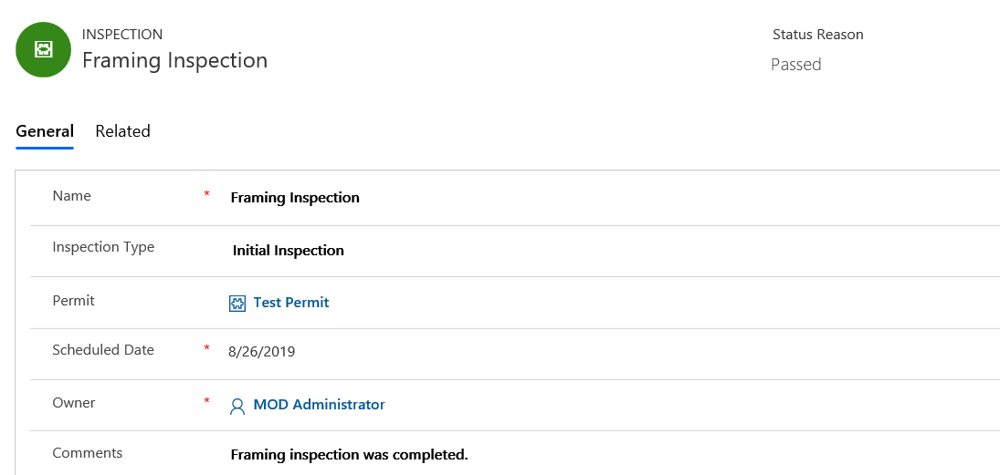

	- Close the **Permit Management** application.

  
‎ 

# Exercise #2: Export/Import Solution

**Objective:** In this exercise, you will export the solution you created in the development environment and import it to the production environment.

## Task #1: Export solution.

1. Select the Permit Management solution.

	- Sign in to [Power Apps maker portal](https://make.powerapps.com/) 

	- Make sure you have your **Dev** environment selected.

	- Select **Solutions** and select the **Permit Management** solution.

    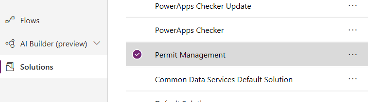

2. Run solution checker.

	- Click **Solution Checker** and select **Run**.

    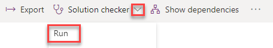

	- Wait for the run to complete.

    **Note:** At the creation of this lab, the solution checker did not complete successfully. If you get an error with the message “Couldn’t be complete” skip to step 3.

    

	- Click on the More **Commands** of the **Permit Management** solution.

    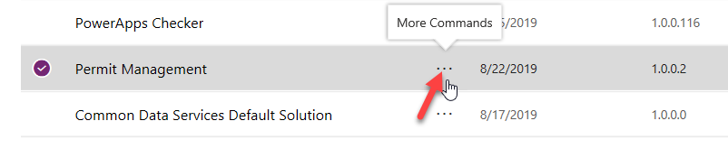

	- Click Solution Checker and select View Results.

    

- You will see several issues reported

    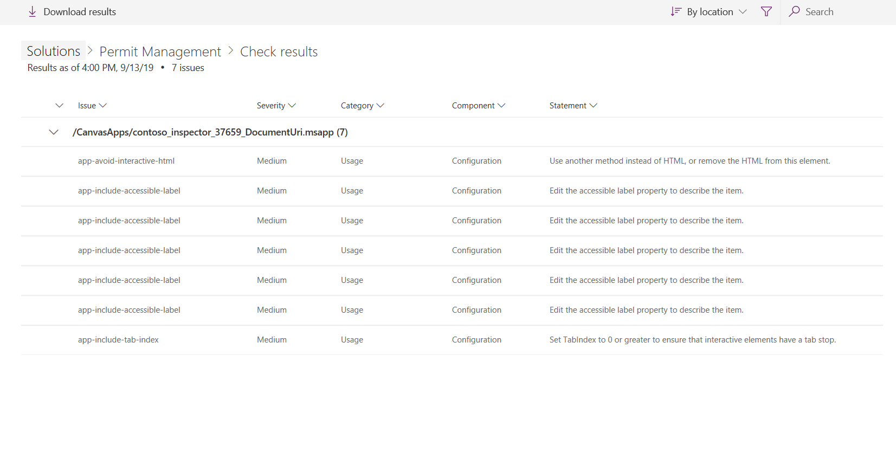

- To resolve the issues, follow these steps:

	- Select **Apps**

	- Click … next to **Inspector** app and select **Edit**

	- Click **App checked** icon on the toolbar 

    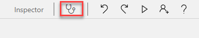

- Select **Recheck All**

- Expand **Missing accessible label** node

- Select an issue. This will open the screen with the control and prompt to enter **AccessibleLabel** property.

- Enter text value as appropriate

    

	- Repeat the process for all controls with missing accessible labels

	- Expand **Missing tab stop** node

	- Select control, enter a value for the **TabIndex**, e.g. 0

	- **Tips** node may contain the following message  
‎“Use another method instead of HTML, or remove the HTML from this element.”

	- This message is related to Map component we imported as part of the component bundle. This component can be safely deleted as it’s not used by the app.

	- Fix other app issues as appropriate.

- Click **File** and then click **Save**.

- Click **Publish**.

- Switch to [Power Apps maker portal](https://make.powerapps.com/) 

- Select **Solutions** then select **Permit Management** solution 

- Click **Solution checker** then select **Run** and wait for the run to complete.

- There should be zero issues.

    

3. Export managed solution

	- Select **Solutions** and click to open the **Permit Management** solution.

	- Click **Export**.

    

	- Click **Publish** and wait for the publishing to complete.

    

	- Click **Next**.

	- Select **Managed** and click **Export**.

    

	- Save the solution on your machine.

4. Export unmanaged solution

	- Click **Export** again.

	- Click **Next**.

	- Edit the version number to match the Managed solution you just exported, select **Unmanaged** and click **Export**.  
‎

    

	- Save the unmanaged solution on your machine.

 

## Task #2: Import solution.

1. Open the Permit Management solution.

	- Sign in to [Power Apps maker portal](https://make.powerapps.com/) 

	- Make sure you have your **Prod** environment selected.
    **Note** If you are using the community plan environment as instructed (e.g: [username]'s Environment), you may need to create a data base before you proceed to the next step.

2. Import solution

	- Select **Solutions** and click **Import**.

    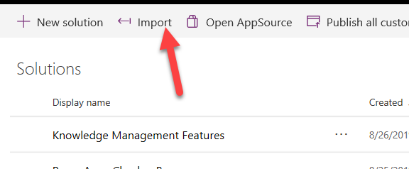

	- Click **Browse**.

	- Select the **Managed** solution you exported and click **Open**.

    

	- Click **Next**.

	- Click **Import** and this will open a new window to track the import status.

	- Wait for import to complete and click **Close**.

	- Navigate to both the model driven and canvas apps you’ve created and add a few records, test the apps.

 

 

 

 

 
