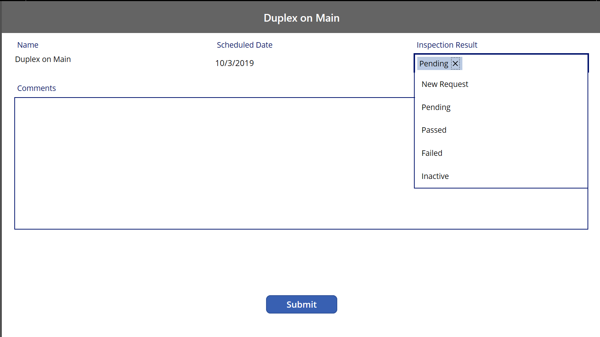
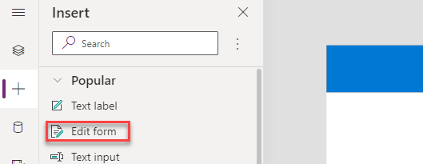
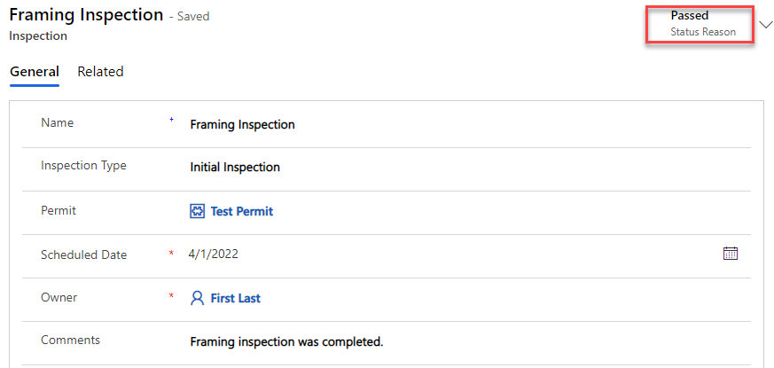

---
lab:
    title: 'Lab 3: Canvas app'
    module: 'Module 2: Create canvas app in Power Apps'
---

# Practice Lab 3 –  Canvas app

## Scenario

As we continue to build our solution, we will now design a Power Apps canvas app that the inspectors will use in the field on their mobile devices. Canvas apps are low code apps that can be designed for a tablet or mobile phone layouts. You will build a two-screen canvas app that allows inspectors quickly access and process the inspections.

## High-level lab steps

We will follow the below basic steps to design the canvas app:

- Create the app using the tablet form factor.
- Connect to Microsoft Dataverse as a data source.
- Configure a gallery control to show the pending inspections.
- Use a Microsoft Dataverse view to populate the gallery.
- Configure a detail page with inspection info.
- Handle saving the inspection results to Microsoft Dataverse.
- Export the solution with the data model and apps and import it to the “Production” environment.

This is the first screen of the application, it will show all Pending Inspections for the logged in Inspector.


This second screen it will let the inspector update the selected Inspection.



## Things to consider before you begin

- What would an inspector need quick access to while in the field?
- How do we move our solution from the development to the production environment?
- Remember to continue working in your DEVELOPMENT environment. We’ll move everything to production in Exercise 2 of this lab.

## Starter solution

A starter solution file for this lab can be found in the  C:\Labfiles\L03\Starter folder.

## Completed solution

Completed solution files for this lab can be found in the  C:\Labfiles\L03\Completed folder.

## Exercise 1: Canvas app

**Objective:** In this exercise, you will create a canvas app that lists pending inspections for the inspector.

### Task 1.1: Create Canvas app

1. Open the Permit Management solution.

   - Navigate to the [Power Apps maker portal](https://make.powerapps.com/)
   - Select your **Development** environment.
   - Select **Solutions**.
   - Open the **Permit Management** solution.

1. Create new canvas application.

   - Select **+ New** and then select **App** and then select **Canvas app**.
   - Enter `Inspector` for App name.
   - Select **Tablet** format.
   - Select **Create**.
  
     

   - On the Welcome to Power Apps Studio popup, select **Skip**.
   - Select the **Save** icon. This will make sure that the changes are not lost if the app closes unexpectedly.

1. Rename Screen1.

   - Go to the **Tree View** and double click on **Screen1**.
   - Rename the screen to `Main Screen`.

     

1. Import Component.

   - Select the **Components** tab.
   - Select the **ellipses ...** next to New component and select **<- Import components**.
  
     

   - Select **Upload file**.
   - Browse to the lab resources folder (L03\Resources), select the **ContosoComponents.msapp** file and select **Open**.

   > [!NOTE]
   > The Component file can be found in the  C:\Labfiles\L03\Resources folder.

1. Add the Header component to the MainScreen.

   - Select the **Screens** tab.
   - Select **+ Insert** tab.

     

   - Expand **Custom** and select **ContosoHeader**.

     

   - Select **Tree view**.
   - Rename **ContosoHeader_1** to `Main Header`.

1. Change the Main Header properties.

   - Select **Main Header**.
   - Change the **Text** property of the **Main Header** to `"My Pending Inspections"`. This can be done by selecting *Text* property in the dropdown below top menu. Make sure that you have selected the Main Header control while doing this step.

     

   - Change the **Width** property of the **Main Header** to the formula below.

     ```powerappsfl
     Parent.Width
     ```

    

### Task 1.2: Add data sources

1. Add Permit and Inspection Dataverse tables as data sources.

   - Select the **Data** tab.

     

   - Select **Add data**.
   - Search for `Permit` and select **Permits**.

     

   - Select **+ Add data**.
   - Search for `Inspection` and select **Inspections**.
   - You should now have both **Permits** and **Inspections** in your app.

     

### Task 1.3: Add Inspections gallery

1. Add Gallery.

   - Select the **+ Insert** tab and then select **Vertical gallery**. The gallery will be added to the Main Screen.

     

   - Select **Inspections** for the gallery's **data source**.

     

   - Select the **Tree view** tab.

   - Rename **Gallery_1** to `Inspection List` by double clicking on the control in the Tree view tab.

1. Select the inspector view.

   - Make sure you have the **Inspection List** control selected.

   - Go to the **Properties** pane and select **Inspector View** for Views.

     

1. Change the **Inspection List** control layout.

   - Go to the **Properties** pane and select the **Layout** dropdown.

   - Select **Title and Subtitle**.
  
     

1. Verify the selected columns.

   - Go to the **Properties** pane and select the **Edit** fields button.

     

   - Confirm that **Scheduled Date** is selected for **Subtitle** and **Name** is selected for **Title**. Close the **Data** pane.

     

1. Change date time to date only.

   - In the Tree view, expand the **Inspection List** and select **Subtitle**.

     

   - Change the **Text** property of the control to the formula below.

    ```powerappsfl
    DateValue(Text(ThisItem.'Scheduled Date'),"en")
    ```

1. Resize the Gallery.

   - Select the **Inspection List** gallery.

   - Select the X property from the dropdown and set it to formula below.

    ```powerappsfl
   'Main Header'.X
    ```

   - Select the Y property from the dropdown and set it to formula below.

    ```powerappsfl
   'Main Header'.Height
    ```

   - Select **Width** property from the formula dropdown and enter the formula below.

    ```powerappsfl
    Parent.Width
    ```

   - Select **Height** property and set it to the formula below.

    ```powerappsfl
   Parent.Height - ('Main Header'.Height * 2)
    ```

     

### Task 1.4: Add Inspection Details screen

1. Add new screen.

   - Select the **Tree view** tab.
   - Select **+ New screen** and select **Blank**.

     

   - Rename the new screen `Details Screen` by double clicking on the control in Tree View.

1. Add Header to the Details Screen and edit.

   - Go to the **Main Screen** and copy the **Main Header**.

     

   - Go to the **Details Screen** and paste the **Header**.

     

   - Rename the Header to `Details Header` by double clicking on the control in the Tree view tab.

   - Select the **Text** property of the **Details Header** and set it to formula below.

    ```powerappsfl
    'Inspection List'.Selected.Name
    ```

     

1. Add a form to the details screen.

   - Select the **Details Screen** in the Tree view.

   - Select the **+ Insert** tab and then select **Edit form**.

     

   - Select the **Tree view** tab.
   - Rename the form `InspectionForm` by double clicking on the control in Tree View.
   - Select the **InspectionForm**.

   - Select the X property from the dropdown and set it to formula below.

    ```powerappsfl
   'Details Header'.X
    ```

   - Select the Y property from the dropdown and set it to formula below.

    ```powerappsfl
   'Details Header'.Height
    ```

   - Select **Width** property from the formula dropdown and enter the formula below.

    ```powerappsfl
   Parent.Width
    ```

   - Select **Height** property and set it to the formula below.

    ```powerappsfl
   Parent.Height - ('Details Header'.Height * 2)
    ```

     

1. Set the form's data source.

   - Select the **InspectionForm** and select the DataSource as **Inspections** table.

     

   - Set the **Item** property to the formula below.

    ```powerappsfl
   'Inspection List'.Selected
    ```

     

1. Select form fields.

   - Select the **InspectionForm**.
   - Go to the **Properties** pane and select the **Edit fields** button.

     

   - Select **+ Add Field**.
   - Select **Status Reason**, **Scheduled Date**, **Name**, and **Comments**.
   - Remove all other fields.
   - Select **Add**.
   - The columns should be ordered as shown in the image below. You can drag/drop to rearrange the columns. Close the Fields pane.

     

1. Change the Scheduled Date to show date only.

   - Select the **Tree view** tab and expand the **InspectionForm**.
   - Select the **Scheduled Date** data card.
   - Go to the **Properties** pane and select the **Advanced** tab.
   - Select **Unlock to change properties**.

     

   - Expand the **Scheduled Date** card.
   - Select **StarVisible**, **ErrorMessage**, **MinuteValue**, **Separator**, and **HourValue**.

     

   - Delete the selected controls either by pressing the Delete key on your keyboard or by selecting the ellipses and selecting Delete. When the controls are deleted, you will see an error message.

     

   - Select the **Scheduled Date** DataCard.
   - Go to property selector and select the **Update** property.

     

   - Remove everything after the **SelectedDate**. This should remove the error message from the app.

     

1. Make the Name and Scheduled Date columns read-only.

   - Select the **InspectionForm** in the Tree view.
   - Go to the **Properties** pane and select **Edit fields**.
   - Expand the **Name** field.
   - Select the **Control Type** dropdown and select **View text**.

     

   - Expand the **Scheduled Date** field. Observe the change.
   - Notice we cannot change this the same way because we’ve customized it.

   - From the Tree View select **DateValue** control inside the **Scheduled Date** Datacard and go to the **Advanced tab** of the **Properties pane**.

     

   - Search for **DisplayMode** property and remove the existing formula and replace it with the following:  

    ```powerappsfl
   DisplayMode.View
    ```

     

1. Change the Status Reason label.

   - Select the **Status Reason data card**.
   - Go to the **Properties** pane and the Advanced tab, select **Unlock to change properties.**
   - Change the **DisplayName** to `"Inspection Result"`.

     

1. Resize the Comments data card.

   - Select the **Comments** data card.
   - Select and drag the right edge of the control to the far right of the screen.

     

   - Go to the **Advanced** tab of **Properties** pane and select **Unlock to change properties**.
   - Set the **Height** value to **300**.
   - Expand the **Comments** card.
   - Select the **DataCardValue** control.

     

   - Set the **Height** value to **300**.
   - Change the **Mode** to the formula below.

    ```powerappsfl
   TextMode.MultiLine
    ```

     

1. Make sure your form looks like the image below. Save your work.

     

### Task 1.5: Submit the Inspection Result

1. Add submit button to the details screen.

   - Select the **Details Screen** in the Tree view. Make sure that you have selected the screen and not selected the Edit Form.

   - Select the **+ Insert** tab and select **Button**.

     

   - Select the **Tree view** tab.
   - Rename the button `Submit Button`.
   - Change the **Text** value of the button to `"Submit"`.
   - Place the button below the form via drag and drop.

     

1. Submit the inspection result.

   - Select the **Submit Button** in the Tree view.

   - Set the **OnSelect** value of the submit button to the formula below. Remove the false expression and update it. This formula will submit the form and then navigate back to the MainScreen.

    ```powerappsfl
    SubmitForm(InspectionForm);Back(ScreenTransition.UnCoverRight);
    ```

     

1. Add navigation from the main screen to the details screen.

   - Go to the **Main Screen** and select the **Inspection List**.

   - Set the **OnSelect** property of the **Inspection List** to the formula below. Remove the already existing false expression.

    ```powerappsfl
   Navigate('Details Screen', ScreenTransition.Cover);
    ```

1. Save your work.

### Task 1.6: Test Application

1. Start the application.

   - Select the **Main Screen** and select **Preview the app**.

     

   - The application should load and show at least one inspection. Select the inspection.

     

   - The application should navigate to the details screen.
   - Change the **Inspection Result** to **Passed**, provide a comment in the textbox as `Framing inspection was completed.`.
   - Select **Submit**.

     

   - The inspection should be submitted, and the application should navigate back to the Main Screen. The inspection you set to passed will not be listed in the gallery.

     

   - **Close** Preview Mode.

1. Save and publish the application.

   - Select the **Save** icon.
   - Select the **Publish** icon.
   - Select **Publish this version**.

     

   - Select the **<- Back** icon.
   - Select **Leave**.

1. Confirm the inspection record was updated.

   - Navigate to the [Power Apps maker portal](https://make.powerapps.com/)
   - Select your **Development** environment.
   - Select **Apps** and play the **Permit Management** app.

     

   - Select **Inspections** and open the **Framing Inspection** record.

     

   - The **Status Reason** of the inspection should be **Passed** and the comment should be updated to the comment you provided.

     

   - Change the **Status Reason** back to **Pending**.

   - Select **Save & Close**.

   - Close the **Permit Management** application.

## Exercise 2: Export and import solution

**Objective:** In this exercise, you will export the solution you created in the development environment and import it to the production environment.

### Task 2.1: Solution checker

1. Select the Permit Management solution.

   - Navigate to the [Power Apps maker portal](https://make.powerapps.com/)
   - Select your **Development** environment.
   - Select **Solutions**.
   - Select the **Permit Management** solution.

     

1. Run solution checker.

   - Select **Solution checker** and then select **Run**.

     

   - Wait for the run to complete as it may take several minutes.
   - Select the **ellipses ...** on the **Permit Management** solution.
   - Select **Solution checker** and select **View results**.

     

   - You will see several issues reported

     

   - To resolve the issues, follow these steps:

     - Select **Objects** in the Permit Management solution.
     - Select **Apps**.
     - Select the **ellipses ...** next to **Inspector** app and select **Edit**.
     - Select the **App checker** icon on the toolbar

        

     - Select **Recheck all**.
     - Expand **Accessibility**.

     - Select an issue. This will open the screen with the control and prompt to enter the *AccessibleLabel* property.

     - Enter text value as appropriate

       

     - Repeat the process for all controls with missing accessible labels

     - Expand **Missing tab stop** node
     - Select control, enter a value for the **TabIndex**, e.g. `0`.
     - Fix other app issues as appropriate.
     - Select **Recheck**.

1. Save and publish the app.

   - Select the **Save** icon.
   - Select the **Publish** icon.
   - Select **Publish this version**.
   - Select the **<- Back** icon.
   - Select **Leave**.

1. Run solution checker again.

   - Select the **Overview** tab in the solution.

     

   - Under **Solution status overview** then select **Run check** and wait for the run to complete.

   - There should be zero issues.

     

### Task 2.2: Export solution

1. Export managed solution.

   - Select the **Overview** tab in the solution.
   - Select **Export**.

     

   - Select **Publish** and wait for the publishing to complete.

     

   - Select **Next**.
   - Set the version number to `1.0.0.3`.
   - Select **Managed**.

     

   - Select **Export**.

       

   - Select **Download** to download the managed solution on your machine.

1. Export unmanaged solution.

   - Select **Export** again.
   - Select **Next**.
   - Edit the version number to match the Managed solution you just exported i.e., `1.0.0.3`.
   - Select **Unmanaged**.
  
    

   - Select **Export**.
   - Select **Download** to download the unmanaged solution on your machine.

### Task 2.4: Import solution

1. Import the Permit Management solution.

   - Navigate to the [Power Apps maker portal](https://make.powerapps.com/)
   - Select your **Production** environment.

1. Import solution.

   - Select **Solutions**.
   - Select **Import solution**.
   - Select **Browse**.
   - Select the **Managed** solution file you exported in the previous task and then select **Open**.

     

   - Select **Next**.
   - Select **Import**.
   - Wait for import to complete.
   - Navigate to both the model-driven and canvas apps you built and add a few records and test the apps.
