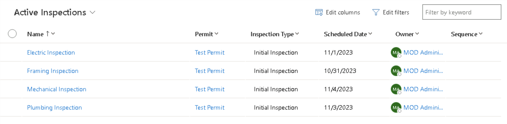

---
lab:
    title: 'Lab 4: Advanced canvas app techniques'
    module: 'Module 4: Advanced techniques in canvas apps'
---

# Practice Lab 4 –  Advanced canvas app techniques

## Scenario

As we continue to build our solution, we will now customize the canvas app to use variables and the Patch formula.

## High-level lab steps

We will follow the below basic steps to optimize the canvas app:

- Add variables to store the user's Office 365 profile.
- Use Patch to set the status reason of an inspection to failed.

## Things to consider before you begin

- Should you use OnStart or OnVisible?
- What do you need to update a record using Patch?

## Starter solution

A starter solution file for this lab can be found in the  C:\Labfiles\L04\Starter folder.

## Completed solution

Completed solution files for this lab can be found in the  C:\Labfiles\L04\Completed folder.

## Exercise 1: Variables

**Objective:** In this exercise, you will connect to Office 365 Users and set a variable in OnStart.

### Task 1.1: Set variable in OnStart

1. Open the Permit Management solution.

   - Navigate to the [Power Apps maker portal](https://make.powerapps.com/)
   - Select your **Development** environment.
   - Select **Solutions**.
   - Open the **Permit Management** solution.

1. Edit the **Inspector** canvas app.

   - Select **Apps** in the Permit Management solution.
   - Select the ellipses **...** next to the **Inspector** app and select **Edit in new tab**.

1. Add Office 365 Users as a data source.

   - Select the **Data** tab.

     

   - Select **+ Add data**.
   - Expand **Connectors**.
   - Select **Office 365 Users**.
   - Select **Connect**.

1. Configure OnStart.

   - Select the **Tree view** tab.
   - Select the **App** object.
   - In the property selector, select **OnStart**.
   - Change the **OnStart** property to the formula below.

     ```powerappsfl
     Set(currentuser,Office365Users.MyProfile())
     ```

    

1. Populate variable.

   - Select the **Tree view** tab.
   - Select the **App** object.
   - Select the ellipses **...** and select **Run OnStart**

    

1. Add Text label.

   - Select the **+ Insert** tab.
   - Select **Text label**.
   - Drag the label to the top right of the screen.
   - Select the **Tree view** tab.
   - Rename **Label1** to `CountryLabel` by double clicking on the control in the Tree view tab.
   - Change the **Color** property of the **CountryLabel** to `Color.White`.
   - Change the **Text** property of the **CountryLabel** to the formula below.

     ```powerappsfl
     currentuser.Country
     ```

1. Select the **Save** icon.

1. Do **NOT** navigate away from this screen.

## Exercise 2: Patch

**Objective:** In this exercise, you use Patch to update the Status Reason on an inspection.

### Task 2.1: Update inspection row using Patch

1. Add failed button to the details screen.

   - Select the **Tree view** tab.
   - Select the **Details Screen** in the Tree view. Make sure that you have selected the screen and not selected the form.
   - Select the **+ Insert** tab and select **Button**.

     

   - Drag the button next to the submit button.
   - Select the **Tree view** tab.
   - Rename the button to `Failed Button`.
   - Change the **Text** value of the button to `"Failed"`.

     

1. Use Patch to set the inspection result to Failed.

   - Select the **Failed Button** in the Tree view.
   - In the property selector, select **OnSelect**.
   - Change the **OnSelect** property to the formula below.

   ```powerappsfl
   Patch(Inspections, 'Inspection List'.Selected, {'Status Reason':'Status Reason (Inspections)'.Failed});Back(ScreenTransition.UnCoverRight);
   ```

1. Save the app.

1. Do **NOT** navigate away from this screen.

### Task 2.2: Test the app

   > [!NOTE]
   > If you closed the application, follow these steps to get back to the Power Apps Studio.
   >
   > - Navigate to the [Power Apps Maker portal](https://make.powerapps.com)
   > - Select your **Development** environment.
   > - Select **Solutions**.
   > - Open the **Permit Management** solution.
   > - Select **Apps** in the Permit Management solution.
   > - Select the ellipses **...** next to the **Inspector** app and select **Edit**.

1. Start the application.

   - Select the **Main Screen** and select **Preview the app**.
   - The application should load and show at least one inspection.
   - Select the inspection.
   - Select the **Failed** button.
   - The inspection should be updated, and the application should navigate back to the Main Screen. The inspection you set to failed will not be listed in the gallery.
   - **Close** preview mode.

1. Save and publish the app.

   - Select the **Publish** icon.
   - Select **Publish this version**.
   - Select the **<- Back** icon.
   - Select **Leave**.

1. Confirm the inspection record was updated.

   - Navigate to the [Power Apps maker portal](https://make.powerapps.com/)
   - Select your **Development** environment.
   - Select **Apps** and play the **Permit Management** app.
   - Select **Inspections** and open the **Framing Inspection** record.
   - The **Status Reason** of the inspection should be **Failed**.

     

   - Change the **Status Reason** back to **Pending**.
   - Select **Save & Close**.
   - Close the **Permit Management** application.

### Task 2.3: Create test data

1. Create test records for later labs.

   - Navigate to the [Power Apps maker portal](https://make.powerapps.com/)
   - Select your **Development** environment.
   - Select **Apps**.
   - Select the **Permit Management** app, select the ellipses **...** and select **Play**.
   - Select **Inspections**.
   - Select **+ New**.
   - Enter `Electric Inspection` for Name, select **Initial Inspection** for Type, select the **Test Permit**, set **Scheduled Date** to today's date, select **Failed** for Status Reason, and then select **Save & Close**.

   - Select **+ New**.
   - Enter `Plumbing Inspection` for Name, select **Initial Inspection** for Type, select the **Test Permit**, set **Scheduled Date** to two days in the future, select **Pending** for Status Reason, and then select **Save & Close**.

   - Select **+ New**.
   - Enter `Mechanical Inspection` for Name, select **Initial Inspection** for Type, select the **Test Permit**, set **Scheduled Date** to three days in the future, select **New Request** for Status Reason, and select **Save & Close**.

1. You should have four inspections for the Test Permit.

    
