---
lab:
    title: 'Lab 04: Client Scripting'
---

## Lab 04 – Client Scripting

# Scenario

A regional building department issues and tracks permits for new buildings and updates for remodeling of existing buildings. Throughout this course, you will build applications and automation to enable the regional building department to manage the permitting process. This will be an end-to-end solution which will help you understand the overall process flow.

In this lab, you will implement client-side logic that will use the web API to evaluate the permit type associated with the permit record and use the client scripting API to manipulate the form controls. 

You will also customize the command bar to introduce a new lock permit button that will invoke a custom API to perform the lock permit logic. The server-side logic for the lock permit custom API will be implemented later in the course. Right now, you will just add the button and the logic to invoke the custom API.

## High-level lab steps

As part of building the client-side logic, you will complete the following:

- Setup a folder to contain your client script

- Upload and register the client script on the form

- Build logic to use the web API to retrieve the permit type record associated with the permit

- Build logic based on the permit type settings to hide and show the inspections tab on the form

- Build logic to set columns as required/not required based on the permit type settings

- Modify the command bar

- Build logic to invoke the lock permit custom API when the command bar button is selected

## Things to consider before you begin

- Are there alternative designs that would be viable and not require code?

- Remember to continue working in your DEVELOPMENT environment. We will move everything to production soon.

  
‎ 

# Exercise #1: Prepare and Load Resources

**Objective:** In this exercise, you will create, organize, and load your JavaScript web resources.

## Task #1: Use Visual Studio Code to Create Resources

In this task, you will set up a folder to contain the JavaScript web resource files in this course. 

1. If you do not already have Visual Studio Code, download it from here [Visual Studio Code](https://code.visualstudio.com/docs/?dv=win) and install it.

2. Start **Visual Studio Code**. 

3. Create resources

	- Select Explorer from left menu or press Ctrl + Shift + E.

    

	- Select **Open Folder**.

	- Create a new folder and name it **ContosoClientScripts**.
  
  	**Note:** This is the name and structure used for this lab, the platform does not require a specific structure or content organization. Many projects check these assets into a source control system to keep track of all the changes over the life of the client script.

	- Select the new folder you just created and select **Select Folder**.

    

4. Create **Form Scripts** folder

	- Hover over the folder and select **New Folder**.

    

	- Name the new folder as **FormScripts** and **Enter**.

    

5. Create the **Permit Form Functions** file

	- Right click on the **FormScripts** folder and select **New File**.

    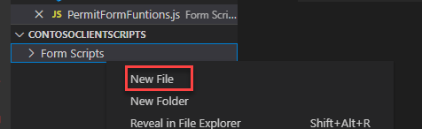

	- Name the new file as **PermitFormFuntions.js** and **Enter**.

    

	- Add the below mentioned namespaces to the newly created **PermitFormFunctions** file.

            if (typeof (ContosoPermit) == "undefined")
            {var ContosoPermit = {__namespace: true};}
            if (typeof (ContosoPermit.Scripts) == "undefined")
            {ContosoPermit.Scripts = {__namespace: true};}

     

    - Add the function mentioned below after adding the namespaces.

            ContosoPermit.Scripts.PermitForm = {
            __namespace: true
            }

      
‎

## Task #2: Add Event Handlers

In this task, you will create functions for the logic that you will be implementing. This will allow you to register the event handlers in the next tasks for calling these functions and performing few basic tests in the upcoming tasks.

1. Add a function to OnLoad event

	- Add the function mentioned below to the **PermitFormFuntions** file inside the function created in Step 1(d).

            handleOnLoad: function (executionContext) {
        console.log('on load - permit form');
    },

    

2. Add a function to OnChange permit type event

	- Add the function mentioned below to the **PermitFormFuntions** file inside the function created in Step 1(d). Once this is done, select **File** and **Save All**.

            handleOnChangePermitType: function (executionContext) {
        console.log('on change - permit type');
    },

    

 

## Task #3: Load Web Resources 

In this task, you will upload the JavaScript files as web resources.You will also edit the Permit table main form and associate the new web resource with its form. Finally, you will register your functions to be called on specific form events.

1. Open the Permit Management solution

	- Sign in to [Power Apps maker portal](https://make.powerapps.com/).

	- Select your **Dev** environment.

	- Select **Solutions**.

	- Open the **Permit Management** solution.

2. Add web resource to the solution

	- Select **+ New**.

	- Select **More | Web Resources**.

    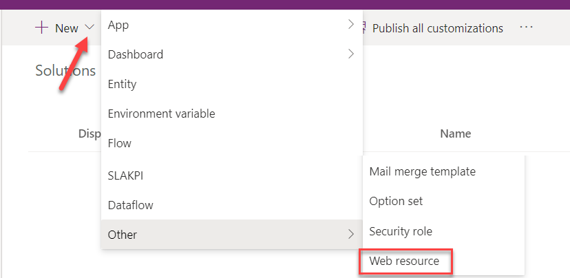

	- Enter **Permit Form Scripts** for **Display name**.

	- Enter **PermitFormScripts.js** for **Name**.

	- Select **JavaScript (JS)** for **Type**.

	- Select **Upload file**.

    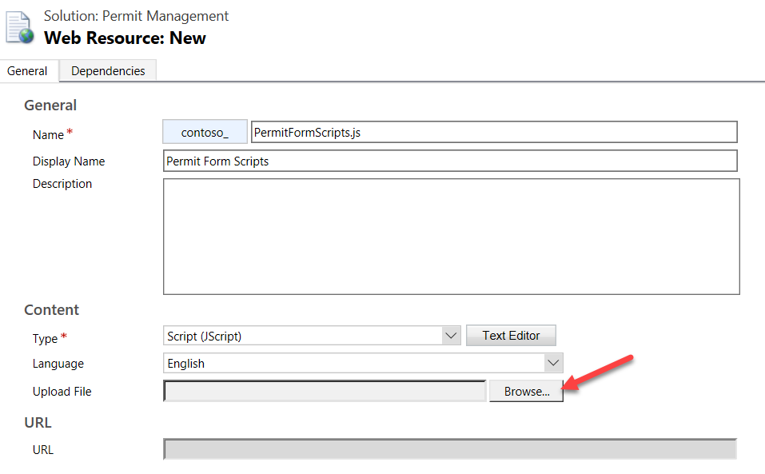

	- Select the **PermitFormFunctions.js** file and select **Open**.

    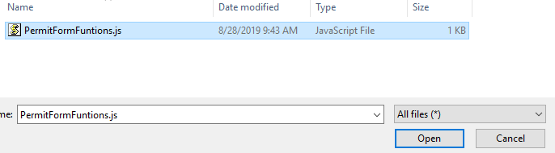

	- Select **Save** and wait until the changes are saved.

	- Select **Publish all customizations** and wait for the publishing to complete.

3. Open the Permit main form.

	- Make sure you are still in the solution.

	- Open the **Permit** table.

	- Select the **Forms** tab and open the **Main** form.

4. Add the script to the permit form

	- Go to the **Properties** pane and select the **Events** tab.

    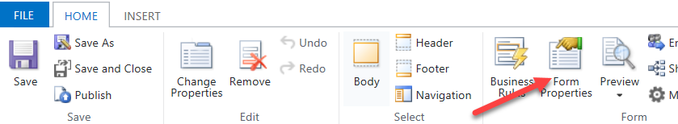

	- Select **+ Add library**.

	- Search for **contoso**, select **Permit Form Scripts** and select **Add**.

    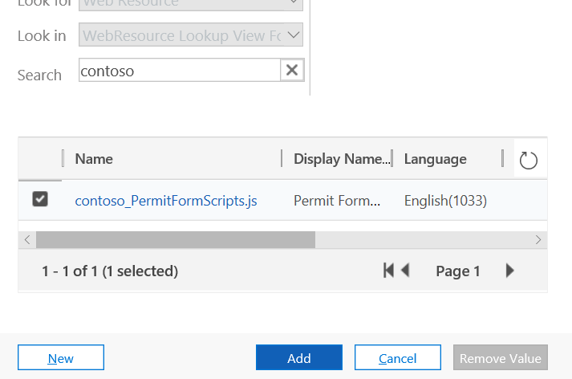

5. Add OnLoad event handler.

	- Expand the **OnLoad** section and select **+ Event Handler**.

    

	- Select **Contoso_****PermitFormScripts.js** in the dropdown for **Library**.

	- Enter **ContosoPermit.Scripts.PermitForm.handleOnLoad** in the textbox for **Function**.

	- Check the **Pass execution context as first parameter** checkbox.

	- Select **Done**.

    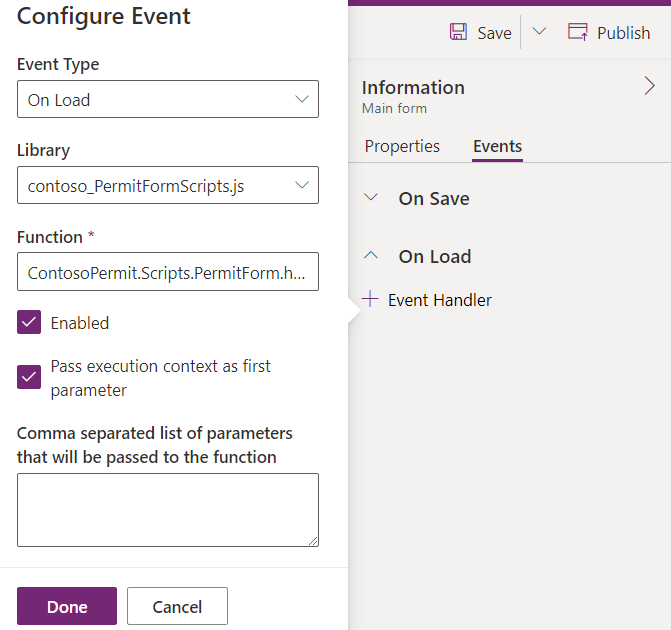

6. Add Permit Type OnChange event handler.

	- Select **Permit Type** field on the form.

    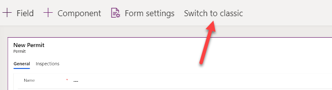

	- Go to the **Properties** pane and select the **Events** tab.
  
	- Expend the On Change section and select **+ Event Handler**

    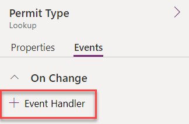

	- Select **Contoso_****PermitFormScripts****.js** for **Library**.

	- Enter **ContosoPermit.Scripts.PermitForm.handleOnChangePermitType** in the textbox for **Function**.

	- Check the **Pass execution context as first parameter** checkbox.

	- Select **Done**.

    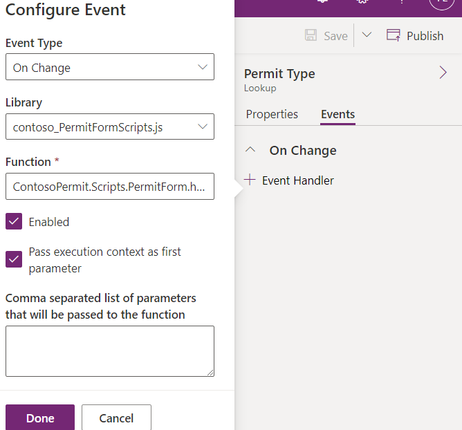

7. Save and publish your changes

	- Select **Save** and wait for changes to be saved.

	- Select **Publish** and wait for the publishing to complete.

	- Go back to the Permit table by selecting on the **<- Back** button.

     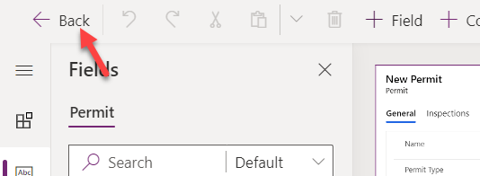

	- Go back to the main maker portal by selecting the **<-** back button again.
  
	- Select **Publish all customizations** and wait for the publishing to complete.

**DO NOT** navigate away from this page

## Task #4: Test Event Handlers 

In this task, you will test the event handlers.

1. Start the Permit Management application

	- Select **Apps**.

	- Launch the **Permit Management** application.

    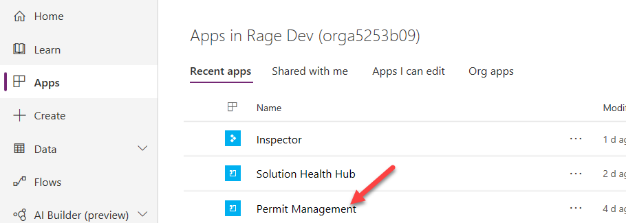

2. Open a Permit record

	- Select **Permits** from the Site Map.

	- Select to open a permit record.

    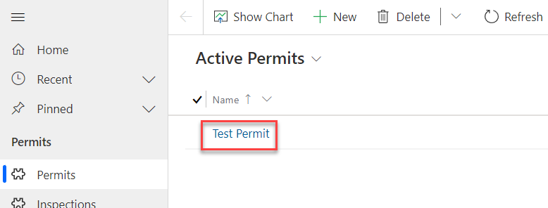

3. Open Edge Dev Tools

	- Press **F12** or right click and select **Inspect**.

	- Select the **Console** from top menu and clear console.

    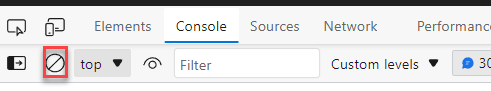

4. Refresh and confirm the OnLoad event handler function runs

	- Go to the **Permit** record and select **Refresh**.

	- Go to the **Dev Tools** and you should now be able to see the **on load – permit form** message.

    

5. Remove Permit Type and confirm the OnChange Permit Type event handler function runs

	- Go to the **Permit** record and remove the **Permit Type**.

    

	- Go to the **Dev Tools** and you should now be able to see the **on change – permit type** message.

    

	- Close the **Dev Tools**.

  
‎ 

# Exercise #2: Show and Hide Tabs

**Objective:** In this exercise, you will create a script that will show and hide the inspections tab based on the permit type table’s “required inspections” column value.

## Task #1: Create Function   

1. Create a function that will run when the Permit form loads and when the Permit Type value changes

	- Go back to **Visual Studio Code**.

	- Add the function mentioned below to **PermitFormFuntions** inside the PermitForm function.

            _handlePermitTypeSettings: function (executionContext) {

            },

    

2. Get form context from the execution context

	- Add the script mentioned below inside _**handlePermitTypeSettings** function.

            var formContext = executionContext.getFormContext(); 

3. Get the Permit Type value from the form.

	- Add the script mentioned below inside the _**handlePermitTypeSettings** function. contoso_permittype is the logical name of the Permit Type column. You can verify this in the table metadata.

            var permitType = formContext.getAttribute("contoso_permittype").getValue();

4. Check if the Permit Type has value.

	- Add the script mentioned below inside the _**handlePermitTypeSettings** function.

            if (permitType == null) {

            } else {
            
            }

    

5. Hide the Inspections tab and return if Permit type is null.

	- Add the script mentioned below inside the _**handlePermitTypeSettings** function. inspectionsTab is the name of the Inspections tab (This is configured while creating the Model Driven App in a previous lab in this course).

            formContext.ui.tabs.get("inspectionsTab").setVisible(false);
            return;

    

 

## Task #2: Get Inspection Type Record   

In this task, you will use the web API to retrieve the permit type lookup record associated with the current permit record that is currently displayed in the form.

1. Get the Permit Type ID

	- Add the script mentioned below in the else statement of the _**handlePermitTypeSettings** function.

            var permitTypeID = permitType[0].id;

2. Retrieve the Permit Type record and show alert if there are errors

	- Add the script mentioned below in the else statement of the _**handlePermitTypeSettings** function. contoso_pertmittype is the logical name of the Permit Type table.

            Xrm.WebApi.retrieveRecord("contoso_permittype", permitTypeID).then(function (result) {
            },

            function (error) { alert('Error:' + error.message) });

    

3. Check if “**Require Inspections**” column value is true

	- Add the script mentioned below in the **retrieveRecord** function call. contoso_requireinspections is the logical name of the Require Inspections column of the Permit Type table.

            if (result.contoso_requireinspections) {

            } else {

            }

4. Make the Inspections tab visible if Require Inspections is true

	- Add the script mentioned below in the if statement of the **retrieveRecord** call. 

            formContext.ui.tabs.get("inspectionsTab").setVisible(true);

5. Hide the Inspections tab if Require Inspections is not true

	- Add the script mentioned below in the else statement of the **retrieveRecord** call. 

            formContext.ui.tabs.get("inspectionsTab").setVisible(false);

    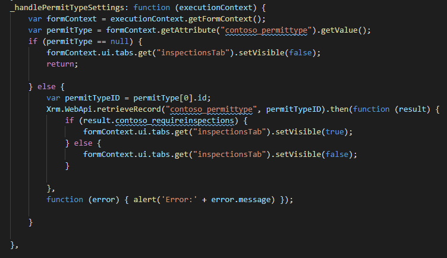

6. Call the _handlePermitTypeSettings function from the handleOnLoad function.

	- Go to the **handleOnLoad** function and add the script mentioned below.

            ContosoPermit.Scripts.PermitForm._handlePermitTypeSettings(executionContext);

7. Call the _handlePermitTypeSettings function from the handleOnChangePermitType function.

	- Go to the **handleOnChangePertmitType** function and add the script mentioned below.

            ContosoPermit.Scripts.PermitForm._handlePermitTypeSettings(executionContext);

    

    - Select **File** and **Save All**.

## Task #3: Load Updated Script    

1. Open the Permit Form Script web resource.

	- Navigate to [Power Apps maker portal](https://make.powerapps.com/).

	- Select your **Dev** environment.

	- Select **Solutions**.

	- Open the **Permit Management** solution.

	- Select **Web resources** and open the **Permit Form Script** web resource.

    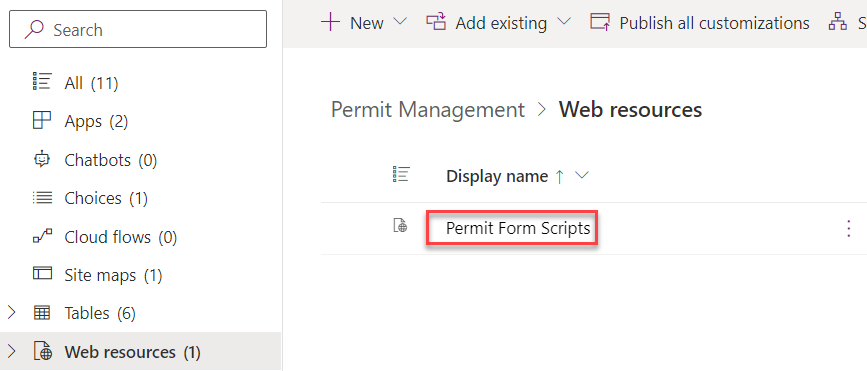

2. Load the updated version of permitFormFuntion.jsPermitFormFuntion.js

	- Select **Upload file**.

    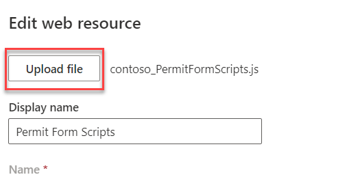

	- Select **PermitFormFunctions.js** and select **Open**.

3. Save and Publish your changes

	- Select **Save** and wait until the changes are saved.

	- Select **Publish** and wait for the publishing to complete.
  
	- Select the **<-** back button to go back to the main maker portal.
  
	- Do not navigate away from this page.

## Task #4: Test Your Changes    

1. Start the Permit Management application

	- Select **Apps**.

	- Launch the **Permit Management** application.

2. Open Permit record.

	- Select Permits from the Site Map.

	- Select to open a **Permit** record.

3. Check if the **Permit Type** column is empty and if it is, the **Inspections** tab is hidden. In this case, the Permit Type is null.

    

4. Select Permit Type.

	- Select the **Permit Type** lookup.

	- Select **New Construction**.

	- Check if the **Inspections** tab is still hidden. If so, in this case, the Require Inspections column value is false/No

    

5. Set **Require Inspections** column value of the **Permit Type** to **Yes**.

	- Open the selected **Permit Type**.

    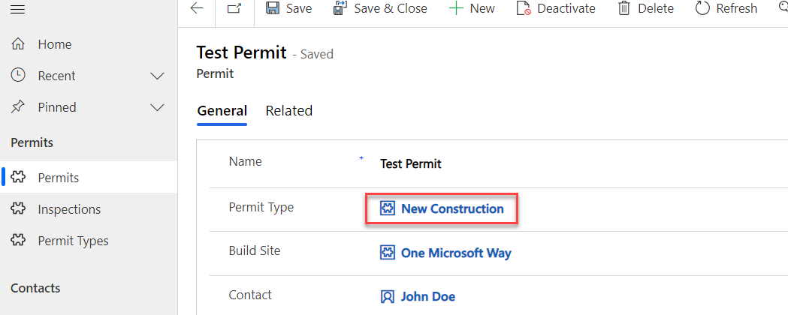

	- Set the **Require Inspections** to **Yes**.

    

	- Select **Save**.

	- Select the **<-** back button.

6. You should now be able to see the Inspections tab.

	- Select the **Inspections** tab.

    

	- The user should now be able to view/add inspections to the sub-grid.

    

 

# Exercise #3: Toggle required property on the columns

**Objective:** In this exercise, you will create a script that will make the “New Size” column required when the “Require Size” column value is set to Yes. If the “Require Size” column value is set to No, remove the requirement. You will also hide the “New Size” column. This logic will be driven by a column on the permit type record that was retrieved using web API in the previous exercise.

## Task #1: Create Function

1. Locate the _handlePermitTypeSettings function

	- Go back to **Visual Studio Code**.

	- Locate the _**handlePermitTypeSettings** function.

2. If permitType is null, remove the requirement and hide the “New Size” column. 

	- Add the script below in the **if** **permitType == null** statement. contoso_newsize is the logical name of the New Size column.

            formContext.getAttribute("contoso_newsize").setRequiredLevel("none");

            formContext.ui.controls.get("contoso_newsize").setVisible(false);

    

3. Check if “Require Size” column value of the Permit Type is set to Yes

	- Add the script mentioned below inside the retrieveRecord function.

            if (result.contoso_requiresize) {

            } else {

            }

    

4. If “Require Size” column value of the Permit Type is set to Yes, make the “New Size” column visible and required.

	- Add the script mentioned below in the **if** **result.contoso_requiresize** statement. contoso_requiresize is the logical name of the Require Size column.

            formContext.ui.controls.get("contoso_newsize").setVisible(true);

            formContext.getAttribute("contoso_newsize").setRequiredLevel("required");

    

5. If Require Size column value of the Permit Type is not set to Yes, make the “New Size” column not required and hide it.

	- Add the script mentioned below inside the else statement.

            formContext.getAttribute("contoso_newsize").setRequiredLevel("none");

            formContext.ui.controls.get("contoso_newsize").setVisible(false);

    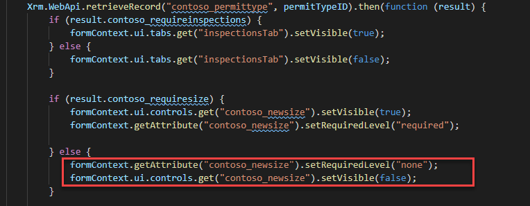

6. The _handlePermitTypeSettings function should now look like the image below.

    

7. Select **File** and then **Save All**.

## Task #2: Load Updated Script    

1. Update the Permit Form Script web resource.

	- Go to the maker portal and select **Solutions**.

	- Open the **Permit Management** solution.
  
	- Select **Web resources** and open the **Permit Form Scripts** web resource.

	- Select **Upload File**.

	- Select the **PermitFormFunctions.js** you updated and then select **Open**.

2. Save and Publish your changes

	- Select **Save** and wait until the changes are saved.

	- Select **Publish** and wait for the publishing to complete.

	- Select the **<-** back button.
  
3. Do not navigate away from this page.

## Task #3: Test Your Changes    

1. Start the Permit Management application

	- Select **Apps**.

	- Launch the **Permit Management** application.

2. Open Permit record.

	- Select Permits.

	- Select to open a **Permit** record.

3. Check if the **New Size** column is hidden. If so, then it is because the “Require Size” column of the Permit Type is set to NO.

    

4. Set **Require Size** column value of the **Permit Type** to **Yes**.

	- Open the **Permit Type**.

    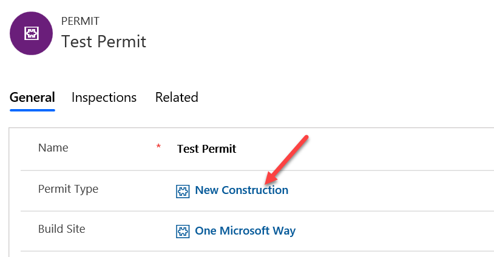

	- Set the **Require Size** to **Yes**.

    

	- Select **Save** on the bottom right of the screen.

	- Select the **<-** back button.

5. Check if the “New Size” column is visible and it is marked as required.

	- You should now be able to see **New Size”** column on the form and it is a required field.

    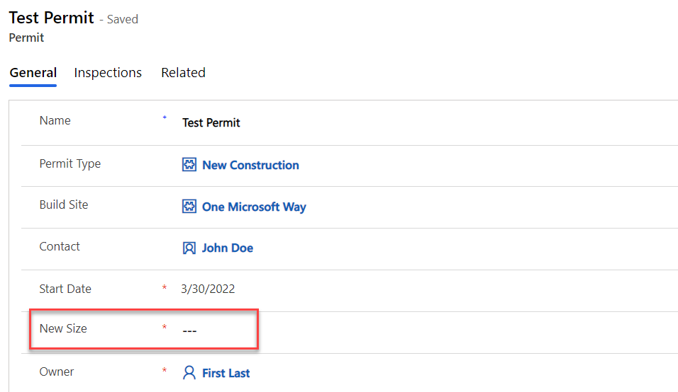

	- Remove **Permit Type**.

    

	- Check if both the **Inspections** tab and **New Size** column are now hidden. They should be removed as soon as the “Permit Type” is removed.

    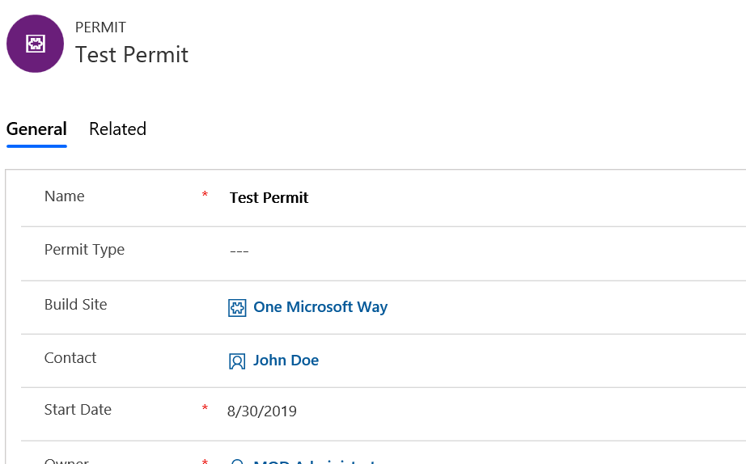

 
# Exercise #4: Command Button Function

**Objective:** In this exercise, you will you will create custom API, create a function that will lock permits, add a button to the permit table and call the lock permit function when the button is selected.

## Task #1: Create Custom API

In this task, you will create a custom API that will be called to lock the permit. You will not be implementing the business logic that will lock the permit in this lab. It will be completed later in the class when you build the plug-in that registers on the custom api you are defining here.

1. Open the Permit Management Solution.

	- Navigate to [Power Apps makes portal](https://make.powerapps.com/) and make sure you have the **Dev** environment selected.

	- Select **Solutions** and open the **Permit Management** solution.
  
2. Create new custom API

	- Select **+ New** and then select **More | Other | Custom API**.

    

	- Enter **contoso_LockPermit** for Unique name, enter **Lock Permit** for Name, **Lock Permit** for Display name, enter **Lock Permit** for Description, select **Entity** for Binding type, enter **contoso_permit** for Bound entity logical name, and select **Save and Close**.

    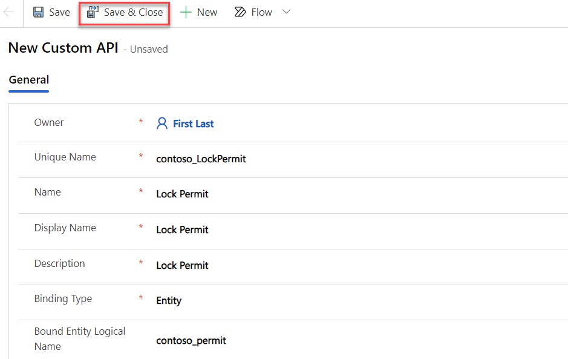
  
    - Select **Done**
  
3. Create custom API request parameter

	- Select **+ New** and then select **More | Other | Custom API Request Parameter**.

    

	- Select **Lock Permit** for Custom API, enter **Reason** for Unique name, enter **Reason** for Name, enter **Reason** Display name, **Reason** for Description, select **String** for Type, and select **Save and Close**.

    

	- Select **Done**

4. Create Custom API Response Property 

	> **NOTE:** Previously the 'Custom API Response Property' was called 'Custom API response parameter'.

	- Select **+ New** and then select **More | Other | Custom API Response Property**.

	- Select **Lock Permit** for Custom API, enter **CanceledInspectionsCount** for Unique name, enter **Canceled Inspections Count** for Name, enter **Canceled Inspections Count** Display name, **Canceled Inspections Count** for Description, select **Integer** for Type. set **Yes** for Is Optional, and select **Save and Close**.

    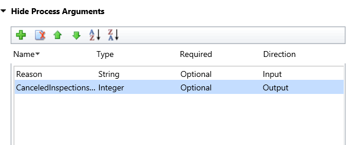

    - Select **Done**

5. Publish your changes

	- Select **Publish all customizations** and wait for the publishing to complete.
 

## Task #2: Create the Function

In this task, you will create the logic to invoke that will call the custom API.

1. Start Visual Studio Code and open the resources you create in Exercise One

	- Start **Visual Studio Code**.

	- Select **File** and select **Open Folder**.

	- Select the **ContosoClientScripts** folder you created in exercise one and select **Select Folder**.

    

2. Add a function that will build the request

	- Open the **PermitFormFunctions.js** file.

    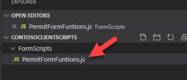

	- Add the function below after the _handlePermitTypeSettings function.

            _lockPermitRequest : function (permitID, reason) {

            },

    

3. Build entity and set reason.

	- Add the script mentioned below inside the **_lockPermitRequest** function.

            this.entity = { entityType: "contoso_permit", id: permitID };

            this.Reason = reason;

4. Build and return the request

	- Add the script mentioned below in the **_lockPermitRequest** function.

            this.getMetadata = function () {
                return {
                    boundParameter: "entity", parameterTypes: {
                        "entity": {
                            typeName: "mscrm.contoso_permit",
                            structuralProperty: 5
                        },
                        "Reason": {
                            "typeName": "Edm.String",
                            "structuralProperty": 1 // Primitive Type
                        }
                    },
                    operationType: 0, // This is an action. Use '1' for functions and '2' for CRUD
                    operationName: "contoso_LockPermit",
                };
            };

    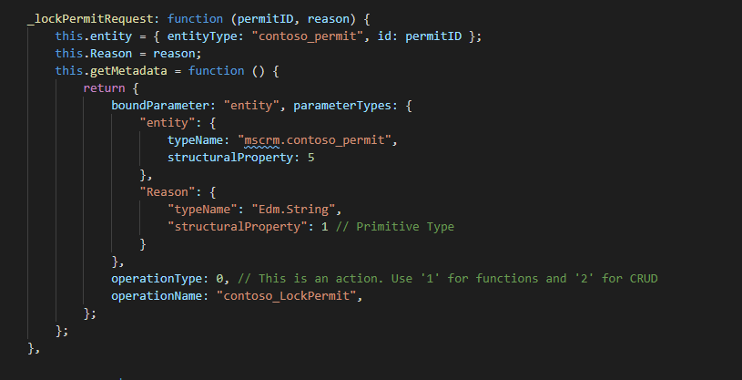

5. Add the function that will be called from the action button.

	- Add the function mentioned below after the **_lockPermitRequest** function.

            lockPermit: function (primaryControl) {

            },

    

6. Get Permit ID and call **_lockPermitRequest**

	- Get the id by adding the script mentioned below inside the **lockPermit** function.

            formContext = primaryControl;
            var PermitID = formContext.data.entity.getId().replace('{', '').replace('}', '');

	- Call **_lockPermitRequest**. We are hard-coding the reason “Admin Lock”

            var lockPermitRequest = new ContosoPermit.Scripts.PermitForm._lockPermitRequest(PermitID, "Admin Lock");

7. Execute the request.

	- Add the script mentioned below inside the lockPermit function.

            // Use the request object to execute the function
                Xrm.WebApi.online.execute(lockPermitRequest).then(
                    function (result) {
                        if (result.ok) {
                            console.log("Status: %s %s", result.status, result.statusText);
                            // perform other operations as required;
                            formContext.ui.setFormNotification("Status " + result.status, "INFORMATION");
                        }
                    },
                    function (error) {
                        console.log(error.message);
                        // handle error conditions
                    }
                );

    

	- Select **File** and then **Save All**.

8. Load the update resource and publish.

	- Log on to [Power Apps maker portal](https://make.powerapps.com/) and make sure you have the **Dev** environment selected.

	- Select **Solutions** and open the **Permit Management** solution.

	- Select **Web resources** and open the **Permit Form Scripts** web resource.

	- Select **Upload File**.

	- Select the **PermitFormFunctions.js** you updated and select **Open**.

	- Select **Save** and wait until the changes are saved.

	- Select **Publish** and wait for the publishing to complete.

## Task #3: Add Button to Ribbon

1. Open the Permit Management application for edit 

	- Sign in to [Power Apps maker portal](https://make.powerapps.com/) and make sure you have the **Dev** environment selected.

	- Select **Solutions** and select to open the **Permit Management** solution.

	- Select **Apps** and select the **Permit Management** application.
  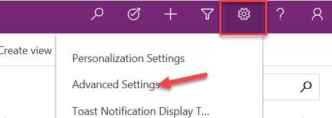

	- Select the chevron button next to the **Edit** button and select **Edit in preview**.
  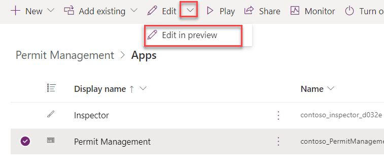

2. Edit the Permit table command bar.

	- Select the **Pages** tab, Hover over the **Permit** table and select the **...** button.
  

	- Select **Edit command bar**.
  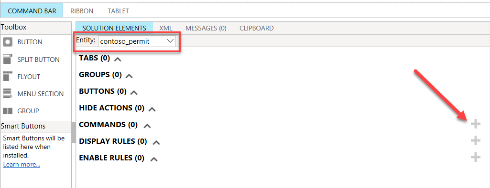

    - Select **Main form** and then select **Edit**.

3. Add command to permit table

	- Select **+ New command**.

    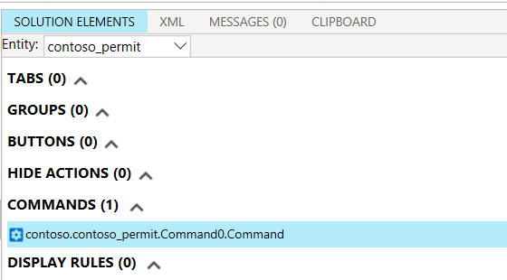

	- Select **JavaScript** and then select **Continue**.

4. Configure command bar button

	- Enter **Lock Permit** for Label, Select **Use Icon**, select **Lock** for Icon, and enter **Lock Permit** for Tooltip, 

    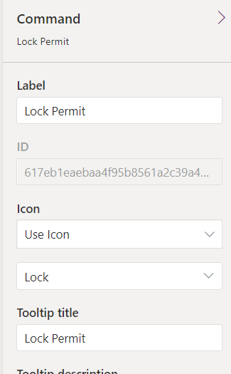

	- Scroll down and select **+ Add library**

    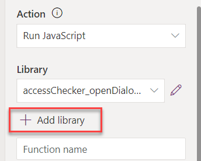

	- Search for **contoso**, select **Permit Form Scripts**, and then select **Add**.

    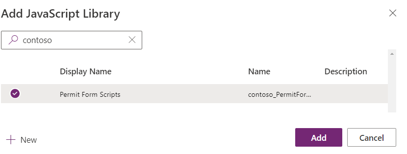

	- Enter **ContosoPermit.Scripts.PermitForm.lockPermit** in the textbox for **Function Name**.

    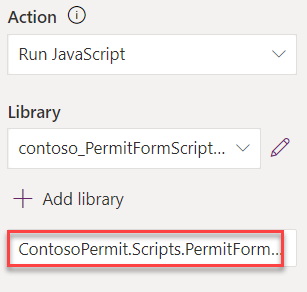

5. Add parameter

	- Select **+ Add Parameter** .

    

	- Select **PrimaryControl** for Parameter 1.

    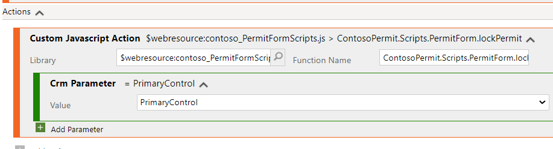

6. Publish your changes.
    - Select **Save and Publish**.

 

## Task #5: Test Command Button

1. Start the Permit Management application.

	- Log on to [Power Apps maker portal](https://make.powerapps.com/) and make sure you have your **Dev** environment selected.

	- Select **Apps** and launch the **Permit Management** application.

2. Open a permit record

	- Select** Permits**.

	- Select to open a permit.

	- You should be able to see the button you just added.

    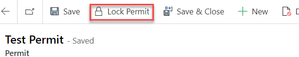

3. Test the Command

	- Select the **Lock Permit** button.

	- The script should trigger the action and you should be able to see the Status 200 notification.

    
