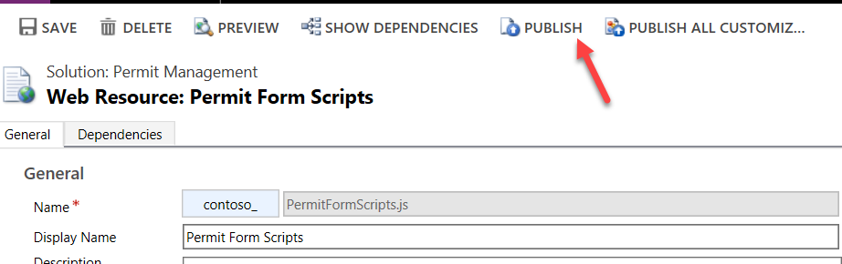
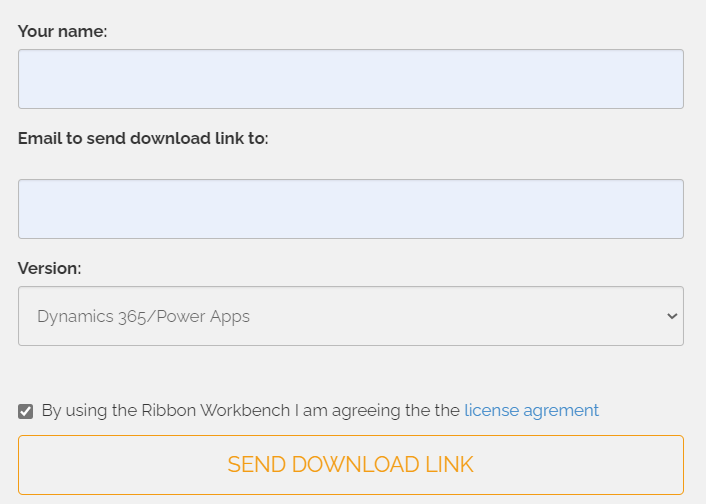

---
lab:
    title: 'Lab 04: Client Scripting'
---

> [!NOTE]
> Effective November 2020:
> - Common Data Service has been renamed to Microsoft Dataverse. [Learn more](https://aka.ms/PAuAppBlog)
> - Some terminology in Microsoft Dataverse has been updated. For example, *entity* is now *table* and *Column* is now *column*. [Learn more](https://go.microsoft.com/fwlink/?linkid=2147247)
>
> This content will be updated soon to reflect the latest terminology.

## Lab 04 – Client Scripting

# Scenario

A regional building department issues and tracks permits for new buildings and updates for remodeling of existing buildings. Throughout this course, you will build applications and automation to enable the regional building department to manage the permitting process. This will be an end-to-end solution which will help you understand the overall process flow.

In this lab, you will implement client-side logic that will use the web API to evaluate the permit type associated with the permit record and use the client scripting API to manipulate the form controls. 

You will also customize the command bar to introduce a new lock permit button that will invoke a custom action to perform the lock permit logic. The server-side logic for the lock permit custom action will be implemented later in the course. Right now, you will just add the button and the logic to invoke the action.

## High-level lab steps

As part of building the client-side logic, you will complete the following:

- Setup a folder to contain your client script

- Upload and register the client script on the form

- Build logic to use the web API to retrieve the permit type record associated with the permit

- Build logic based on the permit type settings to hide and show the inspections tab on the form

- Build logic to set Columns as required/not required based on the permit type settings

- Use a community tool, Ribbon Workbench, to modify the command bar

- Build logic to invoke the lock permit custom action when the command bar button is clicked

## Things to consider before you begin

- Are there alternative designs that would be viable and not require code?

- Remember to continue working in your DEVELOPMENT environment. We will move everything to production soon.

  
‎ 

# Exercise #1: Prepare and Load Resources

**Objective:** In this exercise, you will create, organize, and load your JavaScript web resources.

## Task #1: Use Visual Studio Code to Create Resources

In this task, you will set up a folder to contain the JavaScript web resource files in this course. 

1. If you do not already have Visual Studio Code, download it from here [Visual Studio Code](https://code.visualstudio.com/docs/?dv=win) and install it.

2. Start **Visual Studio Code**. 

3. Create resources

	- Select Explorer from left menu or press Ctrl + Shift + E.

    

	- Click **Open Folder**.

	- Create a new folder and name it **ContosoClientScripts**.   
‎**Note:** This is the name and structure used for this lab, the platform does not require a specific structure or content organization. Many projects check these assets into a source control system to keep track of all the changes over the life of the client script.

	- Select the new folder you just created and click **Select Folder**.

    

4. Create **Form Scripts** folder

	- Hover over the folder and click **New Folder**.

    

	- Name the new folder as **FormScripts** and click **Enter**.

    

5. Create the **Permit Form Functions** file

	- Right click on the **FormScripts** folder and select **New File**.

    

	- Name the new file as **PermitFormFuntions.js** and click **Enter**.

    

	- Add the below mentioned namespaces to the newly created **PermitFormFunctions** file.

            if (typeof (ContosoPermit) == "undefined")
            {var ContosoPermit = {__namespace: true};}
            if (typeof (ContosoPermit.Scripts) == "undefined")
            {ContosoPermit.Scripts = {__namespace: true};}

     

    - Add the function mentioned below after adding the namespaces.

            ContosoPermit.Scripts.PermitForm = {
            __namespace: true
            }

      
‎

## Task #2: Add Event Handlers

In this task, you will create functions for the logic that you will be implementing. This will allow you to register the event handlers in the next tasks for calling these functions and performing few basic tests in the upcoming tasks.

1. Add a function to OnLoad event

	- Add the function mentioned below to the **PermitFormFuntions** file inside the function created in Step 1(d).

            handleOnLoad: function (executionContext) {
            console.log('on load - permit form');
            },

    

2. Add a function to OnChange permit type event

	- Add the function mentioned below to the **PermitFormFuntions** file inside the function created in Step 1(d). Once this is done, click **File** and **Save All**.

            handleOnChangePermitType: function (executionContext) {

            console.log('on change - permit type');

            },

    

 

## Task #3: Load Web Resources 

In this task, you will upload the JavaScript files as web resources. Here, you will also edit the Permit Table main form and associate the new web resource with its form. Finally, you will register your functions to be called on specific form events.

1. Open the Permit Management solution

	- Sign in to [Power Apps maker portal](https://make.powerapps.com/).

	- Select your **Dev** environment.

	- Select **Solutions**.

	- Click to open the **Permit Management** solution.

    

2. Add web resource to the solution

	- Click **+ New**.

	- Click **Other** and select **Web Resources**.

    

	- Enter **PermitFormScripts.js** for **Name**.

	- Enter **Permit Form Scripts** for **Display Name**.

	- Select **Script (Jscript)** for **Type**.

	- Select **English** for **Language**.

	- Click **Browse**.

    

	- Select the **PermitFormFunctions.js** file and click **Open**.

    

	- Click **Save** and wait until the changes are saved.

	- Click **Publish** and wait for the publishing to complete.

	- Close the web resource editor Window.

	- Click **Done**.

3. Open the Permit main form.

	- Make sure you are still in the solution.

	- Click to open the **Permit** Table.

	- Select the **Forms** tab and click to open the **Main** form.

4. Switch to Classic.   
‎**Note**: Currently, you must switch to the classic solution explorer to complete the hookup of the client script to the form. In the future, this will be moved to make.powerapps.com and will not require switching to the classic tools.

	- Click on the **Switch to Classic**. This will open the classic UI in a new browser window.

    

5. Add the script to the permit form

	- Click **Form Properties**.

    

	- Click **Add Library**.

    

	- Search for **contoso**, select **PermitFormScripts** entry with Display Name as **PermitFormScripts** and click **Add**.

    

6. Add OnLoad event handler.

	- Go to the **Event Handlers** section.

	- Select **Form** from **Control Dropdown**.

	- Select **OnLoad** from **Event Dropdown**.

	- Click **Add**.

    

	- Select **Contoso_****PermitFormScripts.js** in the dropdown for **Library**.

	- Enter **ContosoPermit.Scripts.PermitForm.handleOnLoad** in the textbox for **Function**.

	- Check the **Pass Execution** **Context** checkbox.

	- Click **OK**.

    

7. Add Permit Type OnChange event handler.

	- Go to the **Event Handlers** section.

	- Select **Permit Type** from the dropdown for **Control**.

	- Select **OnChange** from the dropdown for **Event**.

	- Click **Add**.

    

	- Select **Contoso_****PermitFormScripts****.js** for **Library**.

	- Enter **ContosoPermit.Scripts.PermitForm.handleOnChangePermitType** in the textbox for **Function**.

	- Check the **Pass Execution** **Context** checkbox.

	- Click **OK**.

    

8. Save and publish your changes

	- Click **OK** to close the **Form Properties** window.

	- Click **Save and Close**.

    

	- Click on the **&lt;- Back** button.

    

	- Go back to the solution by clicking on the solution name.

    

	- Click **Publish All Customizations** and wait for the publishing to complete.

    

**DO NOT** navigate away from this page

## Task #4: Test Event Handlers 

In this task, you will be doing a test to ensure that you have correctly hooked up your functions to the permit form events.

1. Start the Permit Management application

	- Select **Apps**.

	- Click to start the **Permit Management** application and this will open the app in New Window.

    

2. Open a Permit record

	- Select **Permits** from the Site Map.

	- Click to open a permit record.

    

3. Open Edge Dev Tools

	- Press **F12** or right click and select **Inspect**.

	- Select the **Console** from top menu and clear console.

    

4. Refresh and confirm the OnLoad event handler function runs

	- Go to the **Permit** record and click **Refresh**.

    

	- Go to the **Dev Tools** and you should now be able to see the **on load – permit form** message.

    

5. Remove Permit Type and confirm the OnChange Permit Type event handler function runs

	- Go to the **Permit** record and remove the **Permit Type**.

    

	- Go to the **Dev Tools** and you should now be able to see the **on change – permit type** message.

    

	- Close the **Dev Tools**.

  
‎ 

# Exercise #2: Show and Hide Tabs

**Objective:** In this exercise, you will create a script that will show and hide the inspections tab based on the permit type Table’s “required inspections” Column value.

## Task #1: Create Function   

1. Create a function that will run when the Permit form loads and when the Permit Type value changes

	- Go back to **Visual Studio Code**.

	- Add the function mentioned below to **PermitFormFuntions** inside the PermitForm function.

            _handlePermitTypeSettings: function (executionContext) {

            },

    

2. Get form context from the execution context

	- Add the script mentioned below inside _**handlePermitTypeSettings** function.

            var formContext = executionContext.getFormContext(); 

3. Get the Permit Type value from the form.

	- Add the script mentioned below inside the _**handlePermitTypeSettings** function. contoso_permittype is the logical name of the Permit Type Column. You can verify this in the Table metadata.

            var permitType = formContext.getAttribute("contoso_permittype").getValue();

4. Check if the Permit Type has value.

	- Add the script mentioned below inside the _**handlePermitTypeSettings** function.

            if (permitType == null) {

            } else {
            
            }

    

5. Hide the Inspections tab and return if Permit type is null.

	- Add the script mentioned below inside the _**handlePermitTypeSettings** function. inspectionsTab is the name of the Inspections tab (This is configured while configuration of the Model Driven App in Lab1 Module 2).

            formContext.ui.tabs.get("inspectionsTab").setVisible(false);
            return;

    

 

## Task #2: Get Inspection Type Record   

In this task, you will use the web API to retrieve the permit type lookup record associated with the current permit record that is currently displayed in the form.

1. Get the Permit Type ID

	- Add the script mentioned below in the else statement of the _**handlePermitTypeSettings** function.

            var permitTypeID = permitType[0].id;

2. Retrieve the Permit Type record and show alert if there are errors

	- Add the script mentioned below in the else statement of the _**handlePermitTypeSettings** function. contoso_pertmittype is the logical name of the Permit Type Table.

            Xrm.WebApi.retrieveRecord("contoso_permittype", permitTypeID).then(function (result) {
            },

            function (error) { alert('Error:' + error.message) });

    

3. Check if “**Require Inspections**” Column value is true

	- Add the script mentioned below in the **retrieveRecord** function call. contoso_requireinspections is the logical name of the Require Inspections Column of the Permit Type Table.

            if (result.contoso_requireinspections) {

            } else {

            }

4. Make the Inspections tab visible if Require Inspections is true

	- Add the script mentioned below in the if statement of the **retrieveRecord** call. 

            formContext.ui.tabs.get("inspectionsTab").setVisible(true);

5. Hide the Inspections tab if Require Inspections is not true

	- Add the script mentioned below in the else statement of the **retrieveRecord** call. 

            formContext.ui.tabs.get("inspectionsTab").setVisible(false);

    

6. Call the _handlePermitTypeSettings function from the handleOnLoad function.

	- Go to the **handleOnLoad** function and add the script mentioned below.

            ContosoPermit.Scripts.PermitForm._handlePermitTypeSettings(executionContext);

7. Call the _handlePermitTypeSettings function from the handleOnChangePermitType function.

	- Go to the **handleOnChangePertmitType** function and add the script mentioned below.

            ContosoPermit.Scripts.PermitForm._handlePermitTypeSettings(executionContext);

    

Click File and **Save All**.

## Task #3: Load Updated Script    

1. Open the Permit Form Script web resource.

	- Navigate to [Power Apps maker portal](https://make.powerapps.com/).

	- Select your **Dev** environment.

	- Select **Solutions**.

	- Click to open the **Permit Management** solution.

    

	- Locate and click to open the **Permit Form Script** web resource.

    

2. Load the updated version of permitFormFuntion.jsPermitFormFuntion.js

	- Click **Choose file**.

    

	- Select **PermitFormFunctions.js** and click **Open**.

3. Save and Publish your changes

	- Click **Save** and wait until the changes are saved.

	- Click **Publish** and wait for the publishing to complete.

    

**DO NOT** close this window. You will need to come back to this window in the next exercise.

## Task #4: Test Your Changes    

1. Start the Permit Management application

	- Select the browser tab or window for the Power Apps maker portal and click **Done** on the popup.

    

	- Select **Apps**.

	- Click to open the **Permit Management** application.

2. Open Permit record.

	- Select Permits from the Site Map.

	- Click to open a **Permit** record.

    

3. Check if the **Permit Type** Column is empty and if it is, the **Inspections** tab is hidden. In this case, the Permit Type is null.

    

4. Select Permit Type.

	- Click on the **Permit Type** lookup.

	- Select **New Construction**.

	- Check if the **Inspections** tab is still hidden. If so, in this case, the Require Inspections Column value is false/No

    

5. Set **Require Inspections** Column value of the **Permit Type** to **Yes**.

	- Click on the selected **Permit Type**.

    

	- Set the **Require Inspections** to **Yes**.

    

	- Click **Save** button on the bottom right of the screen.

	- Click on the browser back button.

6. You should now be able to see the Inspections tab.

	- Select the **Inspections** tab.

    

	- The user should now be able to view/add inspections to the sub-grid.

    

 

# Exercise #3: Toggle *required property on the Columns

**Objective:** In this exercise, you will create a script that will make the “New Size” Column required when the “Require Size” Column value is set to Yes. If the “Require Size” Column value is set to No, remove the requirement and make it optional. You will also hide the “New Size” Column. This logic will be driven by a Column on the permit type record that was retrieved using web API in the previous exercise.

## Task #1: Create Function   

1. Locate the _handlePermitTypeSettings function

	- Go back to **Visual Studio Code**.

	- Locate the _**handlePermitTypeSettings** function.

2. If permitType is null, remove the requirement and hide the “New Size” Column. 

	- Add the script mentioned below in the **if** **permitType == null** statement. contoso_newsize is the logical name of the New Size Column.

            formContext.getAttribute("contoso_newsize").setRequiredLevel("none");

            formContext.ui.controls.get("contoso_newsize").setVisible(false);

    

3. Check if “Require Size” Column value of the Permit Type is set to Yes

	- Add the script mentioned below inside the retrieveRecord function.

            if (result.contoso_requiresize) {

            } else {

            }

    

4. If “Require Size” Column value of the Permit Type is set to Yes, make the “New Size” Column visible and as required.

	- Add the script mentioned below in the **if** **result.contoso_requiresize** statement. contoso_requiresize is the logical name of the Require Size Column.

            formContext.ui.controls.get("contoso_newsize").setVisible(true);

            formContext.getAttribute("contoso_newsize").setRequiredLevel("required");

    

5. If Require Size Column value of the Permit Type is not set to Yes, remove the “New Size” Column not required and hide it.

	- Add the script mentioned below inside the else statement.

            formContext.getAttribute("contoso_newsize").setRequiredLevel("none");

            formContext.ui.controls.get("contoso_newsize").setVisible(false);

    

6. The _handlePermitTypeSettings function should now look like the image below.

    

Click **File** and **Save All**.

## Task #2: Load Updated Script    

1. Open the Permit Form Script web resource.

	- Go back to the Permit Form Scripts web resource.

	- Click **Choose File**.

    

	- Select the **PermitFormFunctions.js** you updated and click **Open**.

2. Save and Publish your changes

	- Click **Save** and wait until the changes are saved.

	- Click **Publish All Customizations** and wait for the publishing to complete.

    

Close the Web Resource editor.

## Task #3: Test Your Changes    

1. Start the Permit Management application

	- Log on to [https://make.powerapps.com](https://make.powerapps.com/) and select your **Dev** environment.

	- Select **Apps**.

	- Click to open the **Permit Management** application.

2. Open Permit record.

	- Select Permits.

	- Click to open a **Permit** record.

    

3. Check if the **New Size** Column is hidden. If so, then it is because in this case, the “Require Size” Column of the Permit Type is set to NO.

    

4. Set **Require Size** Column value of the **Permit Type** to **Yes**.

	- Click on the selected **Permit Type**.

    

	- Set the **Require Size** to **Yes**.

    

	- Click **Save** on the bottom right of the screen.

	- Click on the browser back button.

5. Check if the “New Size” Column is visible and it is marked as required.

	- You should now be able to see “**New Size”** Column on the form and this is marked as required.

    

	- Remove **Permit Type**.

    

	- Check if both the **Inspections** tab and **New Size** Column are now hidden. They should be removed as soon as the “Permit Type” is removed.

    

 

# Exercise #4: Command Button Function

**Objective:** In this exercise, you will download and install the Ribbon Workbench tool to edit the command bar. Through this, you will also create action, create function that will lock permits, add a button to the permit Table and call the lock permit function when the button is clicked.

## Task #1: Download and Install Ribbon Workbench

Ribbon Workbench is a community tool that makes it easier to edit the command bar on a form. Alternatively, you can do this without the tool, by directly editing the RibbonDiffXml.

1. Get Ribbon Workbench download link

	- Log on to [http://www.develop1.net/public/Download%20Ribbon%20Workbench%202013.aspx](http://www.develop1.net/public/Download Ribbon Workbench 2013.aspx) 

	- Click **Download**.

    

	- Provide a name and an email and the download link will be sent to that email.

	- Select **Dynamics 365/Power Apps** for **Version** available and click **Send Download Link**.

    

	- Wait to receive the download link in an email to the provided email address.

2. Download Ribbon Workbench

	- After you receive the email, click on the download button.

	- Save the downloaded solution on your machine.

3. Install Ribbon Workbench solution.

	- Sign in to [Power Apps maker portal](https://make.powerapps.com/) and select your **Dev** environment.

	- Select **Solutions** and click **Import**.

    

	- Click **Choose File**.

	- Select the **RibbonWorkbench** solution you just downloaded and click **Open**.

    

	- Click **Next**.

	- Click **Next** again.

	- Click **Import** and wait for the import to complete.

	- Click **Close**.

    

4. Confirm the Ribbon Workbench was installed

	- Select **Apps** and click to open the **Permit Management** application.

    

	- Click **Settings** and select **Advanced Settings**.

    

	- Click **Settings | Solutions**.

    

	- You should see the Ribbon Workbench button on the top.

    

5. Close the **Advanced Settings** browser tab or window.

6. Close the Permit Management application.

## Task #2: Create Action Process

In this task, you will create a custom action that will be called to lock the permit. You will not be implementing the business logic in this lab to lock the permit. It will be completed later in the class when you build the plug-in that registers on the custom actions you will define here.

1. Open the Permit Management Solution.

	- Navigate to [Power Apps makes portal](https://make.powerapps.com/) and make sure you have the **Dev** environment selected.

	- Select **Solutions** and click to open the **Permit Management** solution.

2. Switch to Classic

	- Click on the **….** button and select **Switch to Classic**.

    

3. Create new process

	- Select **Processes** and click **New**.

    

	- Enter **Lock Permit** for **Name**, select **Action** from the dropdown for **Category**, select **Permit** from the dropdown for **Table**, select **New Blank Process** for **Type**, and click **OK**.

    

4. Add process arguments

	- Go to the **Process Arguments** section and click **Add**.

    

	- Enter **Reason** for **Name**, select **Type as String**, and select **Input** for **Direction**.

    

	- Click **Add** again.

	- Enter **CanceledInspectionsCount** for **Name**, select **Type** as **Integer**, and select **Output** for **Direction**.

	- You should now have one input and one output arguments.

    

5. Save and activate action

	- Click **Save** and wait until the changes are saved.

	- Click **Activate**. This will open a pop-up for confirmation. Click **Activate.**

    

	- Confirm the activation and wait for the action to be activated. You should now be able to see the Deactivate option in the Top menu.

	- Click **Close**.

    

	- Close the solution explorer.

 

## Task #3: Create the Function

In this task, you will create the logic to invoke a custom action using the web API.

1. Start Visual Studio Code and open the resources you create in exercise one

	- Start **Visual Studio Code**.

	- Click **File** and select **Open Folder**.

    

	- Select the **ContosoClientScrpts** folder you created in exercise one and click **Select Folder**.

    

2. Add a function that will build the request

	- Open the **PermitFormFunctions.js** file.

    

	- Add the function below after the _handlePermitTypeSettings function.

            _lockPermitRequest : function (permitID, reason) {

            },

    

3. Build entity and set reason.

	- Add the script mentioned below inside the **_lockPermitRequest** function.

            this.entity = { entityType: "contoso_permit", id: permitID };

            this.Reason = reason;

4. Build and return the request

	- Add the script mentioned below in the **_lockPermitRequest** function.

            this.getMetadata = function () {
                return {
                    boundParameter: "entity", parameterTypes: {
                        "entity": {
                            typeName: "mscrm.contoso_permit",
                            structuralProperty: 5
                        },
                        "Reason": {
                            "typeName": "Edm.String",
                            "structuralProperty": 1 // Primitive Type
                        }
                    },
                    operationType: 0, // This is an action. Use '1' for functions and '2' for CRUD
                    operationName: "contoso_LockPermit",
                };
            };

    

5. Add the function that will be called from the action button.

	- Add the function mentioned below after the **_lockPermitRequest** function.

            lockPermit: function (primaryControl) {

            },

    

6. Get Permit ID and call **_lockPermitRequest**

	- Get the id by adding the script mentioned below inside the **lockPermit** function.

            formContext = primaryControl;
            var PermitID = formContext.data.entity.getId().replace('{', '').replace('}', '');

	- Call **_lockPermitRequest**. We are hardcoding the reason “Admin Lock”

            var lockPermitRequest = new ContosoPermit.Scripts.PermitForm._lockPermitRequest(PermitID, "Admin Lock");

7. Execute the request.

	- Add the script mentioned below inside the lockPermit function.

            // Use the request object to execute the function
                Xrm.WebApi.online.execute(lockPermitRequest).then(
                    function (result) {
                        if (result.ok) {
                            console.log("Status: %s %s", result.status, result.statusText);
                            // perform other operations as required;
                            formContext.ui.setFormNotification("Status " + result.status, "INFORMATION");
                        }
                    },
                    function (error) {
                        console.log(error.message);
                        // handle error conditions
                    }
                );

 

    

	- Click **File** and **Save All**.

8. Load the update resource and publish.

	- Log on to [Power Apps maker portal](https://make.powerapps.com/) and make sure you have the **Dev** environment selected.

	- Select **Solutions** and click to open the **Permit Management** solution.

	- Click to open the **Permit Form Scripts** web resource. This will open a new browser window.

    

	- Click **Choose File**.

	- Select the **PermitFormFunctions.js** you updated and click **Open**.

	- Click **Save** and wait until the changes are saved.

	- Click **Publish All Customizations** and wait for the publishing to complete.

	- Close the web resource editor and return to the solutions window.

	- Click **Done**.

    

 

## Task #4: Add Button to Ribbon

1. Open Ribbon Workbench

	- Sign in to [Power Apps maker portal](https://make.powerapps.com/) and make sure you have the **Dev** environment selected.

	- Select **Apps** and click to open the **Permit Management** application.

	- Click **Settings** and select **Advanced Settings**.

    

	- Click **Settings | Solutions**.

	- Click on the Ribbon Workbench button.

    

2. Load the Permit Management solution

	- Select the **Permit Management** solution in the pop-up opened for selecting the Load Solution.

	- Click **OK**.

    

	- Wait for the solution to be downloaded.

3. Add command to permit Table

	- Select **contoso_permit** from the dropdown for Table.

	- Click **Add Command**.

    

4. Add action to command

	- Select the command you just created.

    

	- Click **Add Action.**

    

	- Select **JavaScript** **Action**.

    

	- Search for **contoso** and select **contoso_PermitFormScripts.js** 

    

	- Enter **ContosoPermit.Scripts.PermitForm.lockPermit** in the textbox for **Function Name**.

    

5. Add primary control parameter

	- Click **Add Parameter** and select **CRM Parameter**.

    

	- Select **PrimaryControl** for **Value**.

    

6. Add a button select command

	- Drag a **Button** from the **Toolbox** and drop it between **Deactivate** and **Delete**. Make sure you are adding it on the Mscrm.Form.contoso_permit.MainTab section.

    

	- Select the button you just added to ribbon.

	- Go to the **Properties** section and select the command you created for **Command**.

    

	- Change the **Label** value to **Lock Permit**.

	- Provide **Alt** text, **Tool Tip Title**, and **Tool Tip Description.**

    

7. Publish your changes.

    

Click **OK** and wait for the publishing to complete. This might take a few minutes to complete.

 

## Task #5: Test Command Button

1. Start the Permit Management application.

	- Log on to [Power Apps maker portal](https://make.powerapps.com/) and make sure you have your **Dev** environment selected.

	- Select **Apps** and click to open the **Permit Management** application.

2. Open a permit record

	- Select Permits.

	- Click to open a permit.

	- You should be able to see the button you just added.

    

3. Test the Command

	- Click on the **Lock Permit** button.

	- The script should trigger the action and you should be able to see the Status 200 notification.

    
