---
lab:
    title: 'Lab 5: Power Automate'
    module: 'Module 4: Automate a business process using Power Automate'
---

# Practice Lab 5 - Power Automate

## Scenario

As we continue to build our solution, we will now create Power Automate cloud flows to process inspection data.

## High-level lab steps

We will create cloud flows to

- Reset all inspections to Pending.
- Clear comments from the canvas app.

## Things to consider before you begin

- Which triggers should you use?
- How to you use choice columns in expressions and actions?

## Starter solution

A starter solution file for this lab can be found in the  C:\Labfiles\L05\Starter folder.

## Completed solution

Completed solution files for this lab can be found in the  C:\Labfiles\L05\Completed folder.

## Exercise 1: Create a scheduled cloud flow

**Objective:** In this exercise, you will create a cloud flow that resets all inspections to Pending.

### Task 1.1: Create scheduled flow

1. Open the Permit Management solution.

   - Navigate to the [Power Apps maker portal](https://make.powerapps.com/)
   - Select your **Development** environment.
   - Select **Solutions**.
   - Open the **Permit Management** solution.

1. Create a scheduled cloud flow.

   - Select **+ New** and then select **Automation** > **Cloud flow** > **Scheduled**.

     

   - On the Welcome to Power Automate popup, select **Get started**.
   - Enter `Reset Inspections` for Flow name.
   - Change the **Repeat every** drop-down to **Month**.

     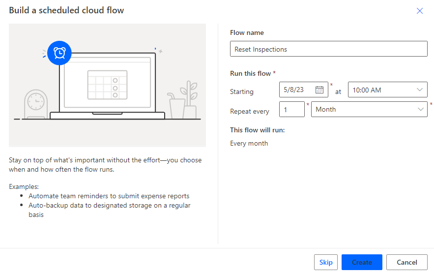

   - Select  **Create**.

1. Add query step.

   - Select **+ New step**.
   - Search for `Dataverse` and select the **Microsoft Dataverse** connector.
   - Select the **List rows** action.

     

   - Rename the List rows step to `Inspections` by selecting the **ellipses ...** on the flow step and selecting **Rename**.

     

   - Select **Inspections** for Table name.
   - Select **Show advanced options**.
   - In **Filter rows**, enter the OData query

     ```odata
     statuscode ne 330650001
     ```

     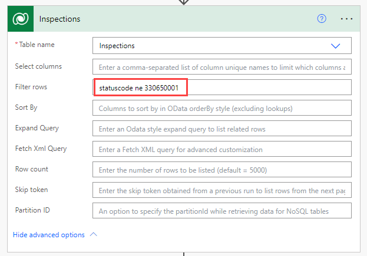

     > [!IMPORTANT]
     > 330650001 is the value of the Pending status reason on the Inspection table. You should verify that this is the correct value for your environment.

1. Add loop step.

   - Select **+ New step**.
   - Select the **Control** connector.
   - Select the **Apply to each** action.
   - Rename the step to `Loop`.
   - Click in **Select an output from previous steps**.
   - Using **Dynamic content**, select **value**.

     

1. Add Update row step within the loop.

   - Select **+ Add an action**.
   - Search for `Dataverse` and select the **Microsoft Dataverse** connector.
   - Select the **Update a row** action.
   - Rename the step to `Update Inspection`.
   - Select **Inspections** for Table name.
   - Click in **Row ID**.
   - Using **Dynamic content**, select **Inspection**.

     

   - Select **Show advanced options**.
   - In **Status Reason**, select **Pending**.

     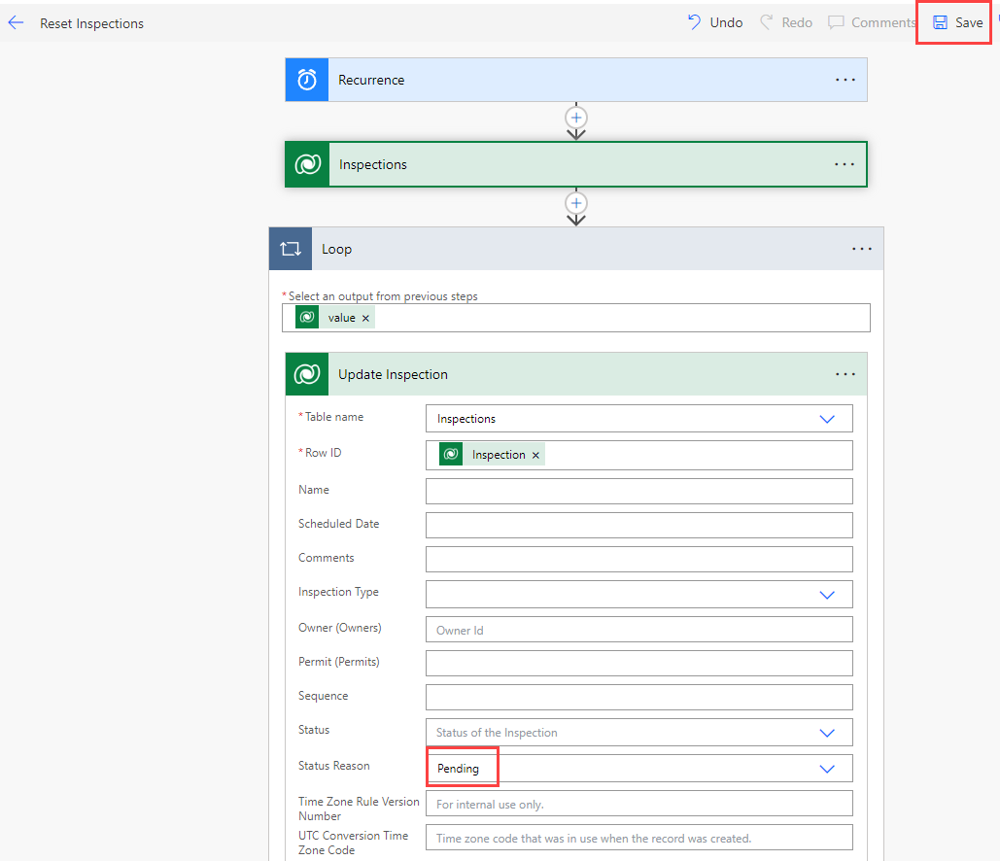

   - Select **Save**.

### Task 1.2: Run flow

   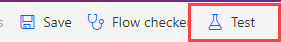

1. Select **Test**.
1. Select **Manually**.
1. Select **Test**.
1. Select **Run flow**.
1. Select **Done**.
1. Select the **<-** icon.

### Task 1.3: Verify flow run

1. View inspection records

   - Navigate to the [Power Apps maker portal](https://make.powerapps.com/)
   - Select your **Development** environment.
   - Make sure you are in the Development environment.
   - Select **Apps**.
   - Select the **Permit Management** app, select the **ellipses (...)** and select **Play**.
   - Select **Inspections**.
   - Select **Edit columns**.
   - Select **+ Add columns**.
   - Select **Status Reason**.
   - Select **Close**.
   - Select **Apply**.
   - All inspections should be set to **Pending**.

   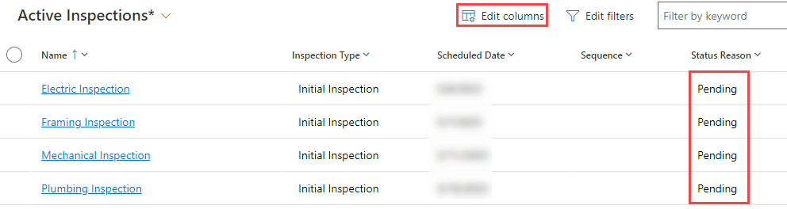

## Exercise 2: Create an instant cloud flow

**Objective:** In this exercise, you will create a cloud flow that is run from a canvas app.

### Task 2.1: Create instant flow

1. Open the Permit Management solution.

   - Navigate to the [Power Apps maker portal](https://make.powerapps.com/)
   - Select your **Development** environment.
   - Select **Solutions**.
   - Open the **Permit Management** solution.

1. Create an instant cloud flow.

   - Select **+ New** and then select **Automation** > **Cloud flow** > **Instant**.
   - Enter `ClearInspectionComments` for Flow name.
   - Select the **PowerApps** trigger.

     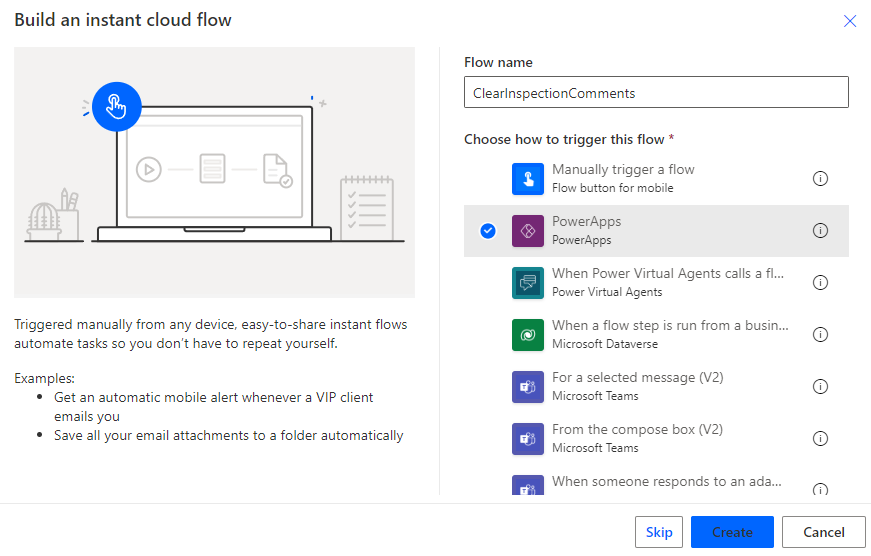

   - Select **Create**.

1. Add Update row step.

   - Select **+ New step**.
   - Search for `Dataverse` and select the **Microsoft Dataverse** connector.
   - Select the **Update a row** action.
   - Rename the step to `CancelComments`.
   - Select **Inspections** for Table name.
   - Click in **Row ID**.
   - Using **Dynamic content**, select **Ask in PowerApps**.

     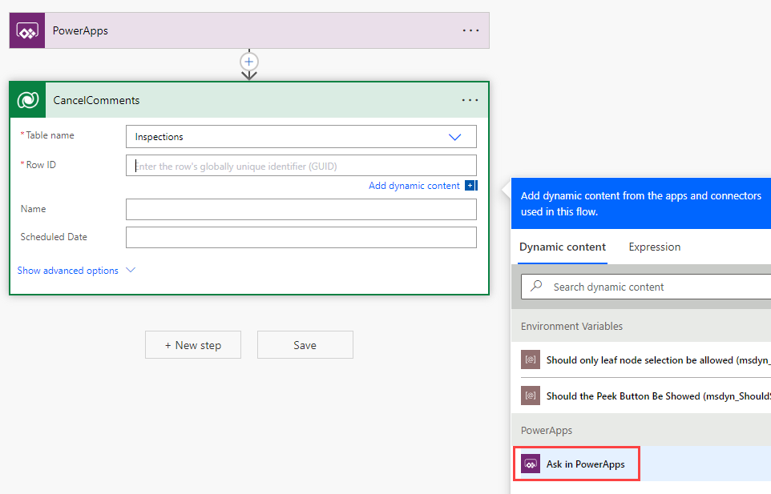

   - Select **Show advanced options**.
   - Click in **Comments**.
   - Select the **Expression** tab.
   - Enter `null`.

     

   - Select **OK**.

1. Add Retrieve Permit step.

   - Select **+ New step**.
   - Search for `Dataverse` and select the **Microsoft Dataverse** connector.
   - Select the **Get a row by ID** action.
   - Rename the step to `GetPermit`.
   - Select **Permits** for Table name.
   - Click in **Row ID**.
   - Using **Dynamic content**, select **Permit (Value)**.

     

1. Add Respond to PowerApps step.

   - Select **+ New step**.
   - Search for `PowerApps` and select the **PowerApps** connector.
   - Select the **Respond to a PowerApp or flow** action.
   - Select **+ Add an output**.
   - Select **Date**.
   - Click in *Enter title* and enter `startdate`.
   - Click in *Enter a value to respond*.
   - Using **Dynamic content**, search for `start` and select **Start Date**.

     

   - Select **Save**.
   - Select the **<-** icon.

### Task 2.2: Call instant flow from the canvas app

1. Open the Permit Management solution.

   - Navigate to the [Power Apps maker portal](https://make.powerapps.com/)
   - Select your **Development** environment.
   - Select **Solutions**.
   - Open the **Permit Management** solution.

1. Edit the **Inspector** canvas app.

   - Select **Apps** in the Permit Management solution.
   - Select the **ellipses ...** next to **Inspector** app and select **Edit**.

1. Add the instant cloud flow to the app.

   - Select the **Power Automate** tab.

     

   - Select **+ Add flow**.
   - Select **ClearInspectionComments**.

1. Add cancel comments button to the details screen.

   - Select the **Tree view** tab.
   - Select the **Details Screen** in the Tree view. Make sure that you have selected the screen and not selected the form.
   - Select the **+ Insert** tab and select **Button**.
   - Drag the button next to the failed button.
   - Select the **Tree view** tab.
   - Rename the button to `Clear Button`.
   - Change the **Text** value of the button to `"Clear Comments"`.

     

1. Run the cloud flow.

   - Select the **Clear Button** in the Tree view.
   - In the property selector, select **OnSelect**.
   - Change the **OnSelect** property to the formula below.

     ```powerappsfl
     Set(ScheduledDate, ClearInspectionComments.Run('Inspection List'.Selected.Inspection).startdate);Refresh(Inspections);
     ```

1. Add Text label.

   - Select the **+ Insert** tab.
   - Select **Text label**.
   - Drag the label to the top right of the screen.
   - Select the **Tree view** tab.
   - Rename **Label1** to `PermitStartLabel` by double clicking on the control in the Tree view tab.
   - Change the **Color** property of the **PermitStartLabel** label to `Color.White`.
   - Change the **Text** property of the **PermitStartLabel** to the formula below.

     ```powerappsfl
     ScheduledDate
     ```

1. Save the app.

### Task 2.3: Test the app

1. Start the application.

   - Select the **Main Screen** and select **Preview the app**.
   - The application should load and show at least one inspection.
   - Select the **Framing Inspection** record.
   - Select the **Clear Comments** button.
   - The inspection should be updated and the comments will be cleared.
   - **Close** preview mode.

1. Save and publish the app.

   - Click the **Publish** icon.
   - Select **Publish this version**.
   - Click the **<- Back** icon.
   - Select **Leave**.

## Exercise 3: Business process flow (Optional)

**Objective:** In this optional exercise, you will create a business process flow for the Build Site table with the following stages and steps:

- Stage 1: New Site with data steps for Street Address, City, State, Postal Code, Country
- Stage 2: Initial Permit on Permit table with data steps Build Site, Name, Contact, Start Date, Permit Type
- Stage 3: Initial Inspection on Inspection Table with data steps Permit, Name, Inspection Type, Scheduled Date

> [!NOTE]
> All data steps should be required

### Task 3.1: Create business process flow for Build Site

1. Open the Permit Management solution.

   - Navigate to the [Power Apps maker portal](https://make.powerapps.com/)
   - Select your **Development** environment.
   - Select **Solutions**.
   - Open the **Permit Management** solution.

1. Create a business process flow.

   - Select **+ New** and then select **Automation** > **Process** > **Business process flow**.
   - Enter `New Build Site` for Display name.
   - Enter `newbuildsite` for Name.
   - Select **Build Site** for Table.

     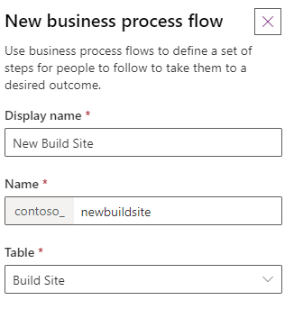

   - Select **Create**.

1. Add stages.

   - Click on the first stage.
   - Enter `New Site` for Display Name.
   - Select **Apply**.
   - Select the **Components** tab.
   - Drag the **Stage** component and drop it onto the **+** icon to the right of the first stage.
   - Click on the second stage.
   - Enter `Initial Permit` for Display Name.
   - Select **Permit** for Entity.
   - Select **Apply**.
   - Select the **+ Add** button in the command bar.
   - Select **Add Stage**.
   - Click the **+** icon to the right of the second stage.
   - Click on the third stage.
   - Enter `Initial Inspection` for Display Name.
   - Select **Inspection** for Entity.
   - Select **Apply**.

     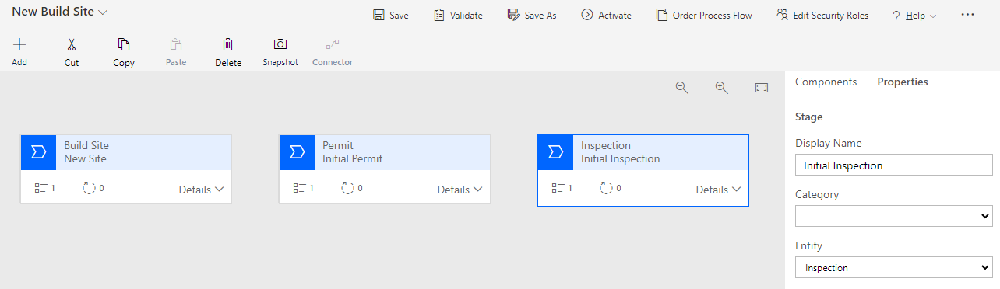

1. Configure Build Site stage.

   - Click on the first stage.
   - Expand **Details**.
   - Select the **+ Add** button in the command bar.
   - Select **Add Data Step**.
   - Click the **+** icon under the existing data step.
   - Repeat adding steps until there are five data steps on the stage.

     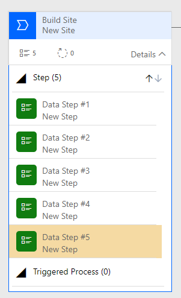

   - Select **Data Step #1**.
   - Select **Street Address** for Data Field.
   - Enter `Street` for Step Name.
   - Check **Required**.
   - Select **Apply**.
   - Select **Data Step #2**.
   - Select **City** for Data Field.
   - Check **Required**.
   - Select **Apply**.
   - Select **Data Step #3**.
   - Select **State/Province** for Data Field.
   - Enter `State` for Step Name.
   - Check **Required**.
   - Select **Apply**.
   - Select **Data Step #4**.
   - Select **ZIP/Postal Code** for Data Field.
   - Enter `Postal Code` for Step Name.
   - Check **Required**.
   - Select **Apply**.
   - Select **Data Step #5**.
   - Select **Country/Region** for Data Field.
   - Enter `Country` for Step Name.
   - Check **Required**.
   - Select **Apply**.

     

1. Configure Initial Permit stage.

   - Click on the second stage.
   - Expand **Details**.
   - Select the **+ Add** button in the command bar.
   - Select **Add Data Step**.
   - Click the **+** icon under the existing data step.
   - Repeat adding steps until there are five data steps on the stage.

   - Select **Data Step #1**.
   - Select **Build Site** for Data Field.
   - Check **Required**.
   - Select **Apply**.
   - Select **Data Step #2**.
   - Select **Name** for Data Field.
   - Check **Required**.
   - Select **Apply**.
   - Select **Data Step #3**.
   - Select **Contact** for Data Field.
   - Check **Required**.
   - Select **Apply**.
   - Select **Data Step #4**.
   - Select **Start Date** for Data Field.
   - Check **Required**.
   - Select **Apply**.
   - Select **Data Step #5**.
   - Select **Permit Type** for Data Field.
   - Check **Required**.
   - Select **Apply**.

     

1. Configure Initial Inspection stage.

   - Click on the third stage.
   - Expand **Details**.
   - Select the **Components** tab.
   - Drag the **Data Step** component and drop it onto the **+** icon under the existing data step.
   - Select the **Components** tab.
   - Drag the **Data Step** component and drop it onto the **+** icon under the existing data step.
   - Select the **Components** tab.
   - Drag the **Data Step** component and drop it onto the **+** icon under the existing data step.
   - There should be four data steps on the stage.

   - Select **Data Step #1**.
   - Select **Permit** for Data Field.
   - Check **Required**.
   - Select **Apply**.
   - Select **Data Step #2**.
   - Select **Name** for Data Field.
   - Check **Required**.
   - Select **Apply**.
   - Select **Data Step #3**.
   - Select **Inspection Type** for Data Field.
   - Check **Required**.
   - Select **Apply**.
   - Select **Data Step #4**.
   - Select **Scheduled Date** for Data Field.
   - Check **Required**.
   - Select **Apply**.

     

1. Save the business process flow.

     

   - Select **Save**.
   - Select **Validate**. Validation should be successful.
   - Select **Activate**.
   - Select **Activate**.
   - Close the business process flow editor.
   - Select **Done**.

1. Add business process flow table to the solution.

   > [!IMPORTANT]
   > You need to add the Business process flow table to the solution.

   - Click on **Add existing** and select **Table**.
   - Search for `build` and select the **New Build Site** table.
   - Select **Next**.
   - Check **Include all objects**.
   - Select **Add**.

### Task 3.2: Test the business process flow

1. Create a Build Site.

   - Navigate to the [Power Apps maker portal](https://make.powerapps.com/)
   - Select your **Development** environment.
   - Select **Apps** and play the **Permit Management** app.
   - Select **Build Sites**.
   - Select **+ New**.

     

   - Click on **New Site** stage in the business process flow.
   - Enter `Street` for Street.
   - Enter `City` for City.
   - Enter `State` for State.
   - Enter `ZIP` for Postal Code.
   - Select **Save**.
   - Select the **New Site** stage in the business process flow.
   - Select **Next Stage**. You should see the error *Country: Required fields must be filled in*.

     > [!NOTE]
     > If the Next Stage button is not shown, refresh your browser.

     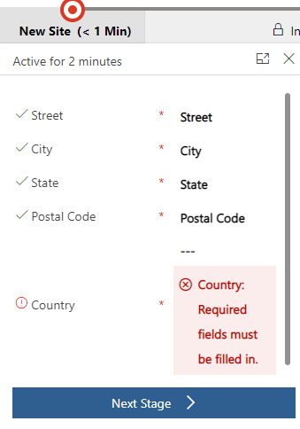

   - Enter `Country` for Country.

1. Transition to Permit stage.

   - Select **Next Stage**.
   - Select **+ Create**.
   - Select the **Initial Permit** stage in the business process flow.
   - Enter `BPF Permit` for Name.
   - Select **John Doe** for Contact.
   - Select today's date for Start Date.
   - Select **New Construction** for Permit Type.
   - Select **Save**.

1. Transition to Inspection stage.

   - Select the **Initial Permit** stage in the business process flow.
   - Select **Next Stage**.
   - Select **+ Create**.
   - Select the **Initial Inspection** stage in the business process flow.
   - Enter `BPF Inspection` for Name.
   - Select **Initial Inspection** for Inspection Type.
   - Select tomorrow's date for Scheduled Date.
   - Select **Save**.
