---
lab:
    title: 'Lab 06: Plugins'
---

## Lab 06 – Plugins

# Scenario

A regional building department issues and tracks permits for new buildings and updates for remodeling of existing buildings. Throughout this course you will build applications and automation to enable the regional building department to manage the permitting process. This will be an end-to-end solution which will help you understand the overall process flow.

In this lab you will build two plugins. The first plugin will run when a new permit record is created, and it will check that there are no other permits that exists for the build sites that are “locked”. If a locked permit is found, the plugin will block the creation of this new permit. The second plugin will hook up and run when the Lock Permit custom API is invoked. In the prior module we defined the custom API, and now with the plugin step registered on execution of the custom API, it will perform the lock permit business logic.

# High-level lab steps

As part of building the plugins, you will complete the following activities.

- Create two plugins.

- Implement logic to work with a plugin registered on an table event.

- Implement logic to work with a plugin registered on a custom API event.

- Deploy the plugins and associate them with your solution.

- Use the plugin trace log to see traces from the plugin.

- Debug the plugin on your local computer.

## Things to consider before you begin

- Do we know what events will trigger our plugins?

- Could what we are doing with the plugin, be done using Power Automate?

- Remember to continue working in your DEVELOPMENT environment. We’ll move everything to production soon.

  
‎ 

# Exercise #1: Block New Permit Creation Plugin

**Objective:** In this exercise, you will create a plugin that will run on create permit. This plugin will check if there are any locked permits for the selected build site of the new permit and block the creation of the new permit.

## Task #1: Create the plugin

1. Find the value of the Status Reason columns.
   - Navigate to https://make.powerapps.com/ and make sure you are in your dev environment.
  
   - Select **Solutions** and open the **Permit Management** solution.
  
   - Select **Switch to classic**.
  
   - Expand **Entities**, expand the **Permit** table, and select **Fields**.
  
   - Locate and double click to open the **Status Reason** column.
  
   - Scroll down and double click on the **Locked** option.
  
   - Copy the value.
  
    

   - You will need this value in a future step. Select **OK**
  
   - Close the column editor.
  
   - Expand **Entities**, expand the **Inspection** table, and select **Fields**.
  
   - Locate and double click to open the **Status Reason** column.
  
   - Scroll down and double click on the **Pending** option.
  
   - Copy the value.
  
    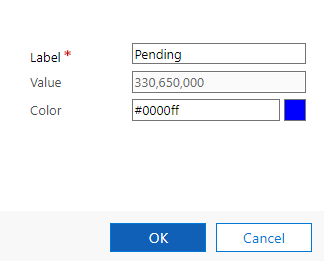

   - You will need this value in a future step. Select **OK**
  
   - Double click on the **Canceled** option.

   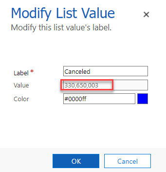
  
   - You will need this value in a future step. Select **OK**
  
   - Close the column editor.
  
  **Note:** Keep these values on a notepad, you need them in future steps.

2. Download and install Power Platform CLI
    - Download the standalone  Microsoft Power Platform CLI https://aka.ms/PowerAppsCLI 
  
    - Run the powerapps-cli file to start installation.
  
    - Use the setup wizard to complete the setup and select **Finish**.

3. Create the Visual Studio project

	- Open the command prompt.
	
	- Run the command below to create a new folder and name it ContosoPackageProject.
  
  
            md ContosoPackageProject

     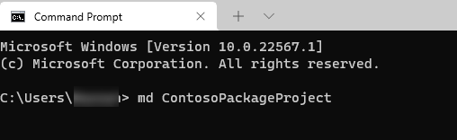
     
	- Change directory to the folder you just create by running the below command.

            cd ContosoPackageProject

	- You should now be in the ContosoPackageProject folder. Run the command below to initialize a directory with a new Dataverse plugin class library.

            pac plugin init

	- Dataverse plugin class library creation should be successful.
  
   

	- Run the command below to open the project in Visual Studio.
  
            start ContosoPackageProject.csproj

3. Delete Plugin1 and create new class file for the plugin

	- Right click on **Plugin1.cs** and select **Rename**.

    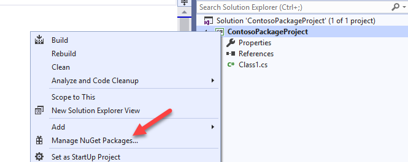

	- Rename the class **PreOperationPermitCreate**.
  
	- Select Yes on the rename references popup.

4. Get the **Target** Table.
    - Add the using statement below to the class.

            using Microsoft.Xrm.Sdk.Query;

	- add the code below inside the ExecuteCdsPlugin method.

            var permitEntity = context.InputParameters["Target"] as Entity;

	- To get the Build Site table reference, add the below code after **permitEntity** variable definition.

            var buildSiteRef = permitEntity["contoso_buildsite"] as EntityReference;

	- To add Trace Messages, add the below mentioned code after **buildSiteRef** variable definition.

            localPluginContext.Trace("Primary Entity Id: " + permitEntity.Id);

            localPluginContext.Trace("Build Site Entity Id: " + buildSiteRef.Id);

	5. Create Fetch xml and that will get the count of locked permits matching the build site id and call retrieve multiple.

	- Create the **FetchXML** string. Replace **[Locked Option Value]** with the locked option value of the status reason column from Permit table you copied.

                string fetchString = "<fetch output-format='xml-platform' distinct='false' version='1.0' mapping='logical' aggregate='true'><entity name='contoso_permit'><attribute name='contoso_permitid' alias='Count' aggregate='count' /><filter type='and' ><condition attribute='contoso_buildsite' uitype='contoso_buildsite' operator='eq' value='{" + buildSiteRef.Id + "}'/><condition attribute='statuscode' operator='eq' value='[Locked Option Value]'/></filter></entity></fetch>";

	- Call RetrieveMultiple and add Trace Message.

                localPluginContext.Trace("Calling RetrieveMultiple for locked permits");
                var response = localPluginContext.InitiatingUserService.RetrieveMultiple(new FetchExpression(fetchString));

	6. Get the locked Permit Count and throw InvalidPluginExecutionException if the **Count** is more than 0

	- Get the locked permits **Count**.

                int lockedPermitCount = (int)((AliasedValue)response.Entities[0]["Count"]).Value;

	- Add Trace Message, check if the **Count** is more than **0** and throw **InvalidPluginExecutionException** if it is more than **0**.

            localPluginContext.Trace("Locket Permit count : " + lockedPermitCount);
            if (lockedPermitCount > 0)
            {
            throw new InvalidPluginExecutionException("Too many locked permits for build site");
            }

	- The ExecuteCdsPlugin method should now look like the image below.

    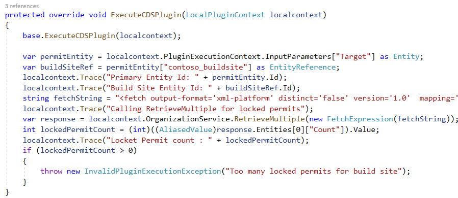

	- Build the project and make sure it succeeds. To build the project, right click on the project and select **Build**. Check the output and make sure that the build has succeeded. If it does not, go back and review your work compared the steps documented here. 

 

## Task #2: Deploy the plugin

1. If you don’t have CDS/Dynamics 365 SDK tools downloaded already, download them using the following method: 

	- Navigate to [https://xrm.tools/SDK](https://xrm.tools/SDK) 

	- Select **Download SDK Zip File**.

    

	- Save the zip file on your machine.

	- Right click on the downloaded **sdk.zip** file and select **Properties**.

	- Check the **Unblock** checkbox and select Apply.

    

	- Select **OK**.

	- Right click on the **sdk.zip** file again and select **Extract All**.

	- Complete extracting.

2. Start the plugin registration tool and sign in.

	- Open the **sdk** folder you extracted and open the **PluginRegistration** folder.

	- Locate **PluginRegistration.exe** and double click to start. This will open a new window.

    

3. Connect to your org.

	- Select **Create New Connection**.

    

- Select **Office 365** and check the **Display List of available organization** and **Show Advanced** checkboxes. Select **Online Region** where your organization is located. If you are unsure what region to select, select **Don’t Know**.

- Provide your **Microsoft Dataverse** credentials and select **Login**.

    

	- Select the **Dev** environment and then select **Login**.

    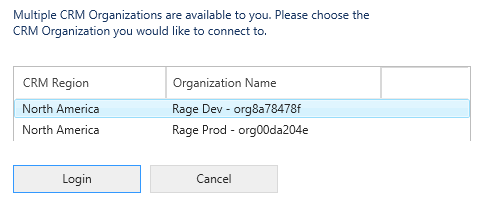

4. Register new assembly

	- Select **Register** and select **Register** **New Assembly**.

    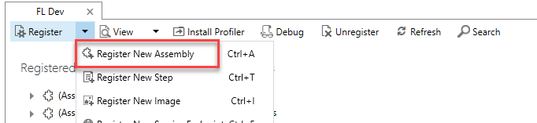

	- Select **…** to browse.

    

	- Browse to the bin/**debug** folder of your plugin project (**ContosoPackageProject**), select the **ContosoPackageProject**.dll file and select **Open**. 
	- 
‎**Path:** PathToFolder/ContosoPackageProject/ContosoPackageProject/bin/Debug

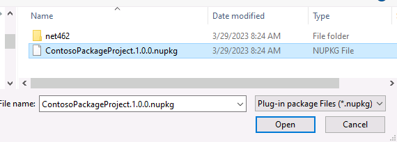

   - Select **Register Selected Plugins**.

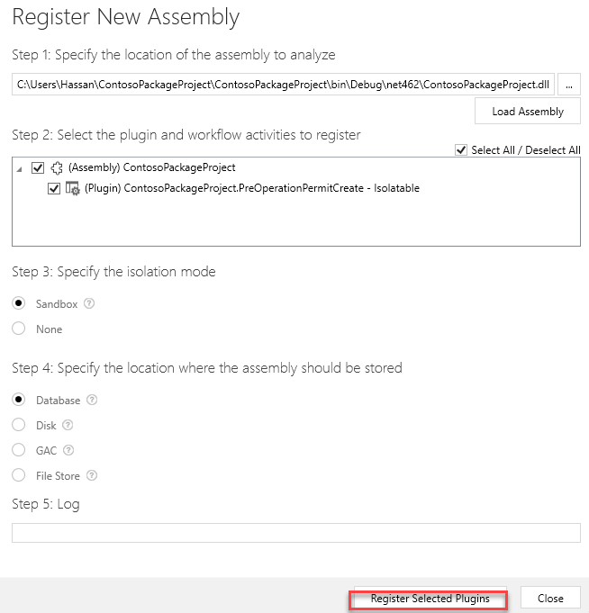

   - Select **OK**.
  

1. Register new step

	- Select the assembly you just registered.

	- Select **Register** and then select **Register New Step**.

    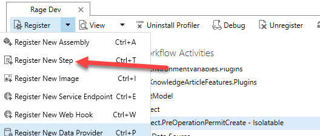

	- Enter **Create** for **Message**.

	- Enter **contoso_permit** for **Primary Table**.

	- Select **PreOperation** from dropdown for **Event Pipeline Stage of Execution** and then select **Register New Step**.

    

	- Step should now be registered in the assembly plugin.

    

 

  
‎ 

# Exercise #2: Create Custom Action Plugin

**Objective**: In this exercise, you will create and register a plugin that will be invoked when the lock permit custom action is used. This plugin will be used to implement the business logic of locking the permit. Specifically, it will update the permit to indicate it is locked and then cancel any pending inspections.

**Note:** If you did not create the custom API in a prior lab, look in your resources folder for how to add it here before you proceed.

## Task #1: Add a new plugin to the project

1. Add **using statements** to the **LockPermitCancelInspections** class, make the class **public**, and inherit from **PluginBase**

	- Add the using statement below to the **LockPermitCancelInspections** class.

            using Microsoft.Xrm.Sdk;
            using System.Text.RegularExpressions;
            using ContosoPackagePoject;
            using Microsoft.Xrm.Sdk.Query;

	- Make the **LockPermitCancelInspections** public and **inherit** from **PluginBase**.

    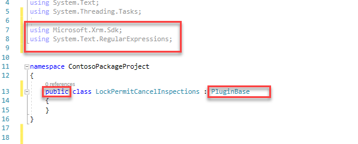

3. Override the ExecuteCDSPlugin method and get the reason value from the input parameter.

	- Override the **ExecuteCDSPlugin** method. Add the code below inside the **LockPermitCancelInspections** method.

            public LockPermitCancelInspections(string unsecureConfiguration, string secureConfiguration)
            : base(typeof(PreOperationPermitCreate))
            {

            }
            
            protected override void ExecuteCdsPlugin(ILocalPluginContext localPluginContext)
            { 
                if (localPluginContext == null)
                {
                    throw new ArgumentNullException(nameof(localPluginContext));
                }
            }

4. Get the target Table reference, Table, set status reason to lock, and update the permit record.

	- Get the target **Table Reference** and **Table**. Add the below code inside the Execute method.

            var permitEntityRef = localPluginContext.PluginExecutionContext.InputParameters["Target"] as EntityReference;
            Entity permitEntity = new Entity(permitEntityRef.LogicalName, permitEntityRef.Id);

	- Add **Trace** message and Set the **Status Reason** to **Lock**. 330650000 is the lock value of the Status Reason option you copied and statuscode is the name of the status reason column.

            localPluginContext.Trace("Updating Permit Id : " + permitEntityRef.Id);
            permitEntity["statuscode"] = new OptionSetValue(330650000);

	- Update the **Permit** record and add **Trace** message.

            localPluginContext.CurrentUserService.Update(permitEntity);
            localPluginContext.Trace("Updated Permit Id " + permitEntityRef.Id);

    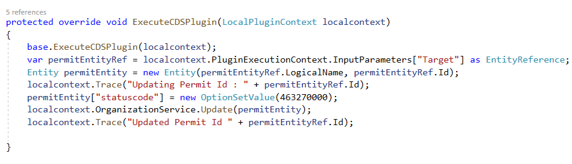

## Task #2: Get Related Inspections and Cancel

1. Create query and condition expressions.

	- Create the **QueryExpression**. Add the code below to the **ExecuteCdsPlugin** method.

            QueryExpression qe = new QueryExpression();
            qe.EntityName = "contoso_inspection";
            qe.ColumnSet = new ColumnSet("statuscode");

	- Create the **ConditionExpression**.

            ConditionExpression condition = new ConditionExpression();
            condition.Operator = ConditionOperator.Equal;
            condition.AttributeName = "contoso_permit";
            condition.Values.Add(permitEntityRef.Id);

	- Set the **Criteria** of the query.

            qe.Criteria = new FilterExpression(LogicalOperator.And);

	- Add the **ConditionExpression** to the **Criteria** of the **QueryExpression**.

            qe.Criteria.Conditions.Add(condition);

    

2. Retrieve the inspections and iterate through the returned Tables.

	- Retrieve the **Inspections** and add **Trace** messages.

            localPluginContext.Trace("Retrieving inspections for Permit Id " + permitEntityRef.Id);
            var inspectionsResult = localPluginContext.CurrentUserService.RetrieveMultiple(qe);
            localPluginContext.Trace("Retrievied " + inspectionsResult.TotalRecordCount + " inspection records");

	- Create a **variable** that will keep track of the canceled **Inspections** count and Iterate through the returned Tables.

            int canceledInspectionsCount = 0;
            foreach (var inspection in inspectionsResult.Entities)
            {          

            }

3. Retrieve the selected status reason option and check if it is set to new request or pending.

	- Get the currently selected value of the **Status Reason** option-set. Add the code below inside the **foreach** loop.

                var currentValue = inspection.GetAttributeValue<OptionSetValue>("statuscode");

	- Check if the selected option is **New Request** or **Pending** and increment the count. 1 is the value of the New Request option and 330650000 id the value of the Pending option you copied. This should be placed inside the foreach loop.

            if (currentValue.Value == 1 || currentValue.Value == 330650000)
            {
            canceledInspectionsCount++;
            }

4. Cancel the inspections that are pending or new request

	- Set the **Status Reason** selected value to **Canceled**. Add the code below inside the if statement inside the foreach loop. Make sure that 330650003 is the value for **Canceled** Status Reason in the **Inspections** table you copied. If this differs, please update the value with actual value for **Canceled** option.

                inspection["statuscode"] = new OptionSetValue(330650003);

	- Update the **Inspection** and add **Trace** messages.

            localPluginContext.Trace("Canceling inspection Id : " + inspection.Id);
            localPluginContext.CurrentUserService.Update(inspection);
            localPluginContext.Trace("Canceled inspection Id : " + inspection.Id);

 

    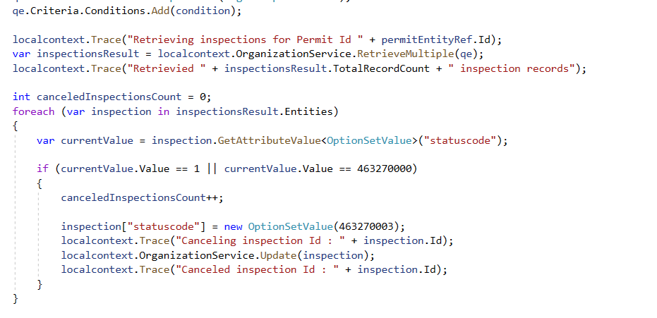

## Task #3: Set Output Parameter and Create Note Record

1. Check if at least one Inspection was canceled and CanceledInspectionsCount output Parameter.

	- Check if at least one **Inspection** was canceled. Add the code below after the **foreach** loop.

            if (canceledInspectionsCount > 0)
            {           

            }

	- Set the **CanceledInspectionsCount** output parameter. Add the code below inside the if statement outside the foreach loop.
    
            localPluginContext.PluginExecutionContext.OutputParameters["CanceledInspectionsCount"] = canceledInspectionsCount + " Inspections were canceled";

    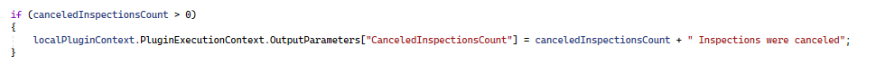

2. Check if the Input Parameters contain reason and create the Note record.

	- Check if **Reason** contains in the **InputParameters**. Add the code below after the last if statement.

            if (localPluginContext.PluginExecutionContext.InputParameters.ContainsKey("Reason"))
            {

            }

	- Build the **Note** record and add **Trace Message**. Add the code below inside the if statement.

            localPluginContext.Trace("building a note reocord");
            Entity note = new Entity("annotation");
            note["subject"] = "Permit Locked";
            note["notetext"] = "Reason for locking this permit: " + localPluginContext.PluginExecutionContext.InputParameters["Reason"];
            note["objectid"] = permitEntityRef;
            note["objecttypecode"] = permitEntityRef.LogicalName;

	- Add Trace Message and create the Note record.

            localPluginContext.Trace("Creating a note reocord");
            var createdNoteId = localPluginContext.CurrentUserService.Create(note);

	- Check if the Note record was created and add Trace Message.

            if (createdNoteId != Guid.Empty)
            localPluginContext.Trace("Note record was created");

    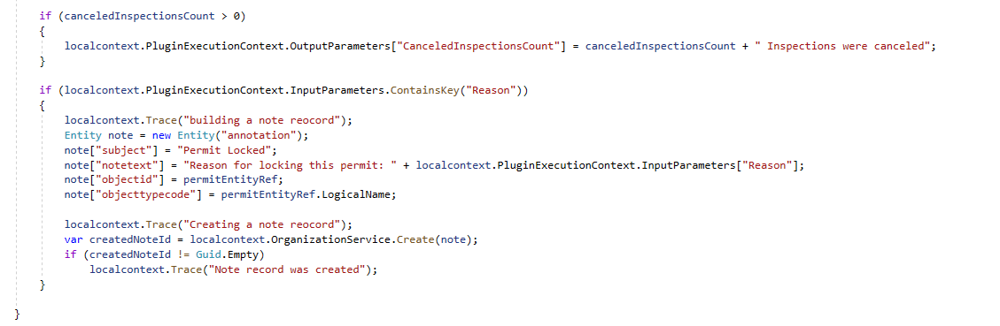

3. Build plugin by right clicking on the project and select **Build** and make sure the build succeeds.

## Task #4: Deploy Plugin

1. If you do not have the plugin registration tool running already, follow instructions above to run the tool and connect to the organization.

2. Update the assembly

	- Select **ContosoPackageProject** and select **Update**.

    

	- Select **…** browse**.

	- Browse to the **debug** folder of your plugin project, select the **ContosoPackageProject.dll** file and select **Open**.

	- Check **Select All** checkbox and then select **Update Selected Plugins**.

    

	- Select **OK**.

3. Add plugin and configure the custom API

	- Navigate to https://make.powerapps.com/ and make sure you are in your **Dev** environment.

	- Select **Solutions** and open the **Permit Management** solution.

	- Select **Add existing** and select **More > Developer > Plug-in assembly**.

    

	- Select the **ContosoPackageProject** assembly and then select **Add**.

	- Select **Custom API** and open the **Lock Permit** custom API.
  
    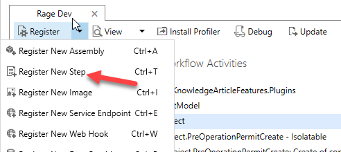
  
	- Scroll down and select **ContosoPackageProject.LockPermitCancelInspections** for Plugin Type.

    

	- Select **Save & Close**.
  
	- Select **Done**

# Exercise #3: Test Plugins

**Objective:** In this exercise, you will test the plugins you created.

## Task #1: Test Lock Plugin

1. Enable attachments for the Permit table   

	- Sign in to [Power Apps maker portal](https://make.powerapps.com/) and make sure you have the **Dev** environment selected.

	- Select **Solution** and open the **Permit Management** solution.

	- Select **Tables** and select the **...** button of the **Permit** table and then select **Settings**.

    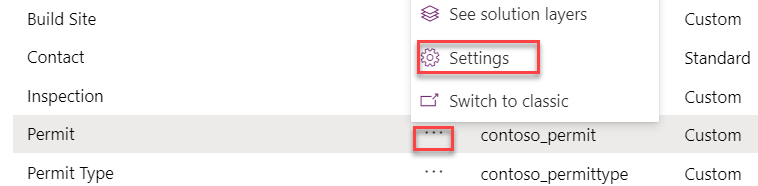

	- Check **Enable attachments** and then select **Done**. 

    

	- Select **All**.

	- Select **Publish All Customizations** and wait for the publishing to complete.

2. Enable Plugin Tracing

	- Select **Settings** and then select **Advanced Settings**.

    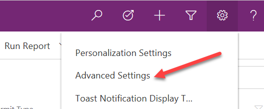

	- Select **Settings** and then select **Administration**.

    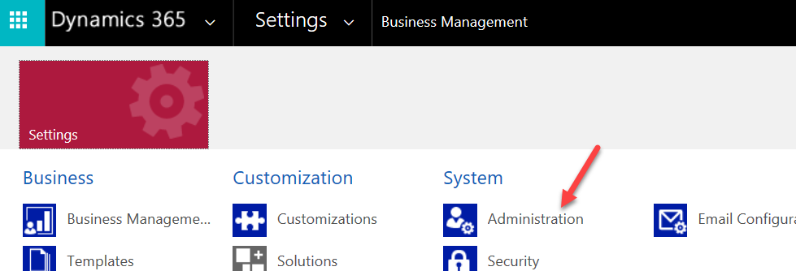

	- Select **System Settings**.

	- Select **Customization** tab.

	- Set Enable Plugin Logging to Plugin Trace Log to **All** and select **OK**.

    
  
    - Close the Advanced settings.

3. Create test record

	- Navigate to https://make.powerapps.com/ and make sure you have your **Dev** environment selected.

	- Select **Apps** and launch the **Permit Management** application.
  
	- Select **Inspections**.

	- You should have two inspections one **Failed** and one **Passed**. If not, open them and update the records.

	- Select **New**.

    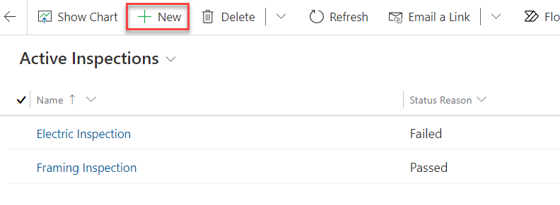

	- Enter **Plumbing Inspection** Name, select **Initial Inspection** for Type, select a permit, provide **Schedule Data**, select **Pending** Status Reason, and then select **Save**.

    

	- Select **New** again.

	- Enter **Mechanical Inspection** for Name, select **Initial Inspection** for Type, select a permit, provide **Schedule Date**, select **New Request** for Status Reason, and select **Save**.

4. Lock Permit.

	- Select **Inspections**.

	- Make sure you have four inspection records and with various Status Reason value.

    

	- Select **Permits**.

	- Open the **Test Permit**.

    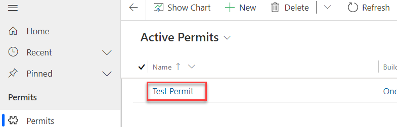

	- Make sure the Status Reason is set to Active and select **Lock Permit**.

    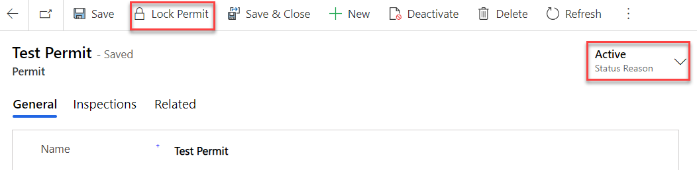

	- The Custom API should run. Select **Refresh**.

    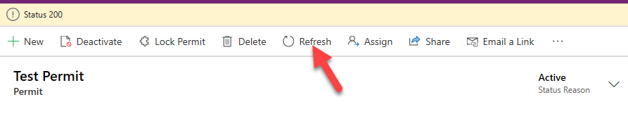

	- The **Status Reason** value should change to **Locked** 

    

5. Check if the Pending and New Request Inspections get canceled

	- Select Inspections.

	- You should now have two canceled inspections.  

    

 

6. Check if the Note record was created.

	- Select **Advanced Find**.

    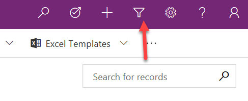

	- Select **Notes** and then select **Results**.

    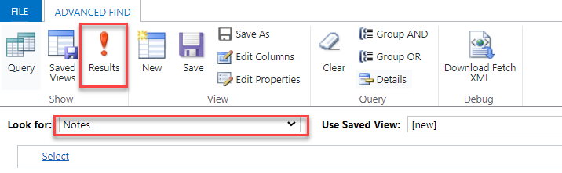

	- You should have at least one **Note** record. Select to open the **Note** record.

    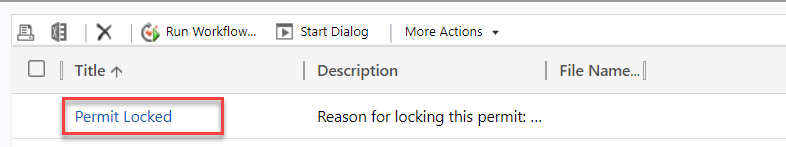

	- The Regarding column should be set to the Permit you locked.

    

	- Close the **Note** record. Close **Advanced Find**.

## Task #2: Test Restrict New Permit Creation Plugin

1. Try to create new Permit record for the One Microsoft Way Build Site

	- Select **Permits**.

	- Select **New**.

	- Provide the information below and select **Save**.

    

	- You should get the error below. Select **OK**.

    

	- The record should not get created.

    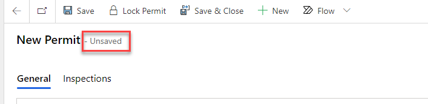

	- Select **Permits**.

	- Select **Discard**.

    

	- You should have only one Permit record.

    

 

  
‎ 

# Exercise #4: Plugin Trace Log and Debugging

**Objective:** In this exercise, you will check the Plugin Trace log and debug the plugins.

## Task #1: Plugin Trace Log

1. Open Plugin trace Log.

	- Go back to the Permit Management application.

	- Select **Settings** and then select **Advanced Settings**.

    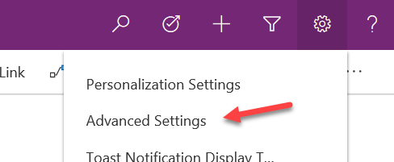

	- Select **Settings** and then select **Plugin Trace Log**.

    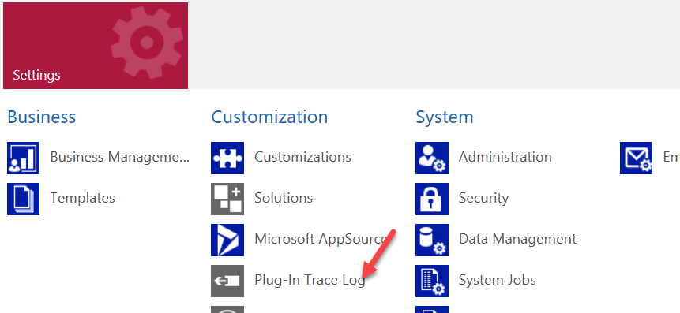

	- You should see at least two logs.

    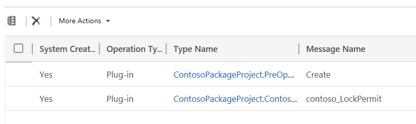

2. Open the log and see what was logged.

	- Open the log with the Create message.

    

	- Scroll down to the Execution section and examine.

 

## Task #2: Debugging Plugins (Optional)

Follow these steps to debug your plugins [https://docs.microsoft.com/en-us/powerapps/developer/common-data-service/tutorial-debug-plug-in](https://docs.microsoft.com/en-us/powerapps/developer/common-data-service/tutorial-debug-plug-in) 
