---
lab:
    title: 'Lab 06 – Plug-ins'
---

PL400: Microsoft Power Apps Developer

## Lab 06 – Plug-ins

# Scenario

A regional building department issues and tracks permits for new buildings and updates for remodeling of existing buildings. Throughout this course you will build applications and automation to enable the regional building department to manage the permitting process. This will be an end-to-end solution which will help you understand the overall process flow.

In this lab you will build two plugins. The first plugin will run when a new permit record is created, and it will check that there are no other permits that exists for the build sites that are “locked”. If a locked permit is found, the plugin will block the creation of this new permit. The second plugin will hook up and run when the Lock Permit custom action is invoked. In the prior module we defined the custom action, and now with the plugin step registered on execution of the custom action, it will now perform the lock permit business logic.

# High-level lab steps

As part of building the plugins, you will complete the following activities.

- Create two plugins using a common provided base class

- Implement logic to work with a plugin registered on an entity event

- Implement logic to work with a plugin registered on a custom action event

- Deploy the plugins and associate them with your solution

- Use the plugin trace log to see traces from the plugin

- Debug the plugin on your local computer

## Things to consider before you begin

- Do we know what events will trigger our plugins?

- Could what we are doing with the plugin, be done using Power Automate?

- Remember to continue working in your DEVELOPMENT environment. We’ll move everything to production soon.

  
‎ 

# Exercise #1: Block New Permit Creation Plugin

**Objective:** In this exercise, you will create a plugin that will run on create permit. This plugin will check if there are any locked permits for the selected build site of the new permit and block the creation of the new permit.

## Task #1: Create the plugin

1. Create a Visual Studio project

	- Start **Visual Studio**.

	- Click **File &gt; New &gt; Project**.

	- Select **Class Library (.NET Framework)** and click **Next**. Make sure you have selected the one with C#.

    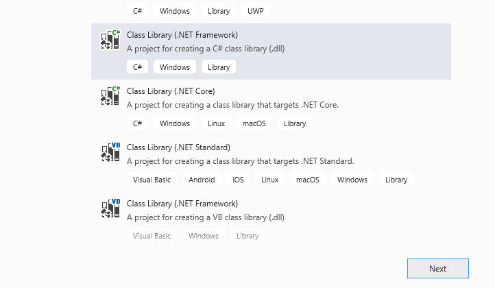

	- Enter **ContosoPackageProject** for **Project Name**, select a location to save the project, select **.NET Framework 4.6.2** for **Framework**, and then select **Create**.

    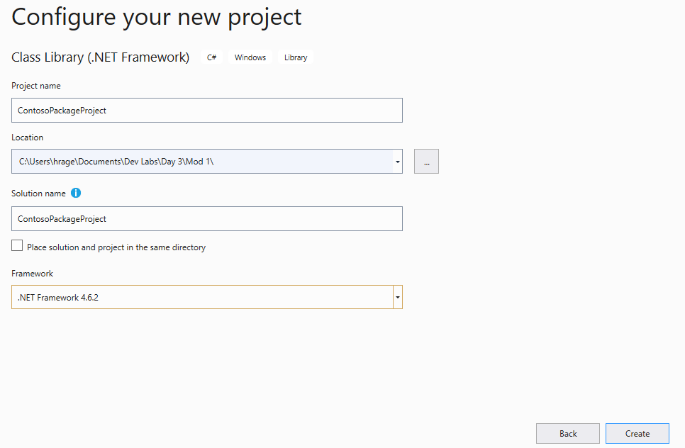

2. Add NuGet packages

	- Right click on the project name and select **Manage NuGet Packages**.

    

	- Select the **Browse** tab.

	- Search for **microsoft.CrmSdk.CoreAssemblies**.

	- Select **Microsoft.crmsdk.coreassemblies** (one authored by Microsoft)and click **Install**.

    

	- Read the license terms and then select **I agree** if you agree. 

3. Delete Class1 and create new class file for the plugin

	- Right click on **Class1.cs** and **Delete.** Click **OK** on the warning to delete this permanently.

	- Right on the project and select **Add &gt; Class**.

	- Enter **PreOperationPermitCreate** for **Name** and click **Add**. 

    

4. Add **PluginBase** file to the project.

	- Locate the **PluginBase** file in the lab resources folder.

	- Drag the **PluginBase** file to your Visual Studio project. Make sure that the file now exists in the folder structure.

    

	- Review the **PluginBase** class. This class inherits from IPlugin.

    

Close the **PluginBase** file.

5. Add **using statements** to the **PreOperationPermitCreate** class, make the class **public**, and inherit from **PuginBase**

	- Add the using statement below to the **PreOperationPermitCreate** class.

            using Microsoft.Xrm.Sdk;
            using Microsoft.Xrm.Sdk.Query;
            using ContosoPackagePoject;

	- Make the **PreOperationPermitCreate** public and **inherit** from **PluginBase**. 

    

6. Override the ExecuteCDSPlugin method and get the Target entity and the Build Site entity reference.

	- To override the **ExecuteCDSPlugin** method, add the code below to the **PreOperationPermitCreate** method.

            protected override void ExecuteCDSPlugin(LocalPluginContext localcontext)

            {

            base.ExecuteCDSPlugin(localcontext);

            }

	- To get the **Target** entity, add the code below inside the ExecuteCDSPlugin method.

            var permitEntity = localcontext.PluginExecutionContext.InputParameters["Target"] as Entity;

	- To get the Build Site entity reference, add the below code after **permitEntity** variable definition.

            var buildSiteRef = permitEntity["contoso_buildsite"] as EntityReference;

	- To add Trace Messages, add the below mentioned code after **buildSiteRef** variable definition.

            localcontext.Trace("Primary Entity Id: " + permitEntity.Id);

            localcontext.Trace("Build Site Entity Id: " + buildSiteRef.Id);

	7. Create Fetch xml and that will get the count of locked permits matching the build site id and call retrieve multiple.

		- Create the **FetchXML** string.

                string fetchString = "<fetch output-format='xml-platform' distinct='false' version='1.0' mapping='logical' aggregate='true'><entity name='contoso_permit'><attribute name='contoso_permitid' alias='Count' aggregate='count' /><filter type='and' ><condition attribute='contoso_buildsite' uitype='contoso_buildsite' operator='eq' value='{" + buildSiteRef.Id + "}'/><condition attribute='statuscode' operator='eq' value='463270000'/></filter></entity></fetch>";

	    - Call RetrieveMultiple and add Trace Message.

                localcontext.Trace("Calling RetrieveMultiple for locked permits");
                var response = localcontext.OrganizationService.RetrieveMultiple(new FetchExpression(fetchString));

	8. Get the locked Permit Count and throw InvalidPluginExecutionException if the **Count** is more than 0

		- Get the locker permits **Count**.

                int lockedPermitCount = (int)((AliasedValue)response.Entities[0]["Count"]).Value;

	- Add Trace Message, check if the **Count** is more than **0** and throw **InvalidPluginExecutionException** if it is more than **0**.

            localcontext.Trace("Locket Permit count : " + lockedPermitCount);
            if (lockedPermitCount > 0)
            {
            throw new InvalidPluginExecutionException("Too many locked permits for build site");
            }

	- The ExecuteCDSPlugin method should now look like the image below.

    

	- Build the project and make sure it succeeds. To build the project, right click on the project and select **Build**. Check the output and make sure that the build is succeeded. If it does not, go back and review your work compared the steps documented here. 

 

## Task #2: Deploy the plugin

1. Create strong name key.

	- Right click on the **Project** and select **Properties**.

    

	- Select the **Signing** tab, check the **Sign the assembly** checkbox and select **&lt;New…&gt;**.

    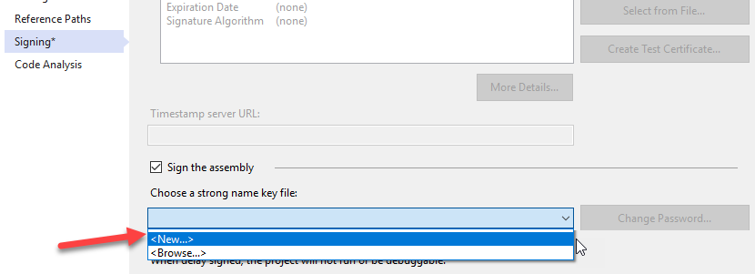

	- Enter **contoso.snk** for **Name**, uncheck the Protect with a **Password** checkbox, and click **OK**. Note: In case you get an access denied while creating the signature, close Visual Studio and run it in administrator mode to successfully complete this step.

    

	- Rebuild the project. Make sure the project is rebuilt successfully.

2. If you don’t have CDS/Dynamics 365 SDK tools downloaded already, download them using the following method: 

	- Navigate to [https://xrm.tools/SDK](https://xrm.tools/SDK) 

	- Click **Download SDK Zip File**.

    

	- Save the zip file on your machine.

	- Right click on the downloaded **sdk.zip** file and select **Properties**.

    

	- Check the **Unblock** checkbox and click Apply.

    

	- Click **OK**.

	- Right click on the **sdk.zip** file again and select **Extract All**.

	- Complete extracting.

3. Start the plugin registration tool and sign in.

	- Open the **sdk** folder you extracted and click to open the **PluginRegistration** folder.

	- Locate **PluginRegistration.exe** and double click to start. This will open a new window.

    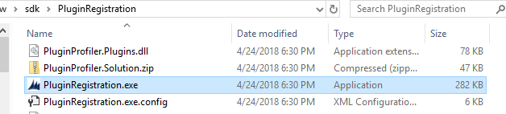

2. Connect to your org.

	- Click **Create New Connection**.

    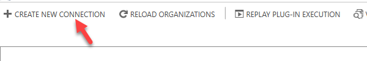

- Select **Office 365** and check the **Display List of available organization** and **Show Advanced** checkboxes. Select **Online Region** where your organization is located. If you are unsure what region to select, select **Don’t Know**.

- Provide your **CDS** credentials and click **Login**.

    

	- Select the **Dev** environment and click **Login**.

    

4. Register new assembly

	- Click **Register** and select **Register** **New Assembly**.

    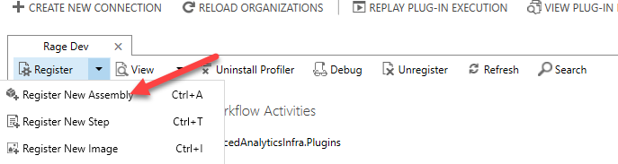

	- Click **…** to browse.

    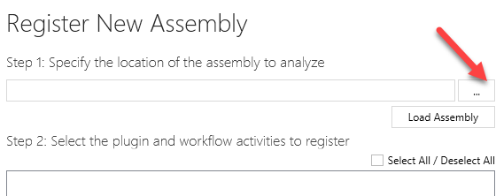

	- Browse to the bin/**debug** folder of your plugin project (**ContosoPackageProject**), select the **ContosoPackageProject**.dll file and click **Open**.  
‎**Path:** PathToFolder/ContosoPackageProject/ContosoPackageProject/bin/Debug

    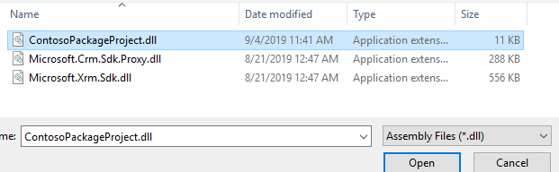

	- Click **Register Selected Plugins**.

    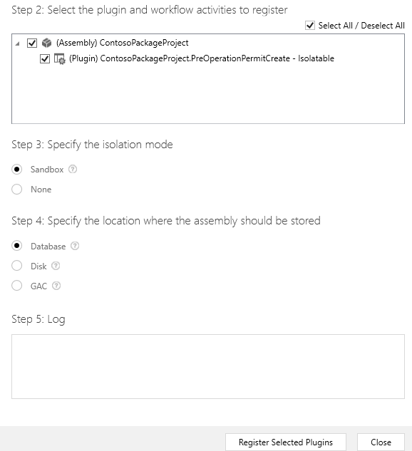

	- Click **OK**.

    

5. Register new step

	- Select the assembly you just registered.

	- Click **Register** and select **Register** **New Step**.

    

	- Enter **Create** for **Message**.

	- Enter **contoso_permit** for **Primary Entity**.

	- Select **PreOperation** from dropdown for **Event Pipeline Stage of Execution** and click **Register New Step**.

    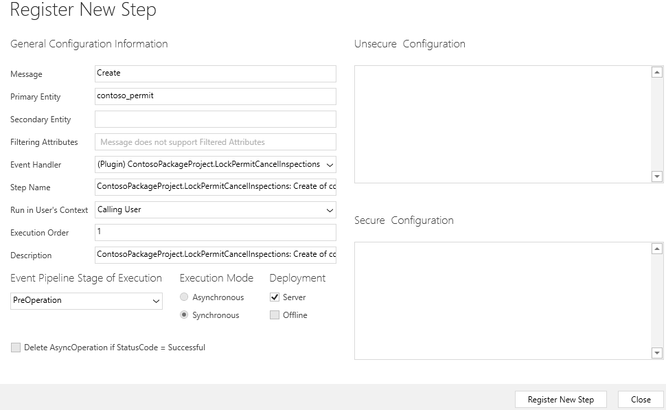

	- Step should now be registered in the assembly plugin.

    

 

  
‎ 

# Exercise #2: Create Custom Action Plugin

**Objective**: In this exercise, you will create and register a plugin that will be invoked when the lock permit custom action is used. This plugin will be used to implement the business logic of locking the permit. Specifically, it will update the permit to indicate it is locked and then cancel any pending inspections.  
‎**Note:** If you did not create the custom action in a prior lab, look in your resources folder for how to add it here before you proceed.

## Task #1: Add a new plugin to the project

1. Add new class to the project and name it **LockPermitCancelInspections**

	- Right on the project and select **Add &gt; Class**.

    

	- Enter **LockPermitCancelInspections** for **Name** and click **Add**.

    

2. Add **using statements** to the **LockPermitCancelInspections** class, make the class **public**, and inherit from **PuginBase**

	- Add the using statement below to the **LockPermitCancelInspections** class.

            using Microsoft.Xrm.Sdk;
            using System.Text.RegularExpressions;
            using ContosoPackagePoject;
            using Microsoft.Xrm.Sdk.Query;

	- Make the **LockPermitCancelInspections** public and **inherit** from **PluginBase**.

    

3. To override the ExecuteCDSPlugin method and get the reason value from the input parameter.

	- Override the **ExecuteCDSPlugin** method. Add the code below inside the **LockPermitCancelInspections** method.

            protected override void ExecuteCDSPlugin(LocalPluginContext localcontext)
            {
            base.ExecuteCDSPlugin(localcontext);
            }

4. Get the target entity reference, entity, set status reason to lock, and update the permit record.

	- Get the target **Entity Reference** and **Entity**.

            var permitEntityRef = localcontext.PluginExecutionContext.InputParameters["Target"] as EntityReference;
            Entity permitEntity = new Entity(permitEntityRef.LogicalName, permitEntityRef.Id);

	- Add **Trace** message and Set the **Status Reason** to **Lock**. 463270000 is the lock value of the Status Reason option-set and statuscode is the name of the status reason field.

            localcontext.Trace("Updating Permit Id : " + permitEntityRef.Id);
            permitEntity["statuscode"] = new OptionSetValue(463270000);

	- Update the **Permit** record and add **Trace** message.

            localcontext.OrganizationService.Update(permitEntity);
            localcontext.Trace("Updated Permit Id " + permitEntityRef.Id);

    

## Task #2: Get Related Inspections and Cancel

1. Create query and condition expressions.

	- Create the **QueryExpression**. Add the code below to the **ExecuteCDSPlugin** method.

            QueryExpression qe = new QueryExpression();
            qe.EntityName = "contoso_inspection";
            qe.ColumnSet = new ColumnSet("statuscode");

	- Create the **ConditionExpression**.

            ConditionExpression condition = new ConditionExpression();
            condition.Operator = ConditionOperator.Equal;
            condition.AttributeName = "contoso_permit";
            condition.Values.Add(permitEntityRef.Id);

	- Set the **Criteria** of the query.

            qe.Criteria = new FilterExpression(LogicalOperator.And);

	- Add the **ConditionExpression** to the **Criteria** of the **QueryExpression**.

            qe.Criteria.Conditions.Add(condition);

    

2. Retrieve the inspections and iterate through the returned entities.

	- Retrieve the **Inspections** and add **Trace** messages.

            localcontext.Trace("Retrieving inspections for Permit Id " + permitEntityRef.Id);
            var inspectionsResult = localcontext.OrganizationService.RetrieveMultiple(qe);
            localcontext.Trace("Retrievied " + inspectionsResult.TotalRecordCount + " inspection records");

	- Create a **variable** that will keep track of the canceled **Inspections** count and Iterate through the returned entities.

            int canceledInspectionsCount = 0;
            foreach (var inspection in inspectionsResult.Entities)
            {          

            }

3. Retrieve the selected status reason option and check if it is set to new request or pending.

	- Get the currently selected value of the **Status Reason** option-set. Add the code below inside the **foreach** loop.

                var currentValue = inspection.GetAttributeValue<OptionSetValue>("statuscode");

	- Check if the selected option is **New Request** or **Pending** and increment the count. 1 is the value of the New Request option and 463270000 id the value of the Pending option. This should be placed inside the foreach loop.

            if (currentValue.Value == 1 || currentValue.Value == 463270000)
            {
            canceledInspectionsCount++;
            }

4. Cancel the inspections that are pending or new request

	- Set the **Status Reason** selected value to **Canceled**. Add the code below inside the if statement inside the foreach loop. Make sure that 463270003 is the value for **Canceled** **Status Reason** in the **Inspections** entity. If this differs, please update the value with actual value for **Canceled Status Reason**.

                inspection["statuscode"] = new OptionSetValue(463270003);

	- Update the **Inspection** and add **Trace** messages.

            localcontext.Trace("Canceling inspection Id : " + inspection.Id);
            localcontext.OrganizationService.Update(inspection);
            localcontext.Trace("Canceled inspection Id : " + inspection.Id);

 

    

## Task #3: Set Output Parameter and Create Note Record

1. Check if at least one Inspection was canceled and CanceledInspectionsCount output Parameter.

	- Check if at least one **Inspection** was canceled. Add the code below after the **foreach** loop.

            if (canceledInspectionsCount > 0)
            {           

            }

	- Set the **CanceledInspectionsCount** output parameter. Add the code below inside the if statement outside the foreach loop.
    
            localcontext.PluginExecutionContext.OutputParameters["CanceledInspectionsCount"] = canceledInspectionsCount + " Inspections were canceled";

    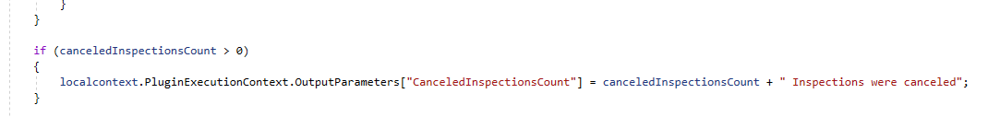

2. Check if the Input Parameters contain Reason and Create the Note record.

	- Check if **Reason** contains in the **InputParameters**. Add the code below after the last if statement.

            if (localcontext.PluginExecutionContext.InputParameters.ContainsKey("Reason"))
            {

            }

	- Build the **Note** record and add **Trace Message**. Add the code below inside the if statement.

            localcontext.Trace("building a note reocord");
            Entity note = new Entity("annotation");
            note["subject"] = "Permit Locked";
            note["notetext"] = "Reason for locking this permit: " + localcontext.PluginExecutionContext.InputParameters["Reason"];
            note["objectid"] = permitEntityRef;
            note["objecttypecode"] = permitEntityRef.LogicalName;

	- Add Trace Message and create the Note record.

            localcontext.Trace("Creating a note reocord");
            var createdNoteId = localcontext.OrganizationService.Create(note);

	- Check if the Note record was created and add Trace Message.

            if (createdNoteId != Guid.Empty)
            localcontext.Trace("Note record was created");

    

3. Build plugin by right clicking on the project and select **Build** and make sure the build succeeds.

## Task #4: Deploy Plugin

1. If you do not have the plugin registration tool running already, follow instructions in Exercise #1, Task #2 to run the tool and connect to the organization.

2. Update the assembly

	- Select **ContosoPackageProject** and click **Update**.

    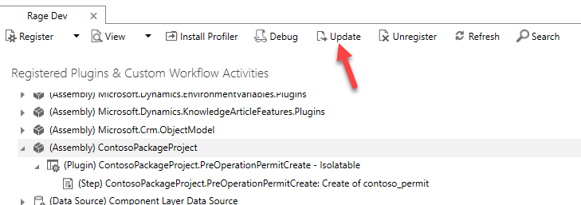

	- Click … to **Browse**.

    

	- Browse to the **debug** folder of your plugin project, select the **ContosoPackageProject**.dll file and click **Open**.

	- Check **Select All** checkbox and click **Update Selected Plugins**.

    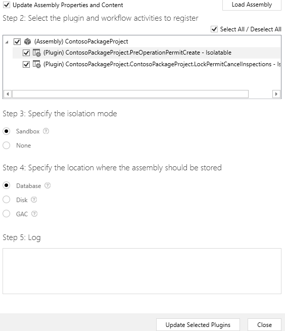

	- Click **OK**.

3. Register new step

	- Select the assembly (ContosoPackageProject.LockPermitCancelInspections).

	- Click **Register** and select **Register** **New Step**.

    

	- Enter **contoso** in the **Message** textbox and select **contoso_LockPermit**.

    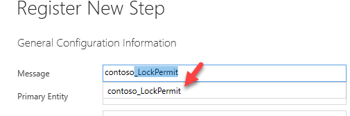

	- Enter **contoso_permit** for **Primary Entity**.

	- Make sure that Event Handler is selected for **LockPermitCancelInspections** plugin.

	- Select **PreOperation** from dropdown for **Event Pipeline Stage of Execution** and click **Register New Step**.

    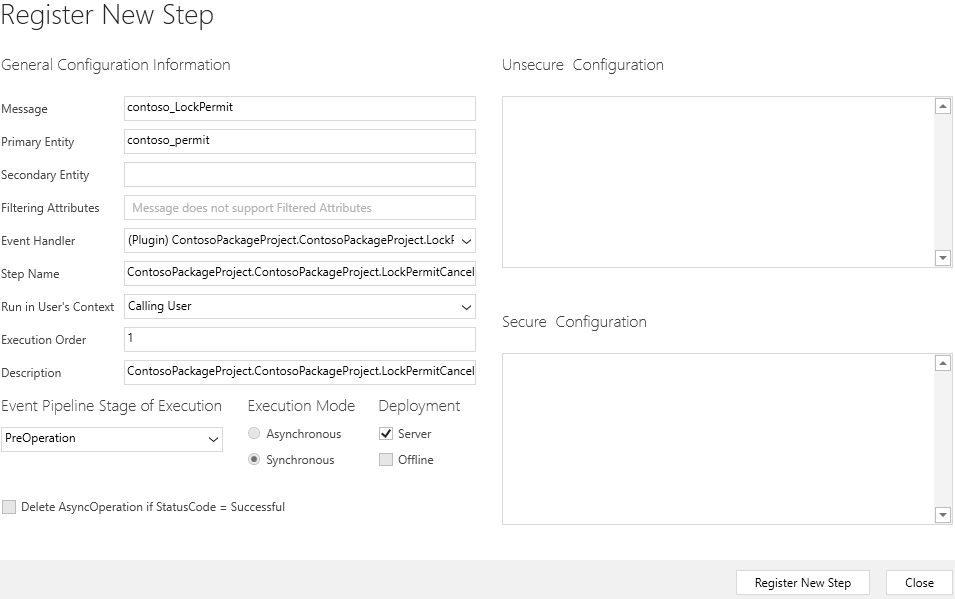

	- Step should now be registered in the assembly.

    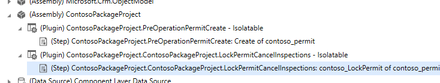

# Exercise #3: Test Plugins

**Objective:** In this exercise, you will test the plugins you created.

## Task #1: Test Lock Plugin

1. Add Plugin Assembly and Plugin - step to the Permit Management solution   
‎

    **Note**: This is only required to be done after deploying it first time to ensure that when the project solution is moved to the production environments, the plugins and the registered steps are included.

	- Sign in to [Power Apps maker portal](https://make.powerapps.com/) and make sure you have the **Dev** environment selected.

	- Select **Solution** and click to open the **Permit Management** solution.

    

	- Click **Add Existing | Other | Plugin Assembly**.

    

	- Select **ContosoPackageProject** and click **Add**.

    

	- Click **Add Existing | Other | Plug-in step**.

    

	- Select both SDK Messages you created and click **Add**.

    

	- Now, open the **Permit** entity and click **Settings**.

    

	- Check **Enable Attachments and Notes,** and then click **Done**. 

    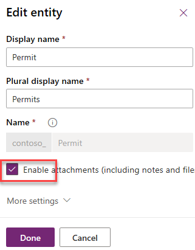

	- Click **Okay**.

	- Finally, select **Save Entity**.

	- Select **Solutions** and click **Publish All Customizations**.

2. Start the Permit Management application and enable Plugin Tracing

	- Select **Apps**.

	- Click to open the **Permit Management** application.

    

	- Click **Settings** and select **Advanced Settings**.

    

	- Click **Settings** and select **Administration**.

    

	- Click **System Settings**.

	- Select **Customization** tab.

	- Set Enable Plugin Logging to Plugin Trace Log to **All** and click **OK**.

    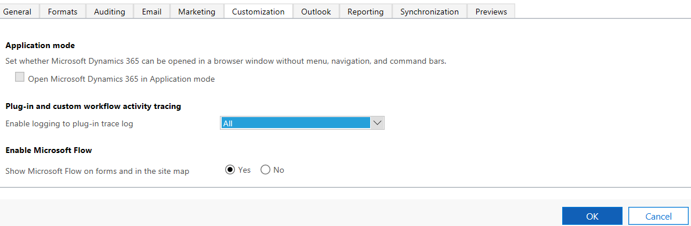

3. Create test record

	- Go back to the **Permit Management** application.

	- Select **Inspections**.

	- You should have two inspections one **Failed** and one **Passed**. If not, open them and update the records.

	- Click **New**.

    

	- Enter **Plumbing Inspection** for **Name**, select **Initial Inspection** for **Type**, select a permit, provide **Schedule Data**, select **Pending** for **Status Reason**, and click **Save**.

    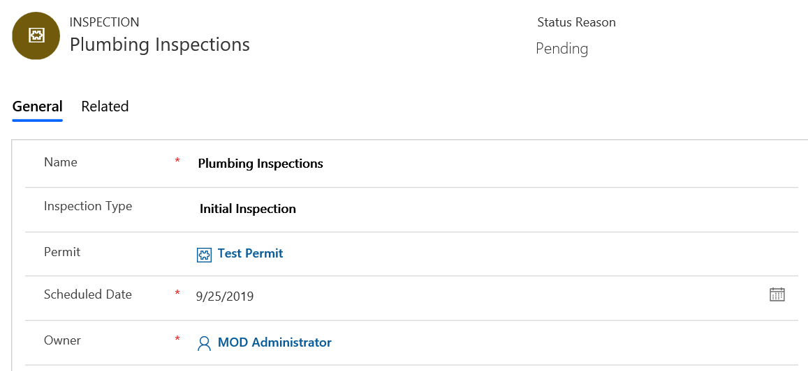

	- Click **New** again.

	- Enter **Mechanical Inspection** for **Name**, select **Initial Inspection** for **Type**, select a permit, provide **Schedule Date**, select **New Request** for **Status Reason**, and click **Save**.

4. Lock Permit.

	- Select **Inspections**.

	- Make sure you have four inspection records and with various Status Reason value.

    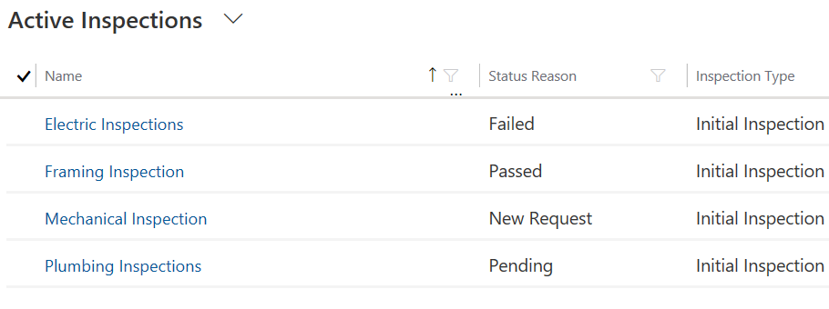

	- Select **Permits**.

	- Click to open the **Test Permit**.

    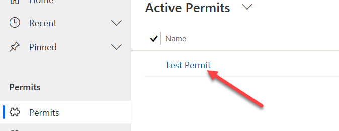

	- Make sure the Status Reason is set to Active and click **Lock Permit**.

    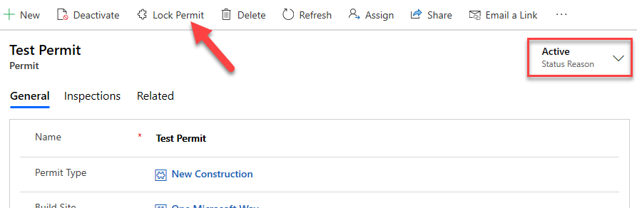

	- The Custom Action should run. Click **Refresh**.

    

	- The **Status Reason** value should change to **Locked** 

    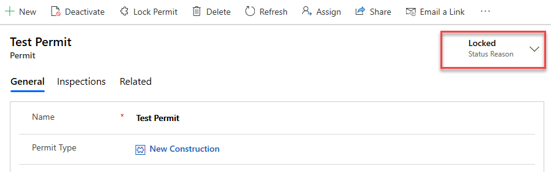

5. Check if the Pending and New Request Inspections get canceled

	- Select Inspections.

	- You should now have two canceled inspections.  
‎

**If you completed the PCF module:**
    

**If you did not complete the PCF module:**
    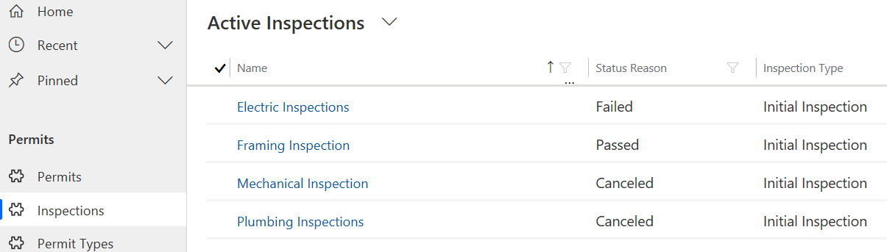

 

6. Check if the Note record was created.

	- Click **Advanced Find**.

    

	- Select **Notes** and click **Results**.

    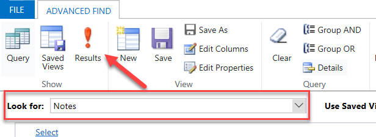

	- You should at least one **Note** record. Click to open the **Note** record.

    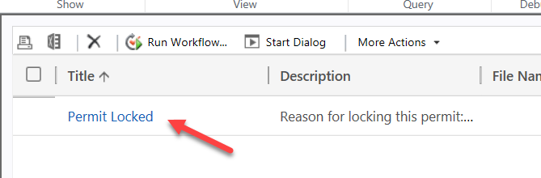

	- The Regarding field should be set to the Permit you locked.

    

	- Close the **Note** record. Close **Advanced Find**.

## Task #2: Test Restrict New Permit Creation Plugin

1. Try to create new Permit record for the One Microsoft Way Build Site

	- Select **Permits**.

	- Click **New**.

    

	- Provide the information below and click **Save**.

    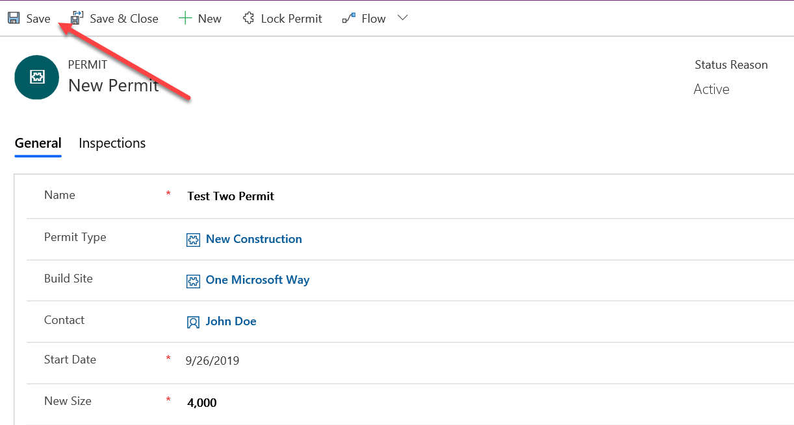

	- You should get the error below. Click **OK**.

    

	- The record should not get created.

    

	- Select **Permits**.

	- Click **Discard**.

    

	- You should have only one Permit record.

    

 

  
‎ 

# Exercise #4: Plugin Trace Log and Debugging

**Objective:** In this exercise, you will check the Plugin Trace log and debug the plugins

## Task #1: Plugin Trace Log

1. Open Plugin trace Log.

	- Go back to the Permit Management application.

	- Click **Settings** and select **Advanced Settings**.

    

	- Click **Settings** and select **Plugin Trace Log**.

    

	- You should see at least two logs.

    

2. Open the log and see what was logged.

	- Click to open the Lock Permit log.

    

	- Scroll down to the Execution section.

	- Examine your Trace messages.

    

 

## Task #2: Debugging Plugins (Optional)

Follow these steps to debug your plugins [https://docs.microsoft.com/en-us/powerapps/developer/common-data-service/tutorial-debug-plug-in](https://docs.microsoft.com/en-us/powerapps/developer/common-data-service/tutorial-debug-plug-in) 
