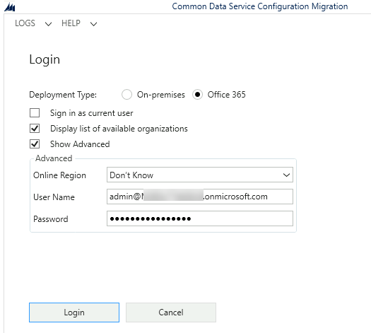
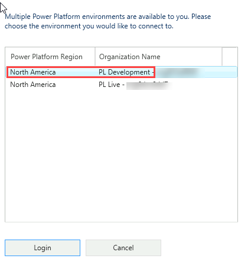

---
lab:
    title: 'Lab 6: Power Platform tools'
    module: 'Module 5: Introduction to developing with Power Platform'
---

# Practice Lab 6 - Power Platform tools

## Scenario

As we continue to build our solution, we will now install and configure tools used for extending the Power Platform with code.

## High-level lab steps

We will install and configure the following tools:

- Power Platform CLI
- Configuration Migration Tool
- XrmToolBox
- Postman
- DotNet Framework
- Visual Studio Code

## Things to consider before you begin

- Which tools do you require?
- Which IDE(s) do you require?

## Exercise 1: Power Platform CLI

**Objective:** In this exercise, you will install the Power Platform CLI.

### Task 1.1: Download and install Power Platform CLI

1. Download [Power Platform CLI](https://aka.ms/PowerAppsCLI).
1. Run the **powerapps-cli-1.0.msi** to start the installation.
1. Use the setup wizard to complete the setup and select **Finish**.
1. Open a Command Prompt.
1. Verify Power Apps CLI is installed.

   ```dos
   pac install latest
   ```

1. List the Power Apps CLI tools.

   ```dos
   pac tool list
   ```

   

   > [!NOTE]
   > Power Platform tools will be installed on first launch.

## Exercise 2: Configuration Migration Tool

**Objective:** In this exercise, you will copy reference data between environments.

### Task 2.1: Export data from Development

1. Open a Command Prompt.
1. Launch the Configuration Migration Tool with the following command.

   ```dos
   pac tool cmt
   ```

   

1. Select **Create schema** and select **Continue**.
1. Select **Office 365** for Deployment Type.
1. Check **Display list of available organizations**.
1. Check **Show Advanced**.
1. Enter your tenant credentials.

   

1. Select **Login**.

   

1. Select your **Development** environment and select **Login**.
1. Select the **Permit Management** solution.
1. Select the **Build Site** table under Select Entity .
1. Select **Build Site, City, Country/Region, State/Province, Street Address, ZIP/Postal Code** columns.
1. Select **Add Fields >**.

   

1. Select the **Permit Type** table under Select Entity.
1. Select **Name, Permit Type, Require Inspections, Require Size** columns.
1. Select **Add Fields >**.
1. Select **Save and Export**.
1. Enter `permit.xml` and select **Save**.
1. Select **Yes** to export the data.
1. Select the **ellipses (...)** next to **Save to data file**.
1. Enter `permitdata.zip`.
1. Select **Save**.

   

1. Select **Export Data**.
1. Select **Exit**.

### Task 2.2: Import data to Production

1. Open the Command Prompt.
1. Run the command `pac tool cmt`.
1. Select **Import data**
1. Select **Continue**.
1. Select **Office 365** for Deployment Type.
1. Check **Display list of available organizations**.
1. Check **Show Advanced**.
1. Enter your tenant credentials.
1. Select **Login**.
1. Select your **Production** environment and click **Login**.
1. Select the ellipses (...) next to **Zip File**.
1. Select the **permitdata.zip** file you created in the previous task and click **Open**.
1. Select **Import data**
1. Select **Exit**.
1. Close the Configuration Migration Tool window.

## Exercise 3: Community tools

**Objective:** In this exercise, you will use FetchXmlBuilder in the XrmToolBox to find inspections with status reason New request or Pending.

### Task 3.1: Install XrmToolBox

1. Navigate to [XrmToolBox](https://www.xrmtoolbox.com).

   

1. Download **XrmToolBox** latest version and extract the files to a folder.
1. Run **XrmToolBox.exe** from the folder.

   

1. Select **Open Tool Library**.
1. Search for `fetchxml` and select **FetchXML Builder by Jonas Rapp**.

   

1. Select **Install**.
1. Select **Yes**.
1. Select **Close**.
1. Search for `early` and select **Early Bound Generator by Daryl LaBar**.
1. Select **Install**.
1. Select **Yes**.
1. Select **Close**.
1. Search for `trace` and select **Plugin Trace Viewer by Jonas Rapp**.
1. Select **Install**.
1. Select **Yes**.
1. Select **Close**.
1. Close the *Tool Library* tab.

### Task 3.2: FetchXML query

1. Select the **Tools** tab in XRMToolBox.
1. Search for `fetchxml` and select **FetchXML Builder**.
1. Select **Yes** to connect to an organization.
1. Select **New connection**.
1. Select **Microsoft Login Control**.
1. Click **Open Microsoft Login Control**.
1. Select **Office 365** for Deployment Type.
1. Check **Display list of available organizations**.
1. Check **Show Advanced**.
1. Enter your tenant credentials.
1. Click **Login**.
1. Select your **Development** environment and select **Login**.
1. Enter `Dev` for Name and select **Finish**.
1. Select **Continue**.

   

1. Click on the **(entity)** node.
1. Select **contoso_inspection** in the Entity name drop down.
1. Click on **filter**.
1. Select **statuscode** in the Attribute drop down.
1. Select **Equal** in the Operator drop down.
1. Select **New Request** in the Value drop down.
1. Click on **+condition**.
1. Select **statuscode** in the Attribute drop down.
1. Select **Equal** in the Operator drop down.
1. Select **Pending** in the Value drop down.
1. Click on the **filter** node.
1. Select **or** in the Filter type drop down.

   

1. Select **View** and then select **FetchXML**. The FetchXML should look like the following query.

   ```xml
   <fetch top="50">
     <entity name="contoso_inspection">
       <filter type="or">
         <condition attribute="statuscode" operator="eq" value="1" />
         <condition attribute="statuscode" operator="eq" value="330650001" />
       </filter>
     </entity>
   </fetch>
   ```

1. Select **Execute (F5)**. You should see a list of inspection records.

1. Select **Convert** and then select **Power Automate Parameters**. The filter should look like the following

   ```odata
   (statuscode eq 1 or statuscode eq 330650001)
   ```

## Exercise 4: Postman

**Objective:** In this exercise, you will install Postman and configure connection to Dataverse.

### Task 4.1: Find the Web API endpoint

1. Find the Web API endpoint

   - Navigate to the [Power Apps maker portal](https://make.powerapps.com/)
   - Select your **Development** environment.

     

   - Select **Settings** and then select **Developer Resources**

     

   - Copy the base url of the Web API endpoint.

### Task 4.2: Install and configure Postman

1. Download Windows 64-bit [Postman](https://www.postman.com/downloads)
1. Run the Postman installer.
1. Create a Postman account.
1. Sign in to Postman.
1. Follow the steps in [Set up a Postman environment](https://learn.microsoft.com/power-apps/developer/data-platform/webapi/setup-postman-environment) to configure Postman to connect to your Development environment.

## Exercise 5: .NET Framework

**Objective:** In this exercise, you will install the supported .NET Framework.

> [!NOTE]
> The virtual machine used in the lab environment has Visual Studio 2019 Community Edition installed. The labs are have been verified against this version of Visual Studio. If you are using a different version or edition of Visual Studio, the steps may differ.

### Task 5.1: Install .NET Framework

1. Install .NET Framework 4.6.2 Developer Pack

   - Navigate to [Download .NET Framework 4.6.2](https://dotnet.microsoft.com/download/dotnet-framework/net462)

   - Select the **Developer Pack**.

    

   - Open the downloaded file.
   - Follow the steps in setup wizard to complete installing the **Developer Pack.**

### Task 5.2: Install .NET Framework in Visual Studio

1. Add .NET Framework 4.6.2 to Visual Studio 2019.

   - Start **Visual Studio Installer**.
   - Select **Modify**.
   - Under *Installation details* pane, check **.NET Framework 4.6.2 development tools**.
   - Select **Modify**.
   - Select **Yes**
   - Close the **Visual Studio Installer** window.

## Exercise 6: Visual Studio Code

**Objective:** In this exercise, you will install the Visual Studio Code IDE.

> [!NOTE]
> If you already have Visual Studio Code installed, you can skip this exercise.

### Task 6.1: Install Visual Studio Code

1. Download [Visual Studio Code](https://code.visualstudio.com/docs/?dv=win).

1. Open the downloaded file.

1. Follow the steps in setup wizard to complete installing **Visual Studio Code.**
