---
lab:
    title: 'Lab 07: Azure Functions'
---

> [!NOTE]
> Effective November 2020:
> - Common Data Service has been renamed to Microsoft Dataverse. [Learn more](https://aka.ms/PAuAppBlog)
> - Some terminology in Microsoft Dataverse has been updated. For example, *entity* is now *table* and *Column* is now *column*. [Learn more](https://go.microsoft.com/fwlink/?linkid=2147247)
>
> This content will be updated soon to reflect the latest terminology.

## Lab 07 – Azure Functions

# Scenario

A regional building department issues and tracks permits for new buildings and updates for remodeling of existing buildings. Throughout this course you will build applications and automation to enable the regional building department to manage the permitting process. This will be an end-to-end solution which will help you understand the overall process flow.

In this lab you will create an Azure Function that will handle routing inspections. Every morning people call in to request inspections on their permits. They must call before 9:30 AM and once that period ends all the inspections for the day must be assigned and sequenced for the inspectors. To accomplish this, you will build an Azure Function that runs on a schedule, queries pending inspections and assigns them to inspectors. Given the limited time to complete the lab, we’ve simplified the routing and sequencing decisions. 

# High-level lab steps

As part of building the Azure Function, you will complete the following:

- Configure an application user for the app along with a security role

- Build the function logic to route the requests

Deploy the Azure Function

## Things to consider before you begin

- Could we have used Dynamics 365 Universal Resource Scheduling instead of custom code?

- Could we have used Power Automate instead of custom code?

- Remember to continue working in your DEVELOPMENT environment. We’ll move everything to production soon.

  
‎ 

# Exercise #1: Configure an application user

**Objective:** In this exercise, you will configure an application user that will be used to connect the Azure Function back to the Microsoft Dataverse. 

## Task #1: Register Azure AD Application

1. Navigate to Azure Active Directory

- Sign in to [Azure Portal](https://portal.azure.com/).

**Note:** You must be logged in with an organization account in the same tenant as your Microsoft Dataverse Environment. This does **NOT** have to be the account that has your Azure subscription.

- Click Show portal menu.

- Select **Azure Active Directory**.

- Select **Registrations** from the **Manage** section.

2. Create new application registration.

- Click **+ New registration**.

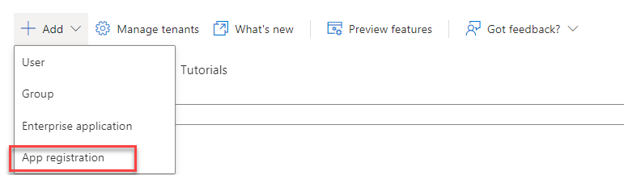

- Enter **Inspection Router** for **Name**, select **Accounts in this Organizational Directory Only** for **Supported** **Account Types**, and click **Register**.

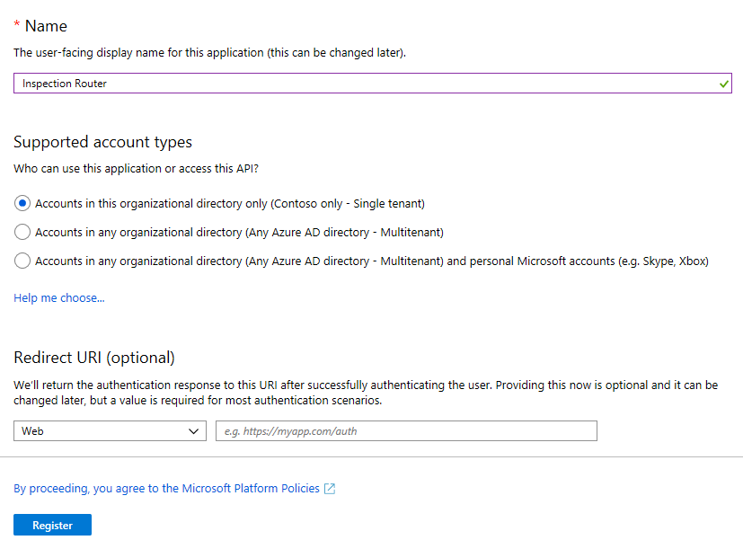

3. Add Client Secret. 

**Note**: In this lab we are using a secret, however, you can also use a certificate. With either of these options you need to have a plan in place to handle rollover when they expire to ensure that the app keeps running.

- Select **Certificates &amp; Secrets**.

- Click **+ New Client Secret**.

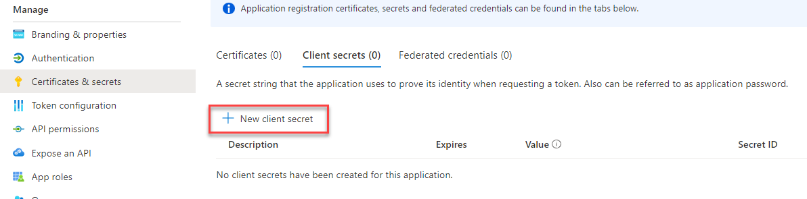

- Enter **Inspection Routing** for **Description** and click **Add**.

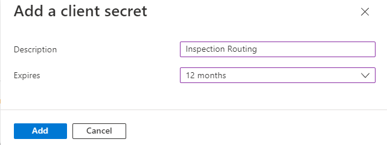

- Copy the **Value** and save it on a notepad. You need this value in future tasks.

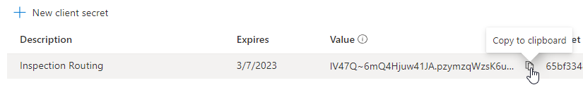

 

## Task #2: Create Application User and Security Role

In this task, you will create the application user and associate it with the Azure AD app that you just registered. You will also create a security role needed to run the routing logic. 

1. Navigate to security settings of your Dev environment

- Sign in to [Power Platform admin center](https://admin.powerplatform.microsoft.com/) 

- Select **Environments**.

- Select the **Dev** environment, click on the **… More Environment Actions** button and select **Settings**.

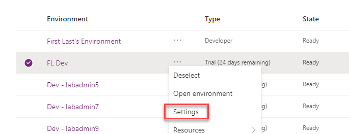

- Expand **Users + Permissions**.

- Select **Security Roles**.

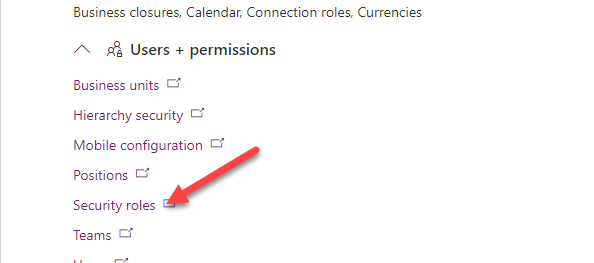

2. Create New Security Role

- Click **New role**.

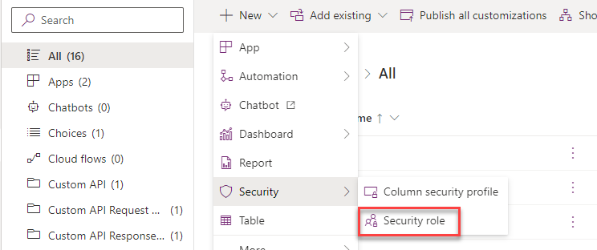

- Enter **Inspection Router** for **Role Name** and click **Save**.

- Select the **Business Management** tab.

- Locate the **User** Table and set **Read** and **Append To** privileges to **Organization**.

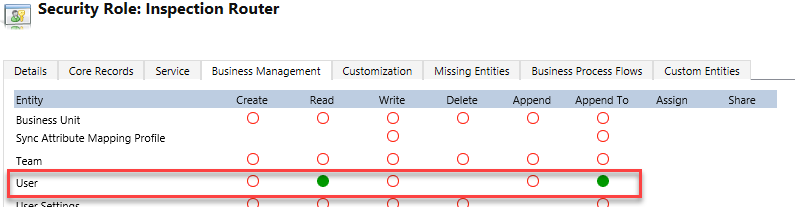

- Select the **Custom Tables** tab.

- Locate the **Inspection** Table and set **Read**, **Write**, **Append,** and **Assign** privileges to **Organization**.

- Click **Save and Close**.

- Close the **Security Roles** browser tab/window.

- Click on the browser back button.

3. Navigate to the Application User form

- Expand **Users + permissions** again.

- Click **Users**.

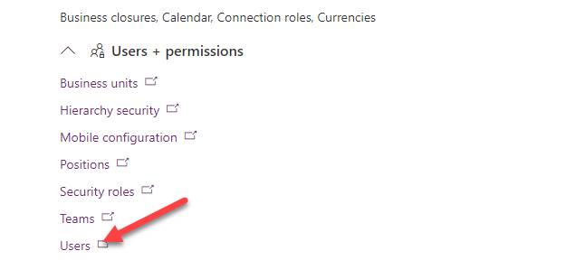

- Click **Manage users in Dynamics 365**.

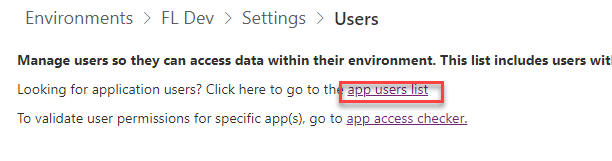

- Switch to the **Application Users** view.

- Click **+ New**.

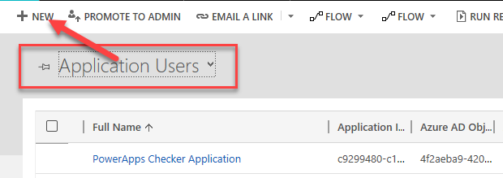

- Switch to the **Application User** form.

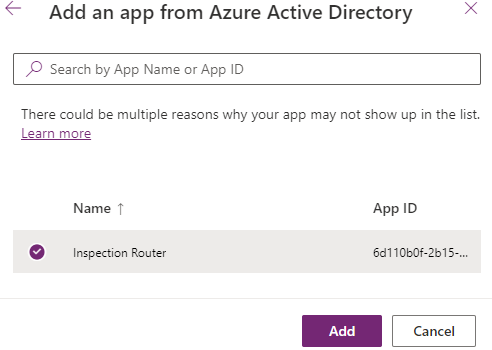

4. Create Application User.

- Click on the **Full Name** Column.

- Enter [InspectionRouter@Tenant.onmicrosoft.com](mailto:InspectionRouter@tenant.onmicrosoft.com) for User name, **Inspection** for **First Name**, **Router** for **Last Name**, enter [InspectionRouter@Tenant.onmicrosoft.com](mailto:InspectionRouter@tenant.onmicrosoft.com) for **Email**.

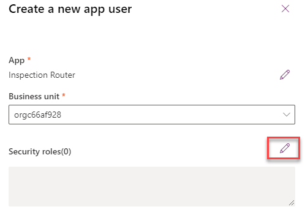

5. Copy App ID from Azure.

- Go back to your **Azure** portal.

- Select **Azure Active Directory**.

- Select **App Registrations** **| Owned applications**

- Click to open the registration you created.

- Copy the **Application (Client ID).**

6. Complete the Application User creation

- Paste the Application Id you copied.

- Click **Save**.

- The **Application ID URI** and **Azure AD Object ID** Columns should auto populate.

- Close the **User** form.

7. Assign the Inspection Router security role to the Application User you created

- Refresh the user view, select the user you create, and click **Manage Roles**.

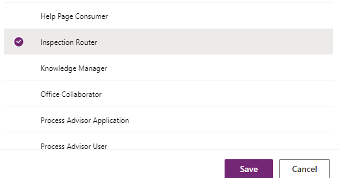

- Select **Inspection Router** and click **OK**.

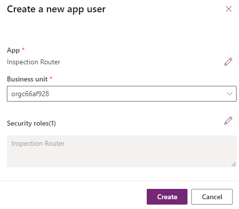

  
‎ 

# Exercise #2: Create Azure Function for Inspection Routing

**Objective:** In this exercise, you will create the Azure function that will route the inspections.

## Task #1: Create the Function

1. Create Azure Function project

- Start **Visual Studio**.

- Click **Create a New Project**.

- Select **Azure Functions** and click **Next**.

- Enter **InspectionManagementApp** for **Name** and click **Create**.

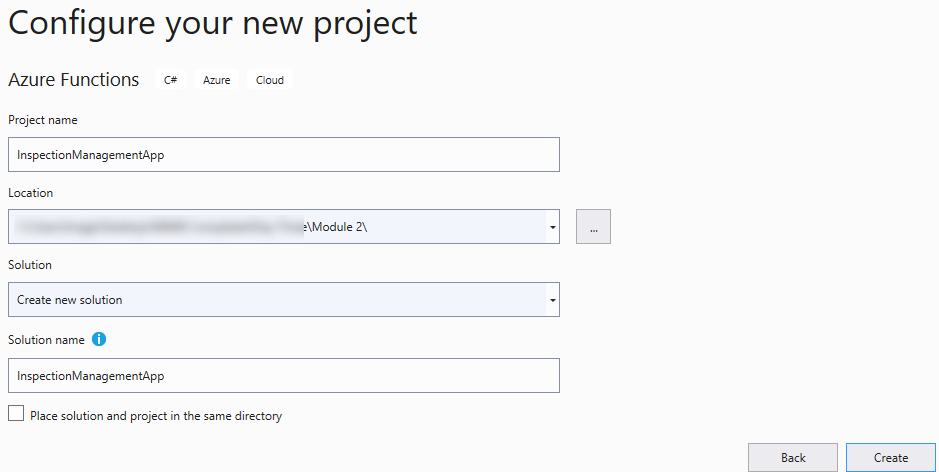

- Select **Azure Function V3 (.NET Core)** and select **Timer Trigger**.

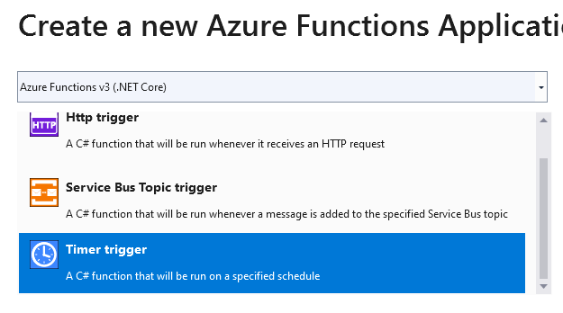

- Change the Schedule to **0 0 0** *** (Midnight Every Day) and click **Create**.

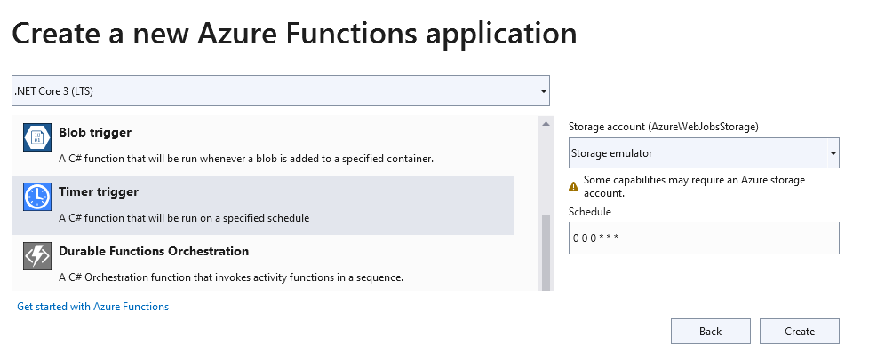

2. Rename and run the Function

- Rename the function file **InspectionRouter**.

- Change the function class and FunctionName to **InspectionRouter.**

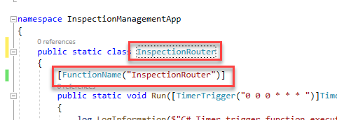

- Click **Run**.

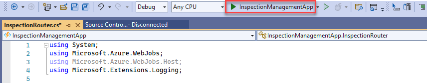

- You should see **Now Listening on:** [http://0.0.0.0:7071](http://0.0.0.0:7071/)

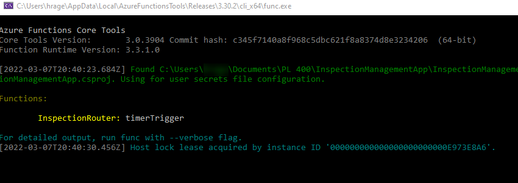

3. Trigger the function with Postman

- If you don’t have **Postman** installed, get it from here [Postman](https://www.getpostman.com/) and install it on your machine. Or you can use any similar tool of your preference that allows you to construct an HTTP POST request. 

- Start **Postman**.

- Select **POST** and paste the URL: [http://localhost:7071/admin/functions/InspectionRouter](http://localhost:7071/admin/functions/InspectionRouter) 

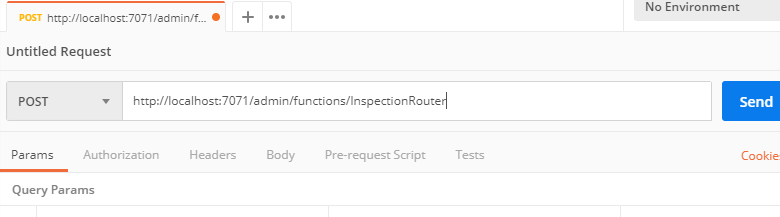

- Select the **Headers** tab.

- Add **Content-Type** and set it to **application/json**.

- Select the **Body** tab.

- Select **Raw** and set it to empty json **{}**.

- Click **Send**.

- You should get **202** **Accepted Status**.

- Go to the output console.

- The function should get triggered.

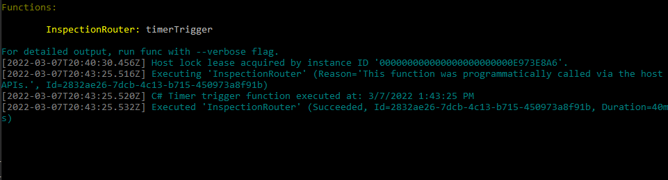

- Go back to **Visual Studio** and stop debugging.

4. Add NuGet packages

- Right Click on the project and select **Manage NuGet Packages**.

- Select the **Browse** tab and search for **Microsoft.IdentityModel.Clients.ActiveDirectory**.

- Select the latest stable version and click **Install**.

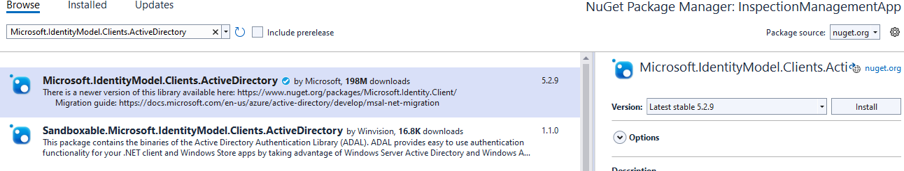

- Search for **Xrm.Tools.CrmWebAPI**. Note: This is a community library designed to work with the Microsoft Dataverse Web API. When you are building this type of extension you can use any oData V4 library you prefer. Make sure you select the one developed by DavidYack.

- Select the latest stable version and click **Install**.

- Close the **NuGet Package Manager**.

5. Edit the local settings file

- Click to open the **local.settings.json** file

- Add the **Values** below to **local.settings**

        "cdsurl": "",

        "cdsclientid": "",

        "cdsclientsecret": ""

- Find the Client Secret you saved in the notepad and paste as the cdsclientsecret.

6. Copy the App ID

- Go back to your **Azure** portal.

- Select **Azure Active Directory**.

- Select **App Registrations**.

- Click to open the registration you created.

- Copy the **Application (Client ID).**

- Go back to **Visual Studio** and paste the **Application ID** as the **cdsclientid**.

7. Find the your Microsoft Dataverse URL

- Sign in to [https://admin.powerplatform.microsoft.com](https://admin.powerplatform.microsoft.com/) 

- Select **Environments** and click to open the **Dev** environment.

- Copy the **Environment URL**.

- Go back to **Visual Studio** and paste the **URL** you copied as the **cdsurl**.

- Save and close the file.

8. Add using statements to the function class.

- Open the **InspectionRouter.cs** file

- Add the using statements below.

        using System.Threading.Tasks;
        using Xrm.Tools.WebAPI;
        using Microsoft.IdentityModel.Clients.ActiveDirectory;
        using Xrm.Tools.WebAPI.Results;
        using System.Dynamic;
        using Xrm.Tools.WebAPI.Requests;
        using System.Collections.Generic;

9. Create a method that will create the web API.

- Add the method below inside the class.

        private static async Task<CRMWebAPI> GetCRMWebAPI(ILogger log)
        {
        return null;
        }

- Add the local variables below before the return line on the **GetCRMWebAPI** method.

        var clientID = Environment.GetEnvironmentVariable("cdsclientid", EnvironmentVariableTarget.Process);
        var clientSecret = Environment.GetEnvironmentVariable("cdsclientsecret", EnvironmentVariableTarget.Process);
        var crmBaseUrl = Environment.GetEnvironmentVariable("cdsurl", EnvironmentVariableTarget.Process);
        var crmurl = crmBaseUrl + "/api/data/v9.0/";

- Create **Authentication Parameters**. 

        AuthenticationParameters ap = await AuthenticationParameters.CreateFromUrlAsync(new Uri(crmurl));

- Create **Client Credential** passing your **Client Id** and **Client Secret**.

        var clientcred = new ClientCredential(clientID, clientSecret);

- Get **Authentication** **Context**.

        // CreateFromUrlAsync returns endpoint while AuthenticationContext expects authority
        // workaround is to downgrade adal to v3.19 or to strip the tail
        var auth = ap.Authority.Replace("/oauth2/authorize", "");
        var authContext = new AuthenticationContext(auth);

- Get **Token**.

        var authenticationResult = await authContext.AcquireTokenAsync(crmBaseUrl, clientcred);

- Return the **web API**. Replace the return line with the code below.

        return new CRMWebAPI(crmurl, authenticationResult.AccessToken);

10. Test the web API you created

- Call the GetCRMWebAPI method. Add the code below to the Run method.

        CRMWebAPI api = GetCRMWebAPI(log).Result;

- Execute **WhoAmI** function and log the **User Id**.

        dynamic whoami = api.ExecuteFunction("WhoAmI").Result;
        log.LogInformation($"UserID: {whoami.UserId}");

11. Debug

- Click Run.

- Go back to **Postman** and click **Send**.

- Go to the output console.

- You should see the **User ID**.

Go back **Visual Studio** and stop debugging.

## Task #2: Get Inspections and Users and Assign Inspections

1. Create a method that will get all active inspections that are New Request or Pending, and scheduled for today

- Add the method below inside the class.

        private static Task<CRMGetListResult<ExpandoObject>> GetInspections(CRMWebAPI api)

        {

        return null;

        }

- Create **Fetch XML**. Add the code below before the return line of the GetInspections method. 

        var fetchxml = @"<fetch version=""1.0"" mapping=""logical"" >
        <entity name=""contoso_inspection"" >
        <attribute name=""contoso_inspectionid"" />
        <attribute name=""contoso_name"" />
        <attribute name=""ownerid"" />
        <attribute name=""contoso_inspectiontype"" />
        <attribute name=""contoso_sequence"" />
        <attribute name=""contoso_scheduleddate"" />
        <filter type=""and"" >
        <condition value=""0"" operator=""eq"" attribute=""statecode"" />
        <condition attribute=""contoso_scheduleddate"" operator=""today"" />
        <condition attribute=""statuscode"" operator=""in"" >
        <value>1</value>
        <value>463270000</value>
        </condition>
        </filter>
        </entity>
        </fetch>";

- Get the list of Inspections.

        var inspections = api.GetList<ExpandoObject>("contoso_inspections", QueryOptions: new CRMGetListOptions()
        {
        FetchXml = fetchxml
        });

- Return the Inspections. Replace the return line with the code below.

        return inspections;

2. Call the GetInspections method from the Run method.

- Go back to the **Run** method.

- Call the **GetInspections** method.

        var inspections = GetInspections(api).Result;

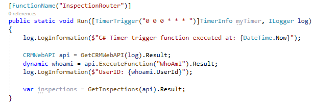

3. Create a method that will get all users.

- Add the method below inside the class.

        private static Task<CRMGetListResult<ExpandoObject>> GetUsers(CRMWebAPI api)
        {
        var users = api.GetList<ExpandoObject>("systemusers");
        return users;
        }

- Call the **GetUsers** method from the **Run** method.

        var users = GetUsers(api).Result;

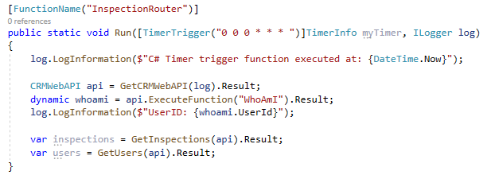

4. Create a method that will assign inspections to users

- Add the method below to the class.

        private static async Task<CRMUpdateResult> RouteInspection(CRMWebAPI api, dynamic inspection, string userId, int sequenceNumber)
        {
        dynamic updateObject = new ExpandoObject();
        ((IDictionary<string, object>)updateObject).Add
        ("ownerid@odata.bind", "/systemusers(" + userId + ")");
        updateObject.contoso_sequence = sequenceNumber.ToString();
        return await api.Update("contoso_inspections", new Guid(inspection.contoso_inspectionid), updateObject);
        }

5. Create two-digit random number.

- Add the code below to the Run method.

        Random rnd = new Random();
        int sequenceNumber = rnd.Next(10, 99);

6. Assign Inspections

- Go through the **Inspections** and call the **RouteInspection** method.

        int currentUserIndex = 0;
        foreach (dynamic inspection in inspections.List)
        {
        log.LogInformation($"Routing inspection {inspection.contoso_name}");
        var inspectionResult = new CRMUpdateResult();
        //Your record assignment would like this. We will not assign records to different users in this lab
        // if (users.List.Count > (currentUserIndex))
        //{
        // dynamic currentUser = users.List[currentUserIndex];
        // inspectionResult = RouteInspection(api, inspection, currentUser.systemuserid.ToString(), sequenceNumber).Result;
        //currentUserIndex++;
        //}
        }

- We will not assign inspection records to other users in this lab. **Comment** out the **if** statement you just added, and we will be replacing it with logic to do the routing to our user only.

- Assign inspections to the Inspection Router. Add the code below inside **foreach**.

        //We will instead assign inspections to the user you are currently logged in as
        inspectionResult = RouteInspection(api, inspection, whoami.UserId.ToString(), sequenceNumber).Result;

Build the project and make sure that the build succeeds.

  
‎ 

# Exercise #3: Publish and Test

**Objective:** In this exercise, you will publish the Azure function to Azure, update the app settings, and test the function.

 

## Task #1: Publish to Azure

1. Publish the function

- Right click on the project and select **Publish**.

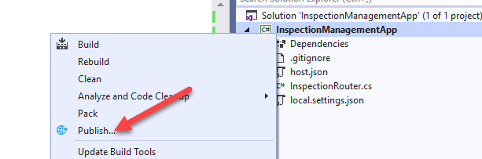

- Select **Create New** and click **Create Profile**.

- Make sure you are logged in to your correct **Azure** account, enter a unique name for **App Name**, create **New Resource Group**, create **New** **Azure Storage**, and click **Create**.

- Click **Publish**.

- Wait for the function application to be configured and published.

2. Open the function application settings

- Go back to you **Azure** portal.

- Select **All Resources**, search for **InspectionManagement**, and click to open the function you published.

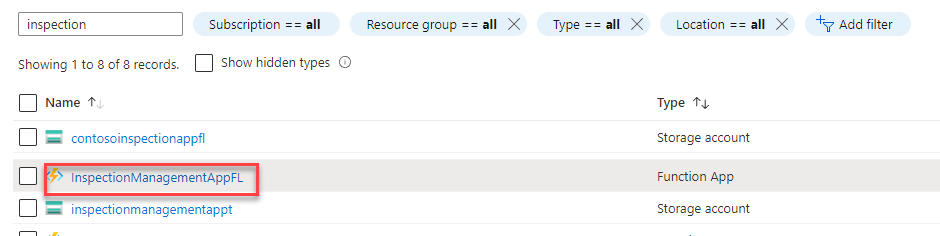

- Click scroll down to **Settings** and select **Configuration**.

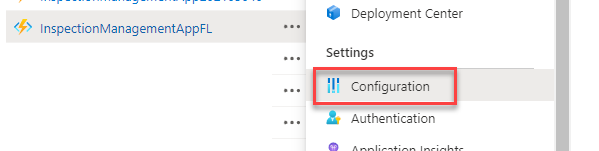

3. Update App Settings

- Click **Advanced Edit**.

- Paste the json below at the top of the settings.

        {

        "name": "cdsclientid",

        "value": "[clientid]",

        "slotSetting": false

        },

        {

        "name": "cdsclientsecret",

        "value": "[clientsecret]",

        "slotSetting": false

        },

        {

        "name": "cdsurl",

        "value": "[cdsurl]",

        "slotSetting": false

        },

- Go back to **Visual Studio** and open the **local.settings.json** file.

- You will copy the **cdsurl**, **cdsclientid**, and **cdsclientsecret**. Copy the **cdsurl** value.

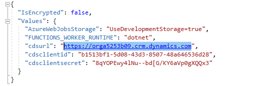

- Go back to **Azure** and replace **[cdsurl]** with the URL you copied.

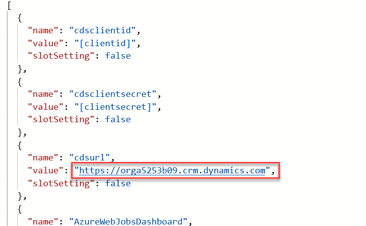

- Copy the **cdsclientid** and **cdsclientsecret** values from the **local.settings.json** file and replace [**cdsclientid**] and [**cdsclientsecret**].

- Click **OK**.

- Click **Save**.

- Click **Continue**.

- Select **Functions** and click to open the function you published.

- Select **Code + Test.**

4. Prepare test record

- Start a new browser window and sign in to [Power Apps maker portal](https://make.powerapps.com/) 

- Make sure you are in the **Dev** environment.

- Select **Apps** and click to open the **Permit Management** application.

- Click Settings and select **Personalization and** Settings.

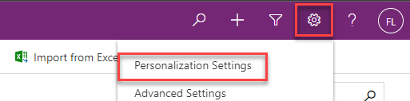

- Change the **Time Zone** to **(GMT-11:00) Coordinated Universal Time-11** and click **OK**. This will ensure the query results will produce the same results regardless of your time zone.

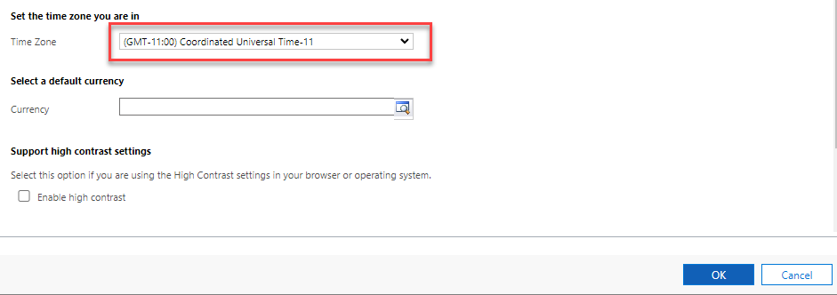

- Select **Inspections** and click to open one of the **Inspection** records or create a new record.

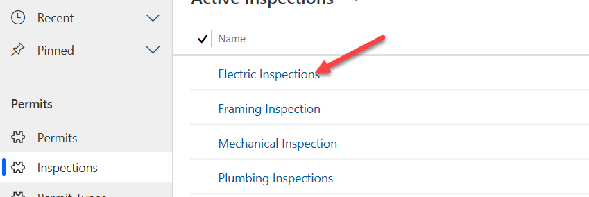

- Set the **Status Reason** to **New Request** or **Pending**, change the **Scheduled Date** to today’s date, and make a note of the current **Owner** of the record.

- Click **Save**.

5. Run the function

- Go to your **Azure** portal.

- Click **Test/Run.**

- Click **Run**.

- The function should run and succeed.

6. Confirm record assignment

- Go back to the **Permit Management** application.

- Click **Refresh**.

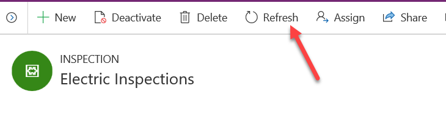

- The record **Owner** should now be the **Inspection Router**.

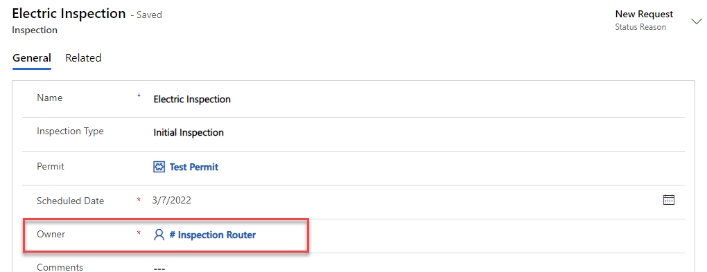

 

 

# Exercise #4: Promote to production

**Objective:** In this exercise, you will export the Permit Management solution form your Dev environment and import it into your Production environment. In this lab, you have added a security role to the solution that must be promoted.

## Task #1: Export Solution

1. Export Permit Management managed solution

- Sign in to [Power Apps maker portal](https://make.powerapps.com/) and make sure you are in the **Dev** environment.

- Select **Solution**.

- Select the **Permit Management** solution and click **Export**.

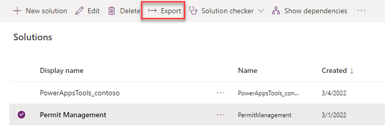

- Click **Publish** and wait for the publishing to complete.

- Click **Next**.

- Select **Managed** and click **Export**.

- Save the **Exported** solution on your machine.

2. Export Permit Management unmanaged solution

- Select **Solution** again.
- Select the **Permit Management** solution and click **Export**.
- Click **Next**.
- Select **Unmanaged, edit the version number to match the Managed solution** and click **Export**.

- Save the **Exported** solution in your machine.

## Task #2: Import Solution

1. Import Permit Management managed solution

- Sign in to [https://make.powerapps.com](https://make.powerapps.com/) and make sure you are in the **Prod** environment.

- Select **Solution**.

- Click **Import**.

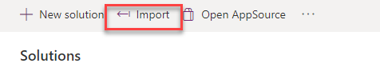

- Click **Choose file**.

- Select the **Managed** solution you exported and click **Open**.

- Click **Next**.

- Click **Next** again.

- Click **Import**.

- Wait for the import to complete and click **Close**.

- Review and test your production environment. 
