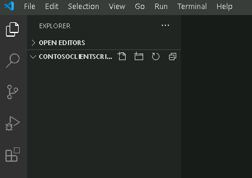
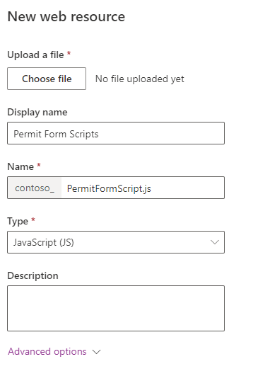
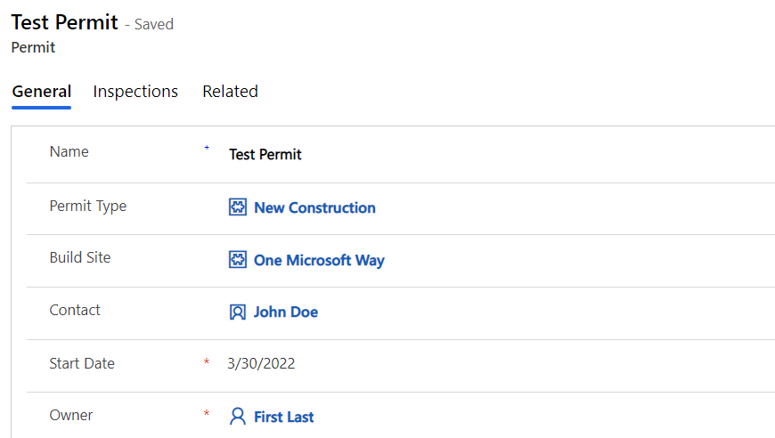
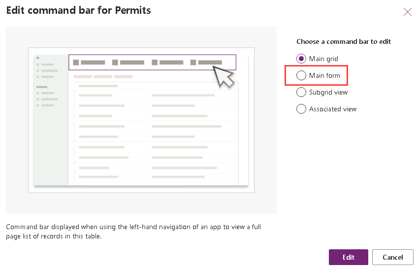
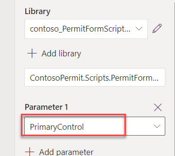
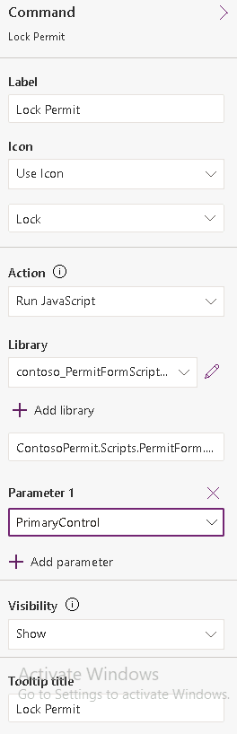

---
lab:
    title: 'Lab 8: Client scripting'
    module: 'Module 6: Extending the model-driven apps user experience'
---

# Practice Lab 8 - Client scripting

## Scenario

In this lab, you will implement client-side logic that will use the web API to evaluate the permit type associated with the permit record and use the client scripting API to manipulate the form controls.

You will also customize the command bar to introduce a new lock permit button that will invoke a custom API to perform the lock permit logic. The server-side logic for the lock permit custom API will be implemented later in the course. Right now, you will just add the button and the logic to invoke the custom API.

## High-level lab steps

As part of building the client-side logic, you will complete the following:

- Setup a folder to contain your client script
- Upload and register the client script on the form
- Build logic to use the web API to retrieve the permit type record associated with the permit
- Build logic based on the permit type settings to hide and show the inspections tab on the form
- Build logic to set columns as required/not required based on the permit type settings
- Modify the command bar
- Build logic to invoke the lock permit custom API when the command bar button is selected

## Things to consider before you begin

- Are there alternative designs that would be viable and not require code?
- Remember to continue working in your DEVELOPMENT environment. We will move everything to production soon.

## Starter solution

A starter solution file for this lab can be found in the  C:\Labfiles\L08\Starter folder.

## Completed solution

Completed solution files for this lab can be found in the  C:\Labfiles\L08\Completed folder.

## Resources

Complete code files for this lab can be found in the  C:\Labfiles\L08\Resources folder.

## Exercise 1: Prepare and load resources

**Objective:** In this exercise, you will create, organize, and load your JavaScript web resources.

### Task 1.1: Use Visual Studio Code to create resources

In this task, you will set up a folder to contain the JavaScript web resource files in this course.

1. Create a folder named named **ContosoClientScripts** for the JavaScript code.

   - Open a Command Prompt.
   - Run the following commands.

   ```dos
   cd C:\LabFiles\L08
   mkdir ContosoClientScripts
   cd ContosoClientScripts
   ```

    

1. Launch **Visual Studio Code**.

   - Run the following command.

   ```dos
   code .
   ```

   

1. Create folder for form scripts.

   - Hover over the folder and select **New Folder**.

    

   - Name the new folder as `FormScripts` and **Enter**.

    

1. Create the file for the JavaScript form script.

   - Right click on the **FormScripts** folder and select **New File**.

     

   - Name the new file as `PermitFormFunctions.js` and **Enter**.

     

   - Add the below namespaces to the newly created **PermitFormFunctions** file.

     ```javascript
     if (typeof (ContosoPermit) == "undefined")
     {var ContosoPermit = {__namespace: true};}
     if (typeof (ContosoPermit.Scripts) == "undefined")
     {ContosoPermit.Scripts = {__namespace: true};}
     ```

     > [!IMPORTANT]
     > When copying and pasting code into Visual Studio Code, Intellisense may add or replace code. You should open Notepad and paste into Notepad first, and then copy and paste into Visual Studio Code.

     

   - Add the function below after adding the namespaces.

     ```javascript
     ContosoPermit.Scripts.PermitForm = {

        __namespace: true
     }
     ```

       

### Task 1.2: Add Event Handlers

In this task, you will create functions for the logic that you will be implementing. This will allow you to register the event handlers in the next tasks for calling these functions and performing few basic tests in the upcoming tasks.

1. Add a function for the OnLoad event.

   - Add the function below to the **PermitFormFunctions.js** file at the top of the *ContosoPermit.Scripts.PermitForm* function created in the previous task.

      ```javascript
      handleOnLoad: function (executionContext) {
         console.log('on load - permit form');
      },
      ```

     

1. Add a function for the OnChange permit type event.

   - Add the function below to the **PermitFormFunctions.js** file inside the *ContosoPermit.Scripts.PermitForm* function.

      ```javascript
      handleOnChangePermitType: function (executionContext) {
          console.log('on change - permit type');
      },
      ```

     

1. Select **File** and **Save All**.

### Task 1.3: Load Web Resources

In this task, you will upload the JavaScript file as a web resource.You will also edit the Permit table main form and associate the new web resource with its form. Finally, you will register your functions to be called on specific form events.

1. Open the Permit Management solution.

   - Navigate to the [Power Apps maker portal](https://make.powerapps.com/)
   - Select your **Development** environment.
   - Select **Solutions**.
   - Open the **Permit Management** solution.

1. Create web resource.

   - Select **+ New**.

   - Select **More** and then select **Web Resource**.

    

   - Enter `Permit Form Scripts` for **Display name**.

   - Enter `PermitFormScripts.js` for **Name**.

   - Select **JavaScript (JS)** for **Type**.

   - Select **Choose file**.

     

   - Browse to the **ContosoClientScripts** folder and then to the **FormScripts** folder.

   - Select the **PermitFormFunctions.js** file and select **Open**.

     

   - Select **Save**.

1. Add the JavaScript library to the Permit main form.

   - In the Objects tab of the solution, expand **Tables**.

   - Expand the **Permit** table.

   - Select **Forms**.

   - Select the **Main** form.

   - Select the ellipses **...** for the **Main** form, select **Edit** and select **Edit in new tab**.

   - Go to the **Properties** pane and select the **Events** tab.

     

   - Select **+ Add library**.

   - Search for `contoso`, select **Permit Form Scripts** and select **Add**.

     

1. Add OnLoad event handler.

   - Expand the **OnLoad** section and select **+ Event Handler**.

     

   - Select **Contoso_PermitFormScripts.js** in the dropdown for **Library**.

   - Enter `ContosoPermit.Scripts.PermitForm.handleOnLoad` in the textbox for **Function**.

   - Check the **Pass execution context as first parameter** checkbox.

   - Select **Done**.

     

1. Add Permit Type OnChange event handler.

   - Select **Permit Type** field on the form.

     

   - Go to the **Properties** pane and select the **Events** tab.
  
   - In the On Change section, select **+ Event Handler**

    

   - Select **Contoso_PermitFormScripts.js** in the dropdown for **Library**.

   - Enter `ContosoPermit.Scripts.PermitForm.handleOnChangePermitType` in the textbox for **Function**.

   - Check the **Pass execution context as first parameter** checkbox.

   - Select **Done**.

     

1. Save and publish your changes.

   - Select **Save and publish**.
   - Close the form editor tab.
   - Select **Done**.

### Task 1.4: Test Event Handlers

In this task, you will test the event handlers.

1. Start the Permit Management app.

   - In the Objects tab of the solution, select the **Apps** node.
   - Select the **Permit Management** app, select the **ellipses (...)** and select **Play**.

     

1. Open a Permit record

   - Select **Permits**.

   - Select to edit a permit record.

     

1. Open browser Dev Tools.

   - Press **F12** or right click and select **Inspect**.

   - Select the **Console** tab in the top menu and select the **Clear console** icon.

     

1. Confirm the OnLoad event handler function runs.

   - In the **Permit** record form, select the **Refresh** cion.

   - In the **Dev Tools** pane you should see the **on load – permit form** message.

     

1. Confirm the OnChange Permit Type event handler function runs.

   - In the **Permit** record form, clear the **Permit Type** field.

     

   - In the **Dev Tools** pane you should see the **on change – permit type** message.

     

   - Close the **Dev Tools** pane.

   - In the **Permit** record form, select **Save & Close**.

## Exercise 2: Show and hide tabs

**Objective:** In this exercise, you will create a script that will show and hide the Inspections tab based on the value of the permit type table's *Required inspections* column.

### Task 2.1: Create Function for Permit Type changes

1. Create a function that will run when the Permit form loads and when the Permit Type value changes.

   - Open **Visual Studio Code**.

   - Add the function below to the **PermitFormFunctions.js** file inside the *ContosoPermit.Scripts.PermitForm* function.

      ```javascript
      _handlePermitTypeSettings: function (executionContext) {


      },
      ```

     

1. Get form context from the execution context

   - Add the script below inside the **_handlePermitTypeSettings** function.

      ```javascript
      var formContext = executionContext.getFormContext(); 
      ```

1. Get the Permit Type value.

   - Add the script below inside the **_handlePermitTypeSettings** function.

      ```javascript
      var permitType = formContext.getAttribute("contoso_permittype").getValue();
      ```

     > [!NOTE]
     > contoso_permittype is the logical name of the Permit Type column. You can verify this in the Power Apps maker portal.

1. Check if the Permit Type has a value.

   - Add the script below inside the **_handlePermitTypeSettings** function.

      ```javascript
      if (permitType == null) {

      } else {
            
      }
      ```

     

1. Hide the Inspections tab if the Permit type is null.

   - Add the script below inside the if statement in the **_handlePermitTypeSettings** function.

      ```javascript
      formContext.ui.tabs.get("inspectionsTab").setVisible(false);
      return;
      ```

     > [!NOTE]
     > inspectionsTab is the name of the Inspections tab configured while creating the model-driven app in an earlier lab.

    

### Task 2.2: Get Inspection type record

In this task, you will use the Web API to retrieve the permit type lookup record associated with the current permit record that is currently displayed in the form.

1. Get the Permit Type ID

   - Add the script below inside the else statement in the **_handlePermitTypeSettings** function.

      ```javascript
      var permitTypeID = permitType[0].id;
      ```

1. Retrieve the Permit Type record and show alert if there are errors

   - Add the script below in the else statement of the **_handlePermitTypeSettings** function.

      ```javascript
      Xrm.WebApi.retrieveRecord("contoso_permittype", permitTypeID).then(function (result) {

      },

          function (error) { alert('Error:' + error.message) });
      ```

     > [!NOTE]
     > contoso_permittype is the logical name of the Permit Type table. You can verify this in the Power Apps maker portal.

     

1. Check if **Require Inspections** column value is true.

    - Add the script below inside the **retrieveRecord** function call.

      ```javascript
      if (result.contoso_requireinspections) {

      } else {

      }
      ```

     > [!NOTE]
     > contoso_requireinspections is the logical name of the Require Inspections column of the Permit Type table.

1. Make the Inspections tab visible if Require Inspections is true

   - Add the script below in the if statement in the **retrieveRecord** call.

      ```javascript
      formContext.ui.tabs.get("inspectionsTab").setVisible(true);
      ```

1. Hide the Inspections tab if Require Inspections is not true

   - Add the script below in the else statement in the **retrieveRecord** call.

      ```javascript
      formContext.ui.tabs.get("inspectionsTab").setVisible(false);
      ```

      

1. Call the _handlePermitTypeSettings function from the handleOnLoad function.

   - In the **handleOnLoad** function and add the script below.

      ```javascript
      ContosoPermit.Scripts.PermitForm._handlePermitTypeSettings(executionContext);
      ```

1. Call the _handlePermitTypeSettings function from the handleOnChangePermitType function.

   - In the **handleOnChangePermitType** function and add the script below.

      ```javascript
      ContosoPermit.Scripts.PermitForm._handlePermitTypeSettings(executionContext);
      ```

     

   - Select **File** and **Save All**.

### Task 2.3: Load Updated Script

1. Open the Permit Form Script web resource.

   - Navigate to the [Power Apps maker portal](https://make.powerapps.com/)
   - Select your **Development** environment.
   - Select **Solutions**.
   - Open the **Permit Management** solution.
   - Select **Web resources**.
   - Edit the **Permit Form Script** web resource.

    

1. Load the updated version of PermitFormFunction.js.

   - Select **Choose file**.
   - Select the **PermitFormFunctions.js** file and select **Open**.
   - Select **Save**. The Edit web resource pane will close.
   - With the Perform Form Scripts web resources still selected, select **Publish** in the action bar.
  
### Task 2.4: Test Your Changes

1. Start the Permit Management app.

   - In the Objects tab of the solution, select the **Apps** node.
   - Select the **Permit Management** app, select the **ellipses (...)** and select **Play**.

     

1. Open a Permit record.

   - Select **Permits**.

   - Select to edit a permit record.

     

1. Check that when the **Permit Type** column is empty, the **Inspections** tab is hidden.

     

   > [!NOTE]
   > If the Inspection tab is not hidden, refresh your browser.

1. Select Permit Type.

   - Select the **Permit Type** lookup.

   - Select **New Construction**.

   - Check that the **Inspections** tab is still hidden. This is because the value of the *Require Inspections* column on the Permit Type table is No.

    

1. Set **Require Inspections** column value of the **Permit Type** to **Yes**.

   - Open the **New Construction** record by clicking in the Permit Type lookup field.

      

   - Set **Require Inspections** to **Yes**.

     

   - Select **Save & Close**.

1. You should now be able to see the Inspections tab.

     

   - Select the **Inspections** tab.

   - You should now be able to the view inspections in the sub-grid.

     

## Exercise 3: Toggle required property on the columns

**Objective:** In this exercise, you will create a script that will make the *New Size* column business required when the *Require Size* column value is set to Yes. If the *Require Size* column value is set to No, remove the requirement. You will also hide the *New Size* column. This logic will be driven by a column on the permit type record that was retrieved using the Web API in the previous exercise.

### Task 3.1: Add script to control fields

1. When Permit Type is not selected, remove the column's requirement and hide the New Size column.

   - Open **Visual Studio Code**.

   - Add the script below inside the **if permitType == null** statement.

      ```javascript
      formContext.getAttribute("contoso_newsize").setRequiredLevel("none");
      formContext.ui.controls.get("contoso_newsize").setVisible(false);
      ```

     > [!NOTE]
     > contoso_newsize is the logical name of the New Size column.

     

1. When Permit Type is selected, check if the value of the *Require Size* column value of the Permit Type is set to Yes.

   - Add the script below inside the **retrieveRecord** function.

      ```javascript
      if (result.contoso_requiresize) {

      } else {

      }
      ```

     

1. If the value of the *Require Size* column of the Permit Type is set to Yes, make the *New Size* column visible and required.

   - Add the script below in the **if result.contoso_requiresize** statement.

      ```javascript
      formContext.ui.controls.get("contoso_newsize").setVisible(true);
      formContext.getAttribute("contoso_newsize").setRequiredLevel("required");
      ```

     > [!NOTE]
     >  contoso_requiresize is the logical name of the Require Size column.

     

1. If the value of the *Require Size* column of the Permit Type is not set to Yes, make the *New Size* column not required and hide it.

   - Add the script below inside the else statement.

      ```javascript
      formContext.getAttribute("contoso_newsize").setRequiredLevel("none");
      formContext.ui.controls.get("contoso_newsize").setVisible(false);
      ```

     

1. The **_handlePermitTypeSettings** function should now look like the image below.

     

1. Select **File** and then **Save All**.

### Task 3.2: Load Updated Script

1. Open the Permit Form Script web resource.

   - Navigate to the [Power Apps maker portal](https://make.powerapps.com/)
   - Select your **Development** environment.
   - Select **Solutions**.
   - Open the **Permit Management** solution.
   - Select **Web resources**.
   - Edit the **Permit Form Script** web resource.

1. Load the updated version of PermitFormFunction.js.

   - Select **Choose file**.
   - Select the **PermitFormFunctions.js** file and select **Open**.
   - Select **Save**. The Edit web resource pane will close.
   - With the Perform Form Scripts web resources still selected, select **Publish** in the action bar.

### Task 3.3: Test Your Changes

1. Start the Permit Management app.

   - In the Objects tab of the solution, select the **Apps** node.
   - Select the **Permit Management** app, select the **ellipses (...)** and select **Play**.

1. Open a Permit record.

   - Select **Permits**.

   - Select to edit a permit record.

1. Check that the **New Size** column is hidden. This is because the value of the *Require Size* column on the Permit Type table is No.

     

   > [!NOTE]
   > If the New Size column is not hidden, refresh your browser.

1. Set **Require Size** column value of the **Permit Type** to **Yes**.

   - Open the **New Construction** record by clicking in the Permit Type lookup field.

     

   - Set **Require Size** to **Yes**.

     

   - Select **Save & Close**.

   - You should now be able to see the **New Size** column on the form and it is a required field.

     

1. Change Permit Type.

   - In the **Permit** record form, clear the **Permit Type** field.

     

   - Both the **Inspections** tab and **New Size** column should be hidden. They should be removed as soon as the *Permit Type* is removed.

     

   - Select the **Permit Type** lookup and select **New Construction**.

   - Enter `1000` for **New Size**.

   - Select **Save & Close**.

## Exercise 4: Command Button Function

**Objective:** In this exercise, you will you will create custom API, create a function that will lock permits, add a button to the permit table and call the lock permit function when the button is selected.

### Task 4.1: Create Custom API

In this task, you will create a custom API that will be called to lock the permit. You will not be implementing the business logic that will lock the permit in this lab. It will be completed later in the class when you build the plug-in that registers on the custom api you are defining here.

1. Open the Permit Management solution.

   - Navigate to the [Power Apps maker portal](https://make.powerapps.com/)
   - Select your **Development** environment.
   - Select **Solutions**.
   - Open the **Permit Management** solution.

1. Create Custom API.

   - Select **+ New** and then select **More** and then **Other** and then **Custom API**.

     

   - Enter the following:
      - `contoso_LockPermit` for Unique name.
      - `Lock Permit` for Name.
      - `Lock Permit` for Display name.
      - `Lock Permit` for Description.
   - Select **Entity** for Binding type.
   - Enter `contoso_permit` for Bound Entity Logical Name.

    
  
   - Select **Save & Close**.
   - Select **Done**.
  
1. Create custom API Request Parameter.

   - Select **+ New** and then select **More** and **Other** and **Custom API Request Parameter**.

     

   - Search for `lock` and select **Lock Permit** for Custom API.
   - Enter the following:
      - `Reason` for Unique name.
      - `Reason` for Name.
      - `Reason` Display name.
      - `Reason` for Description.
   - Select **String** for Type

     

   - Select **Save & Close**.
   - Select **Done**.

1. Create Custom API Response Property.

   - Select **+ New** and then select **More** and **Other** and **Custom API Response Property**.

   - Search for `lock` and select **Lock Permit** for Custom API.
   - Enter the following:
      - **CanceledInspectionsCount** for Unique name.
      - **Canceled Inspections Count** for Name.
      - **Canceled Inspections Count** for Display name.
      - **Canceled Inspections Count** for Description.
   - Select **Integer** for Type
   - Select **Save and Close**.

     

   - Select **Save and Close**.
   - Select **Done**.

### Task 4.2: Create the function for the Lock Permit button

In this task, you will create the logic to invoke that will call the custom API.

1. Start Visual Studio Code and open the resources you created earlier in the lab.

   - Open **Visual Studio Code**.
   - Open the **ContosoClientScripts** folder.

     

1. Add a function to build the Custom API request

   - Open the **PermitFormFunctions.js** file.

     

   - Add the function below after the **_handlePermitTypeSettings** function.

      ```javascript
      _lockPermitRequest : function (permitID, reason) {

      },
      ```

      

1. Build entity and set reason.

   - Add the script below inside the **_lockPermitRequest** function.

      ```javascript
      this.entity = { entityType: "contoso_permit", id: permitID };
      this.Reason = reason;
      ```

1. Build and return the request.

   - Add the script below inside the **_lockPermitRequest** function.

      ```javascript
      this.getMetadata = function () {
          return {
              boundParameter: "entity", parameterTypes: {
                  "entity": {
                      typeName: "mscrm.contoso_permit",
                      structuralProperty: 5
                  },
                  "Reason": {
                      "typeName": "Edm.String",
                      "structuralProperty": 1 // Primitive Type
                  }
              },
              operationType: 0, // This is an action. Use '1' for functions and '2' for CRUD
              operationName: "contoso_LockPermit",
          };
      };
      ```

     

1. Add the function that will be called from the action button.

   - Add the function below after the **_lockPermitRequest** function.

      ```javascript
      lockPermit: function (primaryControl) {

      },
      ```

     

1. Get Permit ID and call **_lockPermitRequest**.

   - Get the id by adding the script below inside the **lockPermit** function.

      ```javascript
      formContext = primaryControl;
      var PermitID = formContext.data.entity.getId().replace('{', '').replace('}', '');
      ```

   - Call **_lockPermitRequest**. Note: we are hard-coding the reason as `Admin Lock`.

      ```javascript
      var lockPermitRequest = new ContosoPermit.Scripts.PermitForm._lockPermitRequest(PermitID, "Admin Lock");
      ```

1. Execute the request.

   - Add the script below inside the lockPermit function.

      ```javascript
      // Use the request object to execute the function
      Xrm.WebApi.online.execute(lockPermitRequest).then(
          function (result) {
              if (result.ok) {
                  console.log("Status: %s %s", result.status, result.statusText);
                  // perform other operations as required;
                  formContext.ui.setFormNotification("Status " + result.status, "INFORMATION");
              }
          },
          function (error) {
              console.log(error.message);
              // handle error conditions
          }
      );
      ```

     

   - Select **File** and then **Save All**.

### Task 4.3: Load Updated Script

1. Open the Permit Form Script web resource.

   - Navigate to the [Power Apps maker portal](https://make.powerapps.com/)
   - Select your **Development** environment.
   - Select **Solutions**.
   - Open the **Permit Management** solution.
   - Select **Web resources**.
   - Edit the **Permit Form Script** web resource.

1. Load the updated version of PermitFormFunction.js.

   - Select **Choose file**.
   - Select the **PermitFormFunctions.js** file and select **Open**.
   - Select **Save**. The Edit web resource pane will close.
   - With the Perform Form Scripts web resources still selected, select **Publish** in the action bar.

### Task 4.4: Add Button to Command Bar

1. Open the Permit Management solution.

   - Navigate to the [Power Apps maker portal](https://make.powerapps.com/)
   - Select your **Development** environment.
   - Select **Solutions**.
   - Open the **Permit Management** solution.

1. Edit the Permit Management app

   - In the Objects tab of the solution, select the **Apps** node.
   - Select the **Permit Management** app, select the **ellipses (...)** and select **Edit** and select **Edit in new tab**.

     

1. Edit the Permit table command bar.

   - Select the **Pages** tab, Hover over **Permit** and select the **...** button.
  
     

   - Select **Edit command bar**.

     

   - Select **Main form** and then select **Edit**.

     

1. Add command to permit table

   - Select **+ New** and then select **Command**.

    

   - Select **JavaScript** and then select **Continue**.

1. Configure command bar button

   - Enter `Lock Permit` for Label.

   - Select **Use Icon** for Icon and then Select the **Lock** icon.

   - Select **Run JavaScript** for Action.

   - Select **+ Add library**.

     

   - Search for `contoso`, select **Permit Form Scripts** and select **Add**.

     

   - Enter `ContosoPermit.Scripts.PermitForm.lockPermit` in the textbox for **Function Name**.

     

   - Add parameter.

     

   - Select **PrimaryControl** for Parameter 1.

     

   - Enter `Lock Permit` for Tooltip title.

     

   - The Lock Permit command should look like the following.

     

   - Select **Save and Publish**.

   - Close the app designer.

   - Select **Done**.

   - In the **Objects** pane, select **All**.

   - Select **Publish all customizations**.

### Task 4.5: Test Command Button

1. Start the Permit Management app.

   - In the Objects tab of the solution, select the **Apps** node.
   - Select the **Permit Management** app, select the **ellipses (...)** and select **Play**.

1. Open a Permit record.

   - Select **Permits**.

   - Select to edit a permit record.

   - You should be able to see the button you just added.

     

   > [!NOTE]
   > If the button is not displayed, refresh your browser.

1. Test the command

   - Select the **Lock Permit** button.

   - The script should trigger the action and you should be able to see the Status 200 notification.

     
