---
lab:
    title: 'Lab 08: Power Apps Component Framework'
---

## Lab 05 – Power Apps Component Framework

# Scenario

A regional building department issues and tracks permits for new buildings and updates for remodeling of existing buildings. Throughout this course you will build applications and automation to enable the regional building department to manage the permitting process. This will be an end-to-end solution which will help you understand the overall process flow.

In this lab you will develop a custom component control using the Power Apps Component Framework (PCF). This component will be used to visualize the permit inspection history timeline. As you build the component, you will see how to use prescriptive interfaces of the framework to interact with the hosting form data. To speed things up we will use a community timeline library to render the visualization. When you build such controls, you can either follow the same procedure or use popular frameworks like React or Vue to completely control the visualization that the component will render.

# High-level lab steps

As part of building this component, you will complete the following steps:

- Use the Power Apps CLI to initialize the new component

- Build the component logic using Typescript

- Publish the component for use on forms

- Configure the permit form to use the component 

This is what the component will look like when it is completed.

 

 

## Things to consider before you begin

- What are the advantages of using a Power Apps Component Framework component over an embedded Power Apps canvas app?

- Remember to continue working in your DEVELOPMENT environment. We’ll move everything to production soon.

  
‎ 

# Exercise #1: Create the PCF Control

**Objective:** In this exercise, you will create a Power Apps Components Framework control using the Power Apps CLI 

 

## Task #1: Install Microsoft Power Apps CLI and Prerequisites

1. Install Node.js

	- Navigate to [Node JS](https://nodejs.org/en/) 

	- Select the latest **LTS** version.

    

	- Open the downloaded file.

	- Follow the steps in setup wizard to complete installing **Node.js**

2. Install .NET Framework 4.6.2 Developer Pack

	- Navigate to [Download .NET Framework 4.6.2](https://dotnet.microsoft.com/download/dotnet-framework/net462) 

	- Select the **Developer Pack**.

    

	- Run the downloaded file.
  
	- Follow the steps in setup wizard to complete installing the **Developer Pack.**

## Task #2: Setup Components Project

1. Start the developer command prompt tool

	- Launch to start the **developer command prompt** from the start menu.

    

2. Create a new folder in your Documents folder and work in that directory

	- Run the command mentioned below to change directory. Replace **[Computer User Name]** with your OS user name.

            cd C:\Users\[Computer User Name]\Documents

	- Run the command mentioned below to create a new folder with name **pcfTimelineControl**.

            mkdir pcfTimelineControl

	- Run the command mentioned below to switch to the **pcfTimelineControl** folder.

            cd pcfTimelineControl

    

3. Create a new folder in the **pcfTimelineControl** folder, name it **src**, and work in that directory

	- Create a new folder with the name **src**, by running the command below.

            mkdir src

	- Run the command below to switch to the **src** folder you just created.

            cd src

	- Clear the screen by running the command below.

            cls

4. Install the latest Power Apps CLI, create a solution project with the name **timelinecontrol**, namespace **contoso**, and template **dataset**

	- Install latest **Power Apps CLI** version. Use: [https://aka.ms/PowerAppsCLI](https://aka.ms/PowerAppsCLI)
	
	
	**Note:** if you just installed the tools, you already have the latest, however, you can run this command anytime to ensure you are always up to date.
	
	**Note:** If you get an error that npm is not a recognized command, you will need to re-run the nodejs installer and make sure to choose **Chocolatry**. This will run a PowerShell script as part of the install which may have been missed during the first install attempt.

         pac install latest

	- Initialize the component. This command will create a set of files that will implement a dataset component. You will customize these files as we continue.

            pac pcf init --name timelinecontrol --namespace contoso --template dataset

	- Install dependencies by running **npm install** command in the Terminal

            npm install

	- Wait for the dependency installation to complete.

5. Open the **src** folder in Visual Studio Code and review the generated resources

	- Open the **src** folder in **Visual Studio Code**. For this to work, make sure that the Visual Studio Code is added to Path in Environment Variables.

            code .

	- **Visual Studio Code** should start, and it should open the **src** folder.

    

	- Expand the **timelinecontrol** folder.

	- Open the **ControlManifest.Input** xml file and examine it.

     

	- Open the **Index.ts** file and examine it.

	- Expand the **generated** folder.

	- Open the **ManifestTypes** file and examine it.

6. Open CLI in visual studio code

	- Select **Terminal** and select **New Terminal**. If Terminal is not visible in the menu, you can open it by selecting View -> Integrated Terminal.

    

	- If **cmd** isn’t your **Default Shell**, select the arrow and then select **Select Default Shell**. 

    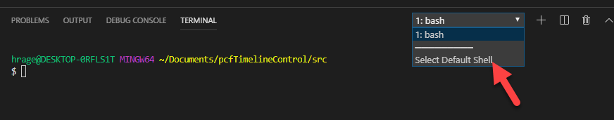

	- Select **Command Prompt**.

    

	- Select **New Terminal**.

    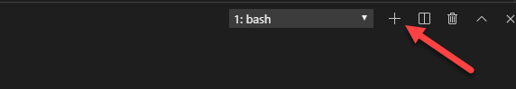

	- The **cmd** terminal should now open.

    

7. Run the Build command and review the out folder

	- Run **npm** **build** in the terminal

            npm run build

	**Note:** if you experience an error, try to modify your .eslintrc.json and include the rules as follows:

			"rules": {
			"no-unused-vars": "off",
			"no-undef" : "off"
			}
					
	- You should now be able to see the out folder. Expand the folder and review its content.

    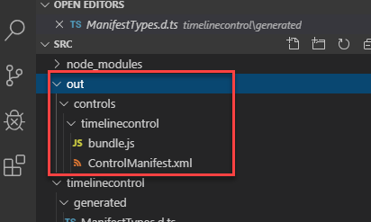

8. Run the Start command to start the test harness

	- Run **npm** **start** in the terminal

            npm start

	- This should open the Test Environment in a browser window.

    

	- The **Component** container size should change, if you provide **Width** and **Height**.

    

9. Stop the test harness

	- Close the **Test Environment** browser window or tab.

	- Go back to **Visual Studio Code**.

	- Click on the **Terminal** and press the **[CONTROL]** key and **c**.

	- Type **y** and **[ENTER].**

    

10. Create a new solution folder in the parent of the **src** folder **pcfTimelineControl** and switch to it

	- Change directory to the **pcfTimelineControl** folder.

            cd ..

	- You should now be in the **pcfTimelineControl** directory.

    

	- Create a new folder with the name **solution**.

            mkdir solution

	- Switch to the solution directory.

            cd solution

	- You should now be in the solution directory.

    

11. Create solution project and add reference of the **src** folder where the component is located to the solution. This configuration will be used when you are done with your development and ready to publish your component for others to use.

	- Create solution project with name and prefix contoso.

            pac solution init --publisher-name contoso --publisher-prefix contoso

	- Add component location to the solution. This creates a reference to include your component when the solution build command is run.

            pac solution add-reference --path ..\src

	- The project reference should be added successfully.

    

12. Build the solution

	- Make sure you are still in the solution folder.

	- Build the project by running the command below.

            msbuild /t:restore

	- The build should succeed.

    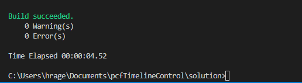

	> NOTE: If you get the response where 'msbuild' is not recognized as an internal or external command. This means that you run a normal command prompt instead of Visual Studio's developer command prompt.

## Task #3: Build the Basic Timeline

1. Change directory to the **src** folder

	- Change directory to the **src** folder.

            cd ..\src

2. Create **css** folder in the **timelinecontrol** folder and create **timelinecontrol.css** file in the **css** folder

	- Select the **timelinecoltrol** folder and then select **New Folder**.

    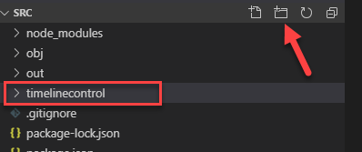

	- Name the folder **css**.

	- Select the **css** folder you created and then select **New File**.

    

	- Name the new file **timelinecontrol.css**.

3. Add the **css** as resource

	- Open the **ControlManifest.Input.xml** file.

	- Locate the **resources** sub element and uncomment the **css** tag, change the **Order** to **2**.

    

4. Change the data-set name to **timelineDataSet**.

	- Locate **sampleDataSet** tag and change the name property to **timelineDataSet**.

    

5. Install vis-timeline css npm package

	- Go to the **Terminal** and make sure you are in the **src** directory.

	- Run the command mentioned below and wait for the packages to be added.

            npm install vis-timeline

    

	- Run the command mentioned below and wait for the packages to be added.

            npm install moment

	- Run the command mentioned below and wait for the packages to be added.

            npm install vis-data

6. Add the vis-timeline css as a resource

	- Go back to the **ControlManifest.Input.xml** file.

	- Add the vis-timeline css inside the resources tag.

            <css path="..\node_modules\vis-timeline\dist\vis-timeline-graph2d.min.css" order="1" />

    

7. Add timeline element and visual properties to the Index file

	- Open the **Index.ts** file.

	- Add the properties below, inside the **export** class timelinecontrol function.

             private _timelineElm: HTMLDivElement;
             private _timelineVis : any;

    

	- Add the below constant after the import lines on the top.

            const vis = require('vis-timeline');

    

8. Build the timeline element as div and add it to container element as a child

	- Locate the **init** function.

	- Add the script mentioned below to the **init** function.

            this._timelineElm = document.createElement("div");

            container.appendChild(this._timelineElm);

    

9. Create a function that will render the timeline

	- Add the function below.

            private renderTimeline(): void {
                // Create a DataSet (allows two way data-binding)
                var items = [
                    { id: 1, content: 'item 1', start: '2020-08-20' },
                    { id: 2, content: 'item 2', start: '2020-08-14' },
                    { id: 3, content: 'item 3', start: '2020-08-18' },
                    { id: 4, content: 'item 4', start: '2020-08-16', end: '2020-08-19' },
                    { id: 5, content: 'item 5', start: '2020-08-25' },
                    { id: 6, content: 'item 6', start: '2020-08-27', type: 'point' }
                ];
                // Configuration for the Timeline
                var options = {};
                // Create a Timeline
                var timeline = new vis.Timeline(this._timelineElm, items, options);
            }

    

10. Call the **renderTimeline** function from the **updateView** function

	- Locate the **updateView** function.

	- Add the script mentioned below inside the **updateView** function.

            this.renderTimeline();

    

	- Select **File** and then select **Save All**.

11. Build and start

	- Go to the **Terminal** and make sure you are still in the **src** directory.

	- Run the build command.

            npm run build

	- The build should succeed.

	- Run the start watch command. This command will keep the test environment running and auto update when you change the component.

            npm start watch

    

**Do not** close the test environment.

## Task #4: Tailor for Inspection Data

In this task, you will switch from using the hard-coded array of data to using a file loaded into the test harness.

1. Create test data csv file

	- Select the **src** folder and then select **New File**.

    

	- Name the new file **testdata.csv**

	- Add the below mentioned data inside the **testdata.csv** file and Save it.

            contoso_permitid,contoso_name,contoso_scheduleddate,statuscode
            123,Electrical:Rough Inspection:Passed,8/1/2020,Passed
            124,Electrical:Rough Inspection:Passed,8/5/2020,Passed
            125,Plumbing:Rough Inspection:Failed,8/8/2020,Failed
            126,Plumbing:Rough Inspection:Passed,8/10/2020,Passed

    

2. Create Timeline Data class

	- Open the **index.ts** file.

	- Paste the code below after the **type** **DataSet** line.

            class TimelineData {
                id: string;
                content: string;
                start: string;
                className: string;
          
                constructor(id: string, content: string, start: string, className: string) {
                this.id = id;
                this.content = content;
                this.start = start;
                this.className = className;
                }
            }

    

	- Add the timeline data array property inside the **export** class timelinecontrol function and below the **_timelineElm** definition.

            private _timelineData : TimelineData[] = [];

    

3. Add a method that will create the timeline data.

	- Add the method mentioned below after the **render** method.

            private createTimelineData(gridParam: DataSet) {
                this._timelineData = [];
                if (gridParam.sortedRecordIds.length > 0) {
                    for (let currentRecordId of gridParam.sortedRecordIds) {
            
                        console.log('record: ' + gridParam.records[currentRecordId].getRecordId());

                        var permitName = gridParam.records[currentRecordId].getFormattedValue('contoso_name')
                        var permitDate = gridParam.records[currentRecordId].getFormattedValue('contoso_scheduleddate')
                        var permitStatus = gridParam.records[currentRecordId].getFormattedValue('statuscode')
                        var permitColor = "green";
                        if (permitStatus == "Failed")
                            permitColor = "red";
                        else if (permitStatus == "Canceled")
                            permitColor = "yellow";
            

                        console.log('name:' + permitName + ' date:' + permitDate);

            
                        if (permitName != null)
                            this._timelineData.push(new TimelineData(currentRecordId, permitName, permitDate, permitColor));
                    }
                }
                else {
                    //handle no data
                }
            }

    

4. Call the createTimelineData method from the updateView method.

	- Go to the **updateView** method.

	- Replace the code inside the **updateView** method with the code below.

            if (!context.parameters.timelineDataSet.loading) {
                // Get sorted columns on View
                this.createTimelineData(context.parameters.timelineDataSet);
                this.renderTimeline();
            }

    

5. Replace the hardcoded items with the csv data.

	- Locate the **renderTimeline** function.

	- Replace the hardcoded **items** with code below.

            var items = this._timelineData;

    

6. Make sure the test environment shows your changes and test the timeline control with the test data.

	- Select **File** and then **Save All**.

	- The test harness should still be running. If it is not running run **npm start watch** command.

	- Go to the test environment and make sure it looks like the image below.

    

	- Select **+ Select a File**.

    

	- Select the **testdata.csv** and then select **Open**.

    

	- Select **Apply**.

    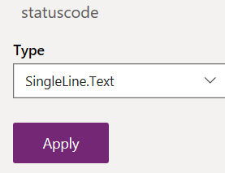

	- The timeline control should now show the test data.

    

Do not close the test environment.

## Task #5: Change Color for Items

In this task, you will use the **css** resource you configured to change the color of the items on the timeline.

1. Add red and green styles to the timelinecontrol.css file

	- Go back to **Visual Studio Code**.

	- Expand the **css** folder and open the **timelinecontrol.css**

	- Add the style below to the **timelinecontrol.css** file and save your changes.

            .red{
                background:red;
                color:white;
                }
            .green{
                background:green;
                color:white;
                }
            .yellow{
                background:yellow;
                color:black;
                }

    

	- Select File and then select Save All.

2. Check the test environment, load the test data and make sure it shows your changes

	- Go to the **Test Environment**.

	- Select **+ Select a File**.

    

	- Select the **testdata.csv** and then select **Open**.

	- Select **Apply**.

	- The timeline control should now show the test data.

    

	- Close the test environment browser window or tab.

3. Stop the test 

	- Go back to **Visual Studio Code**.

	- Click on the **Terminal** and press the **[CONTROL]** key and **c**.

	- Type **y** and **[ENTER].**

 

  
‎ 

# Exercise #2: Publish to Microsoft Dataverse

**Objective:** In this exercise, you will publish the timeline control to your Microsoft Dataverse and add it to the Permit main form.

## Task #1: Setup and Publish

1. Get your environment URL

	- Navigate to [Power Platform admin center](https://admin.powerplatform.microsoft.com/) and select environments.

	- Locate and open your **Dev** environment.

	- Right click and copy the **Environment URL**.

    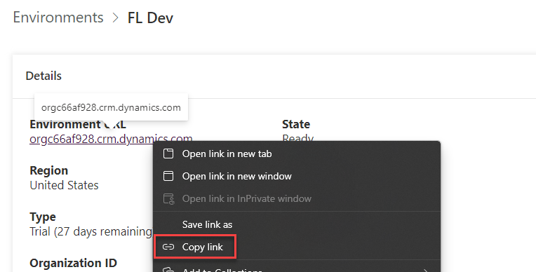

2. Authenticate 

	- Go back to **Visual Studio Code**.

	- Make sure you are still in the **src** directory.

	- Run the command below. Replace **&lt;Environment URL&gt;** with the **URL** you copied.

            pac auth create --url <Environment URL>

	- Sign in with your **admin** username.

3. Import the solution into your org and publish

	- Run the command below and wait for the publishing to complete. The push command uploads your component to the configured environment. This can be used over and over during development to quickly see your component in the live form.

            pac pcf push --publisher-prefix contoso

    

 

## Task #2: Add Timeline Control to the Permit Form

1. Open the Permit Management solution

	- Navigate to [Power Apps maker portal](https://make.powerapps.com/) and make sure you have the **Dev** environment selected.

	- Select **Solutions**.

	- Open the **Permit Management** solution.

2. Open the Permit Main form and switch to classic

	- Select **Tabled** and open the **Permit** table.

    

	- Select the **Forms** tab.

	- Open the **Main** form.

    

	- Select **Switch to Classic**.

    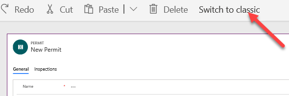

3. Add Timeline control to the form

	- Locate the **Inspections** tab.

	- Double click on the **Inspections** sub-grid.

    

	- Select the **Controls** tab and select **Add Control**.

    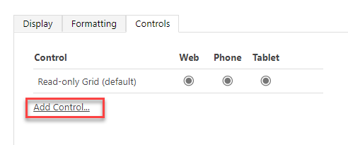

	- Select **timelinecontrol** and select **Add**.

    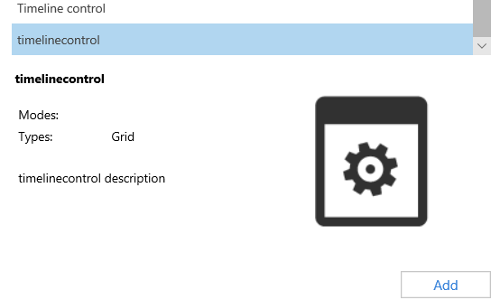

	- Select **Web** and and then select **OK**.

    

4. Save and publish

	- Select **Save**.

	- Select **Publish** and wait for the publishing to complete.

	- **DO NOT** close the form editor.

5. Create test data

	- Go back to [Power Apps maker portal](https://make.powerapps.com/) and make sure you have the **Dev** environment selected.

	- Select **Apps** and launch the **Permit Management** application

	- Select **Advanced Find**.

    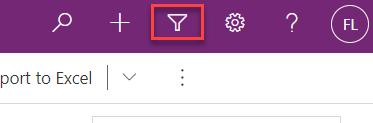

	- Select **Inspections** and then select **Results**.

    

	- Select **Inspection**.

	- Open the **Framing Inspection** record.

	- Change the **Status Reason** to **Passed** and select **New**.

    

	- Provide a Name, select Inspection Type, select the Test Permit, select Scheduled Date, select Failed for Status Reason, and then select **Save and Close**.

    

	- Close **Advanced Find**.

6. Test the control

	- Select **Permits**.

	- Open a **Test Permit** record.

    

	- Select the **Inspections** tab.

	- The control should show the two inspections, but the color will not match the status reason values.

    

 

## Task #3: Debug

1. Start Edge DevTools and add breakpoint.

	- Press **F12**.

	- Search for **createTimelineData = function**

	- Locate the **createTimelineData** function and add breakpoint on the **permitColor =”green”** line.

    

	- Go back to the Permit Management application and click Refresh.

    

	- Select the **Inspections** tab again.

	- Execution should break.

	- Hover over the **permitStatus**, the **permitStatus** is null because **Status Reason** is not included in the **View**.

    

	- Press **F5** to continue.

	- Close the **DevTools**.

2. Add Status Reason to the view.

	- Go back to the form editor.

	- Double click on the Inspections timeline control.

    

	- Select **Edit**.

    

	- Select **Add Columns**.

    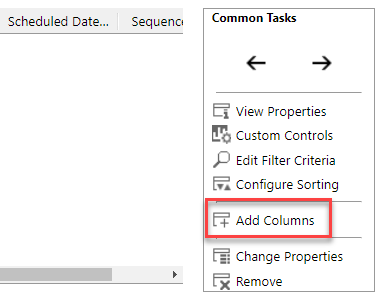

	- Select **Status Reason** and select **OK**.

    

	- Move the **Status Reason** column after the **Name** column.

    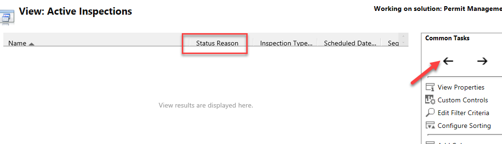

	- Select **Save and Close**.

	- Select **OK**.

    

	- Select **Save**.

	- Select **Publish** and wait for the publishing to complete.

	- Close the form editor.

3. Test your changes

	- Go back to the **Permit Management** application and refresh the browser.

    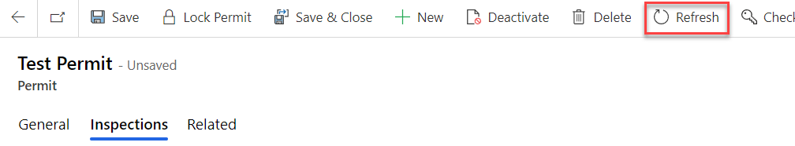

	- Select the **Inspections** tab. The timeline control should now show the correct colors.

    

## Task #4: Add the Timeline Control to Permit Management Solution

1. Add Custom Control to solution

	- Navigate to [Power Apps maker portal - screenshot](https://make.powerapps.com/) and make sure you are in the **Dev** environment.

	- Select **Solutions** and open the **Permit Management** solution.

	- Select **Add Existing | More | Developer | Custom Control**.

    

	- Search for Timeline, select **contoso_contoso.timelinecontrol** and select **Add**.

    

	- Select **Publish All Customizations** and wait for the publishing to complete.

 

 

# Exercise #3: Promote to production

**Objective:** In this exercise, you will export the Permit Management solution from your Dev environment and import it into your Production environment.

## Task #1: Export Solution

1. Export Permit Management managed solution

	- Log on to [Power Apps maker portal](https://make.powerapps.com/) and make sure you are in the **Dev** environment.

	- Select **Solution**.

	- Select the **Permit Management** solution and then select **Export**.

    

	- Select **Publish** and wait for the publishing to complete.

    

	- Select **Next**.

	- Select **Managed** and then select **Export**.

    

	- Save the **Exported** solution on your machine.

2. Export Permit Management unmanaged solution

	- Select **Solution** again.

	- Select the **Permit Management** solution and then select **Export**.

	- Select **Next**.

	- Select **Unmanaged, edit the version number** to match the Managed Solution you just exported and select **Export**.

	- Save the **Exported** solution on your machine.

## Task #2: Import Solution

1. Import Permit Management managed solution

	- Log on to [Powe Apps maker portal](https://make.powerapps.com/) and make sure you are in the **Prod** environment.

	- Select **Solution**.

	- Select **Import**.

    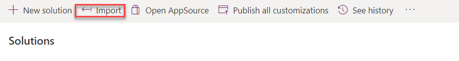

	- Click **Choose File**.

	- Select the **Managed** solution you exported and select **Open**.

    

	- Select **Next**.

	- Expand the Advanced settings area and make sure **Upgrade** is selected.
  
	- Select **Import** and wait the import to complete.

    

Review the production application by adding a few records and testing your progress.
