---
lab:
    title: 'Lab 8: Dataverse Plug-ins'
    module: 'Module 6: Extending Microsoft Dataverse'
---

# Practice Lab 8 – Dataverse Plug-ins

## Scenario

In this lab you will build two plug-ins. The first plug-in will run when a new permit record is created, and it will check that there are no other permits that exists for the build sites that are *locked*. If a locked permit is found, the plug-in will block the creation of this new permit. The second plug-in will hook up and run when the Lock Permit custom API is invoked. In the prior module we defined the custom API, and now with the plug-in step registered on execution of the custom API, it will perform the lock permit business logic.

## High-level lab steps

As part of building the plug-ins, you will complete the following activities.

- Create two plug-ins.
- Implement logic to work with a plug-in registered on a table event.
- Implement logic to work with a plug-in registered for a Custom API.
- Deploy the plug-ins and associate them with your solution.
- Use the plug-in trace log to see trace message from the plug-in.

## Things to consider before you begin

- Do we know what events will trigger the plug-ins?
- Could what we are doing with the plug-in, be done using Power Automate?
- Remember to continue working in your DEVELOPMENT environment. We’ll move everything to production soon.

## Starter solution

A starter solution file for this lab can be found in the  C:\Labfiles\L08\Starter folder.

## Completed solution

Completed solution files for this lab can be found in the  C:\Labfiles\L08\Completed folder.

## Resources

Complete source code files for this lab can be found in the  C:\Labfiles\L08\Resources folder.

> [!IMPORTANT]
> You should have installed .NET 4.6.2 and Power Apps CLI in an earlier lab. If you have not completed the steps in the Power Platform Tools lab, you must complete those before starting this lab.

## Exercise 1: Permit creation validation plug-in

**Objective:** In this exercise, you will create a plug-in that will run on create of a permit. This plug-in will check if there are any locked permits for the selected build site of the new permit and block the creation of the new permit.

### Task 1.1: Status Reason values

1. Open the Permit Management solution.

   - Navigate to the Power Apps Maker portal `https://make.powerapps.com/` and make sure you have the **Development** environment selected.
   - Select **Solutions**.
   - Open the **Permit Management** solution.

1. Find the values of the Permit table Status Reason column.

   - In the **Objects** pane on the left-hand side expand **Tables** then expand **Permit** table.

   - Select **Columns**.

   - Select the **Status Reason** column.
  
    

   - Copy the value of the **Locked** option.
  
   - You will need this value in a future step.

   - Select **Cancel**.
  
1. Find the values of the Inspection table Status Reason column.

   - In the **Tree view** expand the **Inspection** table.
  
   - Select **Columns**.
  
   - Select the **Status Reason** column.
  
    

   - Copy the value of the **New Request** option.

   - Copy the value of the **Pending** option.

   - Copy the value of the **Canceled** option.

   - You will need these values in a future step.

   - Select **Cancel**.

   > [!NOTE]
   > Record these values on a notepad, you need them later in this lab.

### Task 1.2: Create the plug-in

1. Start the developer command prompt tool.

1. Create a folder named named **ContosoPackageProject** for the code component.

   - Run the following commands.

     ```dos
     cd C:\LabFiles\L08
     mkdir ContosoPackageProject
     cd ContosoPackageProject
     ```

1. Create a project for a Dataverse plug-in.

   - Initialize the component. This command will create a set of files that will implement a plug-in. You will customize these files as we continue.

     ```dos
     pac plugin init
     ```

   - Dataverse plug-in class library creation should be successful.
  
     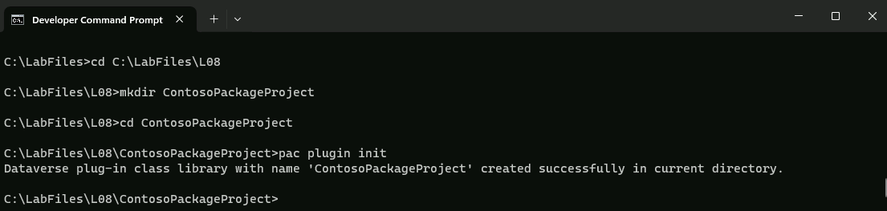

   - Run the command below to open the project in Visual Studio.
  
     ```dos
     start ContosoPackageProject.csproj
     ```

1. Rename the Plugin1 class file.

   - Right click on **Plugin1.cs** and select **Rename**.

     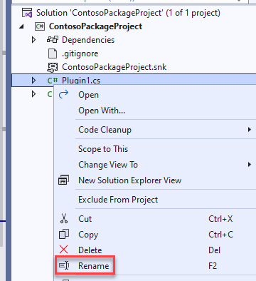

   - Rename the class as `PreOperationPermitCreate`.

   - Select **Yes** on the rename references popup.

   - Open **PreOperationPermitCreate.cs** file.

1. Get the **Target** Table.

    - Add the using statement below to the top of the class.

     ```csharp
     using Microsoft.Xrm.Sdk.Query;
     ```

   - In the **ExecuteDataversePlugin** method After the comment `// TODO: Implement you custom business logic` add the code below.

     ```csharp
     var permitEntity = context.InputParameters["Target"] as Entity;
     ```

   - To get the Build Site table reference, add the below code after **permitEntity** variable definition.

     ```csharp
     var buildSiteRef = permitEntity["contoso_buildsite"] as EntityReference;
     ```

   - To add Trace Messages, add the below mentioned code after **buildSiteRef** variable definition.

     ```csharp
     localPluginContext.Trace("Primary Entity Id: " + permitEntity.Id);
     localPluginContext.Trace("Build Site Entity Id: " + buildSiteRef.Id);
     ```

1. Create FetchXML and that will get the count of locked permits matching the build site id and call retrieve multiple.

   - Create the **FetchXML** string. Replace **330650001** with the locked option value of the status reason column of your Permit table.

     ```csharp
     string fetchString = "<fetch output-format='xml-platform' distinct='false' version='1.0' mapping='logical' aggregate='true'><entity name='contoso_permit'><attribute name='contoso_permitid' alias='Count' aggregate='count' /><filter type='and' ><condition attribute='contoso_buildsite' uitype='contoso_buildsite' operator='eq' value='{" + buildSiteRef.Id + "}'/><condition attribute='statuscode' operator='eq' value='330650001'/></filter></entity></fetch>";
     ```

   - Run the FetchXML query by using RetrieveMultiple.

     ```csharp
     localPluginContext.Trace("Calling RetrieveMultiple for locked permits");
     var response = localPluginContext.InitiatingUserService.RetrieveMultiple(new FetchExpression(fetchString));
     ```

1. Throw an exception if a locked permits was found.

   - Get the locked permits **Count** frm the result of the query.

     ```csharp
     int lockedPermitCount = (int)((AliasedValue)response.Entities[0]["Count"]).Value;
     ```

   - Check if the **Count** is more than **0** and throw **InvalidPluginExecutionException**.

     ```csharp
     localPluginContext.Trace("Locked Permit count : " + lockedPermitCount);
     if (lockedPermitCount > 0)
     {
        throw new InvalidPluginExecutionException("Too many locked permits for build site");
     }
     ```

   - Delete the generated comments from the ExecuteDataversePlugin method.

   - The ExecuteDataversePlugin method should now look like the image below.

     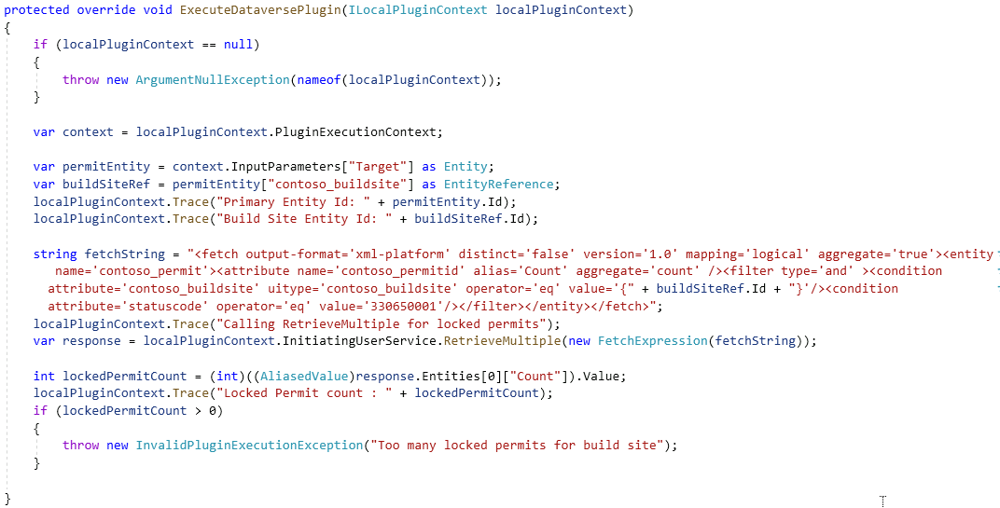

1. Build the project.

   - Select the **Save** icon.
   - In Solution Explorer, right-click the *ContosoPackageProject* project and select **Build**.
   - Check the **Output** window and make sure that the build has succeeded. If it does not, go back and review your work compared the steps documented here.

### Task 1.3: Deploy the plug-in

1. Start the Plug-in Registration Tool.

   - Return to command prompt.

   - Run the command below to launch the Plugin Registration Tool (PRT).

     ```dos
     pac tool prt
     ```

1. Connect to your Dataverse environment.

   - Select **+ CREATE NEW CONNECTION**.

     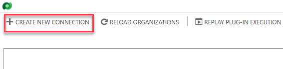

   - Select **Office 365** for Deployment Type.
   - Check **Display list of available organizations**.
   - Check **Show Advanced**.
   - Enter your tenant credentials.

     

   - Select **Login**.

     

   - Select your **Development** environment and select **Login**.

1. Register the plug-in assembly.

   - Select **Register** and select **Register New Assembly**.

     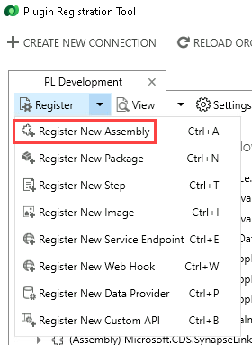

   - Select the ellipses **…**.

     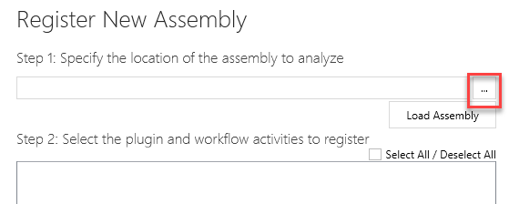

   - Browse to the **bin/debug/net462** folder of your plug-in project **ContosoPackageProject**.

     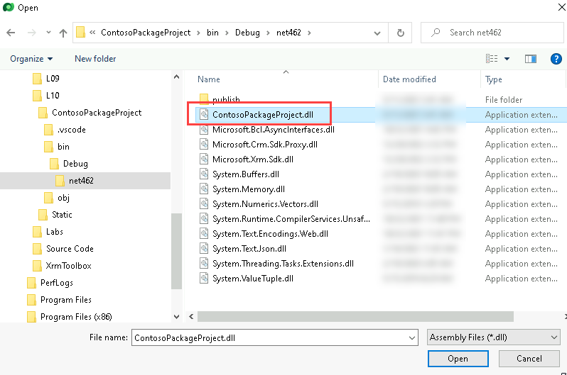

   - Select the **ContosoPackageProject.dll** file and select **Open**.

     

   - Select **Register Selected Plugins**.

     

   - Select **OK**

1. Register step on create of permit table.

   - Right-click on the ContosoPackageProject assembly and select **Register New Step**.

    

   - Enter `Create` for **Message**.

   - Enter `contoso_permit` for **Primary Entity**.

   - Select **PreOperation** from dropdown for **Event Pipeline Stage of Execution**.

     

   - Select **Register New Step**.

   - Select **Close** in the Warning - no Filter on Attributes detected popup window.

   - Step should now be registered in the assembly plugin.

     

## Exercise 2: Create plug-in for Custom API

**Objective**: In this exercise, you will create and register a plug-in that will be invoked when the lock permit Custom API is used. This plug-in will be used to implement the business logic of locking the permit. Specifically, it will update the permit to indicate it is locked and then cancel any pending inspections.

> [!NOTE]
> If you did not create the Custom API in a prior lab, you need to go back and create the Custom API.

### Task 2.1: Add a new plug-in to the project

1. Open **ContosoPackageProject** solution in Visual Studio.

1. Create new class.

   - In Solution Explorer, right-click the *ContosoPackageProject* project and select **Add** and then select **New Item**.
   - Select Class and name the class `LockPermitCancelInspections.cs`
  
     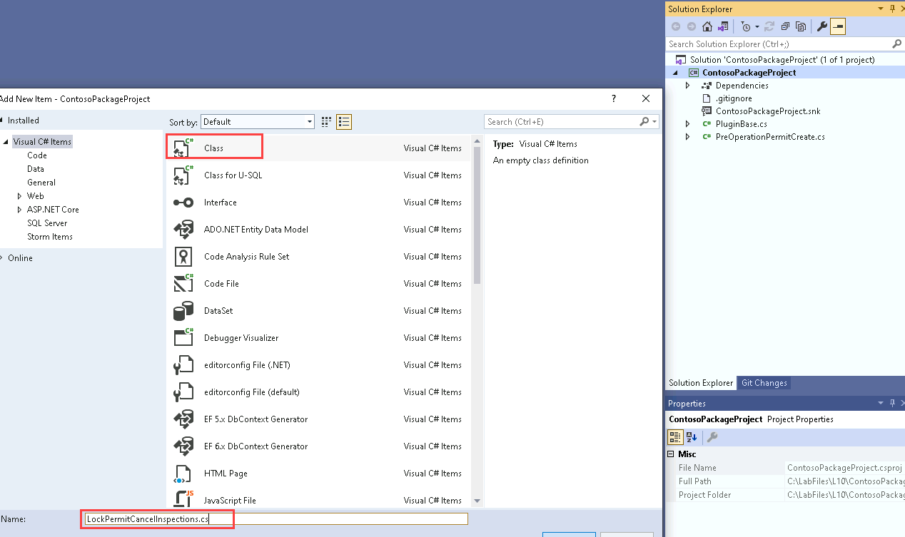

   - Select **Add**.

1. Add using statements to the new class, make the class **public**, and inherit from **PluginBase**.

   - Add the using statements below to the **LockPermitCancelInspections** class.

     ```csharp
     using System.Text.RegularExpressions;
     using Microsoft.Xrm.Sdk;
     using Microsoft.Xrm.Sdk.Query;
     ```

   - Change the **LockPermitCancelInspections** class to be public and **inherit** from the **PluginBase** class.

     ```csharp
     public class LockPermitCancelInspections : PluginBase
     ```

     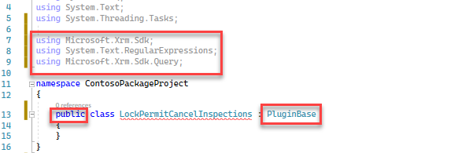

1. Override the ExecuteDataversePlugin method and get the reason value from the input parameter.

   - Add the code below inside the **LockPermitCancelInspections** class.

     ```csharp
     public LockPermitCancelInspections(string unsecureConfiguration, string secureConfiguration)
     : base(typeof(PreOperationPermitCreate))
     {

     }
            
     protected override void ExecuteDataversePlugin(ILocalPluginContext localPluginContext)
     { 
         if (localPluginContext == null)
         {
             throw new ArgumentNullException(nameof(localPluginContext));
         }

     }
     ```

1. Get the target Entity Reference, define Entity, set status reason to Locked, and update the permit record.

   - Get the target **Entity Reference** and define an **Entity** object. Add the below code inside the ExecuteDataversePlugin method.

     ```csharp
     var permitEntityRef = localPluginContext.PluginExecutionContext.InputParameters["Target"] as EntityReference;
     Entity permitEntity = new Entity(permitEntityRef.LogicalName, permitEntityRef.Id);
     ```

   - Set the **Status Reason** to **Locked**.

     ```csharp
     localPluginContext.Trace("Updating Permit Id : " + permitEntityRef.Id);
     permitEntity["statuscode"] = new OptionSetValue(330650001);
     ```

     > [!NOTE]
     > 330650001 is the value of the Locked Status Reason option and statuscode is the name of the status reason column. If the Locked status reason is different for your environment, change the code to match your value.

   - Update the **Permit** record.

     ```csharp
     localPluginContext.PluginUserService.Update(permitEntity);
     localPluginContext.Trace("Updated Permit Id " + permitEntityRef.Id);
     ```

     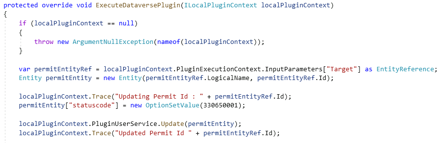

### Task 2.2: Get related inspections and cancel the inspections

1. Create query and condition expressions.

   - Create the **QueryExpression**. Add the code below to the **ExecuteDataversePlugin** method.

     ```csharp
     QueryExpression qe = new QueryExpression
     {
         EntityName = "contoso_inspection",
         ColumnSet = new ColumnSet("statuscode"),
     };
     qe.Criteria.AddCondition("contoso_permit", ConditionOperator.Equal, permitEntityRef.Id);
     ```

     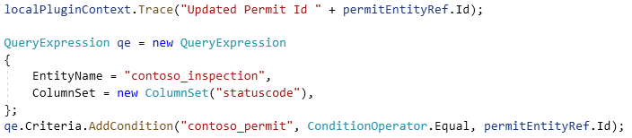

1. Retrieve the inspections and iterate through the returned records.

   - Run the QueryExpression query by using Retrieve Multiple.

     ```csharp
     localPluginContext.Trace("Retrieving inspections for Permit Id " + permitEntityRef.Id);
     var inspectionsResult = localPluginContext.PluginUserService.RetrieveMultiple(qe);
     localPluginContext.Trace("Retrieved " + inspectionsResult.Entities.Count + " inspection records");
     ```

   - Create a **variable** that will keep track of the canceled **Inspections** count and Iterate through the returned entities.

     ```csharp
     int canceledInspectionsCount = 0;
     foreach (var inspection in inspectionsResult.Entities)
     {          

     }
     ```

1. Retrieve the selected status reason option and check if it is set to new request or pending.

   - Get the currently selected value of the **Status Reason**. Add the code below inside the **foreach** loop.

     ```csharp
     var currentValue = inspection.GetAttributeValue<OptionSetValue>("statuscode");
     ```

   - Check if the inspection is **New Request** or **Pending** and increment the count. This should be placed inside the foreach loop.

     ```csharp
     if (currentValue.Value == 1 || currentValue.Value == 330650001)
     {
            
     }
     ```

     > [!NOTE]
     > 1 is the value of the Inspection New Request status reason and 330650001 id the value of the Inspection Pending status reason. If the Pending status reason is different for your environment, change the code to match your value.

1. Cancel the inspections that are pending or new request.

   - Set the **Status Reason** selected value to **Canceled**. Add the code below inside the if statement inside the foreach loop.

     ```csharp
     inspection["statuscode"] = new OptionSetValue(330650004);
     ```

     > [!NOTE]
     > 330650004 is the value of the Inspection Canceled status reason. If the Canceled status reason is different for your environment, change the code to match your value.

   - Update the **Inspection** and add **Trace** messages.

     ```csharp
     localPluginContext.Trace("Canceling inspection Id : " + inspection.Id);
     localPluginContext.PluginUserService.Update(inspection);
     localPluginContext.Trace("Canceled inspection Id : " + inspection.Id);
     canceledInspectionsCount++;
     ```

     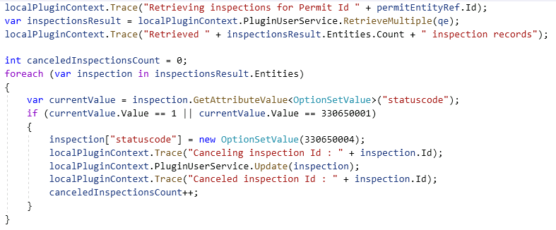

### Task 2.3: Set Output Parameter and Create Note record

1. Check if at least one Inspection was canceled and CanceledInspectionsCount output Parameter.

   - Check if at least one **Inspection** was canceled. Add the code below after the **foreach** loop.

     ```csharp
     if (canceledInspectionsCount > 0)
     {           

     }
     ```

   - Set the **CanceledInspectionsCount** output parameter. Add the code below inside the if statement outside the foreach loop.

     ```csharp
     localPluginContext.Trace("Canceled " + canceledInspectionsCount + " inspection records");
     localPluginContext.PluginExecutionContext.OutputParameters["CanceledInspectionsCount"] = canceledInspectionsCount;
     ```

     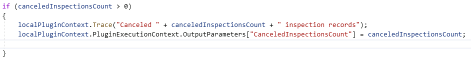

1. Check if the Input Parameters contain reason and create the Note record.

   - Check if **Reason** contains in the **InputParameters**. Add the code below after the last if statement.

     ```csharp
     if (localPluginContext.PluginExecutionContext.InputParameters.ContainsKey("Reason"))
     {

     }
     ```

   - Build the **Note** record. Add the code below inside the if statement.

     ```csharp
     localPluginContext.Trace("building a note record");
     Entity note = new Entity("annotation");
     note["subject"] = "Permit Locked";
     note["notetext"] = "Reason for locking this permit: " + localPluginContext.PluginExecutionContext.InputParameters["Reason"];
     note["objectid"] = permitEntityRef;
     note["objecttypecode"] = permitEntityRef.LogicalName;
     ```

   - Create the Note record. Add the code below inside the if statement.

     ```csharp
     localPluginContext.Trace("Creating a note record");
     var createdNoteId = localPluginContext.PluginUserService.Create(note);
     ```

   - Check if the Note record was created.

     ```csharp
     if (createdNoteId != Guid.Empty)
         localPluginContext.Trace("Note record was created");
     ```

     

1. Build the project.

   - Select the **Save** icon.
   - In Solution Explorer, right-click the *ContosoPackageProject* project and select **Build**.
   - Check the **Output** window and make sure that the build has succeeded. If it does not, go back and review your work compared the steps documented here.

1. Select **File** and **Close Solution**.

1. Select **Save**.

1. Select **Save**.

### Task 2.4: Deploy the plug-in

1. If you do not have the Plugin Registration Tool running already, follow instructions above to run the tool and connect to the environment.

1. Update the assembly.

   - Select the **ContosoPackageProject** assembly and select **Update**.

     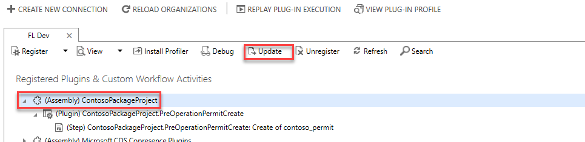

   - Select the ellipses **…**.

   - Browse to the **bin/debug/net462** folder of your plugin project **ContosoPackageProject**.

   - Select the **ContosoPackageProject.dll** file and select **Open**.

   - Check the **Select All** checkbox.

     

   - Select **Update Selected Plugins**.

     

   - Select **OK**.

1. Add plug-in to solution.

   - Navigate to the Power Apps Maker portal `https://make.powerapps.com/` and make sure you have the **Development** environment selected.
   - Select **Solutions**.
   - Open the **Permit Management** solution.

   - Select **Add existing** and select **More** and **Developer** and **Plug-in assembly**.

     

   - Select the **ContosoPackageProject** assembly and then select **Add**.

   - Select **Add existing** and select **More** and **Developer** and **Plug-in step**.

   - Select the **ContosoPackageProject.PreOperationPermitCreate** step and then select **Add**.

1. Configure the custom API.

   - Select **Custom API** and open the **Lock Permit** custom API.
  
     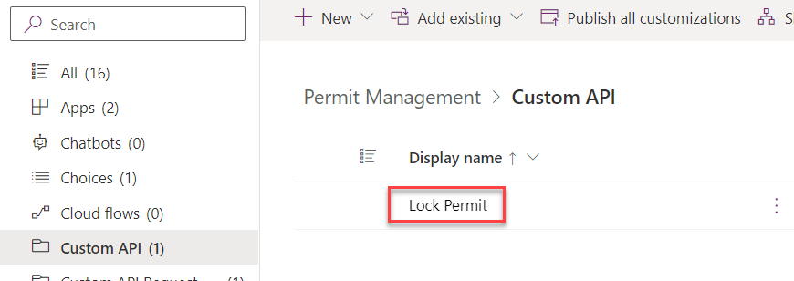
  
   - Scroll down and select **ContosoPackageProject.LockPermitCancelInspections** for Plugin Type.

     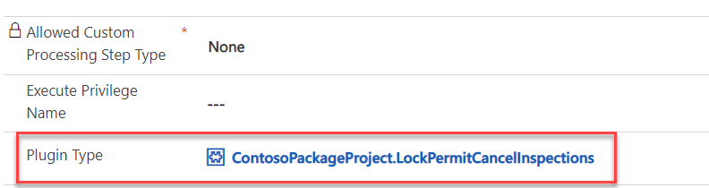

   - Select **Save & Close**.
  
   - Select **Done**.

## Exercise 3: Test Plug-ins

**Objective:** In this exercise, you will test the plug-ins you created.

### Task 3.1: Enable Trace Logs

1. Enable Trace logs in XrmToolBox.

   - Launch **XrmToolBox**.

   - Select the **Tools** tab in XRMToolBox.

   - Search for `trace` and select **Plugin Trace Viewer**.

   - Select **Yes** to connect to an organization.

   - Select your **Dev** connection and select **OK**.

   - Change **Trace Log Setting** to **All**.

   - Set Enable Plug-in Logging to Plug-in Trace Log to **All** and select **OK**.

     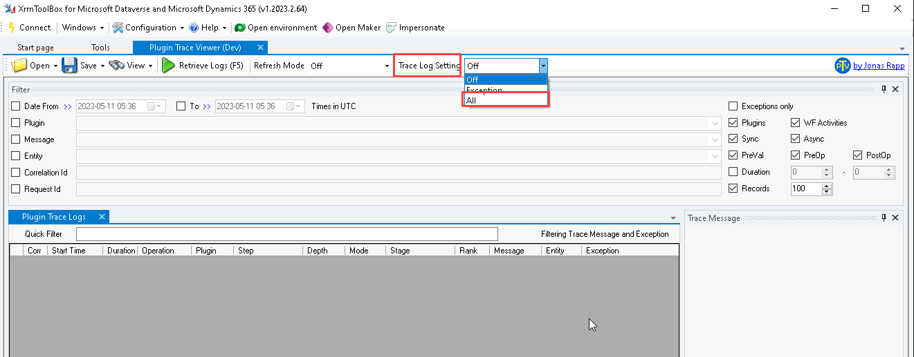
  
   - Select **OK**.

   - Select **OK**.

   - Leave XrmToolBox open.

1. Test data.

   - Navigate to the Power Apps Maker portal `https://make.powerapps.com`.
   - Make sure you are in the Development environment.
   - Select **Apps**.
   - Select the **Permit Management** app, select the **ellipses (...)** and select **Play**.
   - Select **Inspections**.

   - You should have four inspections for **Test Permit**; one **Failed**, one **Passed**, one **New Request**, and one **Pending**. If not, edit and update the records.

     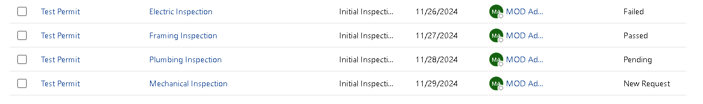

### Task 3.2: Test Lock plug-in

1. Lock Permit.

   - Select **Permits**.

   - Open the **Test Permit**.

     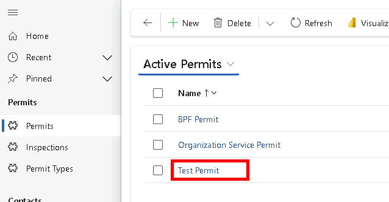

   - Make sure the Status Reason is set to Active.

   - Select the **Lock Permit** button.

    

   - The Custom API should run. Select **Refresh**.

     

   - The **Status Reason** value should change to **Locked**.

     

   - A note should have been added to the Timeline.

     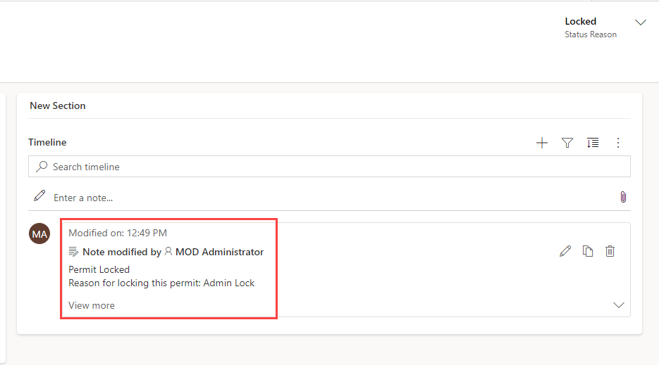

1. Check if the Pending and New Request Inspections are canceled.

   - Select **Inspections**.

   - You should now have two canceled inspections.  

     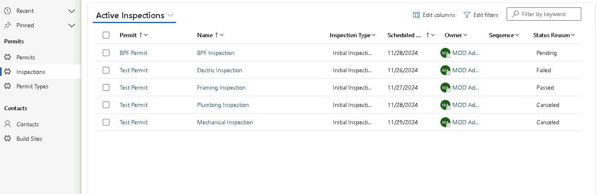

### Task 3.3: Test Restrict New Permit creation plug-in

1. Try to create new Permit record for the One Microsoft Way Build Site.

   - Select **Permits**.

   - Select **+ New**.

   - Provide **Name** as `Test Permit Two`.

   - Select **New Construction** for Permit Type, **One Microsoft Way** for Build Site, and **Jon Doe** for **Contact**.

   - Select today's date for the Start Date.

   - Enter `4000` for New Size.

     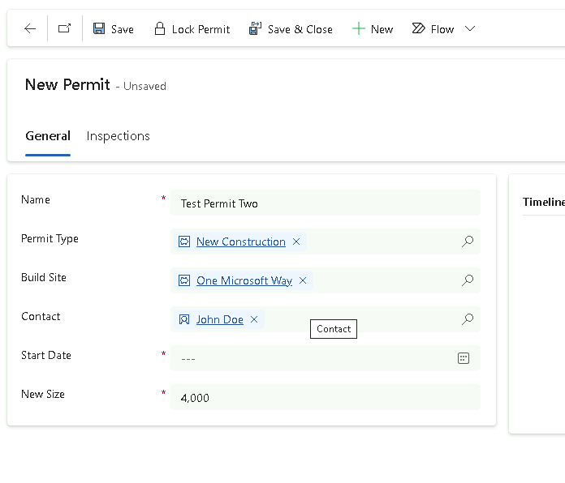

   - Select **Save**.

   - You should get the error below.

     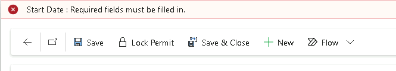

   - The record should not get created.

    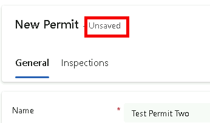

   - Select **OK**.

   - Select **Permits**.

   - Select **Discard changes**.

     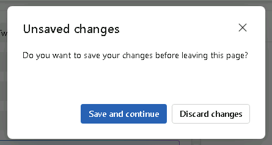

   - The Test Two permit has not been created.

     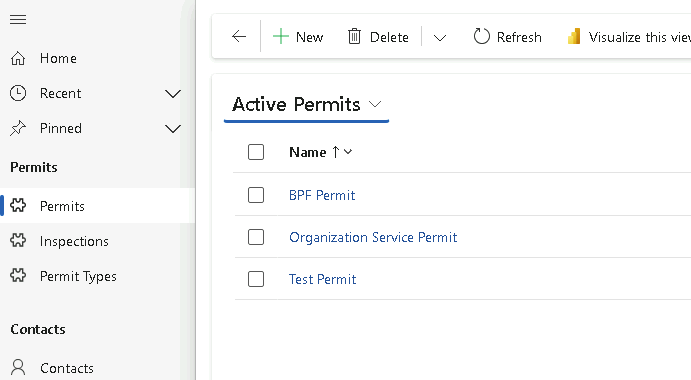

## Exercise 4: Trace Log

**Objective:** In this exercise, you will check the Plugin Trace logs.

### Task 4.1: Plugin Trace Viewer

1. Open Plugin trace Log.

   - Go back to XrmToolBox.

   - Select the **Plugin Trace Viewer** tab.

   - Select **Retrieve Logs (F5)**.

   - You should see at least two logs.

     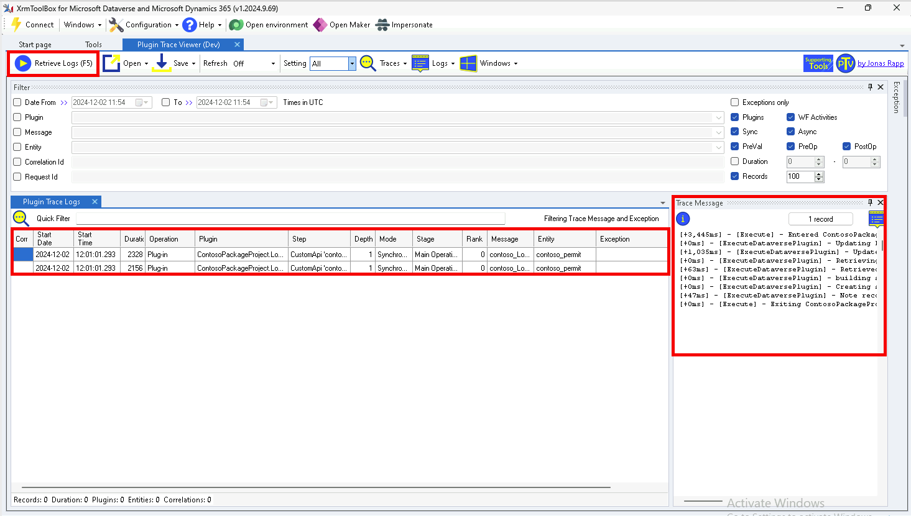

1. View the trace logs.

   - Select the log with the contoso_LockPermit message and view the trace message in the right-hand pane. The trace messages should looks similar to.

     ```DOS
     Entered ContosoPackageProject.PreOperationPermitCreate.Execute() Correlation Id: f67c48f1-7946-4322-bc0b-de0950fffbec, Initiating User: 69d46714-c7eb-ed11-8849-000d3a17a888
     Updating Permit Id : f9068d71-f9ec-ed11-8848-0022481c5f83
     Updated Permit Id f9068d71-f9ec-ed11-8848-0022481c5f83
     Retrieving inspections for Permit Id f9068d71-f9ec-ed11-8848-0022481c5f83
     Retrieved 4 inspection records
     Canceling inspection Id : 18c39160-82ed-ed11-8848-0022481c5f83
     Canceled inspection Id : 18c39160-82ed-ed11-8848-0022481c5f83
     Canceling inspection Id : de46fb89-82ed-ed11-8848-0022481c5f83
     Canceled inspection Id : de46fb89-82ed-ed11-8848-0022481c5f83
     Canceled 2 inspection records
     building a note record
     Creating a note record
     Note record was created
     Exiting ContosoPackageProject.PreOperationPermitCreate.Execute()
     ```

   - Select the log with the Create message and view the trace message in the right-hand pane. The trace messages should looks similar to.

     ```DOS
     Entered ContosoPackageProject.PreOperationPermitCreate.Execute() Correlation Id: 8d662516-cfba-4143-951c-f2423e743cc2, Initiating User: 69d46714-c7eb-ed11-8849-000d3a17a888
     Primary Entity Id: d12a656d-fcef-ed11-8848-0022481c5f83
     Build Site Entity Id: d4518341-f9ec-ed11-8848-0022481c5f83
     Calling RetrieveMultiple for locked permits
     Locked Permit count : 1
     Exiting ContosoPackageProject.PreOperationPermitCreate.Execute()
     ```

## Exercise 5: Plug-in performance (Optional)

**Objective:** In this exercise, you see if you can improve the performance of the plugins.

### Task 5.1: Improve performance of LockPermitCancelInspections

1. Filter the records in the QueryExpression to only return inspections to canceled.

   ```csharp
   qe.Criteria.AddCondition("statuscode", ConditionOperator.In, new object[] { 1,330650001 });   
   ``````

   or

   ```csharp
   qe.Criteria.FilterOperator = LogicalOperator.And;
   FilterExpression statusfilter = new FilterExpression();
   statusfilter.FilterOperator = LogicalOperator.Or;
   statusfilter.AddCondition("statuscode", ConditionOperator.Equal, 1);
   statusfilter.AddCondition("statuscode", ConditionOperator.Equal, 330650001);
   qe.Criteria.AddFilter(statusfilter);
   ```

## Exercise 6: Export and import solution

**Objective:** In this exercise, you will export the solution you created in the development environment and import it to the production environment.

### Task 6.1: Export solution

1. Export managed solution.

   - Navigate to the Power Apps Maker portal `https://make.powerapps.com/` and make sure you have the **Development** environment selected.
   - Select **Solutions**.
   - Open the **Permit Management** solution.
   - Select the **Overview** tab in the solution.
   - Select **Export**.
   - Select **Publish** and wait for the publishing to complete.
   - Select **Next**.
   - Set the version number to `1.0.0.8`.
   - Select **Managed**.
   - Select **Export**.
   - Click **Download** to download the managed solution on your machine.

1. Export unmanaged solution.

   - Select **Export** again.
   - Select **Next**.
   - Edit the version number to match the Managed solution you just exported i.e., `1.0.0.8`.
   - Select **Unmanaged**.
   - Select **Export**.
   - Click **Download** to download the unmanaged solution on your machine.

### Task 6.2: Import solution

1. Import the Permit Management solution.

   - Sign in to the Power Apps Maker portal `https://make.powerapps.com/`.
   - Select your **Production** environment.
   - Select **Solutions**.
   - Select **Import solution**.
   - Select **Browse**.
   - Select the **Managed** solution file you exported in the previous task and then select **Open**.
   - Select **Next**.
   - Expand **Advanced settings** and make sure **Upgrade** is selected.
   - Select **Import** and wait the import to complete.
