---
lab:
    title: 'Lab 9: Integration with Azure'
    module: 'Module 7: Integrate Dataverse and Azure and Module 8: Custom Connectors'
---

# Practice Lab 9 – Azure

## Scenario

This lab focuses on both inbound and outbound integration with Azure. In this lab you will:

1) Use the event publishing capability of Microsoft Dataverse. When a permit results in changing the size of the build site, an external taxing authority needs to be notified so they can evaluate if additional taxing is required. You will configure Microsoft Dataverse to publish permits with size changes using the Webhook. To simulate the taxing authority receiving the information you will create a simple Azure function to receive the post.

1. Build a custom connector that can be used from Power Apps and Power Automate. Custom connectors describe existing APIs and allow them to be used easily. In this lab, you will build an API that has common calculations used by inspectors so that they can be used by applications. After building the API, you will create a custom connector definition to make it available to Power Apps and Power Automate.

## High-level lab steps

- Import solution and test data
- Create an Azure function and configure as a webhook
- Create an Azure function and use in a custom connector

## Starter solution

A starter solution file for this lab can be found in the  C:\Labfiles\L09\Starter folder.

## Completed solution

Completed solution files for this lab can be found in the  C:\Labfiles\L09\Completed folder.

## Resources

Complete source code files for this lab can be found in the  C:\Labfiles\L09\Resources folder.

## Lab environment

If you are not using cloud slice and already have the solution installed you should skip to Exercise 4.

Otherwise, id you are starting a new lab you will need to:

- Download the lab files
- Use the **Dev One** environment
- Import the solution and data

in order to complete the lab.

## Exercise 1: Download lab files

In this exercise, you will download the lab files from GitHub.

### Task 1.1: PowerShell

1. From the lab virtual machine, select the Windows **Start** icon and search for **PowerShell** then open **PowerShell as Administrator**.

   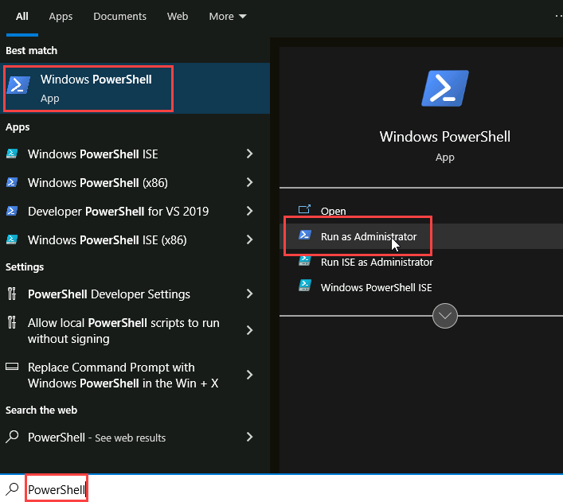

1. Select **Yes** if prompted.

1. Run the following commands to download the latest version of the lab files to the virtual machine.

   > [!NOTE]
   > If any of the commands fail run them again until they are successful.

1. Create folder for lab files.

   ```powershell
   New-Item -Path "C:\" -Name "LabFiles" -ItemType "directory"   
   ```

1. Download ZIP file from GitHub.

   ```powershell
   ([System.Net.WebClient]::new()).DownloadFile('https://github.com/MicrosoftLearning/PL-400_Microsoft-Power-Platform-Developer/archive/master.zip', 'C:\LabFiles\master.zip')
   ```

1. Expand ZIP file.

   ```powershell
   Expand-Archive -Path 'C:\LabFiles\master.zip' -DestinationPath 'C:\LabFiles'
   ```

1. Move files to C:\Labfiles

   ```powershell
   Move-item -Path "C:\LabFiles\PL-400_Microsoft-Power-Platform-Developer-master\Allfiles\Labs\*" -Destination "C:\LabFiles" -confirm: $false
   ```

    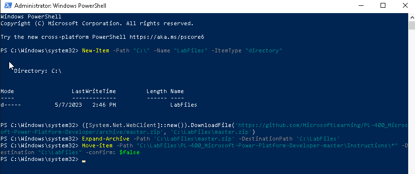

1. Delete files not required for labs.

   ```powershell
   Remove-item 'C:\LabFiles\PL-400_Microsoft-Power-Platform-Developer-master' -recurse -force
   ```

1. Delete zip file.

   ```powershell
   Remove-item 'C:\LabFiles\master.zip'
   ```

   > [!NOTE]
   > Please note, the files are copied to C:\Labfiles and whenever asked to navigate to a lab files, you should use this location.

    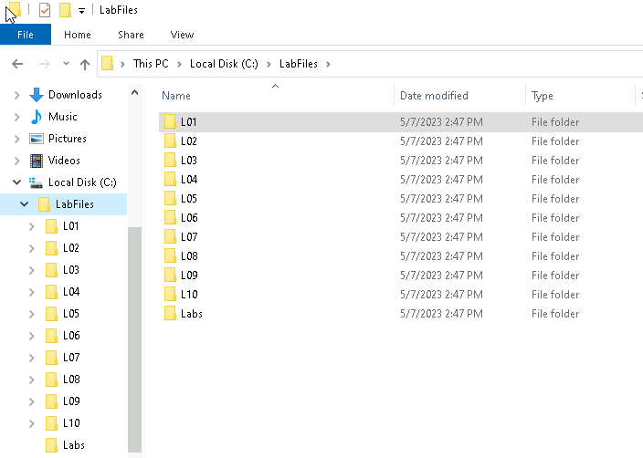

1. Close the PowerShell window.

## Exercise 2: Import Permit Management solution

In this exercise, you will import the solution into the **Dev One** environment.

### Task 2.1: Import solution

1. Navigate to `https://make.powerapps.com`

1. Make sure you are in the **Dev One** environment.

1. Select **Solutions**.

1. Select **Import solution**.

1. Select **Browse** and locate the **PermitManagement_1.0.0.0.zip** file and select **Open**.

    > **Note:** This file is located in the Labfiles/L09 folder on your machine.

    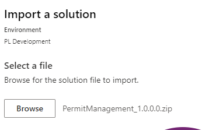

1. Select **Next**.

1. Select **Import**.

    The solution will import in the background. This may take a few minutes.

    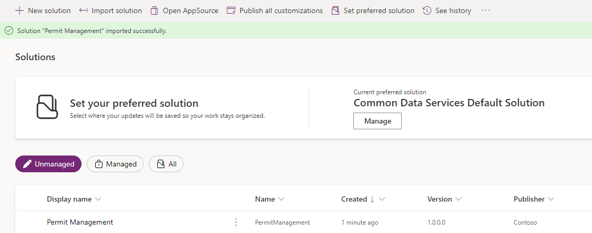

    > **Alert:** Wait until the solution has finished importing before continuing to the next step.

1. When the solution has imported successfully, open the **Permit Management** solution.

    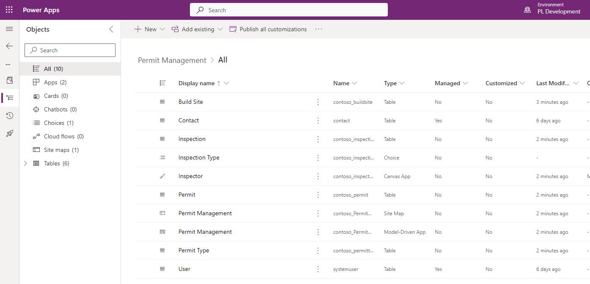

1. In the solution, select the **Overview** page.

    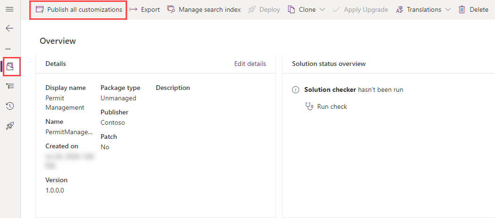

1. Select **Publish all customizations**.

## Exercise 3: Import data

In this exercise, you will import data the into the **Dev One** environment using the Configuration Migration Tool.

### Task 3.1: Import data with the Configuration Migration Tool

1. Open a **Command Prompt**.

1. Launch the **Configuration Migration Tool** using the following command:

    `pac tool cmt`

    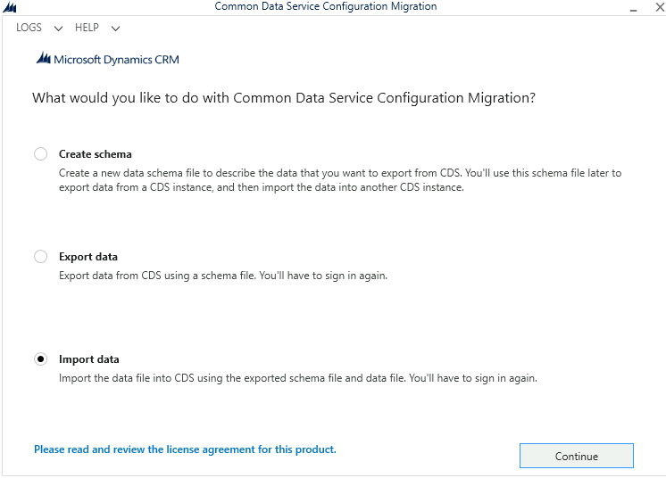

1. Select **Import data**.

1. Select **Continue**.

1. Select **Office 365** for *Deployment Type*.

1. Check **Display list of available organizations**.

1. Check **Show Advanced**.

1. Select **Don't know** for *Online Region*.

1. Enter your Microsoft 365 tenant credentials.

    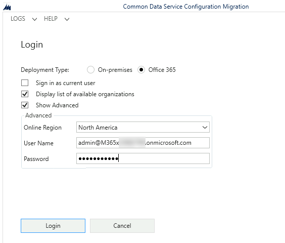

1. Select **Login**.

1. Select the **Dev One** environment.

1. Select **Login**.

    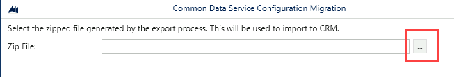

1. Select the ellipsis (...) menu and locate and select **PermitManagementAzuredata.zip** file.

    > **Note:** This file is located in the Labfiles/L09 folder on your machine.

1. Select **Open**. The data file will be validated.

1. Select **Import Data**. The import process will take approximately a minute.

1. Select **Exit**.

1. Select the **X** to close the Configuration Migration Tool.

1. Skip to Exercise 5.

## Exercise 4: Azure Pass

In this exercise, you will create an Azure subscription using an Azure Pass.

### Task 4.1: Redeem Azure Pass

1. Obtain a new Azure Pass (valid for 30-days) from the instructor, lab provider, or other source.

1. Navigate to the Azure Pass redemption page `https://www.microsoftazurepass.com` and sign in with your Microsoft 365 credentials, if prompted.

1. Follow these instructions to redeem your Azure Pass.

    Redeem a Microsoft Azure Pass `https://www.microsoftazurepass.com/Home/HowTo?Length=5`

1. On the **Your profile** page, change *Last name* from *Administrator* to **Developers**.

1. On the **Your profile** page, you will need to enter a valid *Address line 1*, *City*, and *Postal Code* and agree to the subscription offer. Do not change any other details.

    > **Note**:
    > If you are prompted for a *Phone number* when using the Power Platform or Azure portals, enter `0123456789` and select **Submit**.

1. Wait for the Azure subscription to be provisioned and select **Cancel**.

1. Select **Subscriptions**. You should see **Azure Pass - Sponsorship**.

    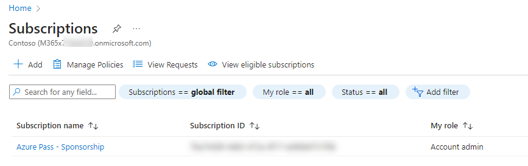

## Exercise 5: Create an Azure Function

**Objective:** In this exercise, you will create an Azure Function that will be the endpoint to accept and log incoming web requests.

### High-level steps for webhook

As part of configuring the event publishing, you will complete the following:

- Create an Azure Function to receive the Webhook post
- Configure Microsoft Dataverse to publish events using a Webhook
- Test publishing of events

### Task 5.1: Create a storage account

1. Create Storage account.

   - Select **Show portal menu** and then select **+ Create a resource**.

   - Search for `storage account` and select **Storage account** by Microsoft.

   - Click on the **Storage account** tile.

   - Select **Create**.

   - Select your **Azure Pass - Sponsorship** subscription.

   - Select the **PL400** for resource group.

   - Enter `pl400sa` followed by a unique number for Storage account name.

     > Note: Storage account name must be unique across Azure.

   - Select **Standard** for Performance.

   - Select **Locally-redundant storage (LRS)** for Redundancy.

     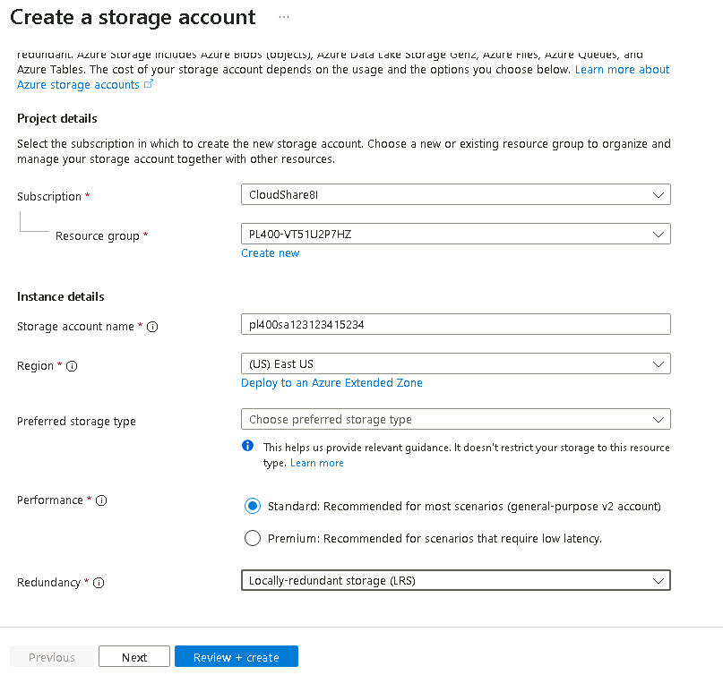

   - Select **Review + create**.

   - Select **Create**.

### Task 5.2: Create a Function App in the Azure Portal

1. Create function app.

   - Sign in to the Azure portal `https://portal.azure.com`.

   - Select **Show portal menu** and then select **+ Create a resource**.

   - Search for `function app` and select **Function App** by Microsoft.

   

   - Click on the **Function App** tile.

   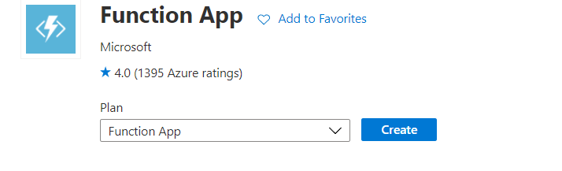

   - Select **Create**.
  
   - Select the **Consumption** tile.

   - Select **Select**.

   - Select your **Azure Pass - Sponsorship** subscription.

   - Select the **PL400** for resource group.

   - Enter `pl400wh` followed by your initials and a unique number for Function App name.

     > Note: Function app name must be unique across Azure. Wait until you see a green tick to confirm the name is unique.

   - Select **.NET** for Runtime stack

   - Select **8 (LTS), in-process model** for Version

   - Select **Next : Storage**.

   - Select the storage account you created in the previous task.

   - Select **Review + create**.

   - Select **Create** and wait for the function app to be deployed.

### Task 5.2: Create an Azure Function in the Azure Portal

1. Create a new function

   - Select **Go to resource**.

     

   - Select the **Functions** tab.

     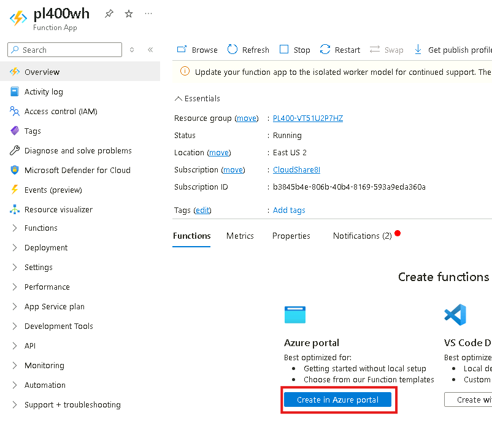

   - Select **Create function** under **Create in Azure portal**.

   - Select **HTTP trigger** for Template.
  
     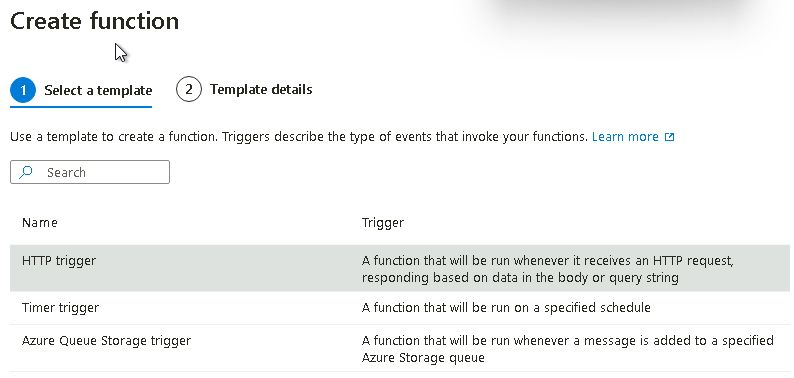

   - Select **Next**.

   - Enter `WebHookTrigger` for Function name.

   - Select **Function** for Authorization level.

     

   - Select **Create**.

1. Test the function

   - Select the **Code + Test** tab.

     

   - Select **Test**/**Run**.

     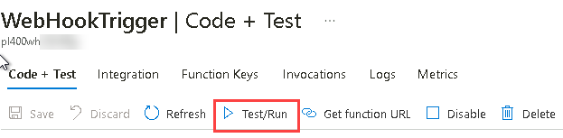

   - Select **Run**.

   - You should see **Hello, Azure** in the output.

     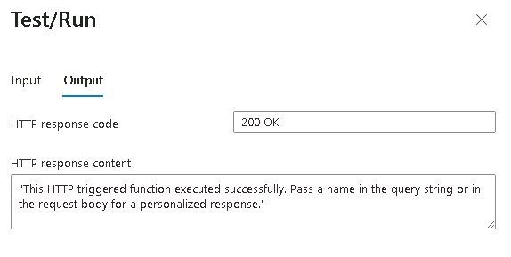

   - Close the test pane.

1. Edit the function

   - Replace the entire Task method with the method below.

     ```csharp
     public static async void Run(HttpRequest req, ILogger log)
     {
         log.LogInformation("C# HTTP trigger function processed a request.");

         string requestBody = await new StreamReader(req.Body).ReadToEndAsync();
         dynamic data = JsonConvert.DeserializeObject(requestBody);
         string indentedJson = JsonConvert.SerializeObject(data, Formatting.Indented);
         log.LogInformation(indentedJson);
     }   
     ```

   - Save your changes.

     

1. Remove HTTP output

   - Select the **Integration** tab.

     

   - Select the **HTTP Output**.

     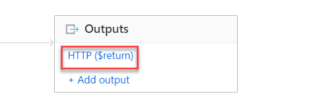

   - Select **Delete**.

     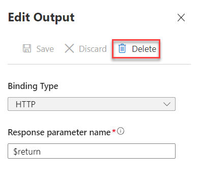

   - Select **Delete**.

1. Get the function endpoint

   - Select the **Code + Test** tab and then select **Get function URL**.

     

   - Select **Copy to clipboard** against the **default (Function key)** and then select **Close**.

     

   - Save the **URL** in a notepad, you will need it in the next exercise.

1. Get the function key

   - Select the **Function Keys** tab.

     

   - Select **Copy to clipboard** against the **default** key.

   - Save the **key** in a notepad, you will need it in the next exercise.

## Exercise 6: Configure Webhook

### Task 6.1: Configure publishing to a webhook

1. Start the Plug-in Registration Tool.

   - Start the developer command prompt tool.

   - Run the command below to launch the Plugin Registration Tool (PRT).

     ```dos
     pac tool prt
     ```

1. Connect to your Dataverse environment.

   - Select **+ CREATE NEW CONNECTION**.

     

   - Select **Office 365** for Deployment Type.
   - Check **Display list of available organizations**.
   - Check **Show Advanced**.
   - Enter your tenant credentials.

     

   - Select **Login**.

   - Select the Development environment and select **Login**.

1. Register webhook.

   - Select **Register** and then select **Register New Web Hook**.

     

   - Enter `NewSize` for **Name**.

   - Go to the notepad where you saved the function URL and copy everything before the **?**.

     

   - In the Plugin Registration Tool, paste the URL you copied in the **Endpoint URL** field.

      

   - Select **WebhookKey** for **Authentication**.

   - Go back to the notepad and copy the function key.

   - In the Plugin Registration Tool, paste the key you copied in the **Value** field.

      

   - Select **Save**

1. Register new step on update of new size column.

   - Select the **Webhook** you registered, select **Register** and then select **Register New Step**.

     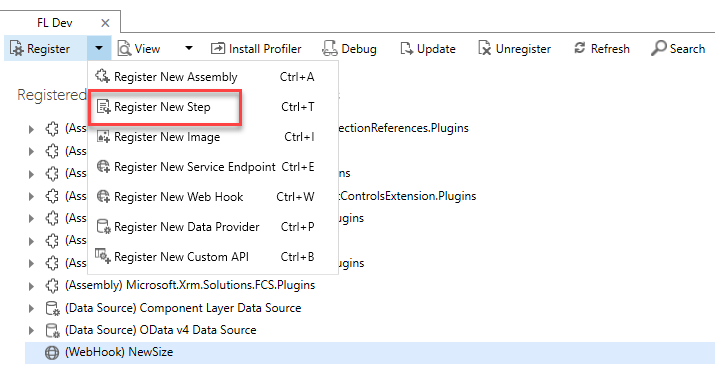

   - Enter `Update` for **Message**.

   - Enter `contoso_permit` for **Primary Table**.

   - Select **Filtering Attributes.**

     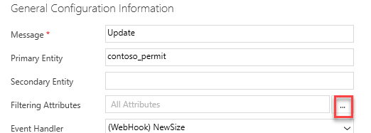

   - Uncheck **Select All**.

   - Select **New Size**.

     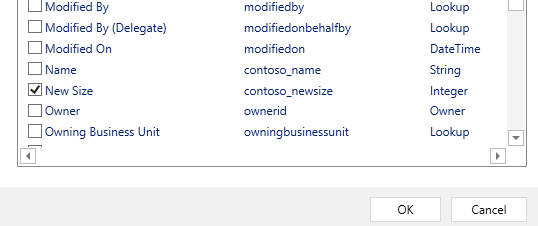

   - Select **OK**.

   - Select **PostOperation** from dropdown for **Event Pipeline Stage of Execution**.

   - Select **Asynchronous** for Execution Mode

     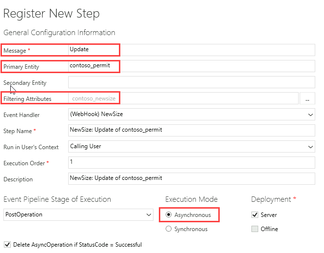

   - Select **Register New Step**.

   - Step should now be registered in the WebHook.

1. Register images.

   - Select the **NewSize** step you created, select **Register** and then select **Register New Image**.

     

   - Check **Pre Image**.

   - Check **Post Image**.

   - Enter `Permit Image` for **Name**.

   - Enter `PermitImage` for **Entity Alias**.

   - Select the **Parameters** button.

     

   - Uncheck **Select All**.

   - Select **Build Site**, **Contact**, **Name**, **New Size**, **Permit Type**, and **Start Date**.

     

   - Select **OK**.

     

   - Select **Register Image**.

### Task 6.2: Test the Webhook

1. Configure formatted output when monitoring the function.

   - Go back to your **Azure Function**.

   - Select **Monitor**.

   - Select the **Logs** tab.

   - Select **App Insight Logs**

     

1. Update Permit record.

   - Navigate to the Power Apps Maker portal `https://make.powerapps.com/`.
   - Select **Apps**.
   - Select the **Permit Management** app, select the **ellipses (...)** and select **Play**.
   - Select **Permits**.
   - Open the **Test Permit** record.

     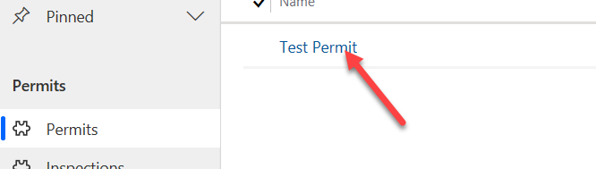

   - Change the **New Size** to **5000**.

      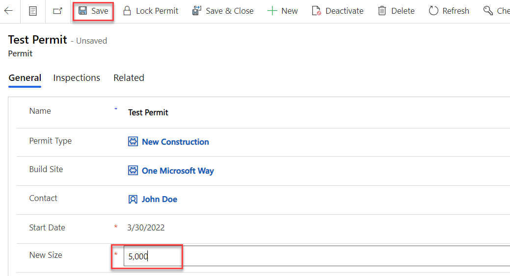

   - Select **Save**.

1. Check Azure logs.

   - Go back to your **Azure Function**.

   - You should see logs like the image below. The Output is a serialized context object.

     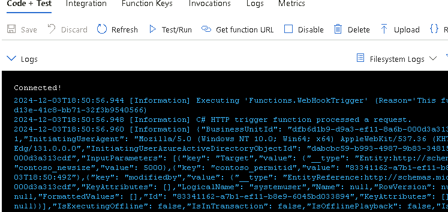

   - Select **Clear**.

      

1. Confirm the function executes only when the New Size value changes

   - Go back to the **Test Permit** record.

   - Change the **Start Date** to tomorrow’s date and select **Save**.

      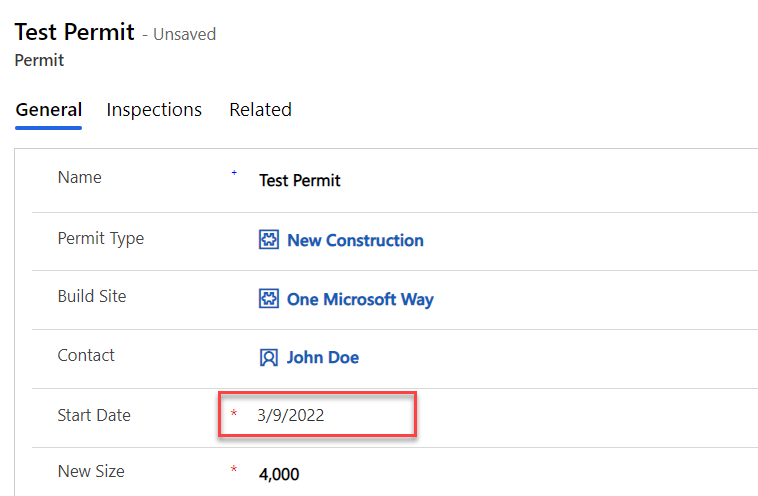

   - Go back to your **Azure Function**.

   - The log is empty and the function did not execute.

1. Update Permit record.

   - In the  **Permit Management** app, select **Permits**.

   - Open the **Test Permit** record.

   - Change the **New Size** to **4000**.

   - Select **Save**.

1. Check Azure logs.

   - Go back to your **Azure Function**.

   - The logs should now show both **Pre** and **Post** entity images. In this case you should see the old value **5000** in **Pre** image and the new value **4000** in the **Post** image

      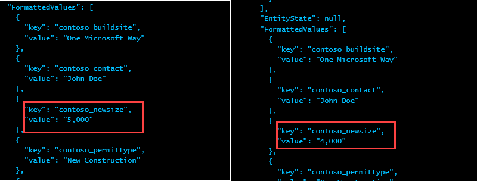

### Task 6.3: Add webhook to the solution

1. Add webhook to solution.

   - Navigate to the Power Apps Maker portal `https://make.powerapps.com/`.
   - Select **Solutions**.
   - Open the **Permit Management** solution.

   - Select **Add existing** and select **More** and **Developer** and **Service endpoint**.

   - Select the **NewSize** webhook and then select **Add**.

   - Select **Add existing** and select **More** and **Developer** and **Plug-in step**.

   - Select the **NewSize: Update of contoso_permit** step and then select **Add**.

## Exercise 7: Create the Azure Function for a custom connector

**Objective:** In this exercise, you will create an Azure function that will calculate the CPM.

The connector could have multiple actions defined on it. However, for our lab we will define a single action **Get Required CPM** – where CPM stands for Cubic X Per Minute. In some regions this would be Cubic Feet Per Minute, and in others it could be Cubic Meters Per Minute. The action we are building will take the dimensions of a room and the number of air exchanges required by policy. The action logic will calculate the required CPM for that configuration. If you want, you can add additional actions to support other inspection type scenarios to the API and the custom connector.

After building the API and the custom connector you will modify the inspector app. You will use the same connector and invoke an action from Power Automate.

### High-level steps for custom connector

As part of configuring the custom connector, you will complete the following

- Create an Azure function
- Create a custom connector in a solution
- Configure the security and actions on the custom connector
- Test the custom connector
- Configure a canvas app to use the connector

### Task 7.1: Create Azure Function for CPM Calculation

1. Create function

   - Sign in to the Azure portal `https://portal.azure.com`.

   - Select **All Resources**, search for `pl400wh`, and open the function app you created in the previous lab.

   - Select the **Functions** tab.

     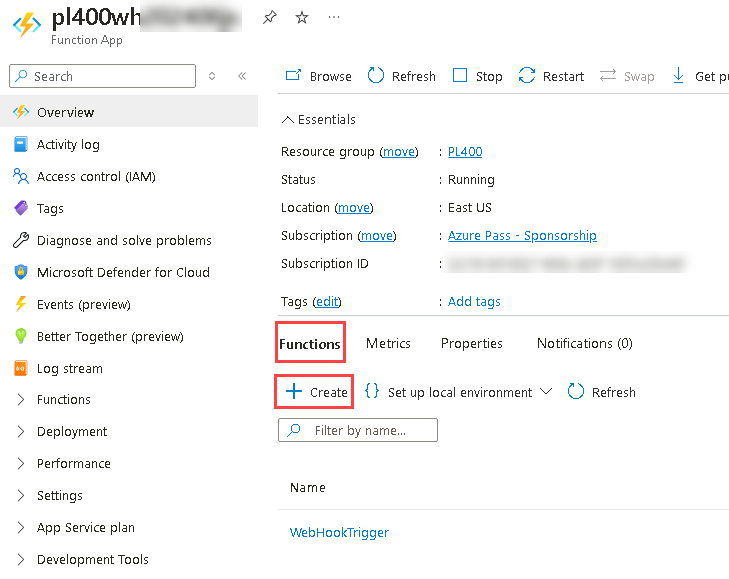

   - Select **+ Create**.

   - Select **HTTP trigger** for Template.

   - Select **Next**.

   - Enter `CPMTrigger` for Function name.

   - Select **Function** for Authorization level.

   - Select **Create**.

1. Add the **Using Statements** and **CPMCalcRequest** class to the function.

   - Select the **Code + Test** tab.

     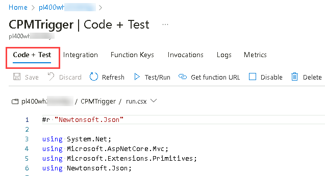

   - Add the Using Statements below to the function.

     ```csharp
     using Microsoft.Extensions.Logging;
     using Newtonsoft.Json.Linq;
     ```

     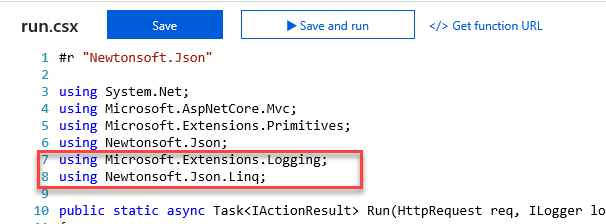

1. Clean up the Run method

   - Go to the **Run** method.

   - Remove everything but the log line from the **Run** method.

    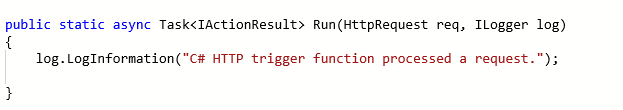

1. Add class for the request.

   - Add the public class below to the function. This will describe the request that will be sent from the applications using the API.

     ```csharp
     public class CPMCalcRequest
     {
         public int Width=0;
         public int Height=0;
         public int Length=0;
         public int AirChanges=0;
     }
     ```

     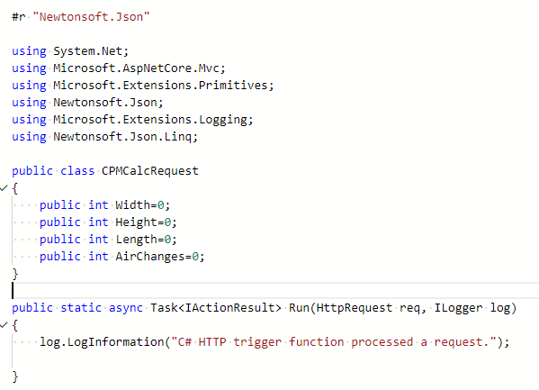

1. Get the Request body and deserialize it as **CPMCalcRequest**.

   - Get the request **Body** from the request argument. Add the code below inside the **Run** method.

     ```csharp
     string requestBody = await new StreamReader(req.Body).ReadToEndAsync();
     ```

   - Deserialize the request body. Add the code below inside the **Run** method.

     ```csharp
     CPMCalcRequest calcReq = JsonConvert.DeserializeObject<CPMCalcRequest>(requestBody);
     ```

    

1. Calculate the CPM and return it form the Run method

   - Calculate the **CPM** and log the calculated value. Add the code below inside the **Run** method.

     ```csharp
     var cpm = ((calcReq.Width*calcReq.Height*calcReq.Length) * calcReq.AirChanges) / 60;
     log.LogInformation("CPM " + cpm);
     ```

   - Return the calculated **CPM**. Add the code below inside the Run method.

     ```csharp
     return (ActionResult)new OkObjectResult(new{
         CPM = cpm
     });
     ```

     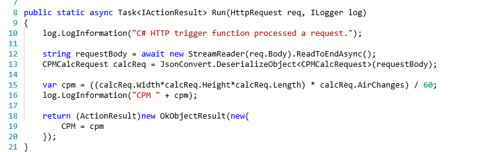

   - Select **Save**.

1. Select **Test/Run**.

1. In the Body copy the following input values.

   ```JSON
   {
    "Width": 10,
    "Height": 15,
    "Length": 10,
    "AirChanges": 6
   }
   ```

1. Select **Run**.

1. the result should be as follows.

   ```JSON
   {
    "cpm": 150
   }
   ```

1. Close the Test pane.

1. Get the function endpoint

   - Select the **Code + Test** tab and then select **Get function URL**.

     

   - Select **Copy to clipboard** against the **default (Function key)** and then select **Close**.

     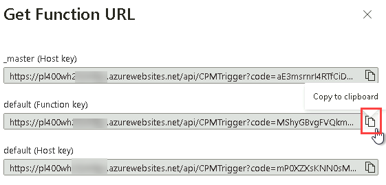

   - Save the **URL** in a notepad, you will need it in the next exercise.

1. Get the function key

   - Select the **Function Keys** tab.

     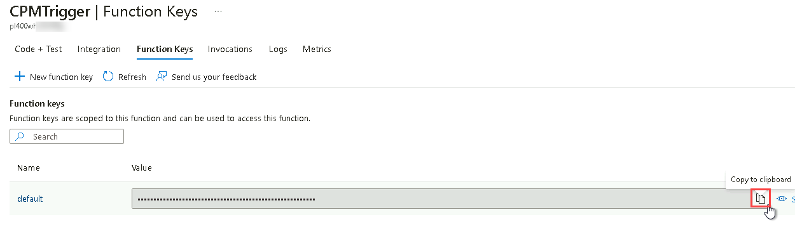

   - Select **Copy to clipboard** against the **default** key.

   - Save the **key** in a notepad, you will need it in the next exercise.

## Exercise 8: Create the Custom Connector

**Objective:** In this exercise, you will create the Custom Connector. This same approach could be used to describe any existing API you create or that has been created by any third party.

### Task 8.1: Create the Custom Connector

1. Open the Permit Management solution

   - Navigate to the Power Apps Maker portal `https://make.powerapps.com/`.
   - Select **Solutions**.
   - Open the **Permit Management** solution.

1. Create Custom Connector

   - Select **+ New** and select **Automation** and select **Custom connector**.

     

   - Enter `CPM Calculator` for **Connector Name**.

     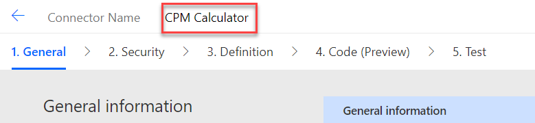

   - Locate the **Host** column and paste the **Function URL** you copied in Exercise 1.

   - Remove https:// and everything after .net.

     

1. Add API key for security.

   - Select **Security ->**.

     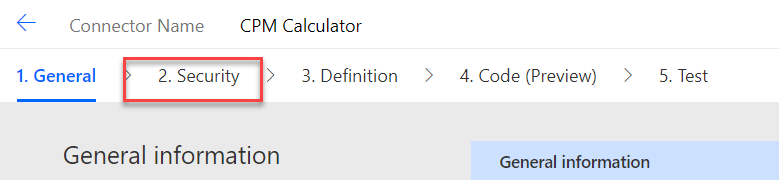

   - Select **API Key** for Authentication type.

     

   - Enter `API Key` for Parameter label.

   - Enter `code` for Parameter name

   - Select **Query** for Parameter Location.

     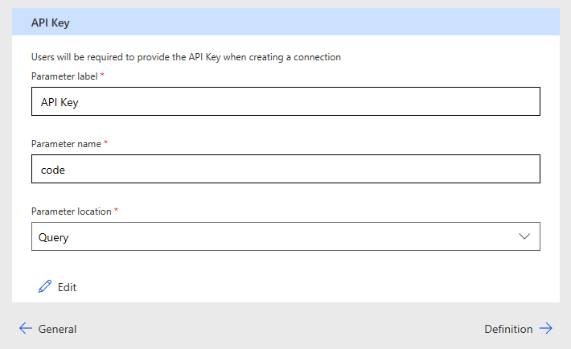

1. Define action.

   - Select **Definition**.

     

   - Select **New Action**. The action describes each operation that the API has. These can be manually defined like we are doing here or can be imported from Open API for larger APIs.

     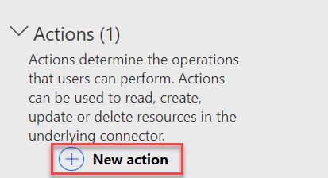

   - Enter `CPM Calculator` for Summary

   - Enter `Calculates CPM` for Description.

   - Enter `GetRequiredCPM` for Operation ID.

     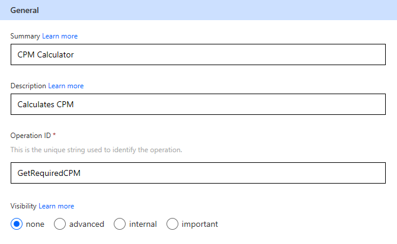

   - Under **Request**, select **+ Import from Sample**.

     

   - Select **POST** for **Verb**.

   - Paste the function **URL** from your notepad and remove everything after **CPMTrigger**.

     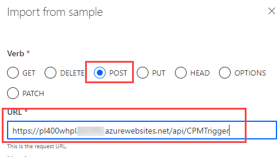

   - Paste the json below in the **Body** field.

     ```json
     {
         "Width": 15,
         "Height": 8,
         "Length":20,
         "AirChanges":8
     }
     ```

     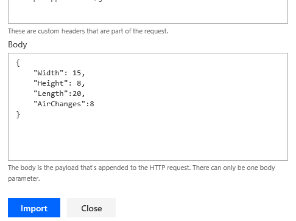

   - Select **Import**.

   - Under **Response**, select **+ Add default response**.

     

   - Paste the json below in the **Body**.

     ```json
     {"cpm":200}
     ```

     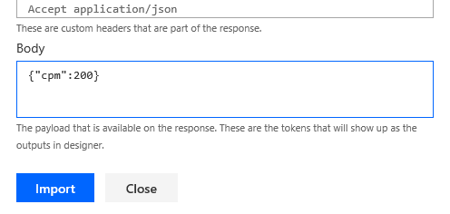

   - Select **Import**.

1. Create connector.

   - Select **Create Connector** and wait for the connector to be created.

     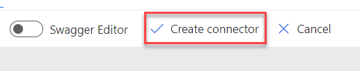

1. Test the connector

   - Advance to **Test**.

     

   - Select **+ New connection**. This will open a New window.

     

   - Go back to the notepad and copy the function key.

   - Go back to the connector and paste the value you copied.

     

   - Select **Create connection**.

   - Select the **Refresh** icon.

     

   - The connection should be selected.

   - Enter test data,

     - Enter 15 for **Width**.
     - Enter 8 for **Height**.
     - Enter 15 for **Length**.
     - Enter 5 for **AirChanges**..

     

   - Select **Test operation**.

   - You should get a CPM value back.

     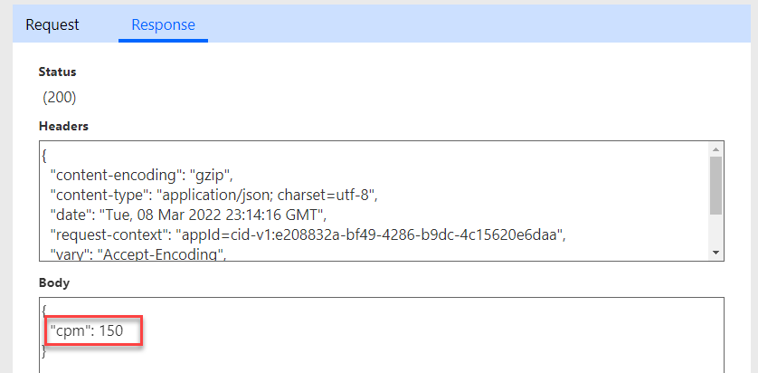

   - Select **Close**,

   - Close the **Custom connectors** tab.

   - Select **Done.**

## Exercise 9: Test Connector

**Objective:** In this exercise, you will use the Custom Connector from a canvas app.

### Task 9.1: Test in Canvas app

1. Open the Permit Management solution

   - Navigate to the Power Apps Maker portal `https://make.powerapps.com/`.
   - Select **Solutions**.
   - Open the **Permit Management** solution.

1. Edit the Inspector canvas app.

   - Select **Apps** and select to open the **Inspector** Canvas app.

     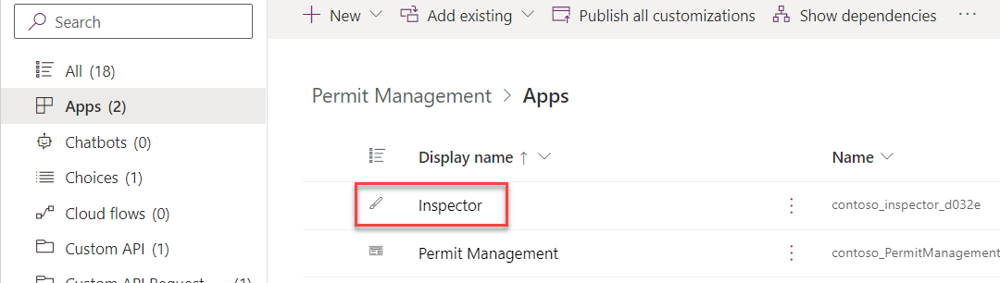

1. Add new screen to the application.

   - Select **New Screen** and then select **Blank**.

     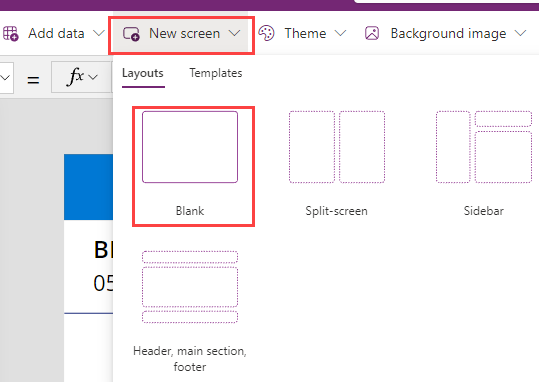

   - Rename the screen `CPM Calc Screen`.

     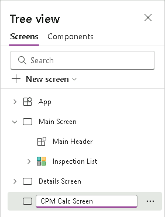

1. Add Input Text to the new screen.

   - Select the **CPM Calc Screen**.

   - Select **+ Insert** tab.

     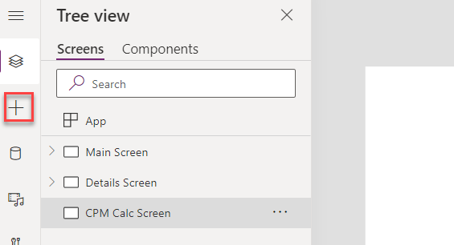

   - Select **Text input**.

     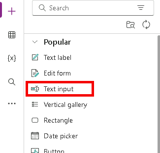

   - Select the **Tree View**.

     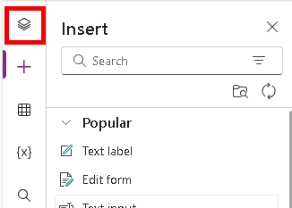

   - Rename the Text Input `Width Text`.

   - Remove the **Default** property of the **Width** text input.

     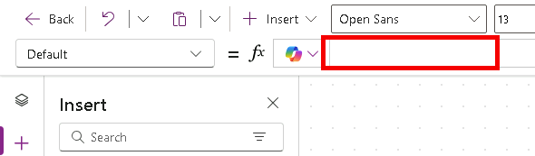

   - Change the **HintText** property of the **Width** text input to `"Provide Width"`.

    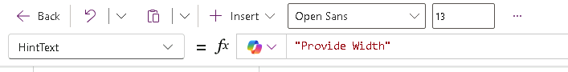

   - The **Width Text** input should now look like the image below.

     

1. Add Height, Length, and Air Change Input Text controls.

   - Copy the **Width Text**.

     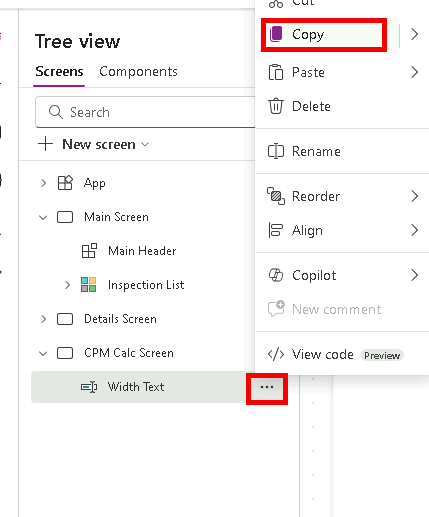

   - Paste the text input you copied to the **CPM Calc Screen.**

     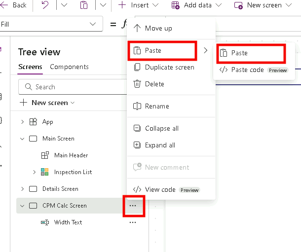

   - Paste the text input you copied to the **CPM Calc Screen** two more times.

   - The **CPMCalcScreen** should now have total of four text inputs.

     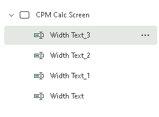

   - Rename the input text controls **Height Text**, **Length Text**, and **Air Change Text**.

     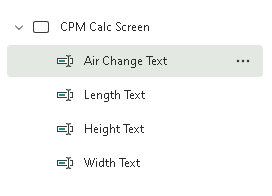

   - Change the **HintText** for the three text inputs you renamed to **Provide Height**, **Provide Length**, and **Provide Air Change**, respectively.

   - Resize and reposition the text inputs as shown in the image below.

     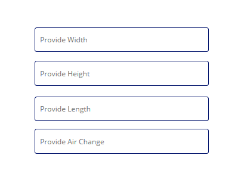

1. Add button.

   - Select **+ Insert** tab.

   - Select **Button**.

   - Select the **Tree view** tab.

   - Rename the button to `Calculate Button`.

   - Change the **Text** value of the button to `"Submit"`.

   - Resize and reposition the button as shown in the image below.

      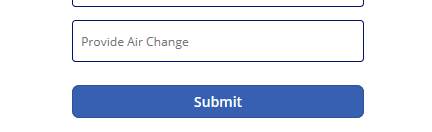

1. Add the result label to the screen

   - Select **+ Insert** tab.

   - Select **Text label**.

   - Select the **Tree view** tab.

   - Rename the label to `Result Label`.

   - Place the label to the right of the text inputs.

      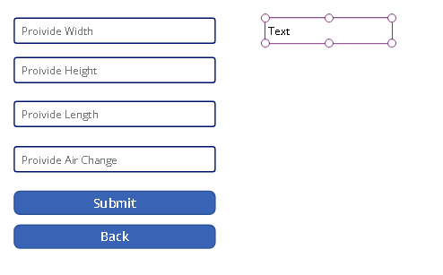

1. Add the Custom Connector to the app.

   - Select the **Data** tab.
  
     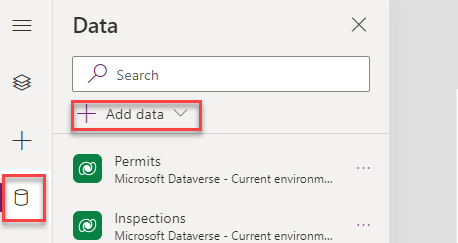

   - Select **+ Add data**.

   - Expand **Connectors**.

   - Select **CPM Connector**.

     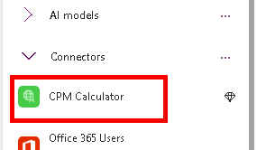

   - Select **CPM Calculator** again.

     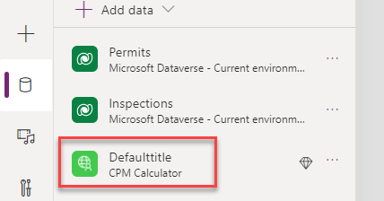

1. Get the calculated value when the button is selected

   - Select the **Tree view** tab.

   - Select **Calculate Button**.

   - Set the **OnSelect** property of the **Calculate Button** to the formula below.

     ```powerappsfl
     Set(CalculatedValue, Concatenate("Calculated CPM ", Text(Defaulttitle.GetRequiredCPM({Width: 'Width Text'.Text, Height: 'Height Text'.Text, Length: 'Length Text'.Text, AirChanges: 'Air Change Text'.Text}).cpm)))
     ```

     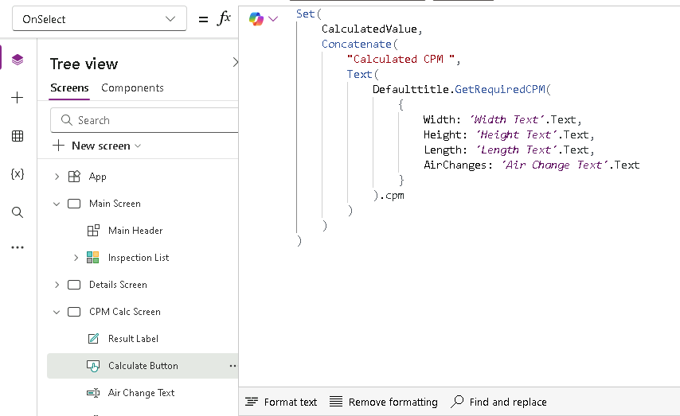

   - Select the **Result Label** and set the **Text** property to the **CalculatedValue** variable.

     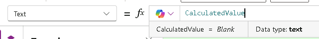

1. Add button to the Main screen.

   - Select the **Main Screen**.

   - Go to the **Insert** tab and select **Button**.

   - Select the **Tree view** tab.

   - Rename the button to `CPM Button`.

   - Change the **Text** value of the button to `"CPM Calculator"`.

   - Place the button on the bottom right of the **Main Screen**.

1. Navigate to the CPM Calc screen.

   - Select the **CPM Button** button.

   - Set the **OnSelect** property of the **CPM Button** to the formula below.

     ```powerappsfl
     Set(CalculatedValue, ""); Navigate('CPM Calc Screen', ScreenTransition.None);
     ```

     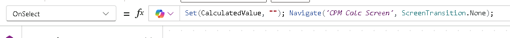

1. Test the app.

   - Select the **Main Screen** and select **Preview the app**.

    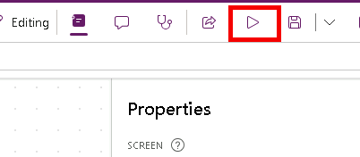

   - Select **CPM Calculator**.

   - The CPM Calc screen should load.

     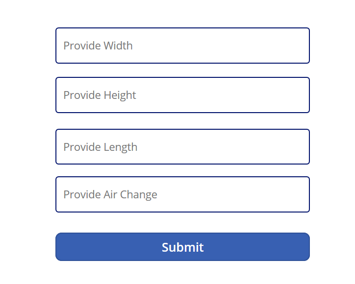

   - Enter values into the four fields and select **Submit**. You can notice the loading dots on top of the screen, which confirms that the request has been initiated.

     

   - The **Result Label** should show the calculated result from the Custom Connector.

     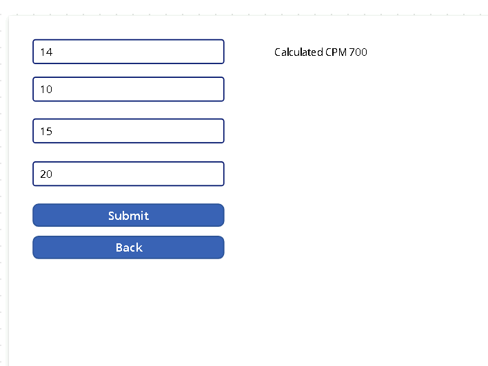

   - Close the Preview.

1. Save and publish the app.

   - Click the **Save** icon.
   - Click the **Publish** icon.
   - Select **Publish this version**.
   - Click the **<- Back** icon.
   - Select **Leave**.
