---
lab:
    title: 'Lab 09: Custom Connector'
---

> [!NOTE]
> Effective November 2020:
> - Common Data Service has been renamed to Microsoft Dataverse. [Learn more](https://aka.ms/PAuAppBlog)
> - Some terminology in Microsoft Dataverse has been updated. For example, *Table* is now *table* and *Column* is now *column*. [Learn more](https://go.microsoft.com/fwlink/?linkid=2147247)
>
> This content will be updated soon to reflect the latest terminology.

## Lab 09 – Custom Connector

# Scenario

A regional building department issues and tracks permits for new buildings and updates for remodeling of existing buildings. Throughout this course you will build applications and automation to enable the regional building department to manage the permitting process. This will be an end-to-end solution which will help you understand the overall process flow. 

In this lab you will build a custom connector that can be used from Power Apps and Power Automate. Custom connectors describe existing APIs and allow them to be used easily. In this lab, you will build an API that has common calculations used by inspectors so that they can be used by applications. After building the API, you will create a custom connector definition to make it available to Power Apps and Power Automate.

The connector could have multiple actions defined on it. However, for our lab we will define a single action **Get Required CPM** – where CPM stands for Cubic <N> Per Minute. In some regions this would be Cubic Feet Per Minute, and in others it could be Cubic Meters Per Minute. The action we are building will take the dimensions of a room and the number of air exchanges required by policy. The action logic will calculate the required CPM for that configuration. If you want, you can add additional actions to support other inspection type scenarios to the API and the custom connector. 

After building the API and the custom connector you will modify the inspector app to add the user experience to use the connector. You will use the same connector and invoke an action from Power Automate.

# High-level lab steps

As part of configuring the custom connector, you will complete the following

- Create an Azure function that implements the CPM API

- Create a custom connector in a solution

- Configure the security and actions on the custom connector

- Test the custom connector

- Configure a Power Apps canvas app to use the connector

- Configure a Power Automate to use the connector

## Things to consider before you begin

- Is there a standard approved connector already available that can be used?

- What security will we use in our connector?

- What are possible triggers and actions of the connector? 

- Are there any API rate limits that could potentially affect the connector?

 

# Exercise #1: Create the Azure Function

**Objective:** In this exercise, you will create an Azure function app and the function that will calculate the CPM.

## Task #1: Create CPM Calculation Function

1. Create the function app

	- Sign in to [Azure portal](https://portal.azure.com/)

	- Click **Create a Resource**.

    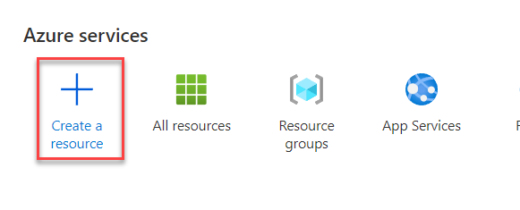

	- Search for **Function** and select **Function App**.

    

	- Click **Create**.

    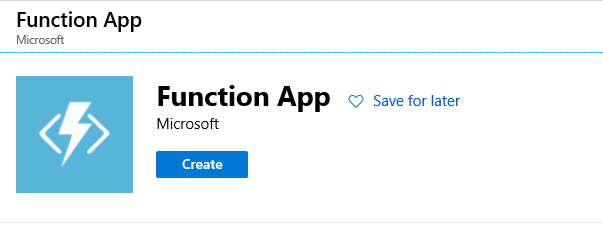

	- Enter **CPMCalculator** for **App Name**. Provide a unique name, if CPMCalculator is not available.

	- Create **New Resource Group**. You may select an existing Resource Group if you already created one for this course.

	- Select **.NET Core** for **Runtime Stack**, select your **Region** and click **Review + Create**.

 

    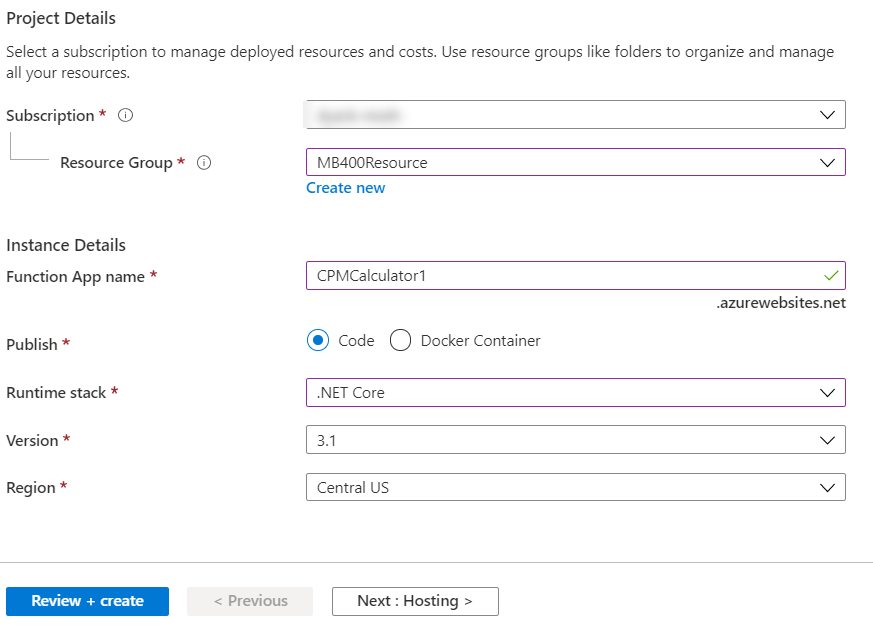

	- Click **Create**. Wait for the function app to be created

2. Create function

	- Click **Go to Resource**.

    

	- Select **Functions** and click **+ Add**.

    

	- Select **HTTP trigger**.

	- Click **Create Function.**

3. Add the **Using Statements** and **CRMCalcRequest** class to the function.

	- Select **Code + Test**.

    

	- Add the Using Statements below to the function.

            using Microsoft.Extensions.Logging;
            using Newtonsoft.Json.Linq;

    

	- Add the public class below to the function. This will describe the request that will be sent from the applications using the API.

            public class CPMCalcRequest
            {
                public int Width=0;
                public int Height=0;
                public int Length=0;
                public int AirChanges=0;
            }

    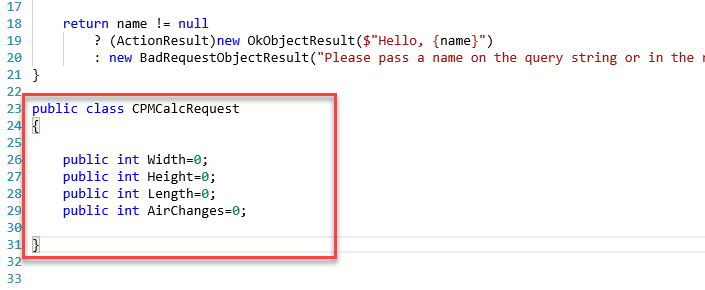

4. Clean up the Run method

	- Go to the **Run** method.

	- Remove everything but the log line from the **Run** method.

    

5. Get the Request body and deserialize it as **CRMCalcRequest**

	- Get the request **Body** from the request argument. Add the code below inside the **Run** method.

            string requestBody = await new StreamReader(req.Body).ReadToEndAsync();

	- Deserialize the request body. Add the code below inside the **Run** method.

            CPMCalcRequest calcReq = JsonConvert.DeserializeObject<CPMCalcRequest>(requestBody);

    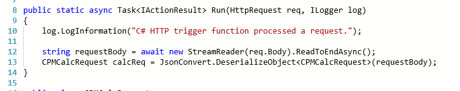

6. Calculate the CPM and return it form the Run method

	- Calculate the **CPM** and log the calculated value. Add the code below inside the **Run** method.

            var cpm = ((calcReq.Width*calcReq.Height*calcReq.Length) * calcReq.AirChanges) / 60;
            log.LogInformation("CPM " + cpm);

	- Return the calculated **CPM**. Add the code below inside the Run method.

            return (ActionResult)new OkObjectResult(new{
                CPM = cpm
            });

    

7. Click **Save** to save your changes.

8. Copy the Function URL.

	- Click **Get Function URL**.

    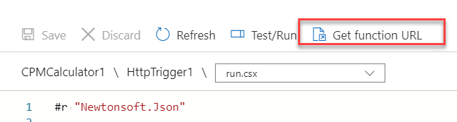

	- Click **Copy**.

    

	- Keep the URL you copied on a notepad. You will need this URL while creating the custom connector.

# Exercise #2: Create the Custom Connector

**Objective:** In this exercise, you will create the Custom Connector. This same approach could be used to describe any existing API you create or that has been created by any 3rd parties and an existing connector for that service is unavailable. 

## Task #1: Create the Custom Connector

1. Open the Permit Management solution

	- Sign in to [Power Apps maker portal](https://make.powerapps.com/) and make sure you are in the **Dev** environment.

	- Select **Solutions**.

	- Click to open the **Permit Management** solution.

    

2. Create Custom Connector

	- Click **+ New**.

    

	- Select **Automation| Custom Connector**.

    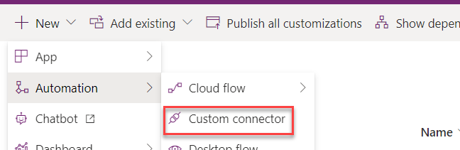

	- Change the **Connector** **Name** from **Untitled** to **CPM Calculator**.

    

	- Locate the **Host** Column and paste the **Function URL** you copied in Exercise 1.

	- Remove https:// and everything after .net. 

    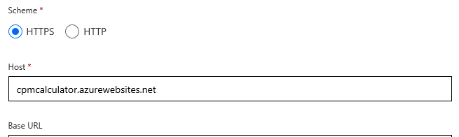

3. Select API key for security and create the connector

	- Advance to **Security**.

    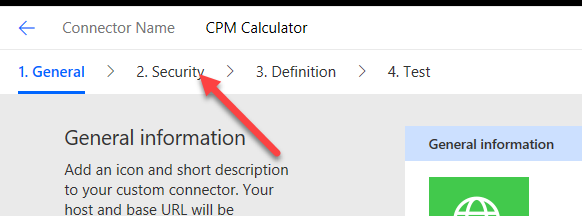

	- Select **API Key**.

    

	- Enter **API Key** for **Parameter Label**, **code** for **Parameter Name**, and select **Query** for **Parameter Location**.

    

4. Create Connector

	- Advance to **Definition**.

    

	- Click **Create Connector** and wait for the connector to be created.

    

5. Create Action

	- Click **New Action**. The action describes each operation that the API has. These can be manually defined like we are doing here or can be imported from Open API or Postman collection files for larger APIs.

    

	- Enter **CPM Calculator** for **Summary**, **Calculates CPM** for **Description**, and **GetRequiredCPM** for **Operation ID**.

    

6. Import request from sample

	- Click **+ Import from Sample**.

    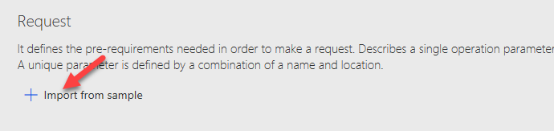

	- Select **Post** for **Verb**.

	- Paste the function **URL** from your notepad and remove everything after **HttpTrigger1**.

    

	- Paste the json below in the **Body** field and click **Import**.

            {
                "Width": 15,
                "Height": 8,
                "Length":20,
                "AirChanges":8
            }

    

7. Add Default response

	- Scroll down to the **Response** section and click **+ Add Default Response**.

    

	- Paste the json below in the **Body** and click **Import**.

            {"cpm":200}

    

	- Click **Update Connector**.

    

8. Test the connector

	- Advance to Test.

    

	- Click **New Connection**. This will open a New window.

    

	- Go to your notepad and copy only the value of the **code**.

    

	- Go back to the connector, paste the value you copied, and click **Create Connection**.

    

	- Refresh the connections and select newly created connection.

	- Provide values for **Width**, **Height**, **Length**, and **AirChanges**.

	- Click **Test Operation**.

    

	- You should get a CPM value back.

    

	- Close the window and go back to Solution window and click **Done.**

	- Click **Publish all Customizations.**

 

  
‎ 

# Exercise #3 Test Connector 

**Objective:** In this exercise, you will use the Custom Connector from a Power 9Apps canvas app and a Power Automate.

## Task #1: Test on Canvas App

1. Open the Permit Management solution

	- Sign in to [Power Apps maker portal](https://make.powerapps.com/) and make sure you are in the **Dev** environment.

	- Select **Solutions.**

	- Click to open the **Permit Management** solution.

2. Open the Inspector canvas application in edit mode

	- Locate the **Inspector Canvas App**.

	- Click on the **… More Commands** button and select **Edit**. This will open the app in a New window.

    

3. Add new screen to the application

	- Click **New Screen** and select **Blank**.

    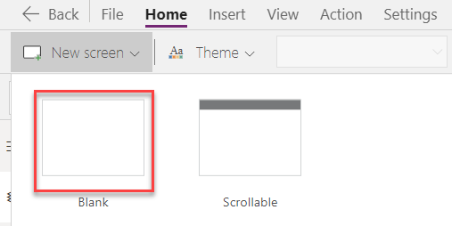

	- Rename the screen **CPM Calc Screen**

    

4. Add Input Text to the new screen

	- Select the **CPM Calc Screen**.

	- Click **Insert**.

    

	- Drag and drop **Text Input** to the screen.

    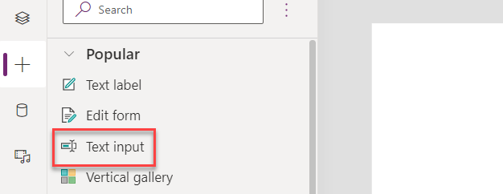

	- Select the **Tree View**.

    

	- Rename the Text Input **Width Text**.

	- Remove the **Default** property of the **Width** text input.

    

	- Change the **HintText** property of the **Width** text input to **Provide Width**.

    

	- The **Width Text** input should now look like the image below.

    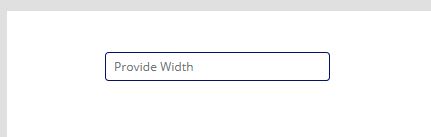

5. Add Height, Length, and Air Change Input Text controls

	- Copy the **Width Text**.

    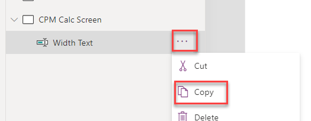

	- Paste the text input you copied to the **CPM Calc Screen.**

    

	- Paste the text input you copied to the **CPM Calc Screen** two more times.

	- The **CPMCalcScreen** should now have total of four text inputs.

    

	- Rename the input text controls **Height Text**, **Length Text**, and **Air Change Text**.

    

	- Change the **HintText** for the three text inputs you renamed to **Provide Height**, **Provide Length**, and **Provide Air Change**, respectively.

	- Resize and reposition the text inputs as shown in the image below.

    

6. Add button

	- Go to the **Insert** tab and click Button.

    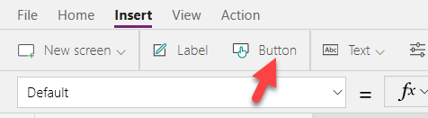

	- Rename the Button **Calculate Button**.

	- Change the **Calculate Button Text** value to **Submit**.

	- Resize and reposition the button as shown in the image below.

    

7. Add the result label to the screen

	- Go to the **Insert** tab and click Label

	- Rename the Label **Result Label**.

	- Place the label to the right of the text inputs.

    

8. Add the Custom Connector to the application.

	- Select the **Data Sources** tab.

	- Expand **Connectors**.

	- Click the **CPM Connector**.

    

	- Click **CPM Calculator** again.

    

	- The **CPM Calculator** should now be listed in the **In your App** section.

    

9. Get the calculated value when the button is clicked

	- Select the **Calculate Button**.

	- Set the **OnSelect** value of the **Calculate Button** to the formula below.

            Set(CalculatedValue, Concatenate("Calculated CPM ", Text(Defaulttitle.GetRequiredCPM({Width: 'Width Text'.Text, Height: 'Height Text'.Text, Length: 'Length Text'.Text, AirChanges: 'Air Change Text'.Text}).cpm)))

    

	- Select the **Result Label** and set the **Text** value to the **CalculatedValue** variable.

    

10. Add navigation button to the Main screen

	- Select the **Main Screen**.

	- Go to the **Insert** tab and click **Button**.

	- Rename the Button **CPM Button**.

	- Change the **CPM Button** **Text** value to **CPM Calculator**.

	- Place the button on the bottom right of the **Main Screen**.

 

11. Steps to navigate to the CPM Calc Screens

	- Select the **CPM Calculator**.

	- Set the **OnSelect** value of the **CPM Calculator** to the formula below.

            Set(CalculatedValue, ""); Navigate('CPM Calc Screen', ScreenTransition.None)

    

12. Run the Application

	- Select the **Main Screen** and click **Preview the App**.

    

	- Click on **CPM Calculator** button.

	- The CPM Calculator screen should load.

    

	- Provide values and click **Submit**. You can notice the loading dots on top of the screen, which confirms that the request has been initiated.

    

	- The **Result Label** should show the calculated result from the Custom Connector.

    

	- Close the Preview.

	- Click **File** and **Save**.

	- **Publish** the changes to the application.

	- Click **Close**.

Click **Done** on the other window for the solution.

 

## Task #2: Test on Flow

1. Open the Permit Management solution

	- Sign in to [Power Apps maker portal](https://make.powerapps.com/) and make sure you are in the **Dev** environment.

	- Select **Solutions**.

	- Click to open the **Permit Management** solution.

2. Create Flow and add trigger.

	- Click **New** and select **Flow**. This will open a New window.

    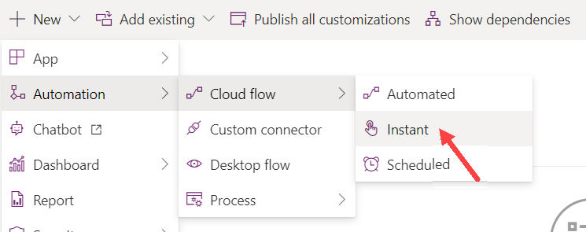

	- Search for **Manually** and select **Manually Trigger Flow**.

    

3. Add a step that will use the Custom Connector

	- Click **+ New Step**.

    

	- Select the **Custom** tab and click **CPM Calculator**.

    

	- Select **CPM Calculator** action.

    

4. Provide values and save

	- Enter 18 for Width, 10 for Height, 18 for Length, 30 for AirChanges, and click **Save**.

    

5. Test the Flow

	- Click **Test**.

    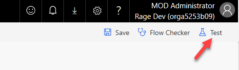

	- Select **I will Perform the Trigger** and click **Save &amp;** **Test**.

	- Click **Continue**.

    

	- Click **Run Flow**.

	- Click **Done.** The Flow should run successfully. In the Flow run history, expand the CPM Calculator action. 

    

	- You should be able to see the calculated result from the custom connector in the output of the action.

    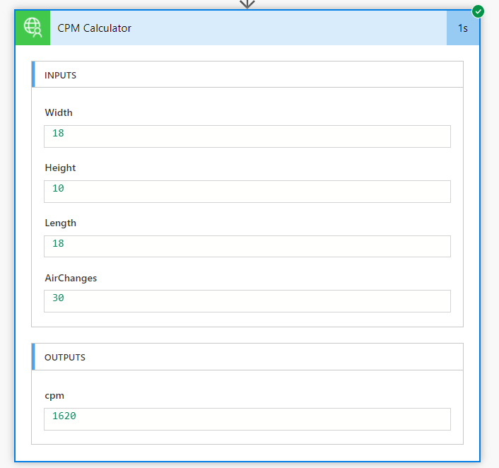

	- Close the window and go back to Solution window. Click **Done.** 

	- Click **Publish all Customizations.**

	- If you finish early, try adding input values to the Manual Button trigger for the room dimensions and use those to call the custom connector. You could also use the notification connector to send the user the required CPM. Finally, if you want to test this in a real device install the Power Automate mobile application.

    

 
