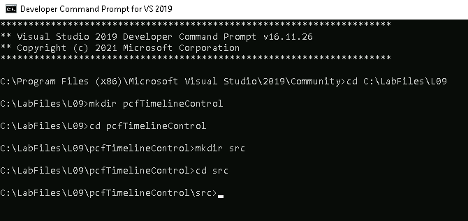
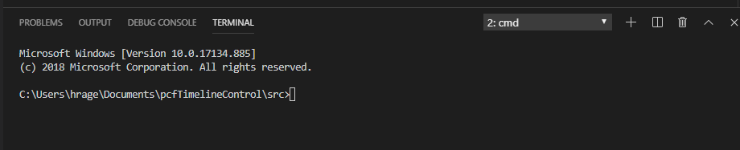
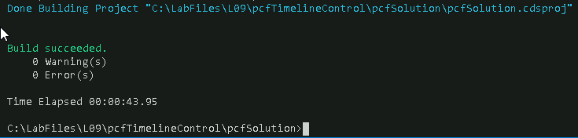
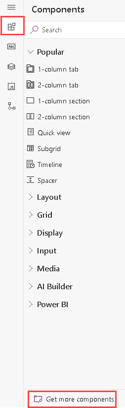
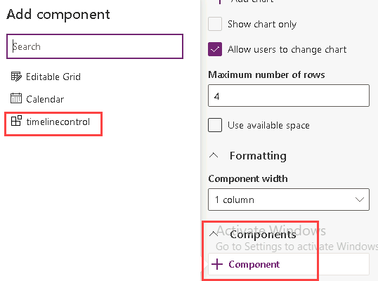
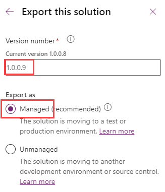
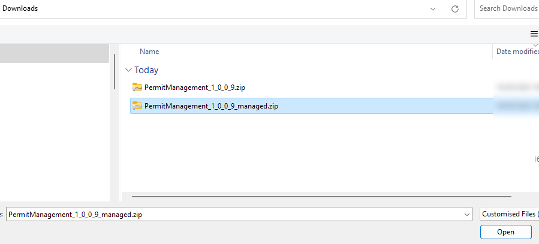

---
lab:
    title: 'Lab 9: Power Apps Component Framework (Optional)'
    module: 'Module 8: Create code components with the Power Apps Component Framework'
---

# Practice Lab 9 – Power Apps Component Framework

## Scenario

In this lab you will develop a custom component control using the Power Apps Component Framework (PCF). This component will be used to visualize the permit inspection history timeline. As you build the component, you will see how to use prescriptive interfaces of the framework to interact with the hosting form data. To speed things up we will use a community timeline library to render the visualization. When you build such controls, you can either follow the same procedure or use popular frameworks like React or Vue to completely control the visualization that the component will render.

## High-level lab steps

As part of building this component, you will complete the following steps:

- Use the Power Apps CLI to initialize the new component
- Build the component logic using Typescript
- Publish the component for use on forms
- Configure the permit form to use the component

This is what the component will look like when it is completed.

 

## Things to consider before you begin

- What are the advantages of using a Power Apps Component Framework component over an embedded Power Apps canvas app?
- Remember to continue working in your DEVELOPMENT environment. We’ll move everything to production soon.

## Starter solution

A starter solution file for this lab can be found in the  C:\Labfiles\L09\Starter folder.

## Completed solution

Completed solution files for this lab can be found in the  C:\Labfiles\L09\Completed folder.

## Resources

Complete source code files for this lab can be found in the  C:\Labfiles\L09\Resources folder.

> [!IMPORTANT]
> You should have installed .NET 4.6.2 and Power Apps CLI in an earlier lab. If you have not completed the steps in the Power Platform Tools lab, you must complete those before starting this lab.

## Exercise 1: Create the PCF Control

**Objective:** In this exercise, you will create a Power Apps Components Framework control using the Power Apps CLI.

### Task 1.1: Node.js

1. Install Node.js

   - Navigate to [Node JS](https://nodejs.org/en/)

   - Select the latest **LTS** version.

     

   - Open the downloaded file.

   - Follow the steps in setup wizard to complete installing **Node.js**.

### Task 1.2: Setup code component project

1. Start the developer command prompt tool.

   - Launch the **Developer Command Prompt** from the start menu.

     

1. Create a folder named named **pcfTimelineControl** for the code component.

   - Run the following commands.

     ```dos
     cd C:\LabFiles\L09
     mkdir pcfTimelineControl
     cd pcfTimelineControl
     mkdir src
     cd src
     ```

     

1. Create a solution project for a pcf dataset component named **timelinecontrol**.

   - Initialize the component. This command will create a set of files that will implement a dataset component. You will customize these files as we continue.

     ```dos
     pac pcf init --name timelinecontrol --namespace contoso --template dataset
     ```

   - Install dependencies by running **npm install** command in the Terminal

     ```dos
     npm install
     ```

   - Wait for the dependencies installation to complete.

1. Review the generated resources.

   - Open the **src** folder in **Visual Studio Code**.

     ```dos
     code .
     ```

   - **Visual Studio Code** should start, and it should open the **src** folder.

     

   - Expand the **timelinecontrol** folder.

   - Open the **ControlManifest.Input** xml file and examine it.

     

   - Open the **Index.ts** file and examine it.

   - Expand the **generated** folder.

   - Open the **ManifestTypes.d.ts** file and examine it.

1. Open CLI in Visual Studio Code

   - In Visual Studio Code, select **Terminal** and select **New Terminal**.

     

     > [!NOTE]
     > If Terminal is not visible in the menu, you can open it by selecting **View** -> **Terminal**.

   - If **cmd** isn’t your **Default Shell**, select the arrow and then select **Select Default Profile**.

     

   - Select **Command Prompt**.

     

   - Select **New Terminal**.

     

   - The **cmd** terminal should now open.

     

1. Run the Build command and review the out folder.

   - Run **npm build** in the terminal.

     ```dos
     npm run build
     ```

     > [!NOTE]
     > if you experience an error, try to modify the .eslintrc.json file and change the rules as follows and re-run npm run build.

     ``` JSON
     "rules": {
       "no-unused-vars": "off",
       "no-undef" : "off"
     }
     ```

   - You should now be able to see the out folder. Expand the folder and review its content.

     

1. Start the test harness.

   - Run **npm start** in the terminal.

     ```dos
     npm start
     ```

   - Select **Allow access** in the Windows Defender Firewall prompt.

   - This should open the Test Environment in a browser window.

     

   - The **Component** container size should change if you provide **Width** and **Height**.

     

1. Stop the test harness

   - Close the **Test Environment** browser window or tab.

   - In **Visual Studio Code**, click on the **Terminal** and press the **[CONTROL]** key and **c**.

   - Type **y** and **[ENTER].**

     

### Task 1.3: Setup solution

1. Create a new solution folder in the parent of the **src** folder **pcfTimelineControl**.

   - Change directory to the **pcfTimelineControl** folder.

     ```dos
     cd ..
     ```

   - You should now be in the **pcfTimelineControl** directory.

   - Create a new folder with the name **solution**.

     ```dos
     mkdir pcfSolution
     ```

   - Switch to the pcfSolution directory.

     ```dos
     cd pcfSolution
     ```

   - You should now be in the pcfSolution directory.

     

1. Create solution project and add reference of the **src** folder where the component is located to the solution. This configuration will be used when you are done with your development and ready to publish your component for others to use.

   - Create solution project with name and prefix contoso.

     ```dos
     pac solution init --publisher-name contoso --publisher-prefix contoso
     ```

   - Add component location to the solution. This creates a reference to include your component when the solution build command is run.

     ```dos
     pac solution add-reference --path ..\src
     ```

   - The project reference should be added successfully.

     

   - Edit the **solution.cdsproj** file  by entering `code .` in the Terminal window to start Visual Studio Code in the pcfSolution folder.

   - Add the following tag to the PropertyGroup.

     ```xml
     <OutputPath>bin\debug</OutputPath>
     ```

     

   - Select **File** and **Save All**.

   - Select **File** and **Close Window**.

1. Build the solution

   - Make sure you are still in the pcfSolution folder.

   - Build the project by running the command below.

     ```dos
     msbuild /t:build /restore
     ```

   - The build should succeed.

     

     > [!NOTE]
     > If you get the response where msbuild is not recognized as an internal or external command. This means that you ran a normal command prompt instead of Visual Studio's developer command prompt.

### Task 1.4: Build the Basic Timeline

1. Change to the **src** folder.

   - Run the following command in the Visual Studio Code Terminal window.

     ```dos
     cd ..\src
     ```

1. Add css file.

   - Select the **timelinecontrol** folder and then select **New Folder**.

     

   - Enter `css` and press [ENTER].

   - Select the **css** folder you created and then select **New File**.

     

   - Enter `timelinecontrol.css` and Press [ENTER].

1. Add the css file as a resource.

   - Open the **ControlManifest.Input.xml** file.

   - Locate the **resources** sub element and uncomment the **css** tag, change the **Order** to **2**.

     

1. Change the data-set name.

   - Locate **sampleDataSet** tag and change the name property to `timelineDataSet`.

     

1. Install vis-timeline css npm package.

   - Run the following command in the Visual Studio Code Terminal window and wait form the packages to be added.

     ```dos
     npm install vis-timeline
     ```

   - Run the following command in the Visual Studio Code Terminal window and wait form the packages to be added..

     ```dos
     npm install moment
     ```

   - Run the following command in the Visual Studio Code Terminal window and wait form the packages to be added..

     ```dos
     npm install vis-data
     ```

1. Add the vis-timeline css as a resource.

   - Open the **ControlManifest.Input.xml** file.

   - Add the vis-timeline css inside the resources tag.

     ```xml
     <css path="..\node_modules\vis-timeline\dist\vis-timeline-graph2d.min.css" order="1" />
     ```

     

1. Add timeline element and visual properties to the Index.ts file.

   - Open the **Index.ts** file.

   - Add the properties below, inside the **export** class timelinecontrol function.

     ```typescript
     private _timelineElm: HTMLDivElement;
     private _timelineVis : any;
     ```

     

   - Add the below constant after the import lines on the top.

     ```typescript
     const vis = require('vis-timeline');
     ```

     

1. Build the timeline element as div and add it to container element as a child.

   - Locate the **init** function.

   - Add the code below to the **init** function.

     ```typescript
     this._timelineElm = document.createElement("div");
     container.appendChild(this._timelineElm);
     ```
  
     

1. Create a function that will render the timeline.

   - Add the function below to the bottom of the class.

     ```typescript
     private renderTimeline(): void {
         // Create a DataSet (allows two way data-binding)
         var items = [
             { id: 1, content: 'item 1', start: '2023-08-20' },
             { id: 2, content: 'item 2', start: '2023-08-14' },
             { id: 3, content: 'item 3', start: '2023-08-18' },
             { id: 4, content: 'item 4', start: '2023-08-16', end: '2020-08-19' },
             { id: 5, content: 'item 5', start: '2023-08-25' },
             { id: 6, content: 'item 6', start: '2023-08-27', type: 'point' }
         ];
         // Configuration for the Timeline
         var options = {};
         // Create a Timeline
         var timeline = new vis.Timeline(this._timelineElm, items, options);
     }
     ```

     

1. Call the **renderTimeline** function from the **updateView** function.

   - Locate the **updateView** function.

   - Add the code below inside the **updateView** function.

     ```typescript
     this.renderTimeline();
     ```

     

   - Select **File** and then select **Save All**.

1. Build and start

   - Run the following command in the Visual Studio Code Terminal window.

     ```dos
     npm run build
     ```
  
   - The build should succeed.

   - Start the test harness. This command will keep the test environment running and auto update when you change the component.

     ```dos
     npm start watch
     ```

     

   - **Do not** close the test environment.

### Task 1.5: Tailor for Inspection Data

In this task, you will switch from using the hard-coded array of data to using a file loaded into the test harness.

1. Create test data csv file

    - Select the **src** folder and then select **New File**.

     

    - Name the new file `testdata.csv`.

    - Add the data below inside the **testdata.csv** file and Save it.

     ```
     contoso_permitid,contoso_name,contoso_scheduleddate,statuscode
     123,Electrical:Rough Inspection:Passed,8/1/2023,Passed
     124,Electrical:Rough Inspection:Passed,8/5/2023,Passed
     125,Plumbing:Rough Inspection:Failed,8/8/2023,Failed
     126,Plumbing:Rough Inspection:Passed,8/10/2023,Passed
     ```

     

1. Create Timeline Data class

   - Open the **index.ts** file.

   - Paste the code below at the top of the file after the **type DataSet** line.

     ```typescript
     class TimelineData {
         id: string;
         content: string;
         start: string;
         className: string;
          
         constructor(id: string, content: string, start: string, className: string) {
            this.id = id;
            this.content = content;
            this.start = start;
            this.className = className;
         }
     }
     ```

     

   - Add the timeline data array property inside the **export** class timelinecontrol function and below the **_timelineElm** definition.

     ```typescript
     private _timelineData : TimelineData[] = [];
     ```

     

1. Add a method that will create the timeline data.

   - Add the method below after the **renderTimeline** method at the bottom of the class.

     ```typescript
     private createTimelineData(gridParam: DataSet) {
         this._timelineData = [];
         if (gridParam.sortedRecordIds.length > 0) {
             for (let currentRecordId of gridParam.sortedRecordIds) {
           
                 console.log('record: ' + gridParam.records[currentRecordId].getRecordId());

                 var permitName = gridParam.records[currentRecordId].getFormattedValue('contoso_name')
                 var permitDate = gridParam.records[currentRecordId].getFormattedValue('contoso_scheduleddate')
                 var permitStatus = gridParam.records[currentRecordId].getFormattedValue('statuscode')
                 var permitColor = "green";
                 if (permitStatus == "Failed")
                     permitColor = "red";
                 else if (permitStatus == "Canceled")
                     permitColor = "yellow";
            
                 console.log('name:' + permitName + ' date:' + permitDate);


                 if (permitName != null)
                     this._timelineData.push(new TimelineData(currentRecordId, permitName, permitDate, permitColor));
             }
         }
         else {
             //handle no data
         }
     }
     ```

      

1. Call the createTimelineData method from the updateView method.

   - Go to the **updateView** method.

   - Replace the code inside the **updateView** method with the code below.

     ```typescript
     if (!context.parameters.timelineDataSet.loading) {
         // Get sorted columns on View
         this.createTimelineData(context.parameters.timelineDataSet);
         this.renderTimeline();
     }
     ```

     

1. Replace the hardcoded items with the csv data.

   - Locate the **renderTimeline** function.

   - Replace the hardcoded **items** with code below.

     ```typescript
     var items = this._timelineData;
     ```

     

1. Make sure the test environment shows your changes and test the timeline control with the test data.

   - Select **File** and then **Save All**.

   - The test harness should still be running. If it is not running run **npm start watch** command.

   - Go to the test environment and make sure it looks like the image below.

     

   - Select **+ Select a file**.

     

   - Select the **testdata.csv** and then select **Open**.

     

   - Select **Apply**.

     

   - The timeline control should now show the test data.

     

   - **Do not** close the test environment.

### Task 1.6: Change Color for Items

In this task, you will use the **css** resource you configured to change the color of the items on the timeline.

1. Add red and green styles to the timelinecontrol.css file

   - In **Visual Studio Code**, expand d the **css** folder and open the **timelinecontrol.css** file.

   - Add the style below to the **timelinecontrol.css** file and save your changes.

     ```css
     .red{
         background:red;
         color:white;
         }
     .green{
         background:green;
         color:white;
                }
     .yellow{
         background:yellow;
         color:black;
         }
     ```

     

   - Select **File** and then select **Save All**.

1. Check the test environment, load the test data and make sure it shows your changes.

   - Go to the **Test Environment**.

   - Select **+ Select a file**.

     

   - Select the **testdata.csv** and then select **Open**.

   - Select **Apply**.

   - The timeline control should now show the test data.

     

   - Close the test environment browser tab.

1. Stop the test.

   - Go back to **Visual Studio Code**.

   - Click on the **Terminal** and press the **[CONTROL]** key and **c**.

   - Type **y** and **[ENTER].**

## Exercise 2: Publish to Microsoft Dataverse

**Objective:** In this exercise, you will publish the timeline control to your Microsoft Dataverse and add it to the Permit main form.

### Task 2.1: Setup and Publish

1. Get your environment URL.

   - Navigate to [Power Platform admin center](https://admin.powerplatform.microsoft.com/) and select environments.
   - Locate and open your **Development** environment.
   - Right click and copy the **Environment URL**.

     

1. Authenticate.

   - Go back to **Visual Studio Code**.

   - Make sure you are still in the **src** directory.

   - Run the command below. Replace **&lt;Environment URL&gt;** with the **URL** you copied.

     ```dos
     pac auth create --url <Environment URL>
     ```

   - Sign in with your tenant credentials.

1. Build the solution.

   - Change directory to the **pcfSolution** folder.

     ```dos
     cd ..\pcfSolution
     ```

   - Build the project by running the command below.

     ```dos
     msbuild /t:build /restore
     ```

1. Import the solution into your org and publish.

   - Run the command below and wait for the publishing to complete.

     ```dos
     pac solution import
     ```

     

### Task 2.2: Add Timeline Control to the Permit Form

1. Open the Permit Management solution.

   - Navigate to [Power Apps maker portal](https://make.powerapps.com/)
   - Select your **Development** environment.
   - Select **Solutions**.
   - Open the **Permit Management** solution.

1. Add the PCF component to the solution.

   - Select **+Add existing** and then **More** and **Developer** and **Custom control**.

     

   - Select **contoso_contoso_timelinecontrol**.

     

   - Select **Add**.

1. Open the Permit Main form.

   - Select **Tables** and open the **Permit** table.

     

   - Under **Data experiences**, select **Forms**.

   - Open the **Main** form.

     

   - Select the ellipses **...** for the **Main** form, select **Edit** and select **Edit in new tab**.

1. Add Timeline control to the form.

   - Select the **Components** tab.

   - Select **Get more components**.

     

   - Select **timelinecontrol** and select **Add**.

1. Add Timeline control to the form.

   - Locate the **Inspections** tab.

   - Click on the **Inspections** sub-grid.

   - In the Properties pane, scroll down and expand **Components**.

   - Select **+ Component**.

     

   - Select **timelinecontrol**.

   - Select **Done**.

     

   - Select **Save and publish**.

   - Close the form editor.

   - Select **Done**.

1. View inspection records

   - Navigate to the [Power Apps maker portal](https://make.powerapps.com).
   - Make sure you are in the Development environment.
   - Select **Apps**.
   - Select the **Permit Management** app, select the **ellipses (...)** and select **Play**.
   - Select **Inspections**.
   - Select **Edit columns**.
   - Select **+ Add columns**.
   - Select **Permit**.
   - Select **Status Reason**.
   - Select **Close**.
   - Select **Apply**.
   - All inspections should be set to **Pending**.

1. Create test data

   - Open the **Framing Inspection** record.

   - Change the **Status Reason** to **Passed**.

     

   - Select **Save & Close**.

   - Open the **Electric Inspection** record.

   - Change the **Status Reason** to **Failed**.

     

   - Select **Save & Close**.

   - Open the **Mechanical Inspection** record.

   - Change the **Status Reason** to **New Request**.

   - You should have four inspections for Test Permit; one Passed, one Failed, one New Request, and one Pending.

     

1. Test the control

   - Select **Permits**.

   - Open the **Test Permit** record.

     

   - Select the **Inspections** tab.

   - The control should show the four inspections, but the color will not match the status reason colors.

     

### Task 2.3: Debug

1. Start Dev Tools and add breakpoint.

   - Press **F12** or right click and select **Inspect**.

   - Press **Ctrl** + **Shift** + **F** to open Search in Dev Tools.

   - Search for **createTimelineData = function**.

     

   - Click on the **createTimelineData** function. This will open index.ts in DevTools.

   - Add a breakpoint on the **permitColor =”green”** line.

     

   - Go back to the Permit Management application and click Refresh.

     

   - Select the **Inspections** tab again.

   - Execution should break.

   - Hover over the **permitStatus**, the **permitStatus** is null because **Status Reason** is not included in the **View** used by the subgrid.

     

   - Press **F5** to continue.

   - Close **Dev Tools**.

### Task 2.4: Add Status Reason to Inspections view

1. Open the Permit Management solution.

   - Navigate to the [Power Apps maker portal](https://make.powerapps.com/)
   - Select your **Development** environment.
   - Select **Solutions**.
   - Open the **Permit Management** solution.

1. Edit the Inspections view.

   - Expand **Tables**.

   - Select the **Inspection** table.

   - Under **Data experiences**, select **Views**.

   - Select the **Active Inspections** view.

   - Select the ellipses **...** for the **Active Inspections** view, select **Edit** and select **Edit in new tab**.

   - Drag the **Status Reason** column and drop it after the **Scheduled Date** column.

   - Select **Save and publish** and wait for the publishing to complete.

   - Close the view editor tab.

   - Select **Done**.

1. Test your changes

   - Go back to the **Permit Management** app and refresh the browser.

     

   - Select the **Inspections** tab. The timeline control should now show the correct colors.

     

## Exercise 3: Export and import solution

**Objective:** In this exercise, you will export the solution you created in the development environment and import it to the production environment.

### Task 3.1: Export solution

1. Export managed solution.

   - Select the **Overview** tab in the solution.
   - Select **Export**.

     

   - Select **Publish** and wait for the publishing to complete.

     

   - Select **Next**.
   - Set the version number to `1.0.0.9`.
   - Select **Managed**.

     

   - Select **Export**.

       

   - Click **Download** to download the managed solution on your machine.

1. Export unmanaged solution.

   - Select **Export** again.
   - Select **Next**.
   - Edit the version number to match the Managed solution you just exported i.e., `1.0.0.9`.
   - Select **Unmanaged**.
  
    

   - Select **Export**.
   - Click **Download** to download the unmanaged solution on your machine.

### Task 3.2: Import solution

1. Import the Permit Management solution.

   - Sign in to [Power Apps maker portal](https://make.powerapps.com/)
   - Select your **Production** environment.

1. Import solution.

   - Select **Solutions**.
   - Select **Import solution**.
   - Select **Browse**.
   - Select the **Managed** solution file you exported in the previous task and then select **Open**.

     

   - Select **Next**.

   - Expand **Advanced settings** and make sure **Upgrade** is selected.
  
     

   - Select **Next**.

   - In the Connections pane, select **Select a connection** and select **+New connection**.

   - Select **Create** and sign in with your tenant credentials.

   - Close the Connections browser tab.

   - Select **Refresh**.

   - Select **Import** and wait the import to complete.
