---
lab:
    title: 'Lab 10 – Application Lifecycle Management'
---

PL400: Microsoft Power Apps Developer

## Lab 10 – Application Lifecycle Management

# Scenario

A regional building department issues and tracks permits for new buildings and updates the remodeling of existing buildings. Throughout this course you will build applications and automation to enable the regional building department to manage the permitting process. This will be an end-to-end solution which will help you understand the overall process flow.

In this lab you will use Azure DevOps for source control of your solution assets. As you have been building your app you have been tracking all the changes in a Permit Management solution. You have exported this solution, so you had a back up copy. You have also manually imported the managed version of the solution into your production environment. As part of this lab you will see how you can automate working with solutions and use the Power Apps Azure DevOps tasks to check the changes into an Azure DevOps Repository. This is the start of an overall ALM process that you would put in place to automate the complete lifecycle form development to production using Azure DevOps automation. In this lab you will be completing the first phase of that automation.

# High-level lab steps

As part of configuring Azure DevOps ALM automation, you will complete the following

- Sign up for an Azure DevOps account

- Create an Azure DevOps project

- Configure the Power Apps ALM tasks

- Build an export solution pipeline

- Test the export from dev to Azure DevOps

## Things to consider before you begin

- How often are you planning to run the build process?

- Is it going to be fully automated or run manually?

- How many users will be committing changes into the repositories and how often?

- How many instances are you planning to control? 

- Are there any other build tasks you should consider?

  
‎ 

# Exercise #1: Initialize Azure DevOps

**Objective:** In this exercise, you will setup an Azure DevOps account to track the solution assets of the Permit Management app.

## Task #1: Sign up for Azure DevOps

1. Sign up for Azure DevOps

	- Navigate to [Azure DevOps](https://dev.azure.com/)

	- Provide your admin credentials and sign in.

	- Click **Sign into Azure DevOps**. Note: Use the same account you have been using to build the Permit Management app.

    

	- Click **Continue**.

    

	- Provide a unique **Azure DevOps Organization** like **FL-PermitManagement** (replace FL with your first and last initials), select your region and click **Continue**.

    

2. Create the Azure DevOps project

	- Enter **Permit Management** for **Project Name**, select **Private**, and click **Create Project**.

    

3. Initialize Repository

	- Select **Repos**.

    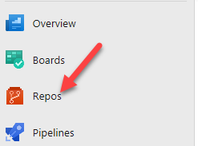

	- Scroll down to the bottom, check the **Add a Readme** checkbox, and click **Initialize**.

    

## Task #2: Configure Power Apps ALM Tasks

1. Get Power Apps BuildTools

	- Sign in to [Visual Studio marketplace](https://marketplace.visualstudio.com/azuredevops) 

	- Search for **Power Platform Build Tools**.

	- Select **Power Platform Build Tools**.

    

 

	- Click **Get it Free**.

    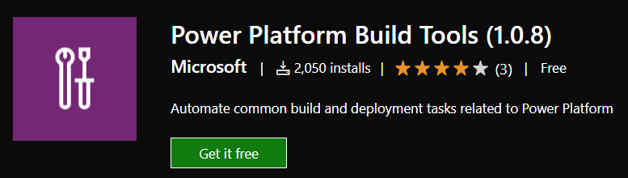

	- Select the **Azure DevOps** organization you created and click **Install**.

    

	- Click **Proceed to Organization**.

    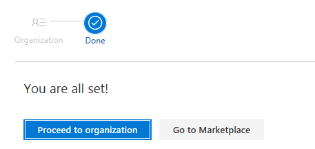

2. Go to Git repositories security

	- Click to open the **Permit Management** project you created.

    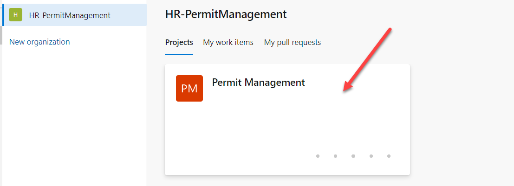

	- Click **Project Settings**.

    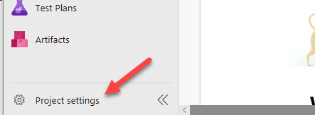

	- Select **Repositories**.

    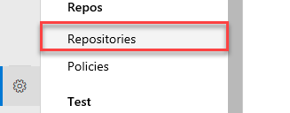

3. Add permissions to allow the build account to check in solution assets

	- Select the **Permit Management** project.

    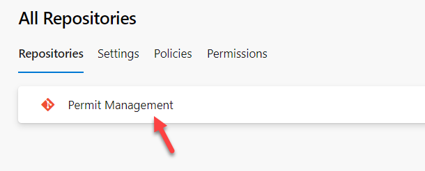

	- Select the **Permissions** tab.

	- Search for **Project Collection Build Service** and select the one without the accounts **Project Collection.**

    

4. Set Contribute permission for the Service Accounts

	- Select the **Project Collection Build Service**.

	- Locate the **Contribute** permission and select **Allow**.

    

	- Click **Show More** to expand the menu.

    

 

  
‎ 

# Exercise #2: Build Export Pipeline

**Objective:** In this exercise, you will build an Azure DevOps pipeline that will export the solution from the development CDS environment, unpack the solution file to individual files and then check those files into the repository.

## Task #1: Export the Solution

1. Create Build Pipeline

	- Click to expand **Pipelines**.

    

	- Click **New Pipeline**.

    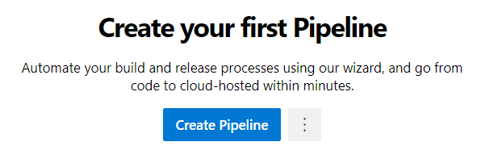

	- Click **Use the Classic Editor.**

    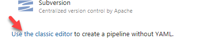

	- Don’t change the default values and click **Continue**.

    

	- Select **Empty Job**.

    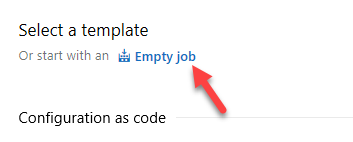

	- Click **Save and Queue** and select **Save**.

    

	- Click **Save**.

    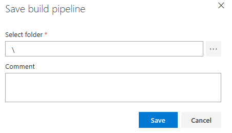

2. Add Power Apps Tool Installer task   
‎Note: The Power Apps Tool Installer needs to be run before any other Power Apps ALM tasks.

	- Click **+** icon to add Task to **Agent Job 1**.

    

	- Search for **Power Platform Tool,** hover over select **Power Platform Tool Installer** and click **Add**.

    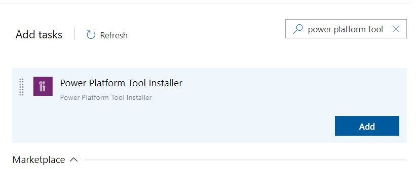

3. Add PowerApps Export Solution task

	- Search for **Export.**

	- Hover over **Power Platform Export Solution** and click **Add**.

    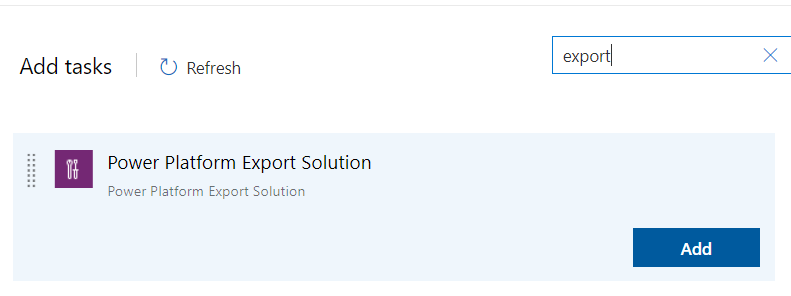

4. Open PowerApps Export Solution

	- Select the **Power Platform Export Solution** task.

    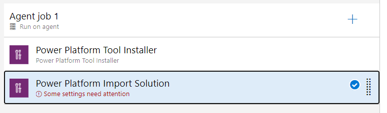

5. Get your Dev Environment URL

	- Start a new browser window or tab and sign in to [Power Platform admin center](https://admin.powerplatform.microsoft.com/support) 

	- Select **Environments** and click to open the **Dev** environment.

	- Copy the **Environment URL** and keep it in your clipboard.

    

	- Close the **Power Platform Admin** browser window or tab.

6. Create Generic Service Connection

	- Go back to the **Pipeline**.

	- Make sure you still have the **Power Platform Export Solution** task selected.

	- Click **Manage** service sonnection. This will open a new window.

    

	- Click **Create Service Connection**.

    

	- Select **Generic** and click **Next**.

    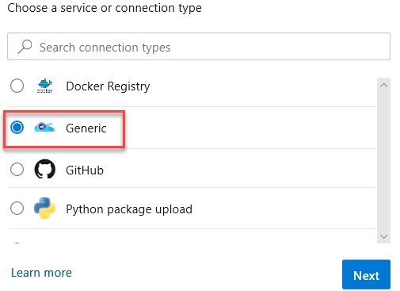

	- Paste the **Environment URL** you copied in Server URL, provide your admin credentials, provide a connection name, and click **Save**.

    

	- Close the **Service Connections** browser window or tab.

7. Select the Generic Service Connection you created as the Power Apps Environment URL

	- Go back to the **Build Pipeline** tasks and make sure you still have Power Apps Export Solution task selected.

	- Locate the **Power Apps Environment URL** field and click **Refresh**.

    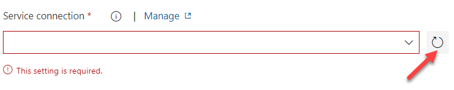

	- Select the **Generic Service Connection** you created.

    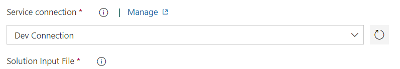

	- Enter **$(SolutionName)** for **Solution Name**, **$(Build.ArtifactStagingDirectory)\$(SolutionName).zip** for **Solution Output File**.

    

	- Click **Save and Queue** and select **Save**.

    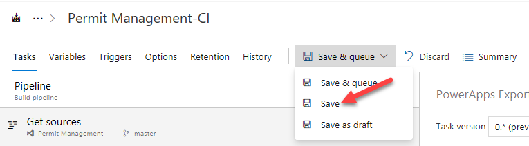

	- Click **Save** again.

8. Add Unpack task.
This task will take the solution zip file and expand it into a file for each solution component.

	- Click **+ Add Task**.

    

	- Search for **Unpack**.

	- Hover over **Power Platform Unpack Solution** and click **Add**.

    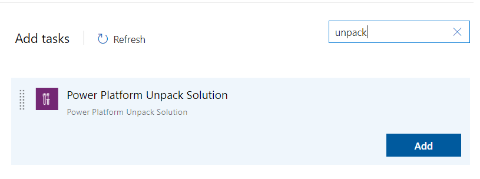

9. Provide Unpack settings information

	- Select the **Unpack** task.

	- Enter **$(Build.ArtifactStagingDirectory)\$(SolutionName).zip** for **Solution Input** **File**, **$(Build.SourcesDirectory)\$(SolutionName)** for **Target Folder**.  
‎    

	- Click **Save and Queue** and select **Save**.

	- Click **Save** again.

10. Allow scripts to access the OAuth Token.

	- Select **Agent Job 1**.

    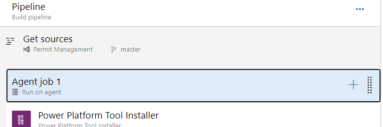

	- Scroll down and check the **Allow Scripts to Access the OAuth Token** checkbox.

    

11. Add Command Line task

	- Click **+ Add a Task**.

    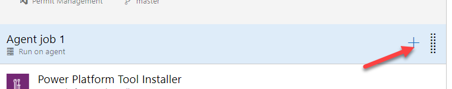

	- Search for **Command Line**.

	- Hover over **Command Line** and click **Add**.

    

12. Add Scripts to the Command Line task. This task will be used to check in the solution file changes to the repo.

	- Select the **Command Line** task.

	- Paste the script below in the **Script** text area. Replace **user@myorg.onmicrosoft.com** with your admin username.

            echo commit all changes
            git config user.email "user@myorg.onmicrosoft.com"
            git config user.name "Automatic Build"
            git checkout master
            git add --all
            git commit -m "solution init"
            echo push code to new repo
            git -c http.extraheader="AUTHORIZATION: bearer $(System.AccessToken)" push origin master

    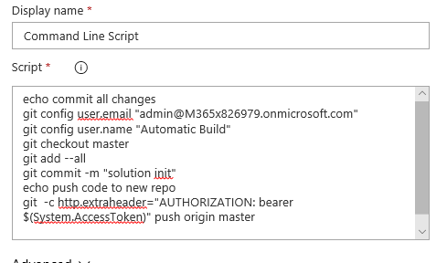

13. Add Solution Name variable

	- Select the **Variables** tab.

	- Click **+ Add.**

    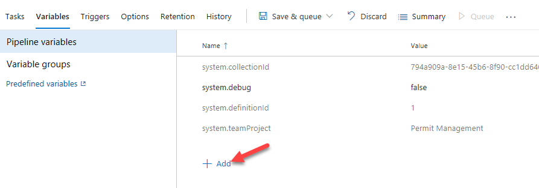

	- Enter **SolutionName** for **Name** and **PermitManagement** for **Value**.

    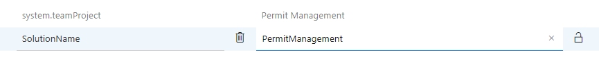

	- Click **Save and Queue** and select **Save**.

	- Click **Save** again.

 

 

  
‎ 

# Exercise #3: Test the Pipeline

**Objective:** In this exercise, you will test the build pipeline you created.

## Task #1: Run the Pipeline

1. Open the build pipeline

	- Sign in to [Azure DevOps](https://dev.azure.com/) and click to open the **Permit Management** project.

    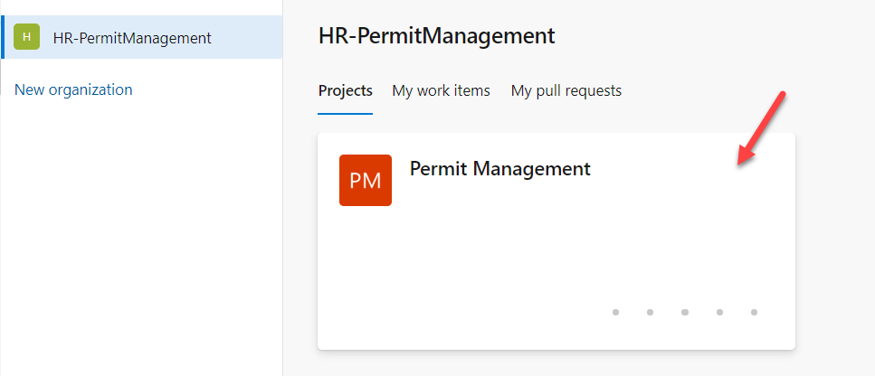

	- Click **Project Settings**.

    

	- Select **Repositories**.

    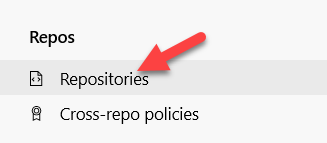

	- Select the **Permit Management** repository.

	- Select the **Permissions** tab.

	- Select **Permit Management Build Service** and **Allow** Contribute.

    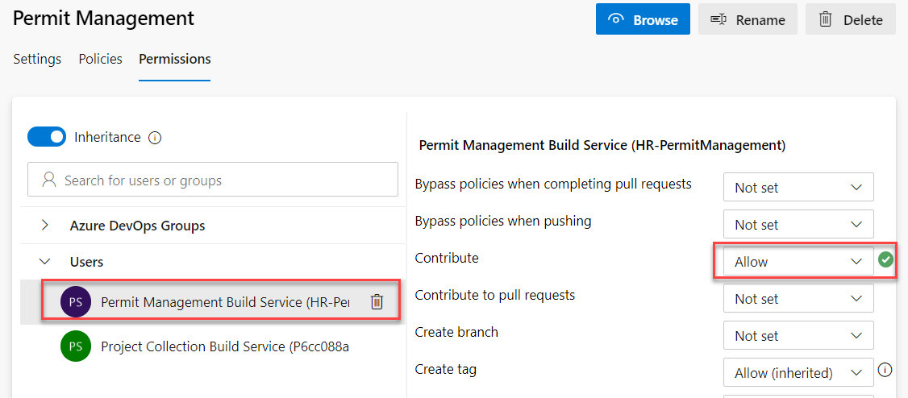

	- Select **Pipelines | Pipelines**.

    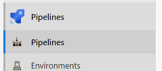

	- Select **Permit Management-CI**.

	- Click **Run Pipeline**.

    

	- Click **Run** again and wait.

    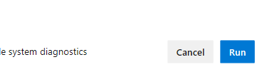

	- Wait until the job completed and click to open it.

    

	- The Build tasks should run and succeed

    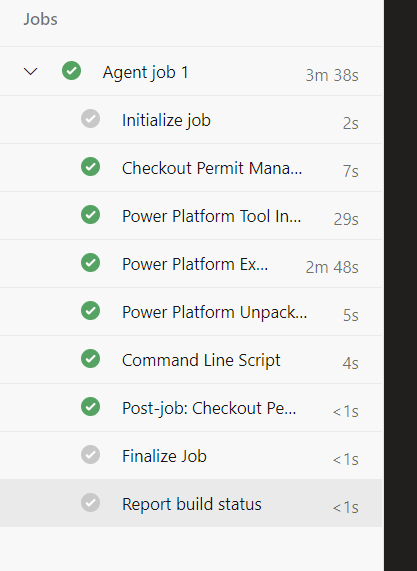

2. Review the Repository

	- Select Repos.

    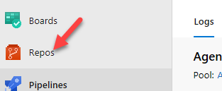

	- You should see **PermitManagement** folder. Click to open the folder.

    

	- The content of the folder should look like the image below.

    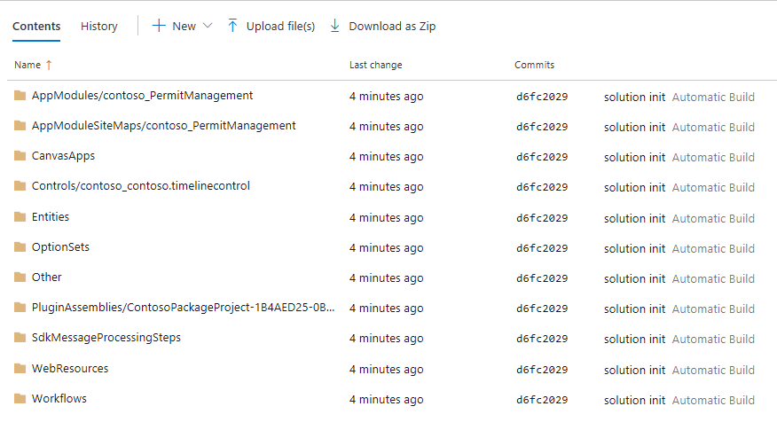

You may examine the content of each folder.

## Task #2: Modify Solution

1. Open the Permit Management solution

	- Sign in to [Power apps maker portal](https://make.powerapps.com/) and make sure you have the **Dev** environment selected.

	- Select **Solutions**.

	- Click to open the **Permit Management** solution.

    

2. Open the Permit entity form for edit

	- Click to open **Permit** entity.

    

	- Select the **Forms** tab and click to open the **Main** form.

    

3. Move the Contact lookup field

	- Drag the **Contact** lookup field and drop it between the **Start Date** and **New Size** fields.

    

	- Click **Save**.

	- Click **Publish** and wait for the publishing to complete.

    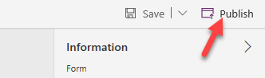

## Task #3: Run Build Pipeline  

1. Open Permit Management DevOps project

	- Sign in to [Azure DevOps](https://dev.azure.com/) 

	- Click to open the **Permit Management** project

    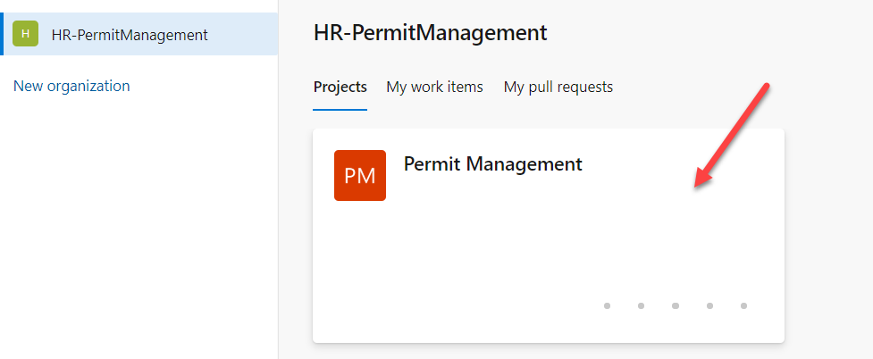

2. Run the build pipeline again

	- Select **Pipelines**.

    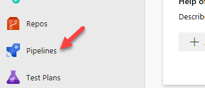

	- Select **Permit Management-CI**.

	- Click **Run Pipeline**.

    

	- Click **Run** and wait for the run to complete.

	- Open the job after it completes.

    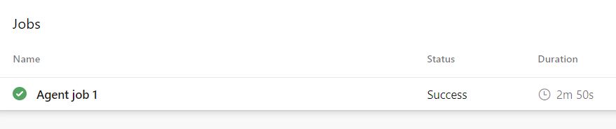

	- All the tasks should succeed again.

    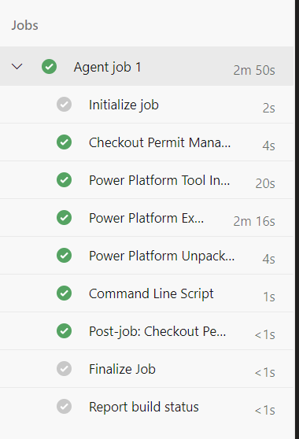

3. Check the Repository for the new changes

	- Select **Repos**.

    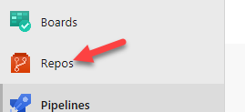

	- Select **Commits**.

    

	- Click to open then topmost commit.

    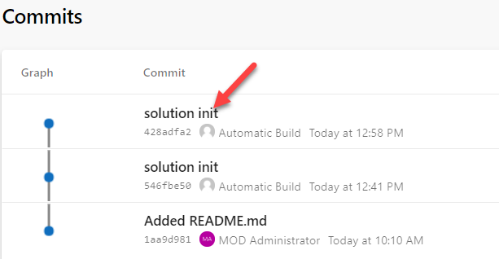

	- The changeset should look like the image below.

    

4. View side-by-side.

	- Click **View**.

    

	- Side-by-side view should load.

    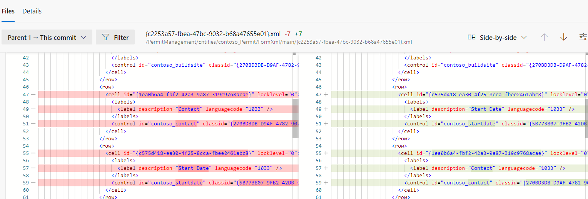
