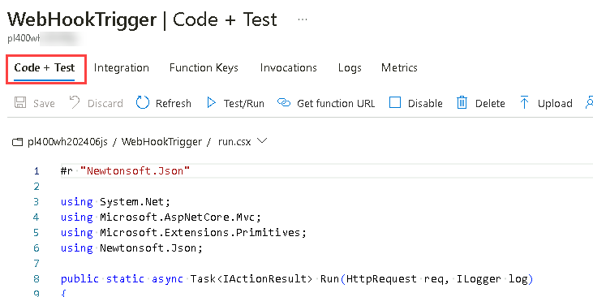
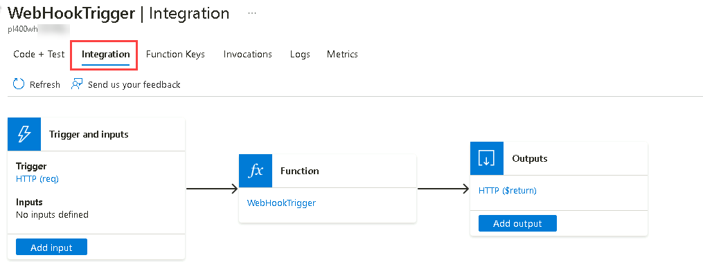
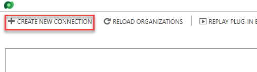
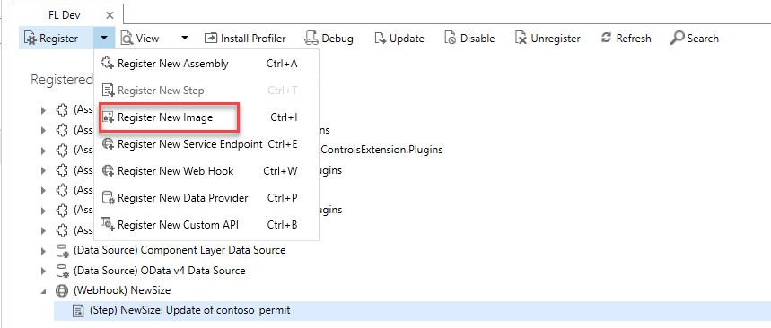
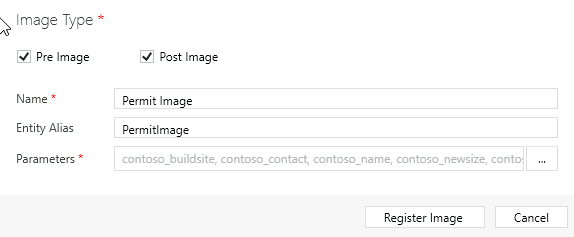
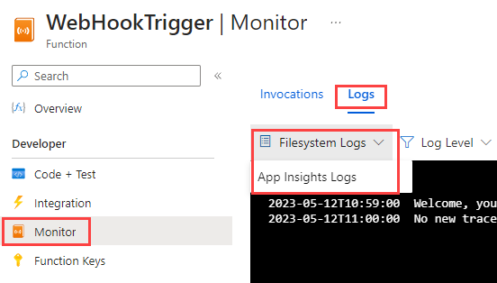
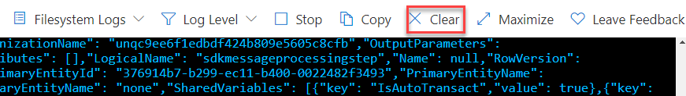

---
lab:
    title: 'Lab 10: Publishing events externally'
    module: 'Module 7: Integrate Dataverse and Azure'
---

# Practice Lab 10 – Publishing Events Externally

## Scenario

In this lab you will use the event publishing capability of Microsoft Dataverse. When a permit results in changing the size of the build site, an external taxing authority needs to be notified so they can evaluate if additional taxing is required. You will configure Microsoft Dataverse to publish permits with size changes using the Webhook. To simulate the taxing authority receiving the information you will create a simple Azure function to receive the post.

## High-level lab steps

As part of configuring the event publishing, you will complete the following:

- Create an Azure Function to receive the Webhook post
- Configure Microsoft Dataverse to publish events using a Webhook
- Test publishing of events

## Things to consider before you begin

- Do we know what events will trigger our Webhook?
- Could what we are doing with the Webhook, be done using Power Automate?
- Remember to continue working in your DEVELOPMENT environment. We’ll move everything to production soon.

## Starter solution

A starter solution file for this lab can be found in the  C:\Labfiles\L10\Starter folder.

## Completed solution

Completed solution files for this lab can be found in the  C:\Labfiles\L10\Completed folder.

## Resources

Complete source code files for this lab can be found in the  C:\Labfiles\L10\Resources folder.

## Exercise 1: Create an Azure Function

**Objective:** In this exercise, you will create an Azure Function that will be the endpoint to accept and log incoming web requests.

### Task 1.1: Create a Function App in the Azure Portal

1. Create function app.

   - Sign in to the Azure portal `https://portal.azure.com`.

   - Select **Show portal menu** and then select **+ Create a resource**.

   - Search for `function app` and select **Function App** by Microsoft.

   

   - Click on the **Function App** tile.

   

   - Select **Create**.
  
   - Select the **Consumption** tile.

   - Select **Select**.

   - Select your **Azure Pass - Sponsorship** subscription.

   - Select the **PL400** for resource group.

   - Enter `pl400wh` followed by your initials and a unique number for Function App name.

     > Note: Function app name must be unique across Azure. Wait until you see a green tick to confirm the name is unique.

   - Select **.NET** for Runtime stack

   - Select **8 (LTS), in-process model** for Version

   - Select **Next : Storage**.

   - Select the storage account you created in the previous lab.

   - Select **Review + create**.

   - Select **Create** and wait for the function app to be deployed.

### Task 1.1: Create an Azure Function in the Azure Portal

1. Create a new function

   - Select **Go to resource**.

     

   - Select the **Functions** tab.

     

   - Select **Create function** under **Create in Azure portal**.

   - Select **HTTP trigger** for Template.
  
     

   - Select **Next**.

   - Enter `WebHookTrigger` for Function name.

   - Select **Function** for Authorization level.

     

   - Select **Create**.

1. Test the function

   - Select the **Code + Test** tab.

     

   - Select **Test**/**Run**.

     

   - Select **Run**.

   - You should see **Hello, Azure** in the output.

     

   - Close the test pane.

1. Edit the function

   - Replace the entire Task method with the method below.

     ```csharp
     public static async void Run(HttpRequest req, ILogger log)
     {
         log.LogInformation("C# HTTP trigger function processed a request.");

         string requestBody = await new StreamReader(req.Body).ReadToEndAsync();
         dynamic data = JsonConvert.DeserializeObject(requestBody);
         string indentedJson = JsonConvert.SerializeObject(data, Formatting.Indented);
         log.LogInformation(indentedJson);
     }   
     ```

   - Save your changes.

     

1. Remove HTTP output

   - Select the **Integration** tab.

     

   - Select the **HTTP Output**.

     

   - Select **Delete**.

     

   - Select **Delete**.

1. Get the function endpoint

   - Select the **Code + Test** tab and then select **Get function URL**.

     

   - Select **Copy to clipboard** against the **default (Function key)** and then select **Close**.

     

   - Save the **URL** in a notepad, you will need it in the next exercise.

1. Get the function key

   - Select the **Function Keys** tab.

     

   - Select **Copy to clipboard** against the **default** key.

   - Save the **key** in a notepad, you will need it in the next exercise.

## Exercise 2: Configure Webhook

### Task 2.1: Configure publishing to a webhook

1. Start the Plug-in Registration Tool.

   - Start the developer command prompt tool.

   - Run the command below to launch the Plugin Registration Tool (PRT).

     ```dos
     pac tool prt
     ```

1. Connect to your Dataverse environment.

   - Select **+ CREATE NEW CONNECTION**.

     

   - Select **Office 365** for Deployment Type.
   - Check **Display list of available organizations**.
   - Check **Show Advanced**.
   - Enter your tenant credentials.

     

   - Select **Login**.

     

   - Select your **Development** environment and select **Login**.

1. Register webhook.

   - Select **Register** and then select **Register New Web Hook**.

     

   - Enter `NewSize` for **Name**.

   - Go to the notepad where you saved the function URL and copy everything before the **?**.

     

   - In the Plugin Registration Tool, paste the URL you copied in the **Endpoint URL** field.

      

   - Select **WebhookKey** for **Authentication**.

   - Go back to the notepad and copy the function key.

   - In the Plugin Registration Tool, paste the key you copied in the **Value** field.

      

   - Select **Save**

1. Register new step on update of new size column.

   - Select the **Webhook** you registered, select **Register** and then select **Register New Step**.

     

   - Enter `Update` for **Message**.

   - Enter `contoso_permit` for **Primary Table**.

   - Select **Filtering Attributes.**

     

   - Uncheck **Select All**.

   - Select **New Size**.

     

   - Select **OK**.

   - Select **PostOperation** from dropdown for **Event Pipeline Stage of Execution**.

   - Select **Asynchronous** for Execution Mode

     

   - Select **Register New Step**.

   - Step should now be registered in the WebHook.

1. Register images.

   - Select the **NewSize** step you created, select **Register** and then select **Register New Image**.

     

   - Check **Pre Image**.

   - Check **Post Image**.

   - Enter `Permit Image` for **Name**.

   - Enter `PermitImage` for **Entity Alias**.

   - Select the **Parameters** button.

     

   - Uncheck **Select All**.

   - Select **Build Site**, **Contact**, **Name**, **New Size**, **Permit Type**, and **Start Date**.

     

   - Select **OK**.

     

   - Select **Register Image**.

### Task 2.2: Test the Webhook

1. Configure formatted output when monitoring the function.

   - Go back to your **Azure Function**.

   - Select **Monitor**.

   - Select the **Logs** tab.

   - Select **App Insight Logs**

     

1. Update Permit record.

   - Navigate to the Power Apps Maker portal `https://make.powerapps.com/`.
   - Make sure you are in the Development environment.
   - Select **Apps**.
   - Select the **Permit Management** app, select the **ellipses (...)** and select **Play**.
   - Select **Permits**.
   - Open the **Test Permit** record.

     

   - Change the **New Size** to **5000**.

      

   - Select **Save**.

1. Check Azure logs.

   - Go back to your **Azure Function**.

   - You should see logs like the image below. The Output is a serialized context object.

     

   - Select **Clear**.

      

1. Confirm the function executes only when the New Size value changes

   - Go back to the **Test Permit** record.

   - Change the **Start Date** to tomorrow’s date and select **Save**.

      

   - Go back to your **Azure Function**.

   - The log is empty and the function did not execute.

1. Update Permit record.

   - In the  **Permit Management** app, select **Permits**.

   - Open the **Test Permit** record.

   - Change the **New Size** to **4000**.

   - Select **Save**.

1. Check Azure logs.

   - Go back to your **Azure Function**.

   - The logs should now show both **Pre** and **Post** entity images. In this case you should see the old value **5000** in **Pre** image and the new value **4000** in the **Post** image

      

### Task 2.3: Add webhook to the solution

1. Add webhook to solution.

   - Navigate to the Power Apps Maker portal `https://make.powerapps.com/` and make sure you have the **Development** environment selected.
   - Select **Solutions**.
   - Open the **Permit Management** solution.

   - Select **Add existing** and select **More** and **Developer** and **Service endpoint**.

   - Select the **NewSize** webhook and then select **Add**.

   - Select **Add existing** and select **More** and **Developer** and **Plug-in step**.

   - Select the **NewSize: Update of contoso_permit** step and then select **Add**.

## Exercise 3: Export and import solution

**Objective:** In this exercise, you will export the solution you created in the development environment and import it to the production environment.

### Task 3.1: Export solution

1. Export managed solution.

   - Navigate to the Power Apps Maker portal `https://make.powerapps.com/` and make sure you have the **Development** environment selected.
   - Select **Solutions**.
   - Open the **Permit Management** solution.
   - Select the **Overview** tab in the solution.
   - Select **Export**.
   - Select **Publish** and wait for the publishing to complete.
   - Select **Next**.
   - Set the version number to `1.0.0.10`.
   - Select **Managed**.
   - Select **Export**.
   - Click **Download** to download the managed solution on your machine.

1. Export unmanaged solution.

   - Select **Export** again.
   - Select **Next**.
   - Edit the version number to match the Managed solution you just exported i.e., `1.0.0.10`.
   - Select **Unmanaged**.
   - Select **Export**.
   - Click **Download** to download the unmanaged solution on your machine.

### Task 3.2: Import solution

1. Import the Permit Management solution.

   - Sign in to the Power Apps Maker portal `https://make.powerapps.com/`.
   - Select your **Production** environment.
   - Select **Solutions**.
   - Select **Import solution**.
   - Select **Browse**.
   - Select the **Managed** solution file you exported in the previous task and then select **Open**.
   - Select **Next**.
   - Expand **Advanced settings** and make sure **Upgrade** is selected.
   - Select **Import** and wait the import to complete.
