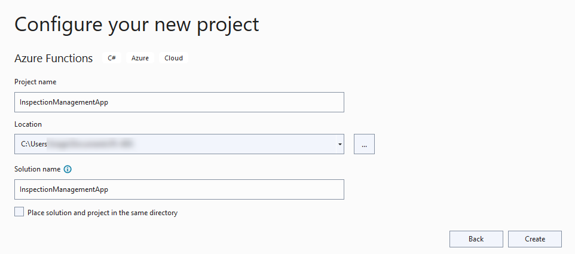
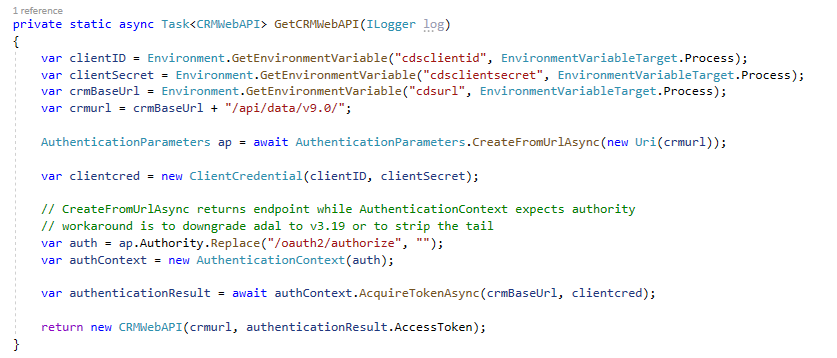
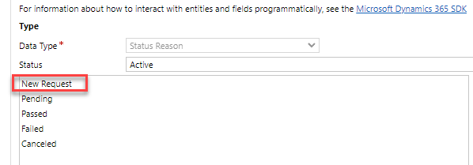
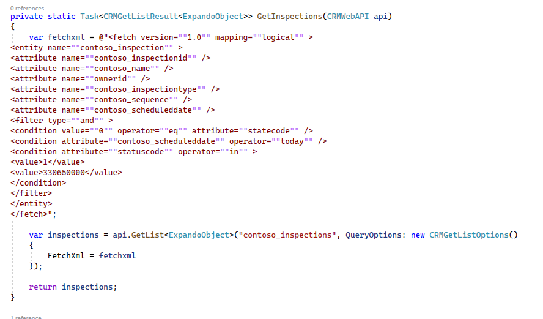
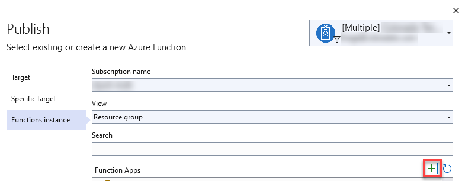
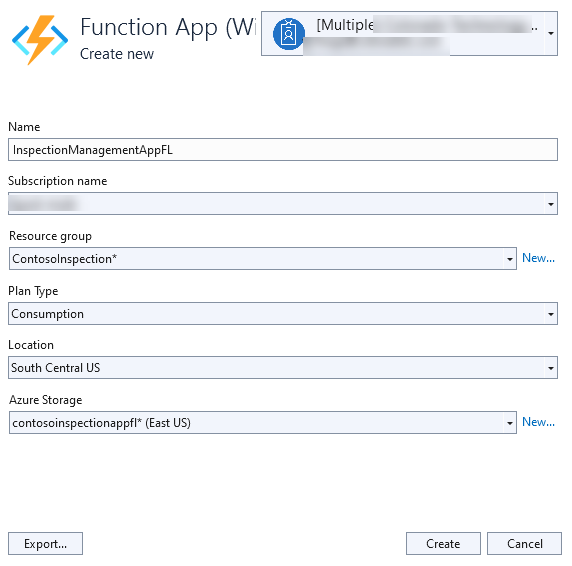
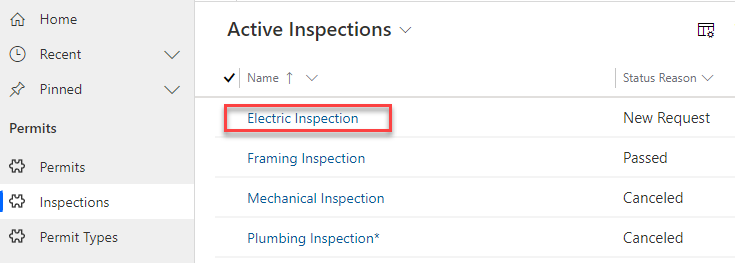
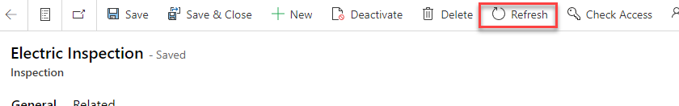

---
lab:
    title: 'Lab 11: Azure Functions'
    module: 'Module 9: Integrate with Power Platform and Dataverse'
---

# Practice Lab 11 – Azure Functions

## Scenario

A regional building department issues and tracks permits for new buildings and updates for remodeling of existing buildings. Throughout this course you will build applications and automation to enable the regional building department to manage the permitting process. This will be an end-to-end solution which will help you understand the overall process flow.

In this lab you will create an Azure Function that will handle routing inspections. Every morning people call in to request inspections on their permits. They must call before 9:30 AM and once that period ends all the inspections for the day must be assigned and sequenced for the inspectors. To accomplish this, you will build an Azure Function that runs on a schedule, queries pending inspections and assigns them to inspectors. Given the limited time to complete the lab, we’ve simplified the routing and sequencing decisions.

## High-level lab steps

As part of building the Azure Function, you will complete the following:

- Configure an application user for the app along with a security role

- Build the function logic to route the requests

- Deploy the Azure Function

## Things to consider before you begin

- Could we have used Dynamics 365 Universal Resource Scheduling instead of custom code?

- Could we have used Power Automate instead of custom code?

- Remember to continue working in your DEVELOPMENT environment. We’ll move everything to production soon.

## Exercise 1: Configure an Azure AD application user

**Objective:** In this exercise, you will configure an application user that will be used to connect the Azure Function back to Microsoft Dataverse.

### Task 1.1: Register Azure AD Application

1. Navigate to Azure Active Directory

- Sign in to [Azure Portal](https://portal.azure.com/).

**Note:** You must be logged in with an organization account in the same tenant as your Microsoft Dataverse Environment. This does **NOT** have to be the account that has your Azure subscription.

- Select Show portal menu.

- Select **Azure Active Directory**.

- Select **+ Add** and then select **App registration**.

- Enter **Inspection Router** for **Name**, select **Accounts in this Organizational Directory Only** for **Supported** **Account Types**, and then select **Register**.

### Task 1.2: Enable OAuth 2.0

1. Select **Manifest**.

1. Set **allowPublicClient** to **true**.

1. Set **oauth2AllowIdTokenImplicitFlow** to **true**.

1. Set **oauth2AllowImplicitFlow** to **true**.

1. Click **Save**.

1. Select **API Permissions**.

1. Click **+Add a permission**.

1. Select **Dynamics CRM**.

1. Select **Delegated permissions**.

1. Check **user_impersonation**.

1. Click **Add permissions**.

### Task 1.3: Client Secret

> [!NOTE]
> In this lab we are using a secret, however, you can also use a certificate. With either of these options you need to have a plan in place to handle rollover when they expire to ensure that the app keeps running.

1. Select **Certificates &amp; secrets**.

1. Click **+ New client secret**.

   

1. Enter **Inspection Routing** for **Description**, select **12 months** for **Expires**, and then select **Add**.

   

1. Copy the **Value** and save it on a notepad. You will need this value in future tasks.

   

### Task 1.4: Security Role

In this task, you will create the security role needed for the routing logic.

1. Create New Security Role

- Navigate to https://make.powerapps.com/ and make sure you have your **Development** environment selected.

- Select **Solutions** and open the **Permit Management** solution.

- Select **+ New** and then select **Security > Security role**

- Enter **Inspection Router** for **Role Name** and then select **Save**.

- Select the **Business Management** tab.

- Locate the **User** table and set **Read** and **Append To** privileges to **Organization**.

- Select the **Custom Entities** tab.

- Locate the **Inspection** table and set **Read**, **Write**, **Append,** and **Assign** privileges to **Organization**.

- Select **Save and Close**.

- Select **Done**.

### Task 1.5: Add Application User to Dataverse

In this task, you will create the application user and associate it with the Azure AD app that you just registered.#

- Navigate to https://admin.powerplatform.microsoft.com/ and make sure you have your **Development** environment selected.

- Select your **Development** environment.

- Click **See all** under **S2S apps**.

- Select **+ New app user**.

- Select **+ Add an app**.

  

- Select the **Inspection Router** you created and then select **Add**.

  

- Select your Business Unit and then select edit **Security roles**.

  

- Select the Inspection Router security role and then select **Save**.

- Select **Create**.

## Exercise 2: Create Azure Function for Inspection Routing

**Objective:** In this exercise, you will create the Azure function that will route the inspections.

### Task 2.1: Create the Function

1. Create Azure Function project

- Start **Visual Studio**.

- Select **Create a New Project**.

   

- Select **Azure Functions** and then select **Next**.

   

- Enter **InspectionManagementApp** for **Name** and then select **Create**.

   

- Select **NET Core3** and select **Timer Trigger**.

- Change the Schedule to 0 0 0 * * * (Midnight Every Day) and select **Create**.

   

2. Rename and run the Function

- Rename the function file **InspectionRouter**.

- Select **Yes** to rename references.

- Change the function FunctionName to **InspectionRouter.**

- Select **Run**.

- Azure functions tools should start.

3. Trigger the function with Postman

- Start **Postman**.

- Click **+** to open a new request tab.

- Select **POST** and enter the URL: [http://localhost:7071/admin/functions/InspectionRouter](http://localhost:7071/admin/functions/InspectionRouter)

- Select the **Headers** tab.

- Add **Content-Type** and set it to **application/json**.

- Select the **Body** tab.

- Select **Raw** and set it to empty json **{}**.

- Select **Send**.

- You should get **202** **Accepted Status**.

- Go to the output console.

- The function should get triggered.

- Go back to **Visual Studio** and stop debugging.

4. Add NuGet packages

- Right Click on the project and select **Manage NuGet Packages**.

- Select the **Browse** tab and search for **Microsoft.IdentityModel.Clients.ActiveDirectory**.

- Select the latest stable version and then select **Install**.

- Search for **Xrm.Tools.CrmWebAPI**. Note: This is a community library designed to work with the Microsoft Dataverse Web API. When you are building this type of extension you can use any oData V4 library you prefer. Make sure you select the one developed by DavidYack.

- Select the latest stable version and then select **Install**.

- Close the **NuGet Package Manager**.

5. Edit the local settings file

- Open the **local.settings.json** file

- Add the **Values** below to **local.settings**

        "cdsurl": "",

        "cdsclientid": "",

        "cdsclientsecret": ""

- Find the client secret you saved in the notepad and paste as the cdsclientsecret.

6. Copy the App ID

- Go back to your **Azure** portal.

- Select **Azure Active Directory**.

- Select **App Registrations**.

- Open the registration you created.

- Copy the **Application (Client ID).**

- Go back to **Visual Studio** and paste the **Application ID** as the **cdsclientid**.

7. Find the your Microsoft Dataverse URL

- Sign in to [https://admin.powerplatform.microsoft.com](https://admin.powerplatform.microsoft.com/)

- Select **Environments** and open the **Dev** environment.

- Copy the **Environment URL**.

- Go back to **Visual Studio** and paste the **URL** you copied as the **cdsurl**.

- Save and close the file.

8. Add using statements to the function class.

- Open the **InspectionRouter.cs** file

- Add the using statements below

        using System.Threading.Tasks;
        using Xrm.Tools.WebAPI;
        using Microsoft.IdentityModel.Clients.ActiveDirectory;
        using Xrm.Tools.WebAPI.Results;
        using System.Dynamic;
        using Xrm.Tools.WebAPI.Requests;
        using System.Collections.Generic;

9. Create a method that will create the web API.

- Add the method below inside the class.

        private static async Task<CRMWebAPI> GetCRMWebAPI(ILogger log)
        {
        return null;
        }

- Add the local variables below before the return line on the **GetCRMWebAPI** method.

        var clientID = Environment.GetEnvironmentVariable("cdsclientid", EnvironmentVariableTarget.Process);
        var clientSecret = Environment.GetEnvironmentVariable("cdsclientsecret", EnvironmentVariableTarget.Process);
        var crmBaseUrl = Environment.GetEnvironmentVariable("cdsurl", EnvironmentVariableTarget.Process);
        var crmurl = crmBaseUrl + "/api/data/v9.0/";

- Create **Authentication Parameters**.

        AuthenticationParameters ap = await AuthenticationParameters.CreateFromUrlAsync(new Uri(crmurl));

- Create **Client Credential** passing your **Client Id** and **Client Secret**.

        var clientcred = new ClientCredential(clientID, clientSecret);

- Get **Authentication Context**.

        // CreateFromUrlAsync returns endpoint while AuthenticationContext expects authority
        // workaround is to downgrade adal to v3.19 or to strip the tail
        var auth = ap.Authority.Replace("/oauth2/authorize", "");
        var authContext = new AuthenticationContext(auth);

- Get **Token**.

        var authenticationResult = await authContext.AcquireTokenAsync(crmBaseUrl, clientcred);

- Return the **web API**. Replace the return line with the code below.

        return new CRMWebAPI(crmurl, authenticationResult.AccessToken);

10. Test the web API you created

- Call the GetCRMWebAPI method. Add the code below to the Run method.

        CRMWebAPI api = GetCRMWebAPI(log).Result;

- Execute **WhoAmI** function and log the **User Id**.

        dynamic whoami = api.ExecuteFunction("WhoAmI").Result;
        log.LogInformation($"UserID: {whoami.UserId}");

11. Debug

- Select **Run**.

- Go back to **Postman** and select **Send**.

- Go to the output console.

- You should see the **User ID**.

Go back **Visual Studio** and stop debugging.

### Task 2.2: Get Inspections and Users and Assign Inspections

1. Get the New Request and Pending option values for the Inspection table Status Reason column.

- Navigate to https://make.powerapps.com/ and make sure you have your **Dev** environment selected.

- Select **Solutions** and open the **Permit Management** solution.

- Select **Tables** and open the **Inspection** table.

- Select **Switch to classic**.

- Select **Fields**.

- Locate and open the **Status Reason** field,

- Scroll down and double open the **New Request** option.
  
  

- Copy the **Value** and keep it in a notepad.

- Select **OK**.

- double click to open the **Pending** option.

- Copy the **Value** and keep it in a notepad.

  

- Select **OK**.

- Close the field editor.

- Close the classic table editor.

2. Create a method that will get all active inspections that are New Request or Pending, and schedule them for today

- Add the method below inside the class.

        private static Task<CRMGetListResult<ExpandoObject>> GetInspections(CRMWebAPI api)

        {

        return null;

        }

- Create **Fetch XML**. Add the code below before the return line of the GetInspections method. replace **[New Request]** and **[Pending]** with the option values you copied without the commas.

        var fetchxml = @"<fetch version=""1.0"" mapping=""logical"" >
        <entity name=""contoso_inspection"" >
        <attribute name=""contoso_inspectionid"" />
        <attribute name=""contoso_name"" />
        <attribute name=""ownerid"" />
        <attribute name=""contoso_inspectiontype"" />
        <attribute name=""contoso_sequence"" />
        <attribute name=""contoso_scheduleddate"" />
        <filter type=""and"" >
        <condition value=""0"" operator=""eq"" attribute=""statecode"" />
        <condition attribute=""contoso_scheduleddate"" operator=""today"" />
        <condition attribute=""statuscode"" operator=""in"" >
        <value>[New Request]</value>
        <value>[Pending]</value>
        </condition>
        </filter>
        </entity>
        </fetch>";

- Get the list of Inspections.

        var inspections = api.GetList<ExpandoObject>("contoso_inspections", QueryOptions: new CRMGetListOptions()
        {
        FetchXml = fetchxml
        });

- Return the Inspections. Replace the return line with the code below.

        return inspections;

3. Call the GetInspections method from the Run method.

- Go back to the **Run** method.

- Call the **GetInspections** method.

        var inspections = GetInspections(api).Result;

4. Create a method that will get all users.

- Add the method below inside the class.

        private static Task<CRMGetListResult<ExpandoObject>> GetUsers(CRMWebAPI api)
        {
        var users = api.GetList<ExpandoObject>("systemusers");
        return users;
        }

- Call the **GetUsers** method from the **Run** method.

        var users = GetUsers(api).Result;

5. Create a method that will assign inspections to users

- Add the method below to the class.

        private static async Task<CRMUpdateResult> RouteInspection(CRMWebAPI api, dynamic inspection, string userId, int sequenceNumber)
        {
        dynamic updateObject = new ExpandoObject();
        ((IDictionary<string, object>)updateObject).Add
        ("ownerid@odata.bind", "/systemusers(" + userId + ")");
        updateObject.contoso_sequence = sequenceNumber.ToString();
        return await api.Update("contoso_inspections", new Guid(inspection.contoso_inspectionid), updateObject);
        }

6. Create two-digit random number.

- Add the code below to the Run method.

        Random rnd = new Random();
        int sequenceNumber = rnd.Next(10, 99);

7. Assign Inspections

- Go through the **Inspections** and call the **RouteInspection** method.

        int currentUserIndex = 0;
        foreach (dynamic inspection in inspections.List)
        {
        log.LogInformation($"Routing inspection {inspection.contoso_name}");
        var inspectionResult = new CRMUpdateResult();
        //Your record assignment would look like this. We will not assign records to different users in this lab
        // if (users.List.Count > (currentUserIndex))
        //{
        // dynamic currentUser = users.List[currentUserIndex];
        // inspectionResult = RouteInspection(api, inspection, currentUser.systemuserid.ToString(), sequenceNumber).Result;
        //currentUserIndex++;
        //}
        }

- We will not assign inspection records to other users in this lab.

- Assign inspections to the Inspection Router. Add the code below inside **foreach**.

        //We will instead assign inspections to the user you are currently logged in as
        inspectionResult = RouteInspection(api, inspection, whoami.UserId.ToString(), sequenceNumber).Result;

Build the project and make sure that the build succeeds.

## Exercise 3: Publish and Test

**Objective:** In this exercise, you will publish the Azure function to Azure, update the app settings, and test the function.

### Task 3.1: Publish to Azure

1. Publish the function

- Right click on the project and select **Publish**.

- Select **Azure** and then select **Next**.

- Select **Azure Function App (Windows)** and then select **Next**.

- Sign in with user that has an Azure subscription.

- Select your Azure subscription and then select **+** create new Azure function app.

- Provide a unique name for **App Name**, select your subscription name, create new resource group, create new Azure storage, select **Consumption** for Plan type, select Location, and then select **Create**.

- Wait for the app service to be created.

- Select **Finish**.

- Select **Publish**.

- Wait for the function application to be configured and published.

2. Open the function application settings

- Go back to you **Azure** portal.

- Select **All Resources**, search for **InspectionManagement**, and open the function you published.

- Scroll down to **Settings** and select **Configuration**.

3. Update App Settings

- Select **Advanced Edit**.

- Paste the json below at the top of the settings.

        {

        "name": "cdsclientid",

        "value": "[clientid]",

        "slotSetting": false

        },

        {

        "name": "cdsclientsecret",

        "value": "[clientsecret]",

        "slotSetting": false

        },

        {

        "name": "cdsurl",

        "value": "[cdsurl]",

        "slotSetting": false

        },

- Go back to **Visual Studio** and open the **local.settings.json** file.

- You will copy the **cdsurl**, **cdsclientid**, and **cdsclientsecret**. Copy the **cdsurl** value.

- Go back to **Azure** and replace **[cdsurl]** with the URL you copied.

- Copy the **cdsclientid** and **cdsclientsecret** values from the **local.settings.json** file and replace [**cdsclientid**] and [**cdsclientsecret**].

- Select **OK**.

- Select **Save**.

- Select **Continue**.

- Select **Functions** and open the function you published.

- Select **Code + Test.**

4. Prepare test record

- Start a new browser window and sign in to [Power Apps maker portal](https://make.powerapps.com/)

- Make sure you are in the **Dev** environment.

- Select **Apps** and open the **Permit Management** application.

- Select **Settings** and then select **Personalization and Settings**.

- Change the **Time Zone** to **(GMT-11:00) Coordinated Universal Time-11** and then select **OK**. This will ensure the query results will produce the same results regardless of your time zone.

- Select **Inspections** and open one of the **Inspection** records or create a new record.

- Set the **Status Reason** to **New Request** or **Pending**, change the **Scheduled Date** to today’s date, and make a note of the current **Owner** of the record.

- Select **Save**.

5. Run the function

- Go to your **Azure** portal.

- Select **Test/Run.**

- Select **Run**.

- The function should run and succeed.

6. Confirm record assignment

- Go back to the **Permit Management** application.

- Select **Refresh**.

- The record **Owner** should now be the **Inspection Router**.

## Exercise 4: Promote to production

**Objective:** In this exercise, you will export the Permit Management solution form your Dev environment and import it into your Production environment. In this lab, you have added a security role to the solution that must be promoted.

### Task 4.1: Export Solution

1. Export Permit Management managed solution

- Sign in to [Power Apps maker portal](https://make.powerapps.com/) and make sure you are in the **Dev** environment.

- Select **Solution**.

- Select the **Permit Management** solution and then select **Export**.

- Select **Publish** and wait for the publishing to complete.

- Select **Next**.

- Select **Managed** and then select **Export**.

- Save the **Exported** solution on your machine.

2. Export Permit Management unmanaged solution

- Select **Solution** again.
- Select the **Permit Management** solution and then select **Export**.
- Select **Next**.
- Select **Unmanaged, edit the version number to match the Managed solution** and then select **Export**.

- Save the **Exported** solution in your machine.

### Task 4.2: Import Solution

1. Import Permit Management managed solution

- Sign in to [https://make.powerapps.com](https://make.powerapps.com/) and make sure you are in the **Prod** environment.

- Select **Solution**.

- Select **Import**.

- Select **Choose file**.

- Select the **Managed** solution you exported and then select **Open**.

- Select **Next**.

- Select **Import**.

- Wait for the import to complete and then select **Close**.

- Review and test your production environment.
