---
lab:
    title: 'Lab 11: Azure Functions'
    module: 'Module 9: Integrate with Power Platform and Dataverse'
---

# Practice Lab 11 – Azure Functions

## Scenario

In this lab you will create an Azure Function that will handle routing inspections. Every morning people call in to request inspections on their permits. They must call before 9:30 AM and once that period ends all the inspections for the day must be assigned and sequenced for the inspectors. To accomplish this, you will build an Azure Function that runs on a schedule, queries pending inspections and assigns them to inspectors. Given the limited time to complete the lab, we’ve simplified the routing and sequencing decisions.

## High-level lab steps

As part of building the Azure Function, you will complete the following:

- Configure an application user for the app along with a security role
- Build the function logic to route the requests
- Deploy the Azure Function

## Things to consider before you begin

- Could we have used Dynamics 365 Universal Resource Scheduling instead of custom code?
- Could we have used Power Automate instead of custom code?
- Remember to continue working in your DEVELOPMENT environment. We'll move everything to production soon.

## Starter solution

A starter solution file for this lab can be found in the  C:\Labfiles\L11\Starter folder.

## Completed solution

Completed solution files for this lab can be found in the  C:\Labfiles\L11\Completed folder.

## Resources

Complete source code files for this lab can be found in the  C:\Labfiles\L11\Resources folder.

## Exercise 1: Configure an Azure AD application user and add the user to Dataverse

**Objective:** In this exercise, you will configure an application user that will be used to connect the Azure Function back to Microsoft Dataverse.

### Task 1.1: Register Azure AD Application

1. Navigate to Azure Active Directory.

- Sign in to the [Azure Active Directory portal](https://aad.portal.azure.com/).

   > **Note:** You must be logged in with an organization account in the same tenant as your Microsoft Dataverse Environment. This does **NOT** have to be the account for your Azure subscription.

1. Expand **Applications** and select **App registrations**.

   

1. Select **+ New registration**.

   

1. Enter `Inspection Router` for **Name**

1. Select **Accounts in this organizational directory only** for **Supported account types**.

   

1. Select **Register**.

### Task 1.2: Enable OAuth 2.0

1. Select **Manifest**.

1. Set **allowPublicClient** to **true**.

1. Set **oauth2AllowIdTokenImplicitFlow** to **true**.

1. Set **oauth2AllowImplicitFlow** to **true**.

   

1. Select **Save**.

### Task 1.3: API Permissions

1. Select **API permissions**.

1. Select **+Add a permission**.

   

1. Select **Dynamics CRM**.

1. Select **Delegated permissions**.

1. Check **user_impersonation**.

   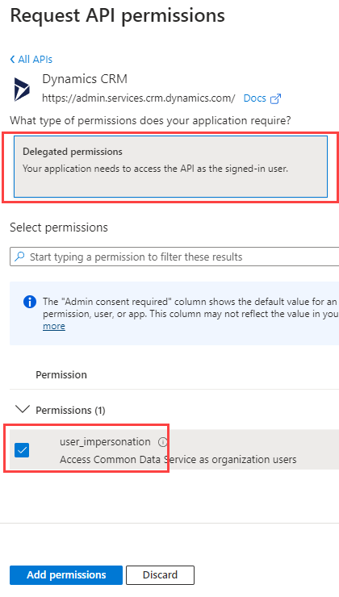

1. Select **Add permissions**.

### Task 1.4: Client secret

1. Select **Certificates &amp; secrets**.

1. Click **+ New client secret**.

   

1. Enter `Inspection Routing` for **Description**, select **(365 days) 12 months** for **Expires**

   

1. Select **Add**.

1. Copy the **Value** and save it on a notepad. You will need this value in future tasks.

   

1. Select **Overview**

   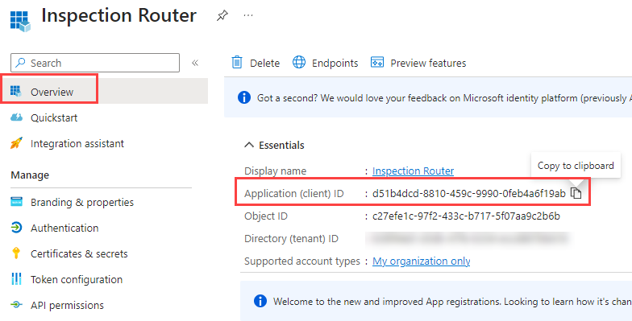

1. Copy the **Application (client) ID.** and save it on a notepad. You will need this value in future tasks.

### Task 1.5: Dataverse security role

In this task, you will create the security role needed for the routing logic.

1. Open the Permit Management solution.

   - Navigate to [Power Apps maker portal](https://make.powerapps.com/) and make sure you have the **Development** environment selected.
   - Select **Solutions**.
   - Open the **Permit Management** solution.

1. Create security role.

   - Select **+ New** and then select **Security** and select **Security role**.

     

   - Enter `Inspection Router` for **Role Name** and then select the **Save** con.

   - Select the **Business Management** tab.

   - Locate the **User** table and set the **Read** and **Append To** privileges to **Organization**.

     

   - Select the **Custom Entities** tab.

   - Locate the **Inspection** table and set the **Read**, **Write**, **Append,** and **Assign** privileges to **Organization**.

     

   - Select **Save and Close**.

   - Select **Done**.

### Task 1.6: Add Application user to Dataverse

In this task, you will create the application user in Dataverse and associate it with the Azure AD app that you just registered.#

1. Navigate to the [Power Platform admin center](https://admin.powerplatform.microsoft.com).

1. Select **Environments**.

1. Select your **Development** environment and select **Settings**.

     

1. Select **See all** under **S2S apps**.

1. Select **+ New app user**.

1. Select **+ Add an app**.

   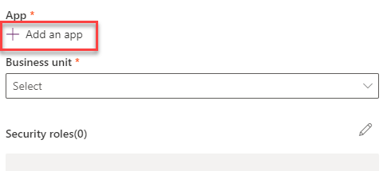

1. Select the **Inspection Router** Azure AD app registration and then select **Add**.

   

1. Select your root Business Unit.

1. Select the edit icon under **Security roles**.

   

1. Select the Inspection Router security role

   

1. Select **Save**.

   

1. Select **Create**.

## Exercise 2: Create Azure Function for Inspection Routing

**Objective:** In this exercise, you will create the Azure function that will route the inspections.

### Task 2.1: Azure resources

1. Create Resource group.

   - Sign in to the [Azure portal](https://portal.azure.com) and login with the credentials used when redeeming your Azure Pass..

   - Select **Show portal menu** and then select **+ Create a resource**.

     

   - Search for `resource group` and select **Resource group**.

     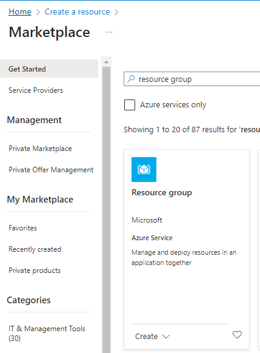

   - Click on the **Resource group** tile.

   - Select **Create**.

   - Select your **Azure Pass - Sponsorship** subscription.

   - Enter `PL400` for resource group.

     

   - Select **Review + create**.

   - Select **Create**.

1. Create Storage account.

   - Select **Show portal menu** and then select **+ Create a resource**.

   - Search for `storage account` and select **Storage account** by Microsoft.

   - Click on the **Storage account** tile.

   - Select **Create**.

   - Select your **Azure Pass - Sponsorship** subscription.

   - Select the **PL400** for resource group.

   - Enter `pl400sa` followed by a unique number for Storage account name.

     > Note: Storage account name must be unique across Azure.

   - Select **Standard** for Performance.

   - Select **Locally-redundant storage (LRS)** for Redundancy.

     

   - Select **Review**.

   - Select **Create**.

1. Create Function app.

   - Select **Show portal menu** and then select **+ Create a resource**.

   - Search for `function app` and select **Function App** by Microsoft.

   

   - Click on the **Function App** tile.

   - Select **Create**.

   

   - Select **Create**.

   - Select your **Azure Pass - Sponsorship** subscription.

   - Select the **PL400** for resource group.

   - Enter `pl400fa` followed by your initials and a unique number for Function App name.

     > Note: Function app name must be unique across Azure. Wait until you see a green tick to confirm the name is unique.

   - Select **.NET** for Runtime stack

   - Select **6 (LTS)** for Version

   - Select **Consumption** for Hosting options and plans.

   - Select **Review + create**.

    

   - Select **Create**.

### Task 2.2: Create Function using Visual Studio

1. Create Azure Function project in Visual Studio.

   - Start **Visual Studio**.

     

   - Select **Create a new project**.
   - Search for `functions`.

     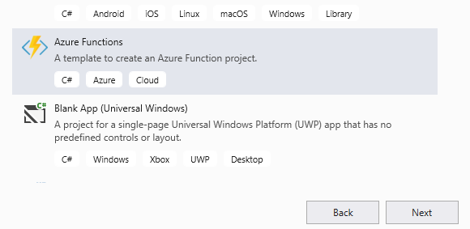

   - Select **Azure Functions** and then select **Next**.

   - Enter `InspectionRoutingApp` for **Name**.

   - Change the location to **C:\LabFiles\L11**.

     

   - Select **Create**.

   - Select **NET Core 3 (LTS)**.

   - Select **Timer Trigger**.

   - Change the Schedule to `0 0 0 * * *` (Midnight Every Day).

     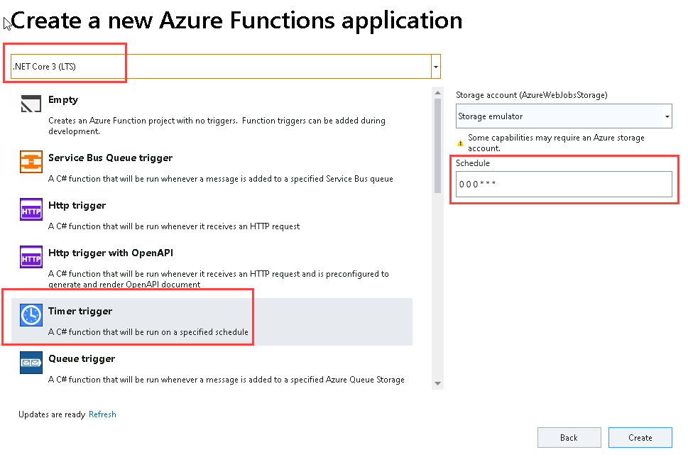

   - Select **Create**.

1. Rename and run the Function.

   - In Solution Explorer, right click on **Function1.cs** and select **Rename**.

     

   - Rename the function file as `InspectionRouter.cs`.
  
     

   - Select **Yes** to rename references.

   - Open **InspectionRouter.cs** file.

   - Rename the function **Function1** to `InspectionRouter`.

     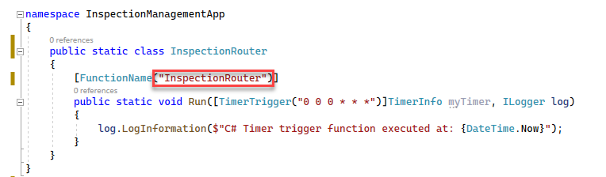

   - Select **Run**.

   - Select **Allow

     

   - Select **Allow access** in the Windows Defender Firewall prompt.

   - After a little while, Azure Functions Core Tools will start.

     

1. Trigger the function with Postman.

   - Start **Postman**.

   - Click **+** to open a new request tab.

   - Select **POST**.

   - Enter [http://localhost:7071/admin/functions/InspectionRouter](http://localhost:7071/admin/functions/InspectionRouter) in *Enter request URL*.

     

   - Select the **Headers** tab.
  
   - Click in **Key** and select **Content-Type**.

   - Click in **Value** and select **application/json**.

     

   - Select the **Body** tab.

   - Select **Raw** and set it to empty json.

     ```json
     {}     
     ```

     

   - Select **Send**.

   - You should see a status of **202** **Accepted Status**.

     

   - Go to the output console.

   - The function should get triggered.

     

   - Go back to **Visual Studio** and stop debugging.

   - In the Visual Studio Debug Console, press [Enter] to close the window.

1. Add NuGet packages.

   - In Solution Explorer, right-click the *InspectionRoutingApp project* and select **Manage NuGet Packages...**.

   - Select the **Browse** tab.

   - Search for `identitymodel` and select the **Microsoft.IdentityModel.Clients.ActiveDirectory** NuGet package.

     

   - Select **Install**.

   - Select **OK**.

   - Select **I Accept**.

   - Search for `crmwebapi` and select the **Xrm.Tools.CrmWebAPI by David Yack** NuGet package.

     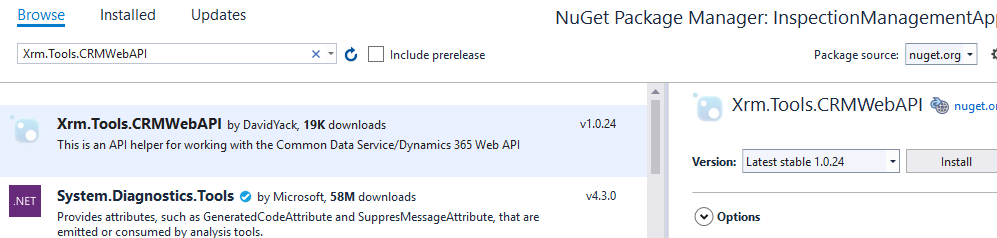

     > Note: This is a community library designed to work with the Microsoft Dataverse Web API. When you are building this type of extension you can use any oData V4 library you prefer. Make sure you select the one developed by DavidYack.

   - Select **Install**.

   - Select **OK**.

   - Select **I Accept**.

   - Close the **NuGet: Permit console** tab.

1. Edit the local settings file.

   - Open the **local.settings.json** file.

     

   - Add the **Values** below to **local.settings**

     ```json
     ,
     "cdsurl": "",
     "cdsclientid": "",
     "cdsclientsecret": ""
     ```

     

   - Find the client secret you saved in the notepad and paste as the cdsclientsecret.

     

   - Find the application (client) ID in the notepad and paste as the **cdsclientid**.

   - Find the Dataverse environment URL in the notepad and paste as the **cdsurl**.

     

   - Save and close the  **local.settings.json** file.

1. Add using statements to the function class.

   - Open the **InspectionRouter.cs** file

   - Add the using statements below

     ```csharp
     using System.Threading.Tasks;
     using Xrm.Tools.WebAPI;
     using Microsoft.IdentityModel.Clients.ActiveDirectory;
     using Xrm.Tools.WebAPI.Results;
     using System.Dynamic;
     using Xrm.Tools.WebAPI.Requests;
     using System.Collections.Generic;
     ```

1. Create a method that will create the Web API.

   - Add the method below inside the InspectionRouter class.

     ```csharp
     private static async Task<CRMWebAPI> GetCRMWebAPI(ILogger log)
     {

        return null;
     }
     ```

   - Add the local variables below before the return line on the **GetCRMWebAPI** method.

     ```csharp
     var clientID = Environment.GetEnvironmentVariable("cdsclientid", EnvironmentVariableTarget.Process);
     var clientSecret = Environment.GetEnvironmentVariable("cdsclientsecret", EnvironmentVariableTarget.Process);
     var crmBaseUrl = Environment.GetEnvironmentVariable("cdsurl", EnvironmentVariableTarget.Process);
     var crmurl = crmBaseUrl + "/api/data/v9.2/";
     ```

   - Create **Authentication Parameters**.

     ```csharp
     AuthenticationParameters ap = await AuthenticationParameters.CreateFromUrlAsync(new Uri(crmurl));
     ```

   - Create **Client Credential** passing your **Client Id** and **Client Secret**.

     ```csharp
     var clientcred = new ClientCredential(clientID, clientSecret);
     ```

   - Get **Authentication Context**.

     ```csharp
     // CreateFromUrlAsync returns endpoint while AuthenticationContext expects authority
     // workaround is to downgrade adal to v3.19 or to strip the tail
     var auth = ap.Authority.Replace("/oauth2/authorize", "");
     var authContext = new AuthenticationContext(auth);
     ```

   - Get **Token**.

     ```csharp
     var authenticationResult = await authContext.AcquireTokenAsync(crmBaseUrl, clientcred);
     ```

   - Return the **Web API**. Replace the **return null** line with the code below.

     ```csharp
     return new CRMWebAPI(crmurl, authenticationResult.AccessToken);
     ```

     

1. Call the Web API.

   - Call the GetCRMWebAPI method and Execute **WhoAmI**.

     ```csharp
     CRMWebAPI api = GetCRMWebAPI(log).Result;
     dynamic whoami = api.ExecuteFunction("WhoAmI").Result;
     log.LogInformation($"UserID: {whoami.UserId}");
     ```

     

1. Test the function.

   - Select the **Save** icon.

   - In Solution Explorer, right-click on the project and select **Build**.

   - The Build should succeed with 0 errors.

   - Select **Run**.

   - Go back to **Postman** and select **Send**.

   - Go to the output console.

   - You should see the **User ID**.

     

   - Go back **Visual Studio** and stop debugging.

   - In the Visual Studio Debug Console, press [Enter] to close the window.

### Task 2.3: Get Inspections and Users and Assign Inspections

1. Create a method that will get all active inspections that are New Request or Pending, and schedule them for today

   - Add the method below inside the InspectionRouter class.

     ```csharp
     private static Task<CRMGetListResult<ExpandoObject>> GetInspections(CRMWebAPI api)
     {

        return null;
     }
     ```

   - Create **FetchXML** query. Add the code below before the return line of the GetInspections method.

     ```csharp
     var fetchxml = @"<fetch version=""1.0"" mapping=""logical"" >
        <entity name=""contoso_inspection"" >
           <attribute name=""contoso_inspectionid"" />
           <attribute name=""contoso_name"" />
           <attribute name=""ownerid"" />
           <attribute name=""contoso_inspectiontype"" />
           <attribute name=""contoso_sequence"" />
           <attribute name=""contoso_scheduleddate"" />
           <filter type=""and"" >
              <condition value=""0"" operator=""eq"" attribute=""statecode"" />
              <condition attribute=""contoso_scheduleddate"" operator=""today"" />
              <condition attribute=""statuscode"" operator=""in"" >
                 <value>1</value>
                 <value>330650001</value>
              </condition>
           </filter>
        </entity>
     </fetch>";
     ```

     > [!NOTE]
     >  1 is the value of the Inspection New Request status reason and 330650001 id the value of the Inspection Pending status reason. If the Pending status reason is different for your environment, change the code to match your value.

   - Get the list of Inspections.

     ```csharp
     var inspections = api.GetList<ExpandoObject>("contoso_inspections", QueryOptions: new CRMGetListOptions()
     {
        FetchXml = fetchxml
     });
     ```

   - Return the Inspections. Replace the **return = null** line with the code below.

     ```csharp
     return inspections;
     ```

     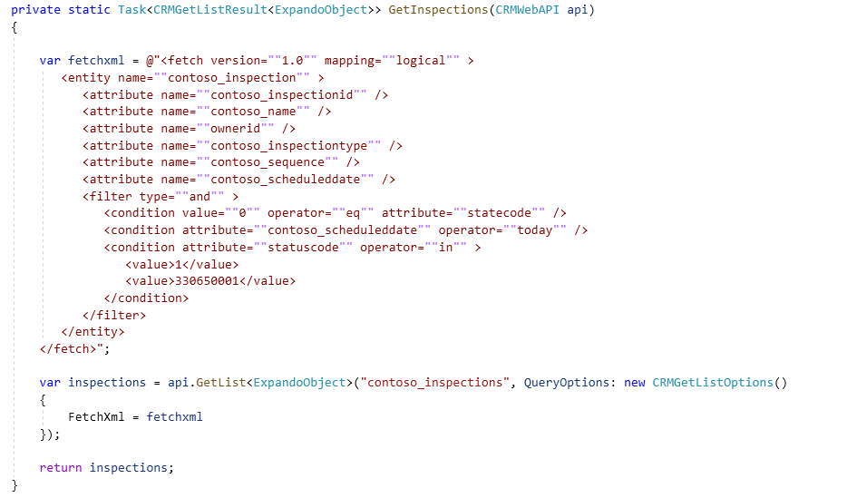

1. Call the GetInspections method from the Run method.

   - Go back to the **Run** method.

   - Call the **GetInspections** method.

     ```csharp
     var inspections = GetInspections(api).Result;
     ```

     

1. Create a method that will get all users.

   - Add the method below inside the class.

     ```csharp
     private static Task<CRMGetListResult<ExpandoObject>> GetUsers(CRMWebAPI api)
     {
        var users = api.GetList<ExpandoObject>("systemusers");
        return users;
     }
     ```

   - Call the **GetUsers** method from the **Run** method.

     ```csharp
     var users = GetUsers(api).Result;
     ```

     

1. Create a method that will assign inspections to users.

   - Add the method below to the class.

     ```csharp
     private static async Task<CRMUpdateResult> RouteInspection(CRMWebAPI api, dynamic inspection, string userId, int sequenceNumber)
     {
        dynamic updateObject = new ExpandoObject();
        ((IDictionary<string, object>)updateObject).Add
        ("ownerid@odata.bind", "/systemusers(" + userId + ")");
        updateObject.contoso_sequence = sequenceNumber.ToString();
        return await api.Update("contoso_inspections", new Guid(inspection.contoso_inspectionid), updateObject);
     }
     ```

1. Create two-digit random number.

   - Add the code below to the Run method.

     ```csharp
     Random rnd = new Random();
     int sequenceNumber = rnd.Next(10, 99);
     ```

1. Assign Inspections

   - Go through the **Inspections** and call the **RouteInspection** method.

     ```csharp
     int currentUserIndex = 0;
     foreach (dynamic inspection in inspections.List)
     {
        log.LogInformation($"Routing inspection {inspection.contoso_name}");
        var inspectionResult = new CRMUpdateResult();
        // Your record assignment would look like this. We will not assign records to different users in this lab
        // if (users.List.Count > (currentUserIndex))
        //{
        // dynamic currentUser = users.List[currentUserIndex];
        // inspectionResult = RouteInspection(api, inspection, currentUser.systemuserid.ToString(), sequenceNumber).Result;
        //currentUserIndex++;
        //}
     }
     ```

   - We will not assign inspection records to other users in this lab.

     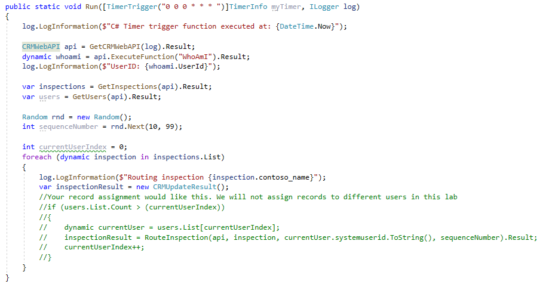

   - Assign inspections to the Inspection Router. Add the code below inside **foreach**.

     ```csharp
     // We will instead assign inspections to the user you are currently logged in as
     inspectionResult = RouteInspection(api, inspection, whoami.UserId.ToString(), sequenceNumber).Result;
     ```

     

   - Select the **Save** icon.

   - In Solution Explorer, right-click on the project and select **Build**.

   - The Build should succeed with 0 errors.

## Exercise 3: Publish and test

**Objective:** In this exercise, you will publish the Azure function to Azure, update the app settings, and test the function.

### Task 3.1: Publish to Azure

1. Publish the function to Azure.

   - In Solution Explorer, right click on the project and select **Publish**.

     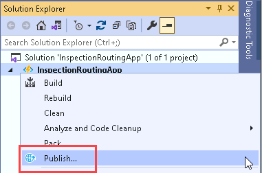

   - Select **Azure** and then select **Next**.

   - Select **Azure Function App (Windows)** and then select **Next**.

   - Sign in with user that has an Azure subscription.

   - Select your **Azure Pass - Sponsorship** subscription.

   - Expand the **PL400** resource group.

   - Select the function app you created in the earlier exercise.

     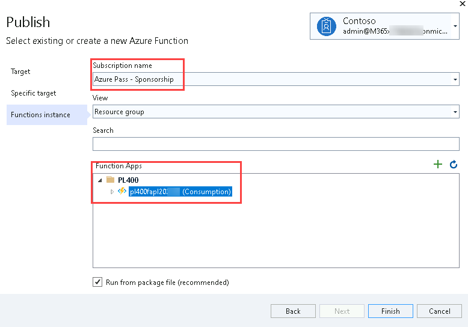

   - Select **Finish**.

     

   - Select **Publish**.
  
   - Select **Yes**.

     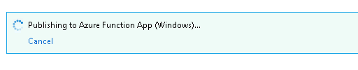

   - Wait for the function application to be successfully published to Azure.

   - Select **File** and **Exit**.

1. Open function application settings.

   - Go back to you **Azure** portal.

   - Select **All Resources**, search for `pl400fa`, and open the function you published.

     

   - Scroll down to **Settings** and select **Configuration**.

     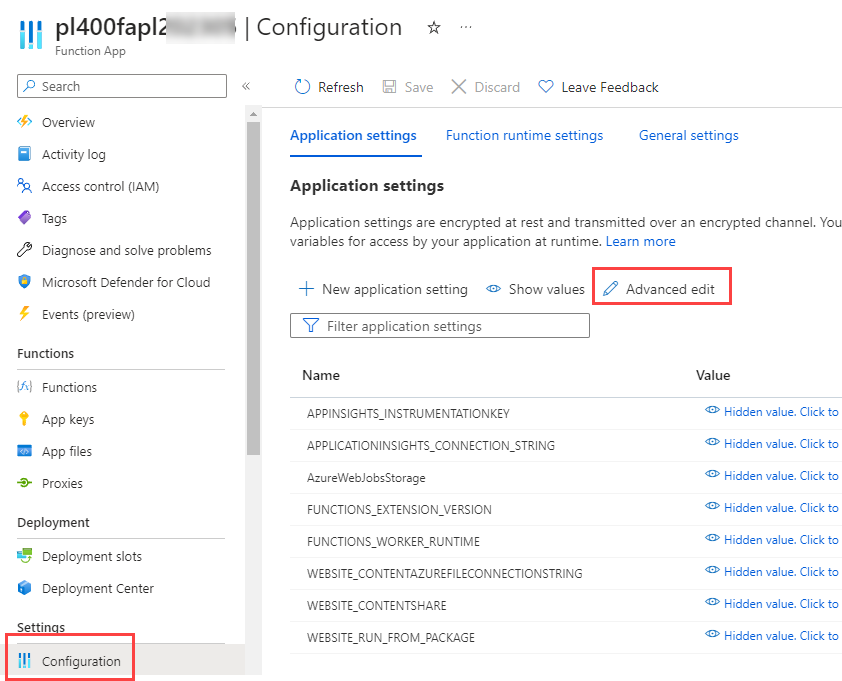

1. Update function app settings.

   - Select **Advanced edit**.

   - Paste the json below at the top of the settings.

     ```json
       {
          "name": "cdsclientid",
          "value": "[clientid]",
          "slotSetting": false
       },
       {
          "name": "cdsclientsecret",
          "value": "[clientsecret]",
          "slotSetting": false
       },
       {
          "name": "cdsurl",
          "value": "[cdsurl]",
          "slotSetting": false
       },
     ```

     

   - Go back to **Visual Studio** and open the **local.settings.json** file.

    

   - Copy the **cdsclientid**, **cdsclientsecret** and **cdsurl** values from the **local.settings.json** file and replace [**cdsclientid**], [**cdsclientsecret**] and [cdsurl].

     

   - Select **OK**.

   - Select **Save**.

     

   - Select **Continue**.

### Task 3.2: Test

1. Timezone.

   - Navigate to the Power Apps maker portal <https://make.powerapps.com>.
   - Make sure you are in the Development environment.
   - Select **Apps**.
   - Select the **Permit Management** app, select the **ellipses (...)** and select **Play**.

   - Select **Settings** and then select **Personalization and Settings**.

     

   - Change the **Time Zone** to **(GMT-11:00) Coordinated Universal Time-11** and then select **OK**. This will ensure the query results will produce the same results regardless of your time zone.

     

1. Reset inspections test data.

   - Navigate to [Power Apps maker portal](https://make.powerapps.com/) and make sure you have the **Development** environment selected.
   - Select **Solutions**.
   - Open the **Permit Management** solution.
   - Select **Cloud flows**.
   - Select the ellipses **...** for the **Reset Inspections** flow, select **Edit** and select **Edit in new tab**.

     

   - Select the **Loop** step.

   - Select the **Update Inspection** step.

   - Click in **Scheduled Date**.

   - Select the **Expression** tab.

   - Enter `utcNow()`.

     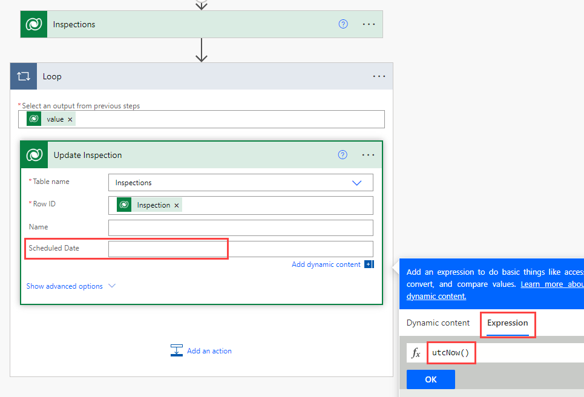

   - Select **OK**.

   - Select **Save**.

   - Select **Test**.

   - Select **Manually**.

   - Select **Test**.

   - Select **Run flow**.

   - Select **Done**.

   - Close the flow editor.

   - All inspections records should be set to Pending and scheduled for today.

1. Run the function.

   - Go to your **Azure** portal.

   - Select **Functions** and open the function you published.

     

   - Select **Code + Test.**

     

   - Select **Test/Run.**

     

   - Select **Run**.

   - The function should run and succeed.

     

1. Confirm record assignments.

   - Go back to the **Permit Management** application.

   - Select **Inspections**.

   - The **Owner** of the inspections should now be the **Inspection Router** and .

     

## Exercise 4: Export and import solution

**Objective:** In this exercise, you will export the solution you created in the development environment and import it to the production environment.

### Task 4.1: Export solution

1. Export managed solution.

   - Navigate to [Power Apps maker portal](https://make.powerapps.com/) and make sure you have the **Development** environment selected.
   - Select **Solutions**.
   - Open the **Permit Management** solution.
   - Select the **Overview** tab in the solution.
   - Select **Export**.
   - Select **Publish** and wait for the publishing to complete.
   - Select **Next**.
   - Set the version number to `1.0.0.11`.
   - Select **Managed**.
   - Select **Export**.
   - Click **Download** to download the managed solution on your machine.

1. Export unmanaged solution.

   - Select **Export** again.
   - Select **Next**.
   - Edit the version number to match the Managed solution you just exported i.e., `1.0.0.11`.
   - Select **Unmanaged**.
   - Select **Export**.
   - Click **Download** to download the unmanaged solution on your machine.

### Task 4.2: Import solution

1. Import the Permit Management solution.

   - Sign in to [Power Apps maker portal](https://make.powerapps.com/)
   - Select your **Production** environment.
   - Select **Solutions**.
   - Select **Import solution**.
   - Select **Browse**.
   - Select the **Managed** solution file you exported in the previous task and then select **Open**.
   - Select **Next**.
   - Expand **Advanced settings** and make sure **Upgrade** is selected.
   - Select **Import**.
   - Select **Import** and wait the import to complete.
