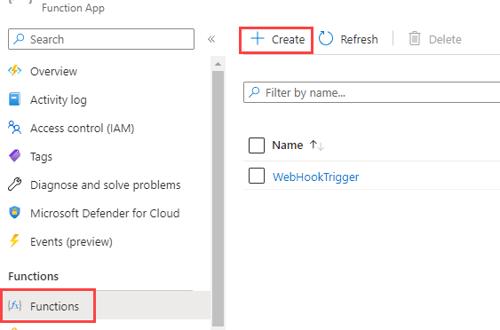
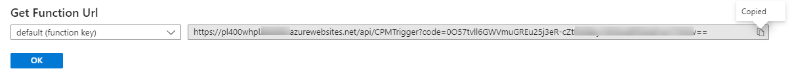
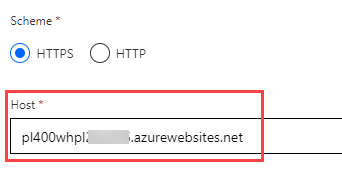
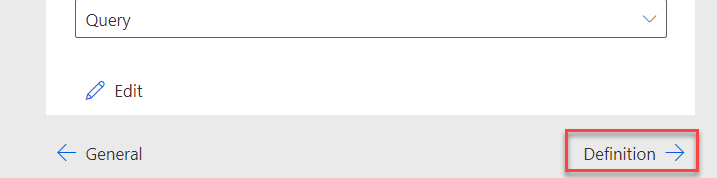
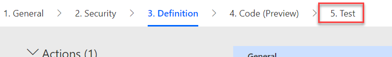
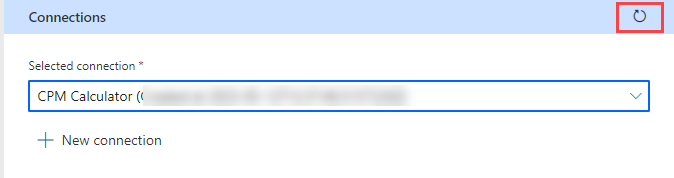

---
lab:
    title: 'Lab 13: Custom connector'
    module: 'Module 11: Custom Connectors'
---

# Practice Lab 13 – Custom Connector

## Scenario

In this lab you will build a custom connector that can be used from Power Apps and Power Automate. Custom connectors describe existing APIs and allow them to be used easily. In this lab, you will build an API that has common calculations used by inspectors so that they can be used by applications. After building the API, you will create a custom connector definition to make it available to Power Apps and Power Automate.

The connector could have multiple actions defined on it. However, for our lab we will define a single action **Get Required CPM** – where CPM stands for Cubic X Per Minute. In some regions this would be Cubic Feet Per Minute, and in others it could be Cubic Meters Per Minute. The action we are building will take the dimensions of a room and the number of air exchanges required by policy. The action logic will calculate the required CPM for that configuration. If you want, you can add additional actions to support other inspection type scenarios to the API and the custom connector.

After building the API and the custom connector you will modify the inspector app. You will use the same connector and invoke an action from Power Automate.

## High-level lab steps

As part of configuring the custom connector, you will complete the following

- Create an Azure function
- Create a custom connector in a solution
- Configure the security and actions on the custom connector
- Test the custom connector
- Configure a canvas app to use the connector

## Things to consider before you begin

- Is there a standard approved connector already available that can be used?
- What security will we use in our connector?
- What are possible triggers and actions of the connector?
- Are there any API rate limits that could potentially affect the connector?

## Starter solution

A starter solution file for this lab can be found in the  C:\Labfiles\L13\Starter folder.

## Completed solution

Completed solution files for this lab can be found in the  C:\Labfiles\L13\Completed folder.

## Resources

Complete source code files for this lab can be found in the  C:\Labfiles\L13\Resources folder.

## Exercise 1: Create the Azure Function

**Objective:** In this exercise, you will create an Azure function that will calculate the CPM.

### Task 1.1: Create Azure Function for CPM Calculation

1. Create function

   - Sign in to the [Azure portal](https://portal.azure.com).

   - Select **All Resources**, search for `pl400wh`, and open the function app you created in the previous lab.

   - Select **Functions**.

     

   - Select **+ Create**.

   - Select **HTTP trigger** for Template.

   - Enter `CPMTrigger` for New Function.

   - Select **Function** for Authorization level.

   - Select **Create**.

1. Add the **Using Statements** and **CPMCalcRequest** class to the function.

   - Select **Code + Test**.

     

   - Add the Using Statements below to the function.

     ```csharp
     using Microsoft.Extensions.Logging;
     using Newtonsoft.Json.Linq;
     ```

     

1. Clean up the Run method

   - Go to the **Run** method.

   - Remove everything but the log line from the **Run** method.

    

1. Add class for the request.

   - Add the public class below to the function. This will describe the request that will be sent from the applications using the API.

     ```csharp
     public class CPMCalcRequest
     {
         public int Width=0;
         public int Height=0;
         public int Length=0;
         public int AirChanges=0;
     }
     ```

     

1. Get the Request body and deserialize it as **CPMCalcRequest**.

   - Get the request **Body** from the request argument. Add the code below inside the **Run** method.

     ```csharp
     string requestBody = await new StreamReader(req.Body).ReadToEndAsync();
     ```

   - Deserialize the request body. Add the code below inside the **Run** method.

     ```csharp
     CPMCalcRequest calcReq = JsonConvert.DeserializeObject<CPMCalcRequest>(requestBody);
     ```

    

1. Calculate the CPM and return it form the Run method

   - Calculate the **CPM** and log the calculated value. Add the code below inside the **Run** method.

     ```csharp
     var cpm = ((calcReq.Width*calcReq.Height*calcReq.Length) * calcReq.AirChanges) / 60;
     log.LogInformation("CPM " + cpm);
     ```

   - Return the calculated **CPM**. Add the code below inside the Run method.

     ```csharp
     return (ActionResult)new OkObjectResult(new{
         CPM = cpm
     });
     ```

     

   - Select **Save**.

1. Copy the Function URL.

   - Select **Overview** and then select **Get Function URL**.

     

   - Select **Copy** and then select OK to close the popup.

     

   - Save the **URL** in a notepad, you will need it when creating the custom connector.

## Exercise 2: Create the Custom Connector

**Objective:** In this exercise, you will create the Custom Connector. This same approach could be used to describe any existing API you create or that has been created by any third party.

### Task 2.1: Create the Custom Connector

1. Open the Permit Management solution

   - Navigate to [Power Apps maker portal](https://make.powerapps.com/) and make sure you have the **Development** environment selected.
   - Select **Solutions**.
   - Open the **Permit Management** solution.

1. Create Custom Connector

   - Select **+ New** and select **Automation** and select **Custom connector**.

     

   - Enter `CPM Calculator` for **Connector Name**.

     

   - Locate the **Host** column and paste the **Function URL** you copied in Exercise 1.

   - Remove https:// and everything after .net.

     

1. Add API key for security.

   - Select **Security ->**.

     

   - Select **API Key** for Authentication type.

     

   - Enter `API Key` for Parameter label.

   - Enter `code` for Parameter name

   - Select **Query** for Parameter Location.

     

1. Define action.

   - Select **Definition**.

     

   - Select **New Action**. The action describes each operation that the API has. These can be manually defined like we are doing here or can be imported from Open API or Postman collection files for larger APIs.

     

   - Enter `CPM Calculator` for Summary

   - Enter `Calculates CPM` for Description.

   - Enter `GetRequiredCPM` for Operation ID.

     

   - Under **Request**, select **+ Import from Sample**.

     

   - Select **POST** for **Verb**.

   - Paste the function **URL** from your notepad and remove everything after **HttpTrigger1**.

     

   - Paste the json below in the **Body** field.

     ```json
     {
         "Width": 15,
         "Height": 8,
         "Length":20,
         "AirChanges":8
     }
     ```

     

   - Select **Import**.

   - Under **Response**, select **+ Add default response**.

     

   - Paste the json below in the **Body**.

     ```json
     {"cpm":200}
     ```

     

   - Select **Import**.

1. Create connector.

   - Select **Create Connector** and wait for the connector to be created.

     

1. Test the connector

   - Advance to **Test**.

     

   - Select **+ New connection**. This will open a New window.

     

   - Go back to the notepad and copy the key - everything after **code=**.

   - Go back to the connector and paste the value you copied.

     

   - Select **Create connection**.

   - Select the **Refresh** icon.

     

   - The connection should be selected.

   - Enter test data,

     - Enter 15 for **Width**.
     - Enter 8 for **Height**.
     - Enter 15 for **Length**.
     - Enter 5 for **AirChanges**..

     

   - Select **Test Operation**.

   - You should get a CPM value back.

     

   - Select **Close**,

   - Close the **Custom connectors** tab.

   - Select **Done.**

## Exercise 3 Test Connector

**Objective:** In this exercise, you will use the Custom Connector from a canvas app.

### Task 3.1: Test in Canvas app

1. Open the Permit Management solution

   - Navigate to [Power Apps maker portal](https://make.powerapps.com/) and make sure you have the **Development** environment selected.
   - Select **Solutions**.
   - Open the **Permit Management** solution.

1. Edit the Inspector canvas app.

   - Select **Apps** and select to open the **Inspector** Canvas app.

     

1. Add new screen to the application.

   - Select **New Screen** and then select **Blank**.

     

   - Rename the screen `CPM Calc Screen`.

     

1. Add Input Text to the new screen.

   - Select the **CPM Calc Screen**.

   - Select **+ Insert** tab.

     

   - Select **Text input**.

     

   - Select the **Tree View**.

     

   - Rename the Text Input `Width Text`.

   - Remove the **Default** property of the **Width** text input.

     

   - Change the **HintText** property of the **Width** text input to `"Provide Width"`.

    

   - The **Width Text** input should now look like the image below.

     

1. Add Height, Length, and Air Change Input Text controls.

   - Copy the **Width Text**.

     

   - Paste the text input you copied to the **CPM Calc Screen.**

     

   - Paste the text input you copied to the **CPM Calc Screen** two more times.

   - The **CPMCalcScreen** should now have total of four text inputs.

     

   - Rename the input text controls **Height Text**, **Length Text**, and **Air Change Text**.

     

   - Change the **HintText** for the three text inputs you renamed to **Provide Height**, **Provide Length**, and **Provide Air Change**, respectively.

   - Resize and reposition the text inputs as shown in the image below.

     

1. Add button.

   - Select **+ Insert** tab.

   - Select **Button**.

   - Select the **Tree view** tab.

   - Rename the button to `Calculate Button`.

   - Change the **Text** value of the button to `"Submit"`.

   - Resize and reposition the button as shown in the image below.

      

1. Add the result label to the screen

   - Select **+ Insert** tab.

   - Select **Button**.

   - Select **Text label**.

   - Select the **Tree view** tab.

   - Rename the label to `Result Label`.

   - Place the label to the right of the text inputs.

      

1. Add the Custom Connector to the app.

   - Select the **Data** tab.
  
     

   - Select **+ Add data**.

   - Expand **Connectors**.

   - Select **CPM Connector**.

     

   - Select **CPM Calculator** again.

     

1. Get the calculated value when the button is selected

   - Select the **Tree view** tab.

   - Select **Calculate Button**.

   - Set the **OnSelect** property of the **Calculate Button** to the formula below.

     ```powerappsfl
     Set(CalculatedValue, Concatenate("Calculated CPM ", Text(Defaulttitle.GetRequiredCPM({Width: 'Width Text'.Text, Height: 'Height Text'.Text, Length: 'Length Text'.Text, AirChanges: 'Air Change Text'.Text}).cpm)))
     ```

     

   - Select the **Result Label** and set the **Text** property to the **CalculatedValue** variable.

     

1. Add navigation button to the Main screen.

   - Select the **Main Screen**.

   - Go to the **Insert** tab and select **Button**.

   - Select the **Tree view** tab.

   - Rename the button to `CPM Button`.

   - Change the **Text** value of the button to `"CPM Calculator"`.

   - Place the button on the bottom right of the **Main Screen**.

1. Navigate to the CPM Calc screen.

   - Select the **CPM Calculator** buttin.

   - Set the **OnSelect** property of the **CPM Calculator** to the formula below.

     ```powerappsfl
     Set(CalculatedValue, ""); Navigate('CPM Calc Screen', ScreenTransition.None);
     ```

     

1. Test the app.

   - Select the **Main Screen** and select **Preview the app**.

    

   - Select the **CPM Calculator** button.

   - The CPM Calculator screen should load.

     

   - Enter values into the four fields and select **Submit**. You can notice the loading dots on top of the screen, which confirms that the request has been initiated.

     

   - The **Result Label** should show the calculated result from the Custom Connector.

     

   - Close the Preview.

1. Save and publish the app.

   - Click the **Save** icon.
   - Click the **Publish** icon.
   - Select **Publish this version**.
   - Click the **<- Back** icon.
   - Select **Leave**.
