---
setup:
    title: 'Lab Setup 1: Data modeling'
    module: 'Set up your own environment'
---

# Lab Setup Instructions 1  – Data Modeling

Follow these instructions to create the data model for the course. A solution is provided for students so that they do not need to perform these steps.

## Scenario

A regional building department issues and tracks permits for new buildings and updates for remodeling of existing buildings. Throughout this course you will build applications and perform automation to enable the regional building department to manage the permitting process. This will be an end-to-end solution which will help you understand the overall process flow.

In this lab, you will create a data model to support the following requirements:

- R1 – Track the status of permits issued for new buildings and existing building modifications
- R2 – Permits are associated with a Build Site, which represents the building or land being modified
- R3 – Permit type indicates the type of permit and inspections, other data that might be required on a permit
- R4 – Inspections completed on the permit work are to be tracked for the entire process i.e., from request of inspection to the pass or fail of the inspection
- R5 – Permits, for our lab purposes, are requested by a person and we need to track who requested each permit

## High-level lab steps

To prepare your learning environments you will create a solution, a publisher, and add both new and existing components that are necessary to meet the application requirements.

Refer to the data model pdf document for the metadata description (tables, column types and relationships) [Data model and metadata](../../Allfiles/Labs/S01/DataModel.pdf).

Your solution will contain several tables upon completion of all the customizations.

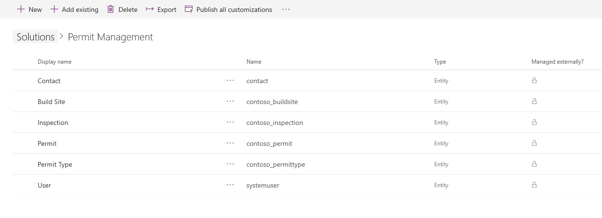

## Things to consider before you begin

- What are considered as best practices for managing changes in between environments (“Dev” to “Test” to “Prod”)? Are there additional considerations for team solution development?
- What tables a user might need in the scenario that we are building?
- What relationship behaviors would we consider enabling users to complete their tasks?
- Remember to work in your *Development* environment with the customizations. Once the customizations are completed, published and tested in *Development*, and if everything works fine, the same will be deployed to *Production*.

## Starter solution

A starter solution file for this lab can be found in the  C:\Labfiles\L01\Starter folder.

This starter solution covers all steps in Labs 1 and 2. You should import this solution if you are familiar with Dataverse and model-driven apps.

There is a second starter solution that covers all steps in Lab 3 if you are familiar with basic canvas apps.

## Completed solution

A completed solution file for this lab can be found in the  C:\Labfiles\L01\Completed folder.

## Exercise 1: Create solution

**Objective:** In this exercise, you will create a publisher and solution for your customizations.

### Task 1.1 – Maker portal

1. Navigate to the Power Apps Maker portal `https://make.powerapps.com` and sign in with your Microsoft 365 credentials if prompted.

1. If you are prompted for a *Phone number* enter `0123456789` and select **Submit**.

1. Switch environments by using the Environment Selector in the upper right corner of the screen. The Contoso (Default) environment will be selected by default.

1. Select your **Development** environment from the list.

    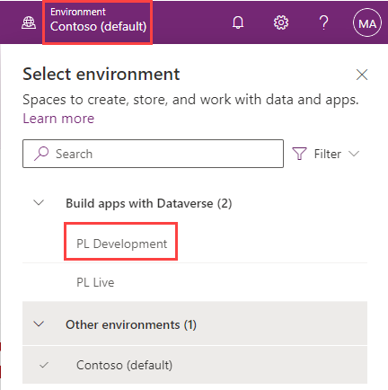

1. Select **Apps** from the left navigation pane and then select **All**. You should see several apps including, Dataverse Accelerator App, Solution Health Hub, and Package Management View, listed.

1. Select **Tables** from the left navigation pane. You should see the standard tables from the *Common Data Model* including Account and Contact.

### Task 1.2 – Create solution and publisher

1. Select **Solutions** from the left navigation pane. You should see the *Default Solution* and the *Common Data Services Default Solution*.

    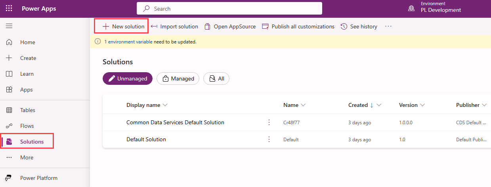

1. Select **+ New solution**.

1. In the **Display name** text box, enter `Permit Management`. The Name text box should be automatically populated.

   

1. Select **+ New publisher** below the **Publisher** dropdown.

1. In the **Display name** text box, enter `Contoso`.

1. In the **Name** text box, enter `contoso`.

1. In the **Prefix** text box, enter `contoso`.

   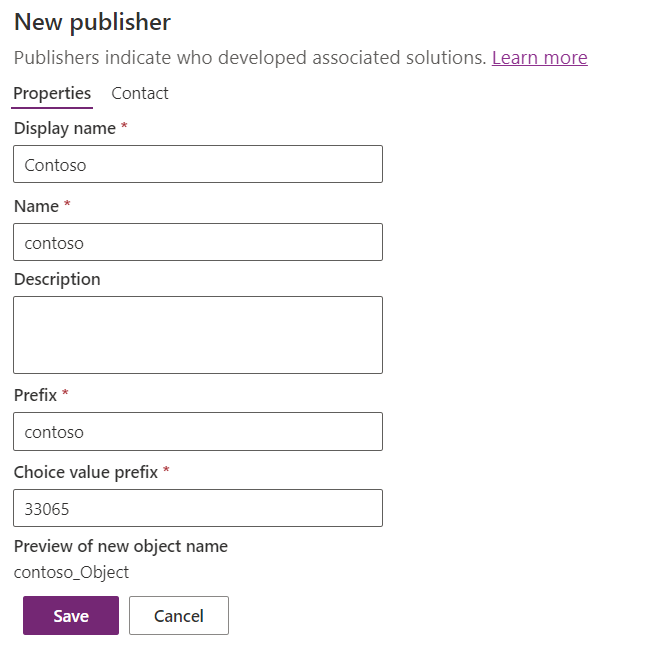

1. Make a note of the **Choice value prefix**.

1. Select **Save**.

1. In the **Publisher** drop-down, select **Contoso (contoso)**.

   

1. Select **Create**.

## Exercise 2: Add components to the solution

In this exercise, you will add existing tables to the solution.

### Task 2.1 – Add existing tables

1. Navigate to the Power Apps Maker portal `https://make.powerapps.com/`.

1. Select your **Development** environment.

1. Select **Solutions**.

1. Open the **Permit Management** solution you created in the previous exercise.

1. Select **Add existing** and select **Table**.

    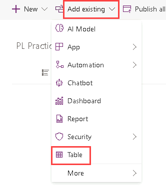

1. Search for `contact` and select the **Contact** table.

1. Select **Next**.

1. Select **Select objects**.

   

1. Select the **Views** tab.

1. Select the **Active Contacts** view.

1. Select **Add**.

1. Select **Select objects**.

1. Select the **Forms** tab.

1. Select the **Contact** main form.

1. Select **Add**.

1. You should have **1 view** and **1 form** selected.

   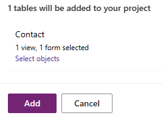

1. Select **Add**. This will add the Contact table to the Permit Management solution.

1. Select **Add existing** and select **Table**.

1. Search for `user` and select the **User** table.

1. Select **Next**.

1. **DO NOT** select any objects and Select **Add**. Your solution should now have two tables.

## Exercise 3: Create tables and columns

In this exercise, you will create tables, add columns to these tables, and edit the **Status Reason** options for the **Permit** and **Inspection** tables.

### Task 3.1: Create Permit table and columns

1. Navigate to the Power Apps Maker portal `https://make.powerapps.com/`.

1. Select your **Development** environment.

1. Select **Solutions**.

1. Open the **Permit Management** solution.

1. Select **+ New** and then select **Table** and select **Table** again.

   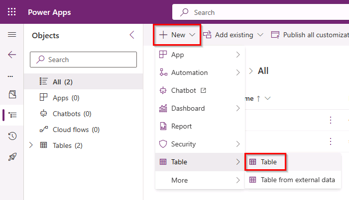

1. Enter `Permit` for **Display Name**. The plural name will be automatically populated.

1. Check **Enable attachments**.

     

1. Select **Save**.

   

1. Select **Properties**.

1. If *Enable attachments* is not checked for the Permit table, then check **Enable attachments** again and select **Save**.

1. Under **Schema**, select **Columns**.

1. Select **+ New column**.

    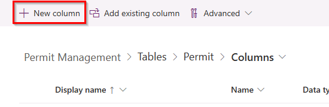

1. Enter `Start Date` for **Display name**.

1. Select **Date and time** in the **Data type** drop-down and then select **Date only**.

1. In the **Required** drop-down, select **Business required**.

1. Select **Save**.

1. Select **+ New column**.

1. Enter `Expiration Date` for **Display name**.

1. Select **Date and time** in the **Data type** drop-down and then select **Date only**.

1. Select **Save**.

1. Select **+ New column**.

1. Enter `New Size` for **Display name**.

1. Select **Number** in the **Data type** drop-down and then select **Whole number**.

1. Select **Save**.

### Task 3.2: Create Permit Type table and columns

1. Create Permit Type table

   - In the **Objects** pane, select **All**.

     
  
   - Select **+ New** and then select **Table** and select **Table** again.
   - Enter `Permit Type` for **Display name**.
   - Expand **Advanced options**.
   - Select **Organization** for **Record ownership**.
   - Select **Save**.

1. Create Require Inspections column

   - Under **Schema**, select **Columns** and select **+ New column**.
   - Enter `Require Inspections` for **Display name**.
   - Select **Choice** and then **Yes/no** for **Data type**.
   - Select **Save**.

1. Create Require Size column

   - Select **+ New column**.
   - Enter `Require Size` for **Display name**.
   - Select **Choice** and then **Yes/no** for **Data type**.
   - Select **Save**.

### Task 3.3: Create Build Site table and columns

1. Create Build Site table

   - In the **Objects** pane, select **All**.
   - Select **+ New** and then select **Table** and select **Table** again.
   - Enter `Build Site` for **Display name**.
   - Select the **Primary column** tab.
   - Change the **Display Name** to `Street Address`.
   - Expand **Advanced options**.
   - Change the **Schema name** to `street1`.

     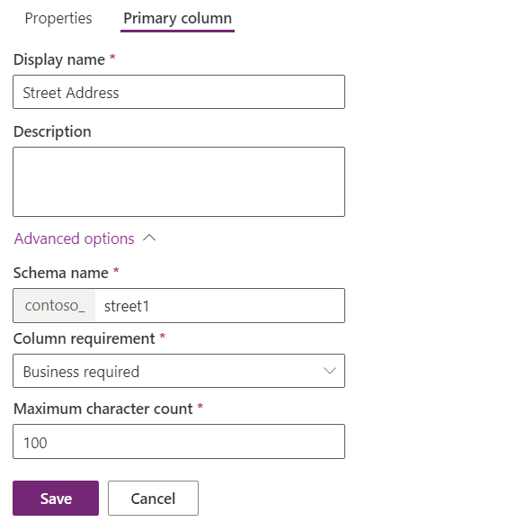

   - Select **Save**.

1. Add City column

   - Under **Schema**, select **Columns** and select **+ New column**.
   - Enter `City` for **Display name**.
   - Verify **Single line of text** is selected for **Data type**.
   - For **Required**, select **Business required**.
   - Expand **Advanced options**.
   - Set **Schema name** to `city`.

     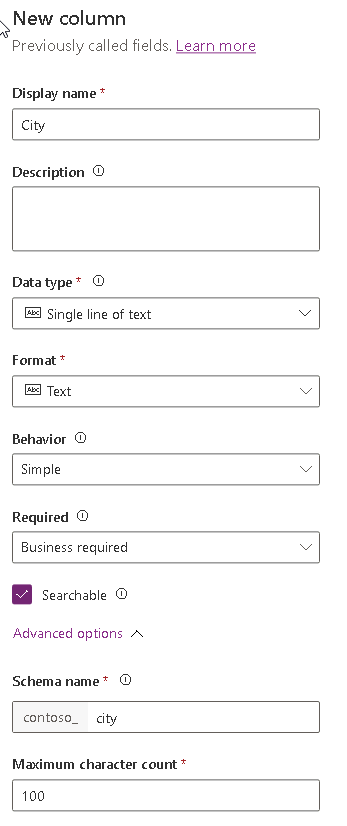

   - Select **Save**.

1. Add Zip/Postal Code column

   - Select **+ New column**.
   - Enter `ZIP/Postal Code` for **Display Name**.
   - Verify **Single line of text** is selected for **Data type**.
   - For **Required**, select **Business required**.
   - Expand **Advanced options**.
   - Set **Schema name** to `postalcode`.
   - Set **Maximum character count** to 10.
   - Select **Save**.

1. Add State/Province column

   - Select **+ New column**.
   - Enter `State/Province` for **Display Name**.
   - Verify **Single line of text** is selected for **Data type**.
   - For **Required**, select **Business required**.
   - Expand **Advanced options**.
   - Set **Schema name** to `stateprovince`.
   - Select **Save**.

1. Add Country/Region column

   - Select **+ New column**.
   - Enter `Country/Region` for **Display Name**.
   - Verify **Single line of text** is selected for **Data type**.
   - For **Required**, leave it set as **Optional**.
   - Expand **Advanced options**.
   - Set **Schema name** to `country`.
   - Select **Save**.

### Task 3.4: Create Inspection Table and Columns

1. Create Inspection table

   - In the **Objects** pane, select **All**.
   - Select **+ New** and then select **Table** and select **Table** again.
   - Enter `Inspection` for **Display name**.
   - Select **Save**.

1. Add Inspection Type Column

   - Under **Schema**, select **Columns** and select **+ New column**.
   - Enter `Inspection Type` for **Display name**.
   - Select **Choice** and then **Choice** for **Data type**.
   - Under **Sync this choice with**, select **+ New choice**.
   - Enter `Inspection Type` for **Display name**.
   - Enter `Initial Inspection` for **Label** and select **+ New choice**.

     

   - Enter `Final Inspection` for **Label**.

     

   - Select **Save**.

   - For **Sync this choice with**, select **Inspection Type** from the drop-down.

   - Select **Save**.

1. Add Scheduled Date Column

   - Select **+ New column**.
   - Enter `Scheduled Date` for **Display name**.
   - Select **Date and time** and then **Date only** for **Data type**.
   - For **Required**, select **Business required**.
   - Select **Save**.

1. Add Comments column

   - Select **+ New column**.
   - Enter `Comments` for **Display name**.
   - For **Data type**, select **Text** and then select **Plain Text** under **Multiple lines of text**.
   - Select **Save**.

1. Add Sequence column

   - Select **+ New column**.
   - Enter `Sequence` for **Display name**.
   - Verify **Single line of text** is selected for **Data type**.
   - Select **Save**.

1. In the **Objects** pane, select **All**.

1. Select **Publish all customizations**.

   

### Task 3.5: Edit Inspection status reasons

1. Navigate to the Power Apps Maker portal `https://make.powerapps.com/`.

1. Select your **Development** environment.

1. Select **Solutions**.

1. Open the **Permit Management** solution.

1. Expand **Tables**.

1. Expand the **Inspection** table.

1. Select **Columns**.

1. Select the **Status Reason** column.

   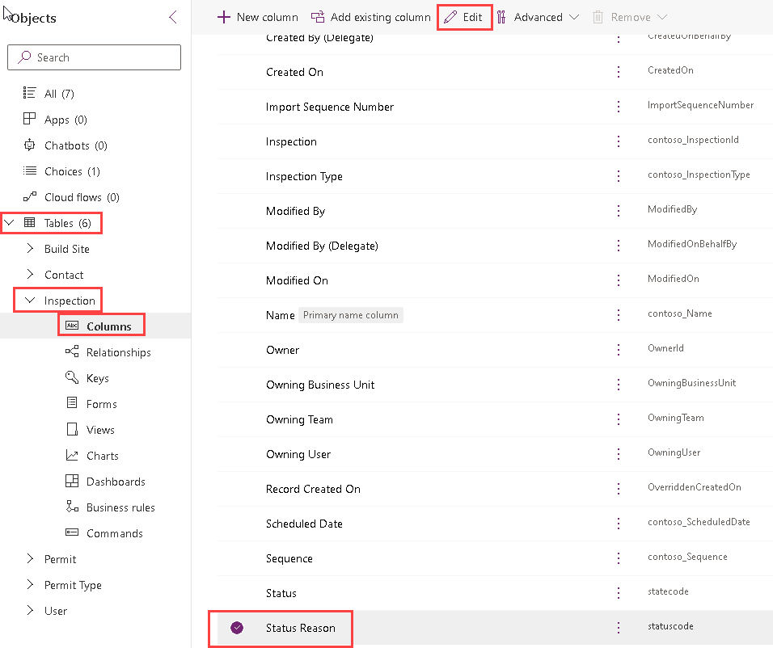

1. Select **Edit**.

   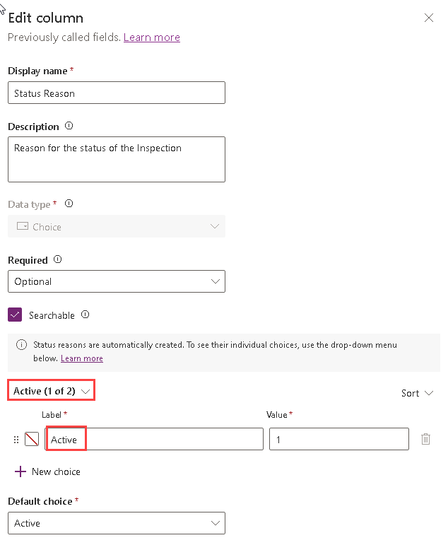

1. Change the Active option label to New Request

   - Make sure you have **Active** selected for **Status**.
   - Change the Label to `New Request`.

     

1. Add the Pending option

   - Select **+New choice**.
   - Enter `Pending` for Label.

1. Add the Passed option

   - Select **+New choice**.
   - Enter `Passed` for Label.

1. Add the Failed option

   - Select **+New choice**.
   - Enter `Failed` for Label.

1. Add the Canceled option

   - Select **+New choice**.
   - Enter `Canceled` for Label.

1. Select **Pending** as the **Default choice**.

1. Your choice list should now have 5 options for the **Active** state.

   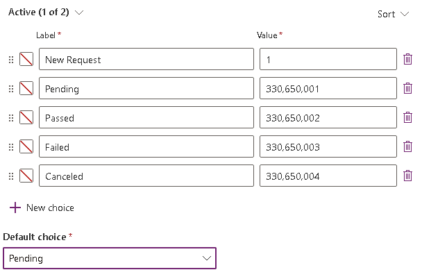

1. Select **Save**.

### Task 3.6: Edit Permit status reasons

1. Navigate to the Power Apps Maker portal `https://make.powerapps.com/`.

1. Select your **Development** environment.

1. Select **Solutions**.

1. Open the **Permit Management** solution.

1. Expand **Tables**.

1. Expand the **Permit** table.

1. Select **Columns**.

1. Select the **Status Reason** column.

1. Select **Edit**.

1. Add the Locked option

   - Make sure you have the **Active** selected for **Status**.
   - Select **+New choice**.
   - Enter `Locked` for **Label**.

1. Add the Completed option

   - Select **+New choice**.
   - Enter `Completed` for Label.

1. Add the Canceled option

   - Select **+New choice**.
   - Enter `Canceled` for Label.

1. Add the Expired option

   - Select **+New choice**.
   - Enter `Expired` for Label.

1. Select **Active** as the **Default choice**.

1. Your choice list should now have 5 options for the **Active** state.

   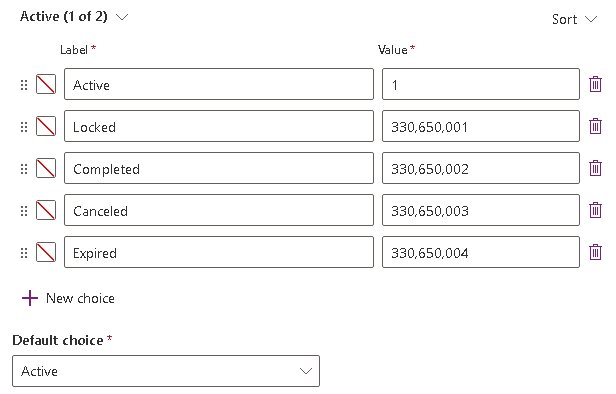

1. Select **Save**.

1. In the **Objects** pane, select **All**.

1. Select **Publish all customizations**.

## Exercise 4: Create Relationships

**Objective:** In this exercise, you will create relationships.

You will create the following data model.

### Task 4.1: Create Relationships

1. Navigate to the Power Apps Maker portal `https://make.powerapps.com/`.

1. Select your **Development** environment.

1. Select **Solutions**.

1. Open the **Permit Management** solution.

1. Expand **Tables**.

1. Select the **Permit** table.

   

1. Create Permit to Contact relationship

   - Under **Schema**, select **Relationships**.
   - Select **+ New relationship** and select **Many-to-one**.
   - Select `Contact` for the **Related (One) > Table**.

    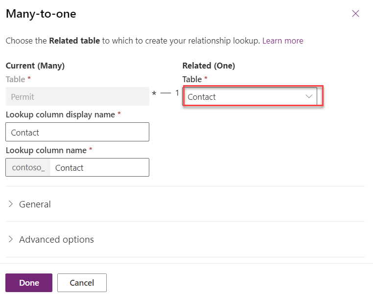

   - Select **Done**.

1. Create Permit to Inspection relationship

   - Select **+ New relationship** and select **One-to-many**.
   - Select `Inspection` for **Table** in the **Related (Many)**
   - Expand **Advanced options**.

    

   - Change the **Type of behavior** to **Parental**.

    

   - Select **Done**.

1. Create Permit to Build Site relationship

   - Select **+ New relationship** and select **Many-to-one**.
   - Select `Build Site` for **Related (One) > Table**.
   - Expand **Advanced options**.
   - Change the **Delete** field to **Restrict**.

    

   - Select **Done**.

1. Create Permit to Permit Type relationship

   - Select **+ New relationship** and select **Many-to-one**.
   - Select `Permit Type` for **Related (One) > Table**.
   - Select **Done**.

1. In the **Objects** pane, select **All**.

1. Select **Publish all customizations**.
